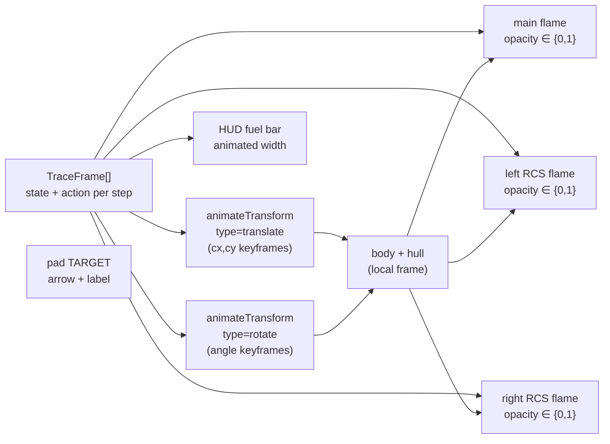

## Summary

Reshaped the Lunar Lander example so it actually plays like the classic Atari Lunar Lander the
issue references — the lander now enters **off-pad and drifting**, has to translate sideways
towards the pad while fighting gravity, and the animated SVG visualises **all three thrusters**
(main, left RCS, right RCS), the **lander's tilt**, a `TARGET` arrow over the pad, and a shrinking
`FUEL` HUD bar so viewers can see "fighting gravity & fuel" in motion. Closes #72.

## Evidence

The animated SVG is regenerated by `./lunar_lander/run.sh` and committed at
`docs/screenshots/lunar_lander.svg` — GitHub renders it natively, so the README's
`` reference shows the new motion
straight from the rendered page. Playwright MCP was not available in this run; the SVG itself is
the visual artefact.

The animated lander group is composed using nested SMIL transforms so the geometry can be drawn
once in the lander's local frame and animated through the trajectory while it tilts:

## Test Plan

- Updated `lunar_lander/physics_test.ts` — replaced the now-stale "above the pad, stationary"
  assertion with one that pins the new entry profile (off-pad, drifting, within world bounds,
  outside the pad).
- Updated `lunar_lander/lunar_lander_test.ts`:
  - `replayController` test now asserts the first frame matches the configured initial state
    (`x` and `vx`) rather than hard-coded zeros.
  - `evolveLanderController …` test refocused on the **champion** beating baseline by a wide
    margin (≥ 300 points) — the population mean became noisier in the new harder regime due to
    out-of-bounds penalties on mutated children, so the meaningful signal is the champion.
- Added new `renderRunSVG` "what" tests:
  - `renderRunSVG animates all three thruster flames` — asserts the rendered SVG contains
    `anim-flame main`, `anim-flame left`, and `anim-flame right`.
  - `renderRunSVG rotates the animated lander to reflect angle` — asserts a `lander-rotor` group
    and a `type="rotate"` `animateTransform` are present.
  - `renderRunSVG renders an animated fuel HUD bar` — asserts the `hud-fuel-bar` element and
    the `FUEL` label are present.
  - `renderRunSVG marks the landing pad with a TARGET indicator` — asserts the `target-marker`
    group and `TARGET` label are present.
- Full repo test suite: **357 passed / 0 failed** (`deno test --no-check`).
- `./quality.sh` passes end-to-end (lint, fmt, type check, all tests, and every example
  `run.sh`).
