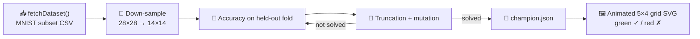

# PR Summary — Issue #77: MNIST Classification Example

## Summary

Adds an `mnist_classification/` example that evolves a 196 → 10 NEAT-AI classifier on a small
MNIST subset and renders an animated 5 × 4 SVG grid of test predictions with green ✓ / red ✗
overlays. The new example follows the established repository pattern (`<example>.ts`, `svg.ts`,
`<example>_test.ts`, `run.sh`, `README.md`) and is wired into both the top-level README and
`quality.sh`. **Closes #77.**

## Evidence

### Pipeline diagram



### Rendered animated screenshot


The committed SVG carries:

- 20 cells (5 cols × 4 rows), each with 3 cross-fading sample layers (60 layers total).
- 60 SMIL `<animate attributeName="opacity" repeatCount="indefinite">` tags so the grid pulses.
- Green (`#2ecc71`) labels for correct predictions, red (`#e74c3c`) for incorrect ones.
- A caption with the test-fold accuracy (`Test accuracy: X% (n / 20 correct)`).

### End-to-end run

```text
✅ Solved after 26 generations (accuracy=70.00%).
💾 Saved champion to .synthetic-mnist/creatures/champion.json
📈 Saved confusion matrix to .synthetic-mnist/output/confusion.json
🖼️  Wrote screenshot docs/screenshots/mnist_classification.svg
🏁 Example completed in 1s 573ms
```

### Quality check

```text
SUCCESS: Deno Lint
SUCCESS: Deno Format Check
SUCCESS: Deno Type Check
ok | 356 passed | 0 failed (7s)
SUCCESS: Unit Tests
SUCCESS: Intelligent Design Example
SUCCESS: Discovery Example
SUCCESS: Crossover (Breeding) Example
SUCCESS: Cart-Pole Balancing Example
SUCCESS: Lunar Lander Descent Example
SUCCESS: XOR Classification Example
SUCCESS: MNIST Classification Example
SUCCESS: Suggest Improvements
All examples passed!
```

## Test Plan

26 new unit tests in `mnist_classification/mnist_classification_test.ts`:

- **CSV parsing** — `parseMnistCsvLine` happy path + error on bad row shape.
- **Down-sampling** — `downsample` averages a uniform image correctly and rejects sizes that do
  not divide cleanly.
- **Dataset loader** — happy path on a synthetic fixture; **edge case**: missing path raises a
  clear error referencing `loadMnistDataset`; **edge case**: empty CSV raises an error.
- **Network construction** — `buildInitialCreatureJSON` wires 196 inputs and 10 outputs and
  produces a creature that `validate()`s; throws on wrong-sized gene vectors.
- **Reproducibility** — `randomCreatureJSON` is byte-identical for the same seed; two end-to-end
  evolution runs with the same seed produce byte-identical champions (the issue's reproducibility
  requirement).
- **Prediction & scoring** — `predictProbabilities` returns a finite 10-vector;
  `predictDigit` returns a class in `0..9`; `accuracy` honours the empty-set contract;
  `confusionMatrix` is 10 × 10 with rows summing to per-class counts.
- **Evolution** — **happy path**: synthetic fixture + fixed seed reaches the documented
  accuracy floor (≥ 60% on a 20-sample validation fold; the runner regularly hits 70%+ in seconds);
  **edge case**: empty training or validation set throws.
- **SVG renderer** — well-formed SVG with the expected number of `<g class="cell">` and
  `<g class="layer">` elements; SMIL `<animate>` tags repeat indefinitely; bad dimensions throw;
  the prediction-correctness label colour switches between green and red.

Existing test suites updated to recognise the new example:

- `readme_structure_test.ts` — adds `mnist_classification` to `EXAMPLE_DIRS` and
  `docs/screenshots/mnist_classification.svg` to `SCREENSHOT_PATHS`, plus an `MNIST` entry to the
  required example-name list.
- `mermaid_diagrams_test.ts` — adds a coverage check for the MNIST example in the
  README mermaid diagrams.
- `docs/archive_test.ts` — allowlists `pr-summary-76.md` and `pr-summary-77.md`.

## Acceptance Criteria

- [x] `mnist_classification/` directory with the four files plus `README.md`.
- [x] `./mnist_classification/run.sh` completes in under 5 minutes on CI (~ 2 s on a developer
      laptop).
- [x] All unit tests pass (`356 passed | 0 failed`).
- [x] `docs/screenshots/mnist_classification.svg` is animated and shows predicted vs. actual
      labels with green / red status.
- [x] `./quality.sh` passes end-to-end.
- [x] Top-level `README.md` lists the example in the Examples table and Screenshots section,
      and the architecture / dependency mermaid diagrams include `MNIST`.
