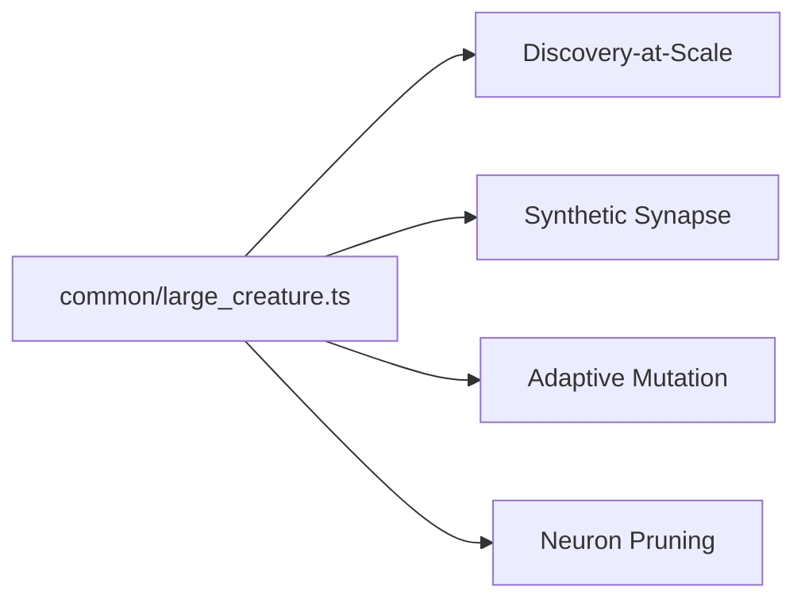

## Summary

Adds `common/large_creature.ts`, a shared utility that builds deterministic
large creatures (~10,000 synapses with default options) for the size-adaptive
demos planned in #75. The builder uses the existing
`common/deterministic_random.ts` PRNG so the same seed and options produce a
byte-identical `Creature` across machines.

Closes #83.

## Evidence

Backend/CLI change with no web interface to screenshot. `./quality.sh` passes
end-to-end (lint, format, type-check, all unit tests including the new
`common/large_creature_test.ts`, and every example program). The new tests
verify determinism, neuron and synapse count assertions, validation, and that
activation produces finite output for a sample input — no timing assertions.

## Test Plan

Added `common/large_creature_test.ts` with eight tests:

- `same seed produces identical creatures` — determinism via `JSON.stringify`
  of `exportJSON()`.
- `different seeds produce different creatures`.
- `neuron counts match requested options` — `input`, `output`, and total
  neuron count match the supplied options.
- `synapse count grows with density` — sparse vs dense densities yield more
  synapses.
- `synapse count matches the density target` — synapse count is at least
  `floor(possibleEdges * density)`.
- `produces finite output for a sample input` — `creature.activate(...)`
  returns finite floats for every output.
- `default options produce a large, valid creature` — defaults yield
  ~10,000 synapses and re-validate cleanly.
- `rejects invalid options` — non-positive neuron counts and out-of-range
  density throw.
