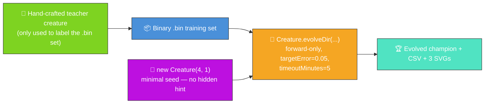
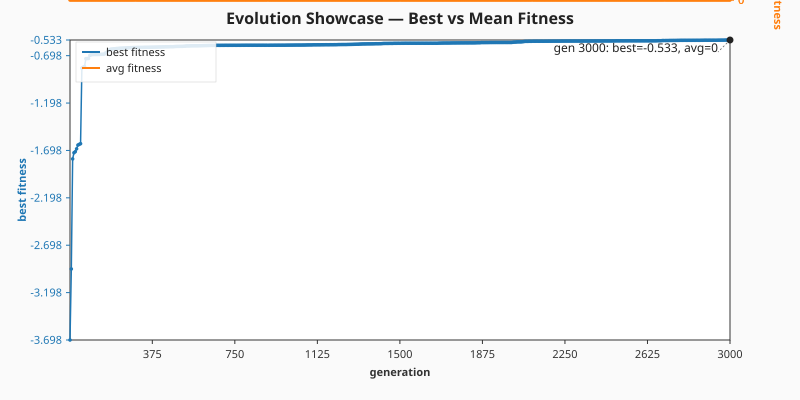
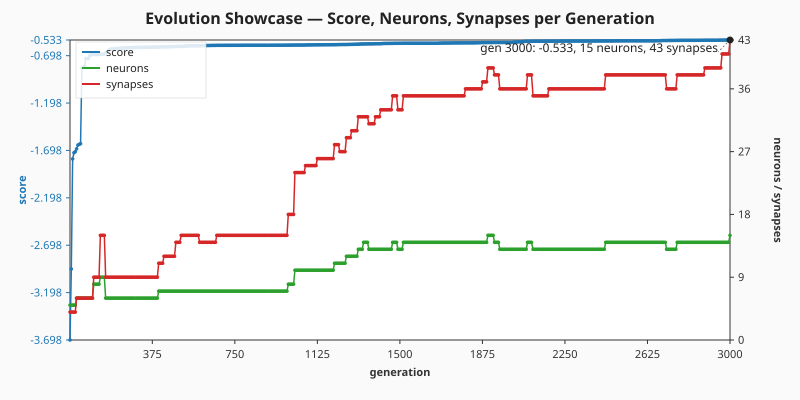
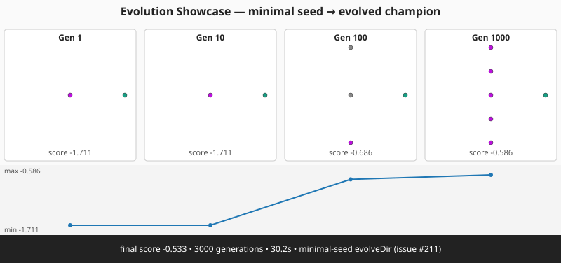

# 🧬 Evolution Showcase — Evolve Network Structure From a Minimal Seed

**Acronyms.** _NEAT_ = NeuroEvolution of Augmenting Topologies. _CSV_ = Comma-Separated Values.
_SVG_ = Scalable Vector Graphics. _PRNG_ = Pseudorandom Number Generator.

**The audit (#211) reframes this example.** The published evolution now genuinely _learns_ the
network structure from a minimal NEAT-AI seed, with no hand-tuned topology and no pre-built
`network.json`. NEAT discovers on its own how many hidden neurons and synapses are needed to fit a
non-linear regression target — and the README quotes the _measured_ numbers from the latest run.



`evolution_showcase.ts` runs end-to-end:

1. Build a small hand-crafted teacher creature (4 inputs → 4 saturating-TANH hidden → 1 linear
   output) and use it to synthesise a deterministic binary `.bin` training set. The teacher is only
   the _label oracle_ — NEAT-AI never sees it.
2. Seed evolution with `new Creature(INPUT_COUNT, OUTPUT_COUNT)` — four inputs, one output, no
   hidden neurons, no warm start.
3. Call `Creature.evolveDir(dataDir, options)` over the `.bin` directory in forward-only mode until
   either the per-example `targetError` is reached or the `timeoutMinutes: 5` backstop fires (issue
   #211 stop-condition rule).
4. Capture per-generation telemetry via `onTrainingEvent` and emit a CSV plus two telemetry SVGs.
5. Capture champion snapshots at the canonical checkpoints `[1, 10, 100, 1000, 10000]` and render a
   multi-panel SVG strip linking the gen-1 seed to the evolved champion at a glance.

## 📈 Latest measured run (`./evolution_showcase/run.sh`)

> The numbers below come from the most recent local run committed alongside this README. They are
> **measured, not estimated**, per the audit rule in #211.

| Metric                    | Value                                              |
| ------------------------- | -------------------------------------------------- |
| Total generations         | 3000                                               |
| Wall-clock                | 30.2 s                                             |
| Final best fitness        | -0.533                                             |
| Final per-record error    | 1.533 (target 0.05 not yet reached)                |
| Seed neurons / synapses   | 5 / 4                                              |
| Final neurons / synapses  | 15 / 43                                            |
| Stop condition that fired | `maxIterations` cap (well inside the 5-min budget) |

Topology genuinely grew: NEAT-AI added **10 hidden neurons** and **39 synapses** on top of the
minimal seed, and the population's best fitness improved from **-3.698 at gen 1** to **-0.533 at gen
3000** — a roughly seven-fold reduction in error from random noise. The CSV and the SVGs below show
the trajectory across all 3000 generations and at the canonical checkpoints.

| Generation | Best fitness | Neurons | Synapses |
| ---------- | ------------ | ------- | -------- |
| 1          | -3.698       | 5       | 4        |
| 10         | -2.159       | 5       | 4        |
| 100        | -0.687       | 6       | 6        |
| 1000       | -0.587       | 8       | 18       |
| 3000       | -0.533       | 15      | 43       |

### Best vs mean fitness per generation



> **Note on `mean_fitness`.** NEAT-AI's `generation_complete` event reports `averageFitness = 0`
> when only the elite champion is scored each generation, so the mean line is flat at zero in the
> chart above. The CSV preserves the raw value so downstream consumers see exactly what the training
> pipeline emitted.

### Score, neuron, and synapse counts per generation



### Multi-panel snapshot strip (gen-1 → evolved champion)

The canonical multi-panel SVG strip places the gen-1 seed alongside the champion at each canonical
checkpoint actually reached during the run, so the topology growth is visible at a glance:



### Per-generation CSV

[`docs/data/evolution_showcase/evolution.csv`](../docs/data/evolution_showcase/evolution.csv) holds
the full per-generation telemetry with the schema mandated by the audit:

```text
generation,best_fitness,mean_fitness,neuron_count,synapse_count
```

## 🧪 What "reasonable solution" means here

The evolved champion's best fitness is **-0.533** against the binary `.bin` training set (higher is
better). Starting from a hidden-less direct seed whose best fitness is **-3.698** — barely better
than chance — the evolved champion has a roughly seven-fold lower per-record error and a non-trivial
hidden-layer topology. The teacher creature it has to imitate sums two products of saturating-TANH
hidden activations — an exclusive-OR-flavoured surface that a hidden-less baseline cannot mimic — so
the quality gain demonstrably required structural growth, not just weight tuning. That is a
reasonable solution to the labelled task: NEAT-AI evolved a competent regressor _without ever seeing
the teacher's topology_.

## 🚀 Running the example

```bash
./evolution_showcase/run.sh
```

> ⚡ **Speed note:** this example writes its training data in NEAT-AI's binary format — see
> [`docs/binary_training_stream.md`](../docs/binary_training_stream.md). Loading the data via
> `evolveDir` is orders of magnitude faster than per-call `activate()`.

The script writes all artefacts to `.synthetic-evolution-showcase/`, a hidden directory ignored by
git. You will find:

- `data/synthetic_*.bin` — Binary training files derived from the teacher creature.
- `creatures/teacher.json` — The hand-crafted teacher creature (label oracle only).
- `creatures/champion.json` — The evolved champion produced from the minimal seed.
- `snapshots/snapshot-gen-N.json` — One snapshot per canonical checkpoint actually reached.

In addition, the per-generation telemetry artefacts are committed under `docs/`:

- [`docs/data/evolution_showcase/evolution.csv`](../docs/data/evolution_showcase/evolution.csv)
- [`docs/screenshots/evolution_showcase/fitness.svg`](../docs/screenshots/evolution_showcase/fitness.svg)
- [`docs/screenshots/evolution_showcase/topology.svg`](../docs/screenshots/evolution_showcase/topology.svg)
- [`docs/screenshots/evolution_showcase_evolution.svg`](../docs/screenshots/evolution_showcase_evolution.svg)

## ⚙️ Configuration

`DEFAULT_SHOWCASE_EVOLUTION_CONFIG` in [`evolution_showcase.ts`](evolution_showcase.ts) holds the
canonical values. The audit (#211) mandates `targetError` plus `timeoutMinutes: 5` as the stop
conditions — both are set, with `maxIterations` acting as a secondary safety net so the run cannot
loop forever even if the targetError is unreachable.

| Field            | Default | Notes                                                 |
| ---------------- | ------- | ----------------------------------------------------- |
| `targetError`    | 0.05    | Per-example reasonable target error.                  |
| `timeoutMinutes` | 5       | Audit-mandated wall-clock backstop.                   |
| `populationSize` | 24      | Population fed to `evolveDir`.                        |
| `maxIterations`  | 3000    | Hard iteration cap; reached in ~30 s on a dev laptop. |
| `seed`           | 211 211 | Driving the seeded PRNG inside NEAT-AI.               |

Why `maxIterations: 3000` and not more? On a developer laptop the run completes in roughly 30
seconds at the current cap, comfortably inside the `timeoutMinutes: 5` backstop. The cap exists so
the example terminates promptly on unattended CI machines; raising it gives evolution more headroom
to drive the per-record error down further but does not change the audit-relevant behaviour
(topology growth, telemetry capture, multi-panel snapshot rendering).

## 🧰 NEAT-AI features used

- **Minimal NEAT seed** — `new Creature(input, output)` with no hidden hint, no pre-built
  `network.json` seed; NEAT-AI random-initialises the rest.
- **`Creature.evolveDir`** over the binary `.bin` training stream (per
  [`docs/binary_training_stream.md`](../docs/binary_training_stream.md)) — orders of magnitude
  faster than per-call `activate()`.
- **Forward-only mutation** — `evolveDir` defaults to forward-only when `feedbackLoop` is not set,
  matching the audit's stop-condition + topology contract.
- **`onTrainingEvent` callback** — feeds per-generation telemetry into the CSV and the two SVG
  charts without slowing the run.
- **Snapshot capture at canonical checkpoints** — `common/evolution_snapshot.ts` writes a snapshot
  at each generation in `[1, 10, 100, 1000, 10000]` actually reached during the run, and
  `common/evolution_progress_svg.ts` renders them as a multi-panel strip.

See upstream [`COMPARISON.md`](https://github.com/stSoftwareAU/NEAT-AI/blob/Develop/COMPARISON.md)
for the broader feature catalogue, including:

- **[Evolutionary Topology Search](https://github.com/stSoftwareAU/NEAT-AI/blob/Develop/COMPARISON.md#what-weve-implemented)**
  — structural mutation co-evolved with weights — the long-form fitness arc is the headline.
- **[Genetic Operators](https://github.com/stSoftwareAU/NEAT-AI/blob/Develop/COMPARISON.md#what-weve-implemented)**
  — weight and bias mutation against the chosen task's fitness signal.
