# 🧬 Evolution Showcase — Evolve Network Structure From a Factory Seed

**Acronyms.** _NEAT_ = NeuroEvolution of Augmenting Topologies. _SVG_ = Scalable Vector Graphics.
_PRNG_ = Pseudorandom Number Generator.

> 🏭 **Factory seed (issue [#534](https://github.com/stSoftwareAU/NEAT-AI-Examples/issues/534),
> factory-adoption tracker [#517](https://github.com/stSoftwareAU/NEAT-AI-Examples/issues/517)).**
> The fresh-run seed is now minted by the data-derived
> `Creature.forDataset(records, { cost: "MSE" })` factory instead of a bare `new Creature(4, 1)`.
> **Only the seed changes — `evolveDir` keeps its default scoring and the example converges exactly
> as before (or faster).** Seed weights and biases stay random; only the topology and weight-init
> scaling are factory-derived, and all structural growth beyond the seed still comes from the
> unchanged mutation operators. This is a **deliberate, milestone-sanctioned departure** from the
> no-warm-start policy in [`AGENTS.md`](../AGENTS.md) and
> [`docs/factory_adoption.md`](../docs/factory_adoption.md) — see
> [the deliberate-departure section below](#-deliberate-departure-from-the-no-warm-start-policy).

**The audit (#211) reframes this example.** The published evolution now genuinely _learns_ the
network structure from a factory-derived NEAT-AI seed, with no hand-tuned topology and no pre-built
`network.json`. NEAT discovers on its own how many additional hidden neurons and synapses are needed
to fit a non-linear regression target. Issue
[#301](https://github.com/stSoftwareAU/NEAT-AI-Examples/issues/301) then retired the per-generation
CSV / fitness / topology charts and the multi-panel checkpoint strip in favour of a single
milestone-summary chart built from `Creature.evolveDir`'s return value (see
[#298](https://github.com/stSoftwareAU/NEAT-AI-Examples/issues/298) for the decision record).

```mermaid
flowchart LR
    REF["🧬 Hand-crafted teacher creature<br/>(only used to label the .bin set)"]
    DATA["📦 Binary .bin training set"]
    SEED["🏭 Creature.forDataset(records,<br/>&#123; cost: MSE &#125;)<br/>linear IDENTITY output, target-mean<br/>bias, data-derived hidden capacity"]
    EVOLVE["🧪 Creature.evolveDir(...)<br/>forward-only, targetError=0.05,<br/>timeoutMinutes=20"]
    SUMMARY["📈 Milestone summary SVG<br/>(from evolveDir return value)"]
    REF --> DATA
    DATA --> SEED
    DATA --> EVOLVE
    SEED --> EVOLVE
    EVOLVE --> SUMMARY
    style REF fill:#7ed321,stroke:#333,color:#fff
    style DATA fill:#4a90d9,stroke:#333,color:#fff
    style SEED fill:#bd10e0,stroke:#333,color:#fff
    style EVOLVE fill:#f5a623,stroke:#333,color:#fff
    style SUMMARY fill:#50e3c2,stroke:#333,color:#fff
```



`evolution_showcase.ts` runs end-to-end:

1. Build a small hand-crafted teacher creature (4 inputs → 4 saturating-TANH hidden → 1 linear
   output) and use it to synthesise a deterministic binary `.bin` training set. The teacher is only
   the _label oracle_ — NEAT-AI never sees it.
2. Read the `.bin` set back into `{ input, output }` records and mint the seed via the data-derived
   factory `Creature.forDataset(records, { cost: "MSE" })` (issue #534). From problem-intrinsic
   facts only, the factory couples the output to the regression cost (linear `IDENTITY` output with
   the bias warm-started to the target mean), sizes a conservative hidden-capacity budget (Heaton's
   rule), and scales the random weights to the per-activation init stddev (He / Xavier). The bare
   `new Creature(INPUT_COUNT, OUTPUT_COUNT)` seed is retained as `buildRandomSeedCreature` — the
   historical baseline used by the tests / resume fixtures.
3. Call `Creature.evolveDir(dataDir, options)` over the `.bin` directory in forward-only mode until
   either the per-example `targetError` is reached or the `timeoutMinutes: 20` wall-clock backstop
   fires (issue #211 stop-condition rule; backstop raised from 5 → 20 under #377 for the
   Refresh-2026-05 milestone).
4. Build an `EvolveDirSummary` from the call's `{ error, score, time, generation }` return value
   plus the seed and final topology counts, and render it via the shared
   `common/evolve_dir_summary.ts` helper from
   [#284](https://github.com/stSoftwareAU/NEAT-AI-Examples/issues/284).

## 📈 Evolution milestone stats

The milestone summary chart below is generated **directly from the return value of
`Creature.evolveDir`**. It pairs the seed and final topology counts on the left with the numeric
callouts (final error, final score, generations, wall-clock) on the right, plus a caption listing
the configured `targetError` / `timeoutMinutes` stop conditions. No per-generation telemetry is
captured or emitted by this example any more (per issue #301).


## 🧪 What "reasonable solution" means here

Starting from a factory seed whose random weights make it barely better than chance, the evolved
champion's per-record error drops sharply across the run. The teacher creature it has to imitate
sums two products of saturating-TANH hidden activations — an exclusive-OR-flavoured surface — so the
quality gain demonstrably requires evolution to grow and tune structure well beyond the seed's small
factory-sized hidden layer, not just nudge a few weights. That is a reasonable solution to the
labelled task: NEAT-AI evolves a competent regressor _without ever seeing the teacher's topology_.
The milestone summary chart above quotes the measured numbers from the latest run.

## 🌱 Deliberate departure from the no-warm-start policy

The repository's [`AGENTS.md`](../AGENTS.md) requires in-scope examples to start evolution from
**uniform-random noise** so the "gen 1 ≈ noise → competent" story holds. This example takes a
**deliberate, milestone-sanctioned departure** from that policy under the NEAT-AI factory-adoption
tracker ([#517](https://github.com/stSoftwareAU/NEAT-AI-Examples/issues/517), per-example issue
[#534](https://github.com/stSoftwareAU/NEAT-AI-Examples/issues/534)):

- **What is factory-derived.** Only the seed's _topology_ and _weight-init scaling_ come from the
  factory. `Creature.forDataset(records, { cost: "MSE" })` couples the output activation to the
  regression cost (linear `IDENTITY` output, output bias warm-started to the target mean), sizes a
  conservative hidden-capacity budget from the problem shape (Heaton's rule), and scales the random
  weights to the per-activation init stddev (He / Xavier).
- **What stays random.** Every seed weight and bias is still drawn from the seeded PRNG — nothing is
  hand-crafted, and no champion / checkpoint is loaded. The noise → competent arc still holds; the
  seed simply starts from a better-conditioned, problem-shaped scaffold.
- **Why the cost is `MSE`.** The teacher emits an unbounded continuous target through a linear
  output and the run is scored on per-record mean-squared error, so this is a **regression** task.
  `MSE` is the cost that makes the factory pick the matching linear (`IDENTITY`) output and
  target-mean bias — the same cost / activation coupling adopted by the stock-market example
  ([#519](https://github.com/stSoftwareAU/NEAT-AI-Examples/issues/519)). (See
  [NEAT-AI #2793](https://github.com/stSoftwareAU/NEAT-AI/issues/2793) for the cost ↔ output
  activation coupling.)
- **Evolution is untouched.** `evolveDir` keeps its default scoring and configuration; all
  structural growth beyond the seed still comes purely from NEAT-AI's unchanged mutation operators.
  The bare `new Creature(4, 1)` baseline is retained as `buildRandomSeedCreature` for the test /
  resume fixtures.

## 🚀 Running the example

```bash
./evolution_showcase/run.sh
```

> ⚡ **Speed note:** this example writes its training data in NEAT-AI's binary format — see
> [`docs/binary_training_stream.md`](../docs/binary_training_stream.md). Loading the data via
> `evolveDir` is orders of magnitude faster than per-call `activate()`.

The script writes all artefacts to `.synthetic-evolution-showcase/`, a hidden directory ignored by
git. You will find:

- `data/synthetic_*.bin` — Binary training files derived from the teacher creature.
- `creatures/teacher.json` — The hand-crafted teacher creature (label oracle only).
- `creatures/champion.json` — The evolved champion produced from the factory seed.

In addition, the milestone summary SVG is committed under `docs/`:

- [`docs/screenshots/evolution_showcase/evolution_summary.svg`](../docs/screenshots/evolution_showcase/evolution_summary.svg)

## ⚙️ Configuration

`DEFAULT_SHOWCASE_EVOLUTION_CONFIG` in [`evolution_showcase.ts`](evolution_showcase.ts) holds the
canonical values. The audit (#211) mandates `targetError` plus a wall-clock backstop as the stop
conditions — both are set, with `maxIterations` acting as a secondary safety net so the run cannot
loop forever even if the targetError is unreachable. Issue
[#377](https://github.com/stSoftwareAU/NEAT-AI-Examples/issues/377) (Refresh-2026-05) raised the
backstop from 5 → 20 minutes to grant the milestone's +15 minutes of additional evolution.

| Field            | Default | Notes                                                                                             |
| ---------------- | ------- | ------------------------------------------------------------------------------------------------- |
| `targetError`    | 0.05    | Per-example reasonable target error.                                                              |
| `timeoutMinutes` | 20      | Wall-clock backstop (raised from 5 → 20 under #377 to grant +15 minutes of additional evolution). |
| `populationSize` | 24      | Population fed to `evolveDir`.                                                                    |
| `maxIterations`  | 20 000  | Hard iteration cap, lifted in lock-step with the backstop so wall-clock is the genuine limiter.   |
| `seed`           | 211 211 | Driving the seeded PRNG inside NEAT-AI.                                                           |

Why `maxIterations: 20 000` and not more? Newer NEAT-AI builds complete ~14 000 generations inside
the 20-minute backstop on a developer laptop, so the cap comfortably exceeds the wall-clock budget
without letting the run loop forever if the budget is ever lifted.

## 📊 Latest measured run

Run reproduced end-to-end via `./evolution_showcase/run.sh` with the data-derived factory seed
(issue #534):

| Metric                   | Value                                          |
| ------------------------ | ---------------------------------------------- |
| Generations              | 8 362                                          |
| Wall-clock               | 6 m 29 s                                       |
| Final per-record error   | 0.0499 (target 0.05 — **reached**, early exit) |
| Final score              | 0.9501                                         |
| Seed neurons / synapses  | 9 / 20 (4 hidden — factory-sized)              |
| Final neurons / synapses | 30 / 107                                       |
| `targetError` / timeout  | 0.05 / 20 min                                  |

The factory seed **converges faster than the old bare-`new Creature(4, 1)` baseline** (which timed
out at the full 20-minute backstop with a final error of ≈ 0.107). Starting from the
better-conditioned, problem-shaped factory scaffold (9 neurons / 20 synapses, 4 factory-sized
hidden), NEAT-AI reaches the `targetError` of 0.05 and exits early in ≈ 6.5 minutes, while still
growing substantial structure on top of the seed (9 → 30 neurons, 20 → 107 synapses) — exactly the
"only the seed changes; evolution converges as before (or faster)" outcome the milestone mandates.
The long-form fitness arc plus the topology bars in the milestone summary chart are the headline
visual.

## 🧰 NEAT-AI features used

- **Data-derived factory seed** — `Creature.forDataset(records, { cost: "MSE" })` derives the output
  activation, a conservative hidden-capacity budget, and weight-init scaling from problem-intrinsic
  facts (issue #534); no hand-tuned topology and no pre-built `network.json` seed. Weights and
  biases stay random. The bare `new Creature(input, output)` baseline is retained as
  `buildRandomSeedCreature`.
- **`Creature.evolveDir`** over the binary `.bin` training stream (per
  [`docs/binary_training_stream.md`](../docs/binary_training_stream.md)) — orders of magnitude
  faster than per-call `activate()`.
- **Forward-only mutation** — `evolveDir` defaults to forward-only when `feedbackLoop` is not set,
  matching the audit's stop-condition + topology contract.
- **Milestone summary chart** — the run's `Creature.evolveDir` return value
  (`{ error, score, time, generation }`) plus the seed and final topology counts feed the shared
  `common/evolve_dir_summary.ts` renderer (issue
  [#284](https://github.com/stSoftwareAU/NEAT-AI-Examples/issues/284)).

See upstream [`COMPARISON.md`](https://github.com/stSoftwareAU/NEAT-AI/blob/Develop/COMPARISON.md)
for the broader feature catalogue, including:

- **[Evolutionary Topology Search](https://github.com/stSoftwareAU/NEAT-AI/blob/Develop/COMPARISON.md#what-weve-implemented)**
  — structural mutation co-evolved with weights — the long-form fitness arc is the headline.
- **[Genetic Operators](https://github.com/stSoftwareAU/NEAT-AI/blob/Develop/COMPARISON.md#what-weve-implemented)**
  — weight and bias mutation against the chosen task's fitness signal.
