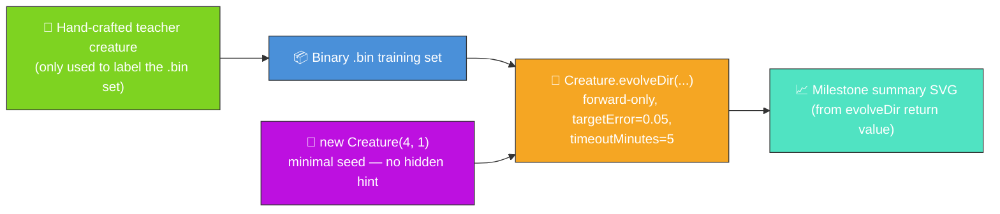

# 🧬 Evolution Showcase — Evolve Network Structure From a Minimal Seed

**Acronyms.** _NEAT_ = NeuroEvolution of Augmenting Topologies. _SVG_ = Scalable Vector Graphics.
_PRNG_ = Pseudorandom Number Generator.

**The audit (#211) reframes this example.** The published evolution now genuinely _learns_ the
network structure from a minimal NEAT-AI seed, with no hand-tuned topology and no pre-built
`network.json`. NEAT discovers on its own how many hidden neurons and synapses are needed to fit a
non-linear regression target. Issue
[#301](https://github.com/stSoftwareAU/NEAT-AI-Examples/issues/301) then retired the per-generation
CSV / fitness / topology charts and the multi-panel checkpoint strip in favour of a single
milestone-summary chart built from `Creature.evolveDir`'s return value (see
[#298](https://github.com/stSoftwareAU/NEAT-AI-Examples/issues/298) for the decision record).



`evolution_showcase.ts` runs end-to-end:

1. Build a small hand-crafted teacher creature (4 inputs → 4 saturating-TANH hidden → 1 linear
   output) and use it to synthesise a deterministic binary `.bin` training set. The teacher is only
   the _label oracle_ — NEAT-AI never sees it.
2. Seed evolution with `new Creature(INPUT_COUNT, OUTPUT_COUNT)` — four inputs, one output, no
   hidden neurons, no warm start.
3. Call `Creature.evolveDir(dataDir, options)` over the `.bin` directory in forward-only mode until
   either the per-example `targetError` is reached or the `timeoutMinutes: 5` backstop fires (issue
   #211 stop-condition rule).
4. Build an `EvolveDirSummary` from the call's `{ error, score, time, generation }` return value
   plus the seed and final topology counts, and render it via the shared
   `common/evolve_dir_summary.ts` helper from
   [#284](https://github.com/stSoftwareAU/NEAT-AI-Examples/issues/284).

## 📈 Evolution milestone stats

The milestone summary chart below is generated **directly from the return value of
`Creature.evolveDir`**. It pairs the seed and final topology counts on the left with the numeric
callouts (final error, final score, generations, wall-clock) on the right, plus a caption listing
the configured `targetError` / `timeoutMinutes` stop conditions. No per-generation telemetry is
captured or emitted by this example any more (per issue #301).


## 🧪 What "reasonable solution" means here

Starting from a hidden-less direct seed whose best fitness is barely better than chance, the evolved
champion's per-record error drops sharply across the run. The teacher creature it has to imitate
sums two products of saturating-TANH hidden activations — an exclusive-OR-flavoured surface that a
hidden-less baseline cannot mimic — so the quality gain demonstrably requires structural growth, not
just weight tuning. That is a reasonable solution to the labelled task: NEAT-AI evolves a competent
regressor _without ever seeing the teacher's topology_. The milestone summary chart above quotes the
measured numbers from the latest run.

## 🚀 Running the example

```bash
./evolution_showcase/run.sh
```

> ⚡ **Speed note:** this example writes its training data in NEAT-AI's binary format — see
> [`docs/binary_training_stream.md`](../docs/binary_training_stream.md). Loading the data via
> `evolveDir` is orders of magnitude faster than per-call `activate()`.

The script writes all artefacts to `.synthetic-evolution-showcase/`, a hidden directory ignored by
git. You will find:

- `data/synthetic_*.bin` — Binary training files derived from the teacher creature.
- `creatures/teacher.json` — The hand-crafted teacher creature (label oracle only).
- `creatures/champion.json` — The evolved champion produced from the minimal seed.

In addition, the milestone summary SVG is committed under `docs/`:

- [`docs/screenshots/evolution_showcase/evolution_summary.svg`](../docs/screenshots/evolution_showcase/evolution_summary.svg)

## ⚙️ Configuration

`DEFAULT_SHOWCASE_EVOLUTION_CONFIG` in [`evolution_showcase.ts`](evolution_showcase.ts) holds the
canonical values. The audit (#211) mandates `targetError` plus `timeoutMinutes: 5` as the stop
conditions — both are set, with `maxIterations` acting as a secondary safety net so the run cannot
loop forever even if the targetError is unreachable.

| Field            | Default | Notes                                                 |
| ---------------- | ------- | ----------------------------------------------------- |
| `targetError`    | 0.05    | Per-example reasonable target error.                  |
| `timeoutMinutes` | 5       | Audit-mandated wall-clock backstop.                   |
| `populationSize` | 24      | Population fed to `evolveDir`.                        |
| `maxIterations`  | 3000    | Hard iteration cap; reached in ~30 s on a dev laptop. |
| `seed`           | 211 211 | Driving the seeded PRNG inside NEAT-AI.               |

Why `maxIterations: 3000` and not more? On a developer laptop the run completes in roughly 30
seconds at the current cap, comfortably inside the `timeoutMinutes: 5` backstop. The cap exists so
the example terminates promptly on unattended CI machines.

## 🧰 NEAT-AI features used

- **Minimal NEAT seed** — `new Creature(input, output)` with no hidden hint, no pre-built
  `network.json` seed; NEAT-AI random-initialises the rest.
- **`Creature.evolveDir`** over the binary `.bin` training stream (per
  [`docs/binary_training_stream.md`](../docs/binary_training_stream.md)) — orders of magnitude
  faster than per-call `activate()`.
- **Forward-only mutation** — `evolveDir` defaults to forward-only when `feedbackLoop` is not set,
  matching the audit's stop-condition + topology contract.
- **Milestone summary chart** — the run's `Creature.evolveDir` return value
  (`{ error, score, time, generation }`) plus the seed and final topology counts feed the shared
  `common/evolve_dir_summary.ts` renderer (issue
  [#284](https://github.com/stSoftwareAU/NEAT-AI-Examples/issues/284)).

See upstream [`COMPARISON.md`](https://github.com/stSoftwareAU/NEAT-AI/blob/Develop/COMPARISON.md)
for the broader feature catalogue, including:

- **[Evolutionary Topology Search](https://github.com/stSoftwareAU/NEAT-AI/blob/Develop/COMPARISON.md#what-weve-implemented)**
  — structural mutation co-evolved with weights — the long-form fitness arc is the headline.
- **[Genetic Operators](https://github.com/stSoftwareAU/NEAT-AI/blob/Develop/COMPARISON.md#what-weve-implemented)**
  — weight and bias mutation against the chosen task's fitness signal.
