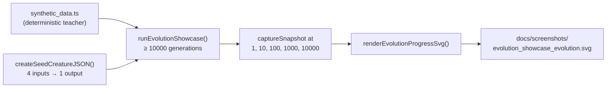

# 🧬 Evolution Showcase — long-running flagship

**Acronym.** _PRNG_ = pseudorandom number generator.

A deliberately long-running example whose purpose is to make the **gen-1-vs-gen-10000 contrast**
visible. Most other examples in this repository target "under five minutes on CI" so they fit normal
quality gates; this one fills the missing gap by evolving for ten thousand generations on a
non-trivial regression task and rendering all five canonical checkpoints —
`[1, 10, 100, 1000, 10000]` — as a single multi-panel SVG strip.

The synthetic dataset is generated deterministically from a fixed **teacher creature** (4 inputs → 4
saturating TANH hidden → 1 linear output), so the regression target is non-linear and a hidden-less
baseline cannot mimic it. Visible improvement therefore requires both weight tuning **and**
structural growth of the learner — exactly the kind of contrast the multi-panel renderer was
designed to surface.

## What you will see

Each panel in
[`docs/screenshots/evolution_showcase_evolution.svg`](../docs/screenshots/evolution_showcase_evolution.svg)
shows the champion at one of the canonical checkpoints, side-by-side:

| Panel     | What it shows                                                                                 |
| --------- | --------------------------------------------------------------------------------------------- |
| Gen 1     | The seed creature: 4 inputs wired straight to the output, no hidden capacity, low score.      |
| Gen 10    | Tiny weight tuning, but still no hidden neurons — the baseline plateau is already visible.    |
| Gen 100   | First hidden neurons typically appear; score climbs noticeably above the gen-1 floor.         |
| Gen 1000  | A grown topology with several hidden neurons and richer wiring; score approaches the teacher. |
| Gen 10000 | The flagship "after" panel — visibly larger network, much better score.                       |

A score-progression polyline links the five panels at the bottom of the strip, and the caption
summarises the run (final score, total generations, wall-clock time).

## Running it

This is the **only** example in the repository that is not wired into `quality.sh`. Run it manually
when you want the full result:

```bash
./evolution_showcase/run.sh
```

Expected wall-clock time: **roughly 30 seconds to several minutes** on a typical developer laptop,
depending on processor speed and population size. The default population (12 creatures) and dataset
(96 samples) lean toward the lower end. Bumping `populationSize` and `SYNTHETIC_CONFIG.totalRecords`
extends the run into the tens-of-minutes range; the canonical demonstration value is the
**ten-thousand-generation count**, not a fixed wall-clock target.

The runner writes:

- `.synthetic-evolution-showcase/data/synthetic_*.bin` — the deterministic dataset.
- `.synthetic-evolution-showcase/snapshots/snapshot-gen-N.json` — one per checkpoint.
- `.synthetic-evolution-showcase/creatures/champion.json` — the best creature found.
- `docs/screenshots/evolution_showcase_evolution.svg` — the rendered multi-panel strip.

## How it works



Each generation runs three independent mutation operators against the elite parent:

1. **Weight perturbation** — every synapse weight and hidden/output bias receives a Gaussian draw of
   standard deviation `mutationStrength`. Always applied.
2. **Add hidden neuron** — with probability `addNeuronRate` a new TANH hidden neuron is inserted
   between a random non-output source and a random non-input target, with two new synapses
   connecting it.
3. **Add synapse** — with probability `addSynapseRate` a new synapse is added between an unconnected
   pair.

Truncation selection keeps the top half of the population as parents each generation; the elite
carries over unchanged so the best score is monotonically non-decreasing.

## Why this is a "what" test

The companion [`evolution_showcase_test.ts`](evolution_showcase_test.ts) exercises the same code
path with a deliberately abbreviated checkpoint list (`[1, 5, 10]`) and a tiny population so each
test finishes well under the 120-second per-test budget. The tests verify the _observable_ outputs —
snapshot files exist, scores are finite, the SVG renderer accepts the captured snapshots — without
inspecting how the loop produces those outputs. The full-length run is exercised manually via
`run.sh`.

## Configuration

`DEFAULT_SHOWCASE_CONFIG` in [`evolution_showcase.ts`](evolution_showcase.ts) holds the canonical
values:

| Field              | Default                     | Notes                                               |
| ------------------ | --------------------------- | --------------------------------------------------- |
| `seed`             | 960096                      | Driving the seeded PRNG.                            |
| `generations`      | 10000                       | Largest checkpoint matches.                         |
| `populationSize`   | 12                          | Held constant across generations.                   |
| `checkpoints`      | `[1, 10, 100, 1000, 10000]` | Canonical for the multi-panel SVG.                  |
| `mutationStrength` | 0.35                        | Gaussian σ for weight perturbations.                |
| `addNeuronRate`    | 0.02                        | Per-generation chance of inserting a hidden neuron. |
| `addSynapseRate`   | 0.05                        | Per-generation chance of inserting a synapse.       |

## Acceptance criteria coverage

- **Long-running by design.** Default `generations = 10000`; not in `quality.sh`.
- **Snapshots at canonical checkpoints.** `[1, 10, 100, 1000, 10000]`.
- **SVG committed for browsing.**
  [`evolution_showcase_evolution.svg`](../docs/screenshots/evolution_showcase_evolution.svg).
- **Fast unit test.** Uses `[1, 5, 10]` and a 6-strong population.
- **Reuses common helpers.** No bespoke snapshot or render code — both are imported from `common/`.

## 🧰 NEAT-AI Features Used

**Acronym.** _NEAT_ = NeuroEvolution of Augmenting Topologies.

The flagship long-form run focuses on the noise → competent story, so it deliberately uses a
stripped-down operator subset.

> 🔎 **Stripped-down operator subset.** This example deliberately exercises a narrow slice of
> NEAT-AI's full pipeline so the noise → competent story stays uncluttered. The production training
> pipeline (backpropagation, dropout, L1/L2 regularisation, K-fold, binary `.bin` data streams,
> distributed evolution, etc.) is intentionally **not** wired into this demo — see issue
> [#185](https://github.com/stSoftwareAU/NEAT-AI-Examples/issues/185) and the upstream
> production-pipeline notes in
> [`COMPARISON.md`](https://github.com/stSoftwareAU/NEAT-AI/blob/Develop/COMPARISON.md) for the
> wider feature set.

Features exercised (links go to upstream
[`COMPARISON.md`](https://github.com/stSoftwareAU/NEAT-AI/blob/Develop/COMPARISON.md)):

- **[Evolutionary Topology Search](https://github.com/stSoftwareAU/NEAT-AI/blob/Develop/COMPARISON.md#what-weve-implemented)**
  — structural mutation co-evolved with weights — the long-form fitness arc is the headline.
- **[Genetic Operators](https://github.com/stSoftwareAU/NEAT-AI/blob/Develop/COMPARISON.md#what-weve-implemented)**
  — weight and bias mutation against the chosen task's fitness signal.
