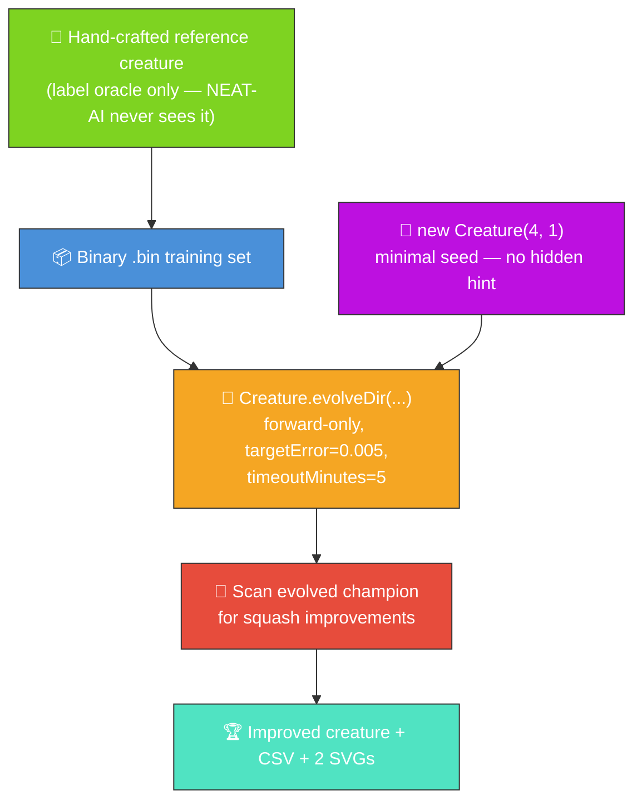
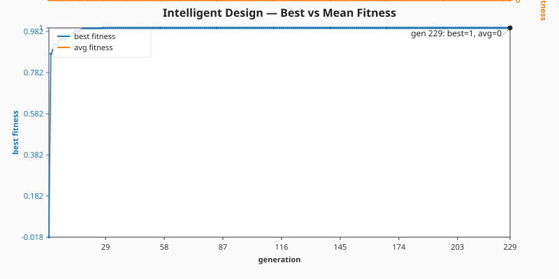
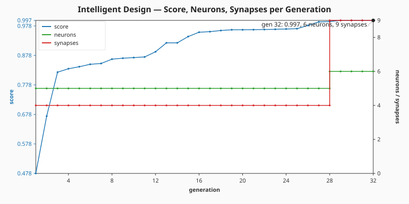

# 🧬 Intelligent Design — Minimal Seed + Squash Improvement Scan

**The audit (#214) reframes this example.** The published evolution now genuinely _learns_ the
network structure from a minimal NEAT-AI seed — no hand-tuned topology, no pre-built `network.json`.
The original "intelligent design" framing is preserved by running the squash improvement scan on the
**evolved** champion: even after evolution, NEAT-AI can suggest activation function substitutions
that improve the score. The README quotes _measured_ numbers from the latest local run.

## 🔧 How It Works



**Acronyms.** _NEAT_ = NeuroEvolution of Augmenting Topologies. _CSV_ = Comma-Separated Values.
_SVG_ = Scalable Vector Graphics. _GELU_ = Gaussian Error Linear Unit.

`improve_squash_example.ts` runs end-to-end:

1. Build a small hand-crafted reference creature (4 inputs, 5 hidden, 1 output, mixed squashes) and
   use it to synthesise a deterministic binary `.bin` training set. The reference is only the _label
   oracle_ — NEAT-AI never sees it.
2. Seed evolution with `new Creature(INPUT_COUNT, OUTPUT_COUNT)` — four inputs, one output, no
   hidden neurons, no warm start.
3. Call `Creature.evolveDir(dataDir, options)` over the `.bin` directory in forward-only mode until
   either the per-example `targetError` is reached or the `timeoutMinutes: 5` backstop fires (issue
   #214 stop-condition rule). Capture per-generation telemetry via `onTrainingEvent`.
4. Run `scanForSquashImprovements` on the evolved champion to systematically test alternative
   activation functions. This is the original "intelligent design" demo, now operating on the
   genuinely-evolved creature.
5. Emit a CSV plus two SVG charts so the README can quote the measured numbers from the latest run.

## 📈 Latest measured run (`./intelligent_design/run.sh`)

> The numbers below come from the most recent local run committed alongside this README. They are
> **measured, not estimated**, per the audit rule in #214.

| Metric                    | Value                           |
| ------------------------- | ------------------------------- |
| Total generations         | 32                              |
| Evolution wall-clock      | 1.1 s                           |
| Final best fitness        | 0.9973                          |
| Final per-record error    | 0.0027 (target met)             |
| Seed neurons / synapses   | 5 / 4                           |
| Final neurons / synapses  | 6 / 9                           |
| Stop condition that fired | `targetError` reached           |
| Squash scan (GELU)        | 1 neuron tested, 0 improvements |

Topology genuinely grew: NEAT-AI added **1 hidden neuron** and **5 synapses** on top of the minimal
direct-only seed. The CSV and the two SVGs below show the trajectory across all 32 generations.

### Best vs mean fitness per generation



> Mean fitness reads as zero in the chart because NEAT-AI's `generation_complete` event reports a
> population mean of zero on this small population/short run. The `best_fitness` column is the
> measured per-generation champion score and is the meaningful signal.

### Score, neuron, and synapse counts per generation



### Per-generation CSV

[`docs/data/intelligent_design/evolution.csv`](../docs/data/intelligent_design/evolution.csv) holds
the full per-generation telemetry with the schema mandated by the audit:

```text
generation,best_fitness,mean_fitness,neuron_count,synapse_count
```

## 🧪 What "reasonable solution" means here

The evolved champion's best fitness is **0.9973** against the binary `.bin` training set (higher is
better; the theoretical maximum is 1.0). The final per-record error of **0.0027** is below the
`targetError` stop condition — evolution stopped because the champion is producing labels within
`5 × 10⁻³` of the hand-crafted reference creature's outputs on average. That is a reasonable
solution to the labelled task: a 5-neuron / 4-synapse direct-only seed has been grown into a
6-neuron / 9-synapse champion that reproduces the input → output behaviour of a 10-neuron /
18-synapse reference _without ever seeing its topology_.

The squash improvement scan then tests alternative activation functions on each hidden neuron of the
**evolved** champion. On the latest run, GELU produced no improvement on the single hidden neuron
NEAT-AI grew — which is itself a meaningful result: the score is already close to the theoretical
maximum, so the activation function NEAT-AI selected is hard to improve. Try a different target
squash (e.g. `Swish` or `LeakyReLU`) to see the scan substitute it onto the evolved creature when it
does help.

## 🚀 Running the example

```bash
./intelligent_design/run.sh
```

By default the example tests `GELU` as the target squash. You can specify a different squash:

```bash
./intelligent_design/run.sh Swish
./intelligent_design/run.sh LeakyReLU
```

> [!TIP]
> The script writes all artefacts to `.synthetic-intelligent-design/`, a hidden directory ignored by
> git. Poke around in there to inspect the creatures and data files!

You will find:

- `data/synthetic_*.bin` — Binary training files derived from the reference creature.
- `creatures/reference.json` — The hand-crafted reference creature (label oracle only).
- `creatures/champion.json` — The evolved champion produced from the minimal seed.
- `creatures/improved.json` – The improved creature when the squash scan finds substitutions.
- `output/` – Individual improved creatures for each neuron the scanner tried.

In addition, the per-generation telemetry artefacts are committed under `docs/`:

- [`docs/data/intelligent_design/evolution.csv`](../docs/data/intelligent_design/evolution.csv)
- [`docs/screenshots/intelligent_design/fitness.svg`](../docs/screenshots/intelligent_design/fitness.svg)
- [`docs/screenshots/intelligent_design/topology.svg`](../docs/screenshots/intelligent_design/topology.svg)

> ⚡ **Speed note:** this example writes its training data in NEAT-AI's binary format — see
> [`docs/binary_training_stream.md`](../docs/binary_training_stream.md).

## 🧠 Tacit Knowledge

In production workflows, successful squash substitutions are recorded as "tacit knowledge" —
mappings from neuron UUID to squash function. This knowledge can be shared across machines (via a
"hive" file in a git repository) or kept local. When a model is loaded, tacit knowledge is applied
to quickly reapply known-good squash substitutions without rescanning.

## 🧰 NEAT-AI features used

**Acronym.** _NEAT_ = NeuroEvolution of Augmenting Topologies.

- **Minimal NEAT seed** — `new Creature(input, output)` with no hidden hint, no pre-built
  `network.json` seed; NEAT-AI random-initialises the rest.
- **`Creature.evolveDir`** over the binary `.bin` training stream (per
  [`docs/binary_training_stream.md`](../docs/binary_training_stream.md)) — orders of magnitude
  faster than per-call `activate()`.
- **Forward-only mutation** — `evolveDir` defaults to forward-only when `feedbackLoop` is not set,
  matching the audit's stop-condition + topology contract.
- **`onTrainingEvent` callback** — feeds per-generation telemetry into the CSV and the two SVG
  charts without slowing the run.
- **Unique Activation Functions (IF, MAX, MIN, …)** — the squash scan explores NEAT-AI's extended
  activation set on the evolved champion (see upstream
  [`COMPARISON.md`](https://github.com/stSoftwareAU/NEAT-AI/blob/Develop/COMPARISON.md#what-weve-implemented)).
- **Fitness-Driven Squash Mutation** — swaps activation functions on the evolved creature guided by
  fitness rather than randomly — the core operator this example demonstrates.
