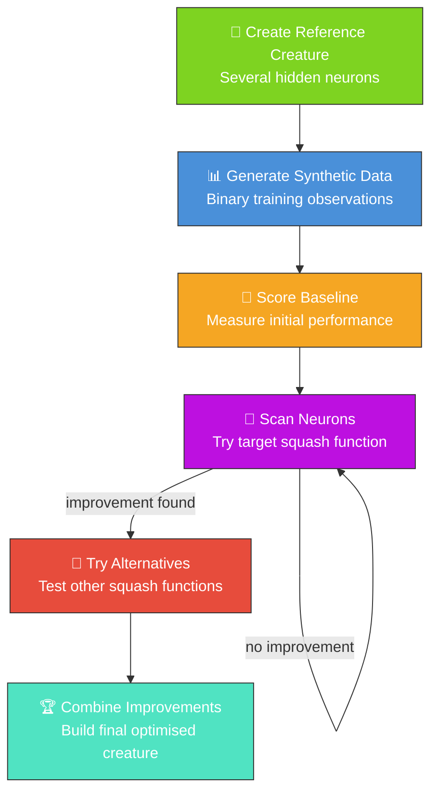

# 🧬 Intelligent Design — Squash Improvement Scan

`improve_squash_example.ts` demonstrates how to use the Intelligent Design module to systematically
test different activation functions (squashes) for each hidden neuron in a creature. This technique
is used in production workflows to optimise trained models by finding better squash functions than
those produced by random mutation.

## 🔧 How It Works



1. Creates a reference creature with several hidden neurons
2. Generates synthetic training data
3. Scores the baseline creature
4. Scans each hidden neuron, trying the target squash function
5. For neurons that improve, tries alternative squash functions
6. Combines the best improvements into a final creature

## 🚀 Running the Example

```bash
./intelligent_design/run.sh
```

By default, the example tries `GELU` as the target squash. You can specify a different squash:

```bash
./intelligent_design/run.sh Swish
./intelligent_design/run.sh LeakyReLU
```

> [!TIP]
> The script writes all artefacts to `.synthetic-intelligent-design/`, a hidden directory ignored by
> git. Poke around in there to inspect the creatures and data files!

You will find:

- `data/` – Binary training data for scoring
- `creatures/baseline.json` – The original reference creature
- `creatures/improved.json` – The improved creature (if improvements were found)
- `output/` – Individual improved creatures for each neuron

## 🧠 Tacit Knowledge

In production workflows, successful squash substitutions are recorded as "tacit knowledge" —
mappings from neuron UUID to squash function. This knowledge can be shared across machines (via a
"hive" file in a git repository) or kept local. When a model is loaded, tacit knowledge is applied
to quickly reapply known-good squash substitutions without rescanning.
