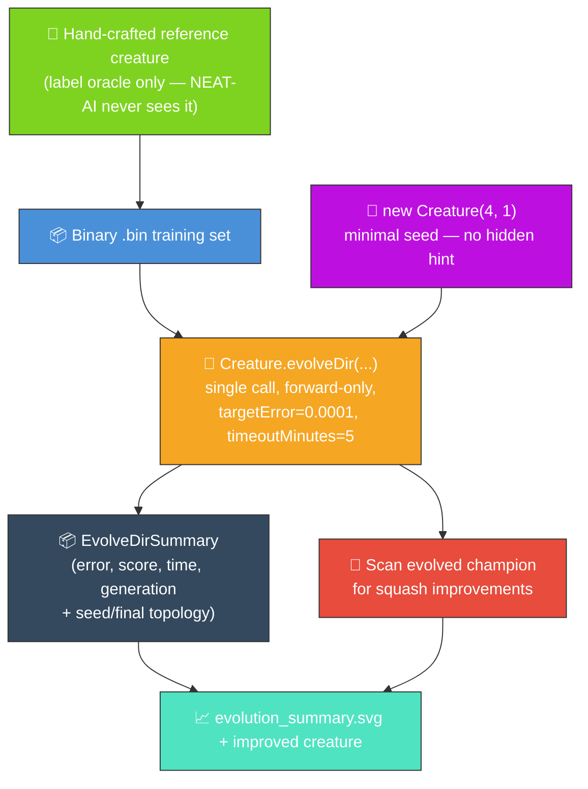
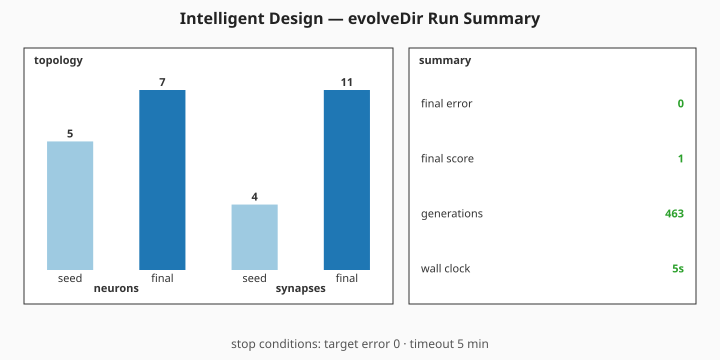

# 🧬 Intelligent Design — Minimal Seed + Squash Improvement Scan

**The audit (#214) reframes this example.** The published evolution genuinely _learns_ the network
structure from a minimal NEAT-AI seed — no hand-tuned topology, no pre-built `network.json`. The
original "intelligent design" framing is preserved by running the squash improvement scan on the
**evolved** champion: even after evolution, NEAT-AI can suggest activation function substitutions
that improve the score.

Under [#302](https://github.com/stSoftwareAU/NEAT-AI-Examples/issues/302) the per-generation
telemetry hook was removed in favour of NEAT-AI's milestone-only telemetry surface (see
[#298](https://github.com/stSoftwareAU/NEAT-AI-Examples/issues/298)). The README now references a
single milestone summary SVG sourced from `Creature.evolveDir`'s return value via the shared
[`renderEvolveDirSummarySvg`](../common/evolve_dir_summary.ts) helper.

## 🔧 How It Works



**Acronyms.** _NEAT_ = NeuroEvolution of Augmenting Topologies. _SVG_ = Scalable Vector Graphics.
_GELU_ = Gaussian Error Linear Unit.

`improve_squash_example.ts` runs end-to-end:

1. Build a small hand-crafted reference creature (4 inputs, 5 hidden, 1 output, mixed squashes) and
   use it to synthesise a deterministic binary `.bin` training set. The reference is only the _label
   oracle_ — NEAT-AI never sees it.
2. Seed evolution with `new Creature(INPUT_COUNT, OUTPUT_COUNT)` — four inputs, one output, no
   hidden neurons, no warm start.
3. Make a **single** `Creature.evolveDir(dataDir, options)` call over the `.bin` directory in
   forward-only mode until either the per-example `targetError` is reached or the
   `timeoutMinutes: 5` backstop fires.
4. Run `scanForSquashImprovements` on the evolved champion to systematically test alternative
   activation functions. This is the original "intelligent design" demo, now operating on the
   genuinely-evolved creature.
5. Render a milestone summary SVG from the `evolveDir` return value plus the seed and final creature
   topology via `renderEvolveDirSummarySvg`.

## 📈 Latest measured run (`./intelligent_design/run.sh`)

The chart is sourced from `Creature.evolveDir`'s return value plus the seed and final creature's
topology — no per-generation telemetry hook.



## 🧪 What "reasonable solution" means here

The evolved champion's final score on the binary `.bin` training set should approach the theoretical
maximum of 1.0. When the final per-record error falls below `targetError`, evolution stops because
the champion is producing labels close to the hand-crafted reference creature's outputs on average.
That is a reasonable solution to the labelled task: a 5-neuron / 4-synapse direct-only seed has been
grown into a champion that reproduces the input → output behaviour of a 10-neuron / 18-synapse
reference _without ever seeing its topology_.

The squash improvement scan then tests alternative activation functions on each hidden neuron of the
**evolved** champion. Try different target squashes (e.g. `Swish` or `LeakyReLU`) to see the scan
substitute one onto the evolved creature.

## 🚀 Running the example

```bash
./intelligent_design/run.sh
```

By default the example tests `GELU` as the target squash. You can specify a different squash:

```bash
./intelligent_design/run.sh Swish
./intelligent_design/run.sh LeakyReLU
```

> [!TIP]
> The script writes all artefacts to `.synthetic-intelligent-design/`, a hidden directory ignored by
> git. Poke around in there to inspect the creatures and data files!

You will find:

- `data/synthetic_*.bin` — Binary training files derived from the reference creature.
- `creatures/reference.json` — The hand-crafted reference creature (label oracle only).
- `creatures/champion.json` — The evolved champion produced from the minimal seed.
- `creatures/improved.json` – The improved creature when the squash scan finds substitutions.
- `output/` – Individual improved creatures for each neuron the scanner tried.

The milestone summary SVG is committed under `docs/`:

- [`docs/screenshots/intelligent_design/evolution_summary.svg`](../docs/screenshots/intelligent_design/evolution_summary.svg)

> ⚡ **Speed note:** this example writes its training data in NEAT-AI's binary format — see
> [`docs/binary_training_stream.md`](../docs/binary_training_stream.md).

## 🧠 Tacit Knowledge

In production workflows, successful squash substitutions are recorded as "tacit knowledge" —
mappings from neuron UUID to squash function. This knowledge can be shared across machines (via a
"hive" file in a git repository) or kept local. When a model is loaded, tacit knowledge is applied
to quickly reapply known-good squash substitutions without rescanning.

## 🧰 NEAT-AI features used

**Acronym.** _NEAT_ = NeuroEvolution of Augmenting Topologies.

- **Minimal NEAT seed** — `new Creature(input, output)` with no hidden hint, no pre-built
  `network.json` seed; NEAT-AI random-initialises the rest.
- **`Creature.evolveDir`** over the binary `.bin` training stream (per
  [`docs/binary_training_stream.md`](../docs/binary_training_stream.md)) — orders of magnitude
  faster than per-call `activate()`.
- **Forward-only mutation** — `evolveDir` defaults to forward-only when `feedbackLoop` is not set,
  matching the audit's stop-condition + topology contract.
- **Milestone-only telemetry** — the chart is sourced from `evolveDir`'s return value via the shared
  `renderEvolveDirSummarySvg` helper, matching NEAT-AI's supported telemetry surface (see
  [`AGENTS.md`](../AGENTS.md)).
- **Unique Activation Functions (IF, MAX, MIN, …)** — the squash scan explores NEAT-AI's extended
  activation set on the evolved champion (see upstream
  [`COMPARISON.md`](https://github.com/stSoftwareAU/NEAT-AI/blob/Develop/COMPARISON.md#what-weve-implemented)).
- **Fitness-Driven Squash Mutation** — swaps activation functions on the evolved creature guided by
  fitness rather than randomly — the core operator this example demonstrates.
