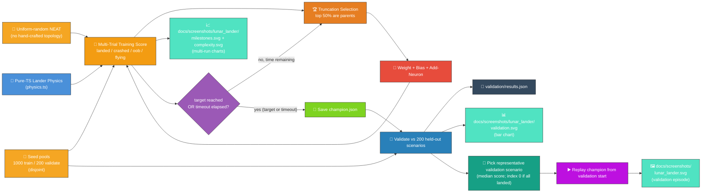
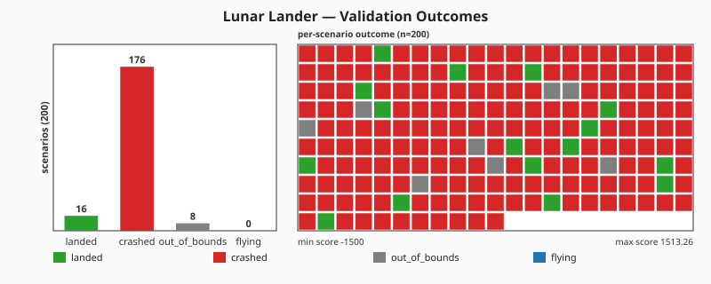
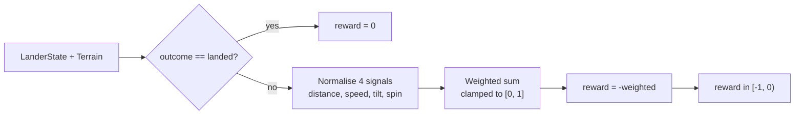
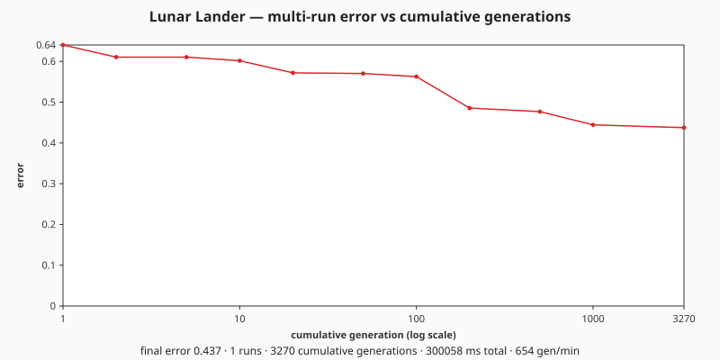
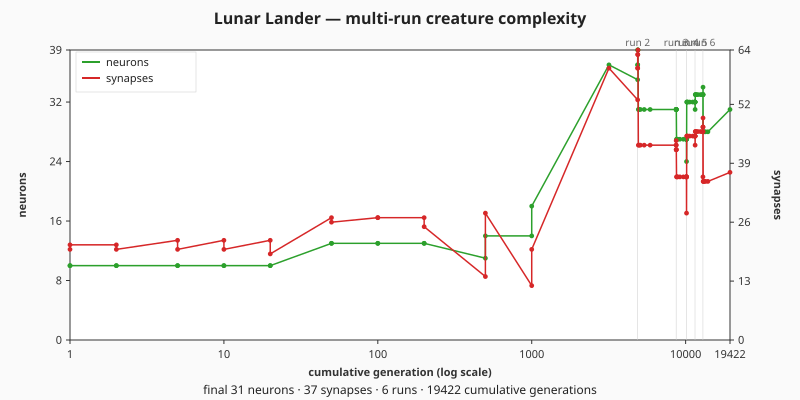

# 🚀 Lunar Lander — Descending onto a Flat Pad

> 🌱 **Generation 1 starts from random noise** — a fresh `new Creature(INPUT_COUNT, OUTPUT_COUNT)`
> seed handed to `Creature.evolveRL()`, with no hand-crafted topology. The captured milestones show
> the controller evolving from chaotic crashes into a network that throttles, orients, and lands
> softly on the pad.

**Acronyms.** _NEAT_ = NeuroEvolution of Augmenting Topologies. _RCS_ = reaction control system
(small attitude-control thrusters that apply torque without changing translation). _CTRNN_ =
continuous-time recurrent neural network — the temporal-memory style NEAT-AI uses for stateful
controllers.

`lunar_lander.ts` evolves a NEAT-AI controller that lands a simplified 2D lunar lander on a marked
landing pad. The simulator and the evolutionary loop run entirely in pure TypeScript, so the only
external dependency is NEAT-AI's `Creature.activate` to compute each step's thruster commands.


## 📊 Real Run Statistics

On a default multi-run invocation (`targetError=0.01`, `timeoutMinutes=5`) the example resumes from
the previously-saved champion (`docs/data/lunar_lander/creature.json`) and continues evolution. Per
[#298](https://github.com/stSoftwareAU/NEAT-AI-Examples/issues/298) NEAT-AI surfaces only milestone
statistics, so the canonical fitness-progression artefacts are the two multi-run charts embedded
below (`milestones.svg` for normalised error, `complexity.svg` for neuron + synapse counts). Each
run appends its milestones to the merged history (`docs/data/lunar_lander/milestones.json`) so the
chart's x-axis is the cumulative generation across **every** run, with faint guide lines marking the
run boundaries.

The topology genuinely grows during the run rather than being memorised from a hand-crafted seed:
the gen-1 milestone records NEAT-AI's minimal `(input, output)` seed (seven inputs and three
outputs, fully connected with no hidden layer) and subsequent milestones capture the neuron and
synapse counts as NEAT-AI's structural-mutation operators splice in hidden neurons. The complexity
chart below renders this growth — champion neuron and synapse counts — at the canonical milestone
cadence (generations 1, 2, 5, 10, 20, 50, 100, 200, 500, 1000, then powers of ten).

> Continuous Integration runs the example in **quick mode** (`LUNAR_QUICK=1`, ~6 seconds) so
> `quality.sh` finishes in seconds and never overwrites the canonical artefacts. The artefacts
> listed below come from a **manual full-budget run** of `./lunar_lander/run.sh`.

## 🔧 How It Works



## 🧪 Validation Against Held-Out Scenarios

After evolution stops the runner replays the champion against the **200 held-out validation
scenarios** drawn from a disjoint seed pool (see `scenarios.ts`). The controller cannot have seen
any of these starts during training, so its validation outcomes measure generalisation, not
memorisation. Every per-scenario outcome (`landed` / `crashed` / `out_of_bounds` / `flying`) plus
final state and trial fitness is written to `.synthetic-lunar-lander/validation/results.json`.

The descent screenshot embedded above (`docs/screenshots/lunar_lander.svg`) is rendered from a
**representative validation episode**, not the canonical training launch — so the SVG always shows
the controller handling an unseen state, and on the captured run that state ends in a `crashed`
outcome (the badge in the top-right corner reflects the real per-scenario result). The default
selection rule is the validation scenario whose final score is the **median** across all validation
scenarios; if every scenario lands, the runner falls back to validation index 0 to keep the choice
deterministic when scores cluster tightly.

The aggregate per-scenario outcome distribution is drawn alongside the descent SVG as a bar chart:



The validation outcome counts (`landed` / `crashed` / `out_of_bounds` / `flying`) and the mean
validation fitness vary between runs because the upstream library makes no byte-level
reproducibility guarantee on `Creature.evolveRL()`'s training trajectory; the bar chart is
regenerated from the current champion on every full-budget run.

## 🎯 NEAT-AI Standard Stop Conditions

Two stop conditions bound the search — the same two fields used across NEAT-AI's `NeatOptions`:

- **`targetError`** (default `0.01`) — the champion must achieve a **landed-on-pad rate ≥
  `1 − targetError`** across a fixed deterministic batch of perturbed-start trials. The default
  threshold is `landed-rate ≥ 99%`. Each landed trial obeys the safe-landing limits (≤ 11.5° tilt, ≤
  2 m/s vertical and ≤ 2 m/s horizontal speed at touchdown), so the threshold checks both pad
  accuracy _and_ gentleness, not just one.
- **`timeoutMinutes`** (default `2`) — the evolver stops once `timeoutMinutes` minutes have elapsed
  since the loop began, even when the target is not reached, so the example terminates predictably.

### Graded terminal reward — gradient between near-miss and disaster

The adapter emits a **graded** terminal reward in `[-1, 0]` via `gradedTerminalReward` rather than
the binary `0`/`-1` it used to carry. The reward is `0` exactly when the lander lands safely;
otherwise it is a weighted combination of four normalised terminal-step signals: distance from pad
centre, impact speed (`sqrt(vx² + vy²)`), tilt magnitude, and angular velocity. A soft, upright
crash next to the pad scores close to `0`; a fast inverted spin out of bounds scores close to `-1`.



Implication for `targetError`: because non-landed crashes can now contribute less than `1` to the
error sum, `error = 1 − landedRate` is now an **upper bound** rather than an exact identity. A
landed rate of e.g. 50% can produce a mean error well below 0.5 if the non-landed crashes are soft.
So `targetError = 0.01` still guarantees the loop stops at **≥ 99% landed rate** in the worst case,
and may stop earlier when the non-landed trials are graded mildly. The graded shape gives the
evolutionary search a smooth gradient to climb — a controller that drifts within metres of the pad
scores measurably better than one that explodes out of bounds, so selection can reward incremental
improvement instead of waiting for the first successful landing.

Whichever condition fires first wins. The runner reports `result.stopReason` (`"target"`,
`"timeout"`, or `"iterations"`) and `result.wallclockMs` so callers can distinguish the outcomes.
The CLI runner accepts overrides:

```bash
./lunar_lander/run.sh --target-error=0.05 --timeout=5
./lunar_lander/run.sh --fresh   # wipe prior multi-run state before evolving
```

Multi-trial scoring (`trials = 10`, `initialPerturbation = 1.0`) means a controller cannot win by
getting lucky on a single canonical launch — it has to land robustly across a varied batch of
starts.

## 🎯 Inputs and Outputs

| Channel  | Type       | Symbol     | Meaning                                           |
| -------- | ---------- | ---------- | ------------------------------------------------- |
| Input 0  | observable | `x`        | Horizontal position (metres, 0 above the pad)     |
| Input 1  | observable | `y`        | Altitude (metres, 0 at ground level)              |
| Input 2  | observable | `vx`       | Horizontal velocity (m/s)                         |
| Input 3  | observable | `vy`       | Vertical velocity (m/s, negative = falling)       |
| Input 4  | observable | `angle`    | Tilt from upright (radians, positive = tilt left) |
| Input 5  | observable | `angularV` | Angular velocity (rad/s)                          |
| Input 6  | observable | `fuel`     | Remaining propellant (units, never negative)      |
| Output 0 | action     | main       | `>= 0.5` fires the main engine                    |
| Output 1 | action     | left       | `>= 0.5` fires the left RCS thruster              |
| Output 2 | action     | right      | `>= 0.5` fires the right RCS thruster             |

The action space is intentionally small and discrete: each timestep the controller chooses any
combination of three boolean thrusters. The main engine accelerates the lander along its local "up"
axis (so a tilt deflects thrust sideways); the RCS thrusters apply pure torque.

## 🏁 Outcomes and Scoring

A run terminates as soon as one of these conditions holds:

- **landed** — touched the ground inside the pad, near-upright (≤ ~11.5° tilt), descending at ≤ 2
  m/s vertical and ≤ 2 m/s horizontal speed. Reward is high; remaining fuel earns extra points.
- **crashed** — touched the ground outside the pad, too fast, or too tilted. Penalty grows with
  impact speed, distance from the pad, and angular error.
- **out_of_bounds** — drifted past the world's horizontal half-width. Heavy fixed penalty.
- **flying** — episode hit the timestep cap before resolution. Modest penalty plus extra cost for
  altitude, so a perpetual hover does not out-score a near-landing.

## 🚀 Running the Example

```bash
./lunar_lander/run.sh
```

### CI/quality fast path

`quality.sh` invokes the runner with `LUNAR_QUICK=1` so the lunar-lander section finishes in
seconds, not minutes. Quick mode forces a tiny ~6-second wall-clock budget (`timeoutMinutes = 0.1`)
and an unreachable target error (`targetError = -1`, threshold `landed-rate ≥ 200%`) so the loop
always exits via `timeout`. The full pipeline still runs end-to-end (population scoring, validation,
replay, SVG/CSV/chart construction) — only the **disk writes** that would overwrite the canonical
docs artefacts are gated off, so a CI run never disturbs the SVGs and CSVs checked into the repo.
Either entry point works:

```bash
LUNAR_QUICK=1 ./lunar_lander/run.sh   # env var
./lunar_lander/run.sh --quick         # CLI flag (equivalent)
```

Without quick mode, the runner uses the realistic `targetError = 0.01`, `timeoutMinutes = 2`
defaults — that is the path users invoke directly when they want a champion + canonical artefacts.

Artefacts:

- `.synthetic-lunar-lander/creatures/champion.json` — the fittest controller from the latest run
  (also persisted under `docs/data/lunar_lander/creature.json` by the multi-run helper)
- `docs/data/lunar_lander/creature.json` — the latest champion (multi-run state, reloaded on the
  next invocation)
- `docs/data/lunar_lander/milestones.json` — merged milestone history across every run, with both
  per-run and cumulative generation indices
- `.synthetic-lunar-lander/validation/results.json` — per-scenario outcomes from replaying the
  champion against every held-out validation scenario (one entry per scenario plus aggregate counts;
  consumed by downstream charts)
- `docs/screenshots/lunar_lander.svg` — animated descent diagram with terrain, the pad marked with a
  `TARGET` arrow, a polyline trace, the lander rendered at start, mid-descent, and touchdown, plus a
  moving lander icon that **tilts with the controller's angle** and lights its **main / left RCS /
  right RCS** flames as the thrusters fire. A shrinking `FUEL` HUD bar surfaces the fuel budget so
  viewers can see the controller "fight gravity & fuel" while aiming for the pad. **When the
  champion crashes or drifts out of bounds**, the renderer replaces the resting lander with a
  pulsing starburst-and-debris **explosion** plus an `EXPLODED` / `OUT OF BOUNDS` caption, and a
  colour-coded outcome badge (`✓ LANDED` / `✗ CRASHED` / `✗ OUT OF BOUNDS` / `… TIMED OUT`) sits in
  the top-right corner so the result is unmistakable
  ([issue #177](https://github.com/stSoftwareAU/NEAT-AI-Examples/issues/177)).
- `docs/screenshots/lunar_lander/milestones.svg` — multi-run error chart plotting normalised error
  vs cumulative generation across every run, with faint run-boundary guide lines. Subsumes the
  legacy single-run `lunar_lander_milestones.svg` retired by
  [#324](https://github.com/stSoftwareAU/NEAT-AI-Examples/issues/324).
- `docs/screenshots/lunar_lander/complexity.svg` — multi-run complexity chart plotting champion
  neuron + synapse counts vs cumulative generation across every run.
- `docs/screenshots/lunar_lander/validation.svg` — per-validation-scenario outcome bar chart
  (`landed` / `crashed` / `out_of_bounds` / `flying` counts across the 200 held-out scenarios)

## Evolution Progress





The runner collects `evolverl_milestone` events from `Creature.evolveRL()` (emitted at the canonical
milestone cadence — generations 1, 2, 5, 10, 20, 50, 100, 200, 500, 1000, then powers of ten),
converts each into a `MultiRunMilestone`, and appends them to the merged history under
`docs/data/lunar_lander/milestones.json`. The two charts re-render from that history on every run so
the noise → competent narrative is preserved across resumes.

Per [#351](https://github.com/stSoftwareAU/NEAT-AI-Examples/issues/351), the runner also appends a
**synthetic final-generation milestone** whenever the run terminates between two canonical schedule
points — for example, when a 5-minute timeout fires at generation 1487, between 1000 and 10000. The
synthetic milestone carries the champion's actual neuron and synapse counts plus the run's final
normalised error, so the chart's x-axis reflects the **true terminal generation count** rather than
the previous round number. Without it the chart would truncate at 1000, even though the run executed
several hundred further generations.

## 🛬 Entry Profile

Issue [#72](https://github.com/stSoftwareAU/NEAT-AI-Examples/issues/72): the lander now enters
**off-pad and drifting**, rather than hovering directly above the touchdown zone, so the controller
must actively manoeuvre — exactly like the classic Atari Lunar Lander.

| Quantity                     | Value                      |
| ---------------------------- | -------------------------- |
| Starting horizontal position | `DEFAULT_START_X` m        |
| Starting horizontal velocity | `DEFAULT_START_VX` m/s     |
| Starting altitude            | `DEFAULT_START_ALTITUDE` m |
| Starting fuel                | `DEFAULT_START_FUEL` units |

The controller has to translate sideways towards the pad while braking against gravity AND its own
horizontal drift, all on a finite fuel budget.

## 🧪 Wider Scenario Distribution and Disjoint Train/Validate Pools

Issue [#195](https://github.com/stSoftwareAU/NEAT-AI-Examples/issues/195): a champion that simply
memorises one trajectory must not pass evaluation. Two safeguards live in `physics.ts` and the new
`scenarios.ts` module:

- **Wider distribution** — `perturbedScenario` (and the legacy `perturbedInitialState`) draws every
  component around the canonical entry across a substantially wider range. The half-ranges at
  `magnitude=1` are exported as `WIDE_RANGES`:

  | Component | Centre                   | ± Half-range | Notes                             |
  | --------- | ------------------------ | ------------ | --------------------------------- |
  | `x`       | `DEFAULT_START_X`        | 25 m         | Stays inside `worldHalfWidth`     |
  | `y`       | `DEFAULT_START_ALTITUDE` | 20 m         | Always above the ground           |
  | `vx`      | `DEFAULT_START_VX`       | 3 m/s        | —                                 |
  | `vy`      | 0                        | 2 m/s        | —                                 |
  | `angle`   | 0                        | 0.25 rad     | ≈ ±14°                            |
  | `fuel`    | `DEFAULT_START_FUEL`     | 20 units     | Always > 0                        |
  | `padX`    | 0                        | 20 m         | Pad still inside the world bounds |

  Only `perturbedScenario` varies `padX` (it returns both the lander state and the terrain).

- **Disjoint training and validation seed pools** — `generateScenarioPools(baseSeed, 1000, 200)` in
  `scenarios.ts` derives two non-overlapping pools of 32-bit per-scenario seeds from a single base
  seed, then realises each pool into `{ state, terrain }` pairs. Same base seed → identical pools;
  different seeds → different pools. A controller that overfits training seeds cannot see validation
  seeds during evolution, so the validation score reflects generalisation rather than memorisation.

  ```mermaid
  flowchart LR
      SEED["base seed"] --> POOLS["seed-pool builder<br/>(32-bit, dedup)"]
      POOLS --> TRAIN["1000 training seeds"]
      POOLS --> VAL["200 validation seeds"]
      TRAIN --> SAMPLER["perturbedScenario<br/>(wider distribution)"]
      VAL --> SAMPLER
      SAMPLER --> SCENARIOS["LanderState + Terrain pairs"]
  ```

  Every drawn scenario classifies as `flying` at `t=0`: above ground, inside the world bounds, with
  fuel remaining — no impossible launches.

## 🧠 Why This Task Benefits from Temporal Memory

Cart-Pole is solvable by a stateless linear policy — every timestep's correct action is determined
entirely by the current observables. Lunar-lander is a sequential control problem with much longer
horizons:

- **Plan ahead, brake in time.** A purely reactive controller that fires the main engine only when
  `vy` is dangerous will already be too late at low altitudes. Solving the task well rewards
  planning a deceleration profile that reaches the safe-landing envelope at `y = 0`.
- **Fuel is a budget.** Hovering uses fuel just like descending, so the controller has to balance
  long-term commitment to descent against short-term safety margin.
- **Coupled rotation and translation.** Tilt deflects the main thrust sideways, so a controller that
  dawdles upright against drift may run out of fuel mid-air.

This is exactly the kind of task where NEAT-AI's
[CTRNN-style temporal memory](https://github.com/stSoftwareAU/NEAT-AI#-key-features) shines:
recurrent connections let evolved networks integrate information across timesteps and learn
anticipatory braking. The example here uses a simple feed-forward genome to keep the search
tractable for an in-process demo, but the same input/output contract is a natural drop-in for richer
architectures explored elsewhere in the NEAT-AI toolkit.

## 🧪 Tacit Knowledge

A few things that are not obvious from the code alone:

- **Pure-TS physics, no Python.** The original `rustneat` lunar-lander demo uses OpenAI Gym; this
  port reimplements the bare minimum (gravity, fixed-thrust engines, ground collision, fuel) in
  TypeScript so the example stays self-contained and fast.
- **Semi-implicit Euler.** Velocities are updated before positions, which is energy-stable for small
  `timeStep` values and matches the integration convention used in `cart_pole/`.
- **Reproducibility.** All randomness flows through `common/deterministic_random.ts`. With a fixed
  seed the same champion is produced on every run.
- **No hand-crafted topology.** Issue
  [#153](https://github.com/stSoftwareAU/NEAT-AI-Examples/issues/153) replaced the original
  hand-specified 7-input → 3-output dense layer with a uniform-random NEAT initial population. Under
  the [#240](https://github.com/stSoftwareAU/NEAT-AI-Examples/issues/240) migration, the seed is now
  a fresh `new Creature(INPUT_COUNT, OUTPUT_COUNT)` handed to `Creature.evolveRL()` (direct input →
  output connections, random weights, random output biases); NEAT-AI's own structural mutation
  operators grow hidden topology during evolution. There is no "warm start" — gen 1 is genuine
  noise.
- **Minimal-seed audit.** Issue [#224](https://github.com/stSoftwareAU/NEAT-AI-Examples/issues/224)
  re-confirmed the audit guarantees against the merged
  [#195](https://github.com/stSoftwareAU/NEAT-AI-Examples/issues/195) /
  [#196](https://github.com/stSoftwareAU/NEAT-AI-Examples/issues/196) /
  [#198](https://github.com/stSoftwareAU/NEAT-AI-Examples/issues/198)–[#202](https://github.com/stSoftwareAU/NEAT-AI-Examples/issues/202)
  pipeline: only `INPUT_COUNT` and `OUTPUT_COUNT` are passed to the library (no `hiddenLayers`, no
  `nodes`, no pre-built `network.json`); the per-step `activate()` call is justified by the
  interactive reinforcement learning (RL) environment; stop conditions are the standard
  `targetError` + `timeoutMinutes` pair on `EvolveRLOptions`; and the gen-0 champion's topology is
  the bare 10-neuron / 21-synapse seed, growing as the run progresses. The per-generation
  neuron/synapse chart embedded above shows the growth visually.

## 🧰 NEAT-AI Features Used

Lunar Lander is an agent demo — evolution-from-noise on a temporally-rich control task. The
capability surfaced here is evolutionary topology search with NEAT-AI's CTRNN-style temporal memory
neurons.

> 🔎 **Stripped-down operator subset.** This example deliberately exercises a narrow slice of
> NEAT-AI's full pipeline so the noise → competent story stays uncluttered. The production training
> pipeline (backpropagation, dropout, L1/L2 regularisation, K-fold, binary `.bin` data streams,
> distributed evolution, etc.) is intentionally **not** wired into this demo — see issue
> [#185](https://github.com/stSoftwareAU/NEAT-AI-Examples/issues/185) and the upstream
> production-pipeline notes in
> [`COMPARISON.md`](https://github.com/stSoftwareAU/NEAT-AI/blob/Develop/COMPARISON.md) for the
> wider feature set.

Features exercised (links go to upstream
[`COMPARISON.md`](https://github.com/stSoftwareAU/NEAT-AI/blob/Develop/COMPARISON.md)):

- **[Evolutionary Topology Search](https://github.com/stSoftwareAU/NEAT-AI/blob/Develop/COMPARISON.md#what-weve-implemented)**
  — structural mutation co-evolved with weights and biases against the soft-landing fitness signal.
- **[Genetic Operators](https://github.com/stSoftwareAU/NEAT-AI/blob/Develop/COMPARISON.md#what-weve-implemented)**
  — weight and bias mutation, plus selection pressure on the episode-return fitness function.
