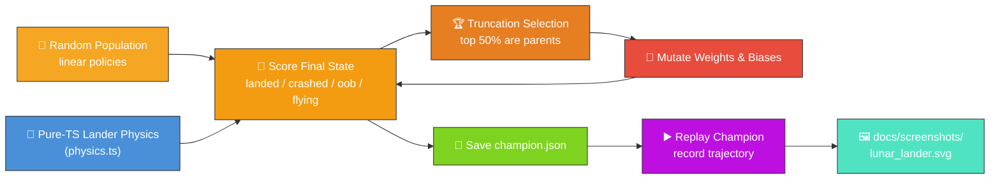

# 🚀 Lunar Lander — Descending onto a Flat Pad

`lunar_lander.ts` evolves a NEAT-AI controller that lands a simplified 2D lunar lander on a marked
landing pad. The simulator and the evolutionary loop run entirely in pure TypeScript, so the only
external dependency is NEAT-AI's `Creature.activate` to compute each step's thruster commands.


## 🔧 How It Works



## 🎯 Inputs and Outputs

| Channel  | Type       | Symbol     | Meaning                                           |
| -------- | ---------- | ---------- | ------------------------------------------------- |
| Input 0  | observable | `x`        | Horizontal position (metres, 0 above the pad)     |
| Input 1  | observable | `y`        | Altitude (metres, 0 at ground level)              |
| Input 2  | observable | `vx`       | Horizontal velocity (m/s)                         |
| Input 3  | observable | `vy`       | Vertical velocity (m/s, negative = falling)       |
| Input 4  | observable | `angle`    | Tilt from upright (radians, positive = tilt left) |
| Input 5  | observable | `angularV` | Angular velocity (rad/s)                          |
| Input 6  | observable | `fuel`     | Remaining propellant (units, never negative)      |
| Output 0 | action     | main       | `>= 0.5` fires the main engine                    |
| Output 1 | action     | left       | `>= 0.5` fires the left RCS thruster              |
| Output 2 | action     | right      | `>= 0.5` fires the right RCS thruster             |

The action space is intentionally small and discrete: each timestep the controller chooses any
combination of three boolean thrusters. The main engine accelerates the lander along its local "up"
axis (so a tilt deflects thrust sideways); the RCS thrusters apply pure torque.

## 🏁 Outcomes and Scoring

A run terminates as soon as one of these conditions holds:

- **landed** — touched the ground inside the pad, near-upright (≤ ~11.5° tilt), descending at ≤ 2
  m/s vertical and ≤ 2 m/s horizontal speed. Reward is high; remaining fuel earns extra points.
- **crashed** — touched the ground outside the pad, too fast, or too tilted. Penalty grows with
  impact speed, distance from the pad, and angular error.
- **out_of_bounds** — drifted past the world's horizontal half-width. Heavy fixed penalty.
- **flying** — episode hit the timestep cap before resolution. Modest penalty plus extra cost for
  altitude, so a perpetual hover does not out-score a near-landing.

## 🚀 Running the Example

```bash
./lunar_lander/run.sh
```

Artefacts:

- `.synthetic-lunar-lander/creatures/champion.json` — the fittest controller from the run
- `docs/screenshots/lunar_lander.svg` — animated descent diagram with terrain, the pad marked with a
  `TARGET` arrow, a polyline trace, the lander rendered at start, mid-descent, and touchdown, plus a
  moving lander icon that **tilts with the controller's angle** and lights its **main / left RCS /
  right RCS** flames as the thrusters fire. A shrinking `FUEL` HUD bar surfaces the fuel budget so
  viewers can see the controller "fight gravity & fuel" while aiming for the pad.

## 🛬 Entry Profile

Issue [#72](https://github.com/stSoftwareAU/NEAT-AI-Examples/issues/72): the lander now enters
**off-pad and drifting**, rather than hovering directly above the touchdown zone, so the controller
must actively manoeuvre — exactly like the classic Atari Lunar Lander.

| Quantity                     | Value                      |
| ---------------------------- | -------------------------- |
| Starting horizontal position | `DEFAULT_START_X` m        |
| Starting horizontal velocity | `DEFAULT_START_VX` m/s     |
| Starting altitude            | `DEFAULT_START_ALTITUDE` m |
| Starting fuel                | `DEFAULT_START_FUEL` units |

The controller has to translate sideways towards the pad while braking against gravity AND its own
horizontal drift, all on a finite fuel budget.

## 🧠 Why This Task Benefits from Temporal Memory

Cart-Pole is solvable by a stateless linear policy — every timestep's correct action is determined
entirely by the current observables. Lunar-lander is a sequential control problem with much longer
horizons:

- **Plan ahead, brake in time.** A purely reactive controller that fires the main engine only when
  `vy` is dangerous will already be too late at low altitudes. Solving the task well rewards
  planning a deceleration profile that reaches the safe-landing envelope at `y = 0`.
- **Fuel is a budget.** Hovering uses fuel just like descending, so the controller has to balance
  long-term commitment to descent against short-term safety margin.
- **Coupled rotation and translation.** Tilt deflects the main thrust sideways, so a controller that
  dawdles upright against drift may run out of fuel mid-air.

This is exactly the kind of task where NEAT-AI's
[CTRNN-style temporal memory](https://github.com/stSoftwareAU/NEAT-AI#-key-features) shines:
recurrent connections let evolved networks integrate information across timesteps and learn
anticipatory braking. The example here uses a simple feed-forward genome to keep the search
tractable for an in-process demo, but the same input/output contract is a natural drop-in for richer
architectures explored elsewhere in the NEAT-AI toolkit.

## 🧪 Tacit Knowledge

A few things that are not obvious from the code alone:

- **Pure-TS physics, no Python.** The original `rustneat` lunar-lander demo uses OpenAI Gym; this
  port reimplements the bare minimum (gravity, fixed-thrust engines, ground collision, fuel) in
  TypeScript so the example stays self-contained and fast.
- **Semi-implicit Euler.** Velocities are updated before positions, which is energy-stable for small
  `timeStep` values and matches the integration convention used in `cart_pole/`.
- **Reproducibility.** All randomness flows through `common/deterministic_random.ts`. With a fixed
  seed the same champion is produced on every run.
- **Linear genome is enough for a respectable controller.** Seven inputs feed three logistic outputs
  — twenty-one weights and three biases. Larger architectures land with more margin to spare, but
  the linear case already produces a recognisable descent.
