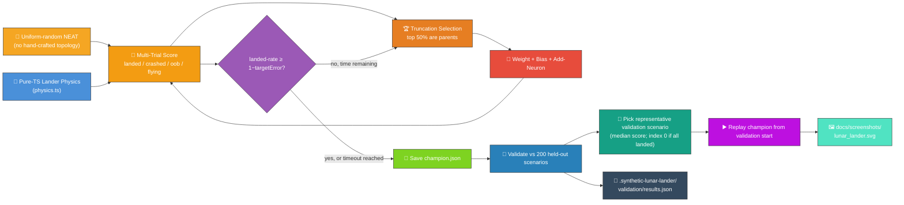
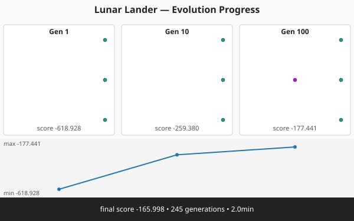
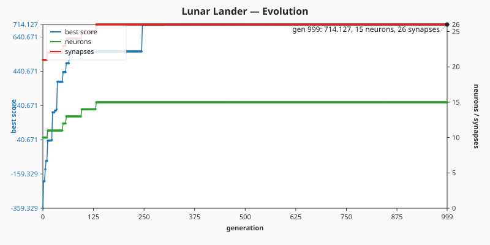

# 🚀 Lunar Lander — Descending onto a Flat Pad

> 🌱 **Generation 1 starts from random noise** — uniform-random NEAT genomes built by
> `createSeededPopulation`, with no hand-crafted topology. The captured milestones show the
> controller evolving from chaotic crashes into a network that throttles, orients, and lands softly
> on the pad.

**Acronyms.** _NEAT_ = NeuroEvolution of Augmenting Topologies. _RCS_ = reaction control system
(small attitude-control thrusters that apply torque without changing translation). _CTRNN_ =
continuous-time recurrent neural network — the temporal-memory style NEAT-AI uses for stateful
controllers.

`lunar_lander.ts` evolves a NEAT-AI controller that lands a simplified 2D lunar lander on a marked
landing pad. The simulator and the evolutionary loop run entirely in pure TypeScript, so the only
external dependency is NEAT-AI's `Creature.activate` to compute each step's thruster commands.



## 🔧 How It Works



## 🧪 Validation Against Held-Out Scenarios

After evolution stops the runner replays the champion against the **200 held-out validation
scenarios** drawn from a disjoint seed pool (see `scenarios.ts`). The controller cannot have seen
any of these starts during training, so its validation outcomes measure generalisation, not
memorisation. Every per-scenario outcome (`landed` / `crashed` / `out_of_bounds` / `flying`) plus
final state and trial fitness is written to `.synthetic-lunar-lander/validation/results.json`.

The descent screenshot embedded above (`docs/screenshots/lunar_lander.svg`) is rendered from a
**representative validation episode**, not the canonical training launch — so the SVG demonstrates
the controller handling an unseen state. The default selection rule is the validation scenario whose
final score is the **median** across all validation scenarios; if every scenario lands, the runner
falls back to validation index 0 to keep the choice deterministic when scores cluster tightly.

## 🎯 NEAT-AI Standard Stop Conditions

Two stop conditions bound the search — the same two fields used across NEAT-AI's `NeatOptions`:

- **`targetError`** (default `0.01`) — the champion must achieve a **landed-on-pad rate ≥
  `1 − targetError`** across a fixed deterministic batch of perturbed-start trials. The default
  threshold is `landed-rate ≥ 99%`. Each landed trial obeys the safe-landing limits (≤ 11.5° tilt, ≤
  2 m/s vertical and ≤ 2 m/s horizontal speed at touchdown), so the threshold checks both pad
  accuracy _and_ gentleness, not just one.
- **`timeoutMinutes`** (default `2`) — the evolver stops once `timeoutMinutes` minutes have elapsed
  since the loop began, even when the target is not reached, so the example terminates predictably.

Whichever condition fires first wins. The runner reports `result.stopReason` (`"target"` or
`"timeout"`) and `result.wallclockMs` so callers can distinguish the two outcomes. The CLI runner
accepts overrides:

```bash
./lunar_lander/run.sh --target-error=0.05 --timeout-minutes=5
```

Multi-trial scoring (`trials = 10`, `initialPerturbation = 1.0`) means a controller cannot win by
getting lucky on a single canonical launch — it has to land robustly across a varied batch of
starts.

## 🎯 Inputs and Outputs

| Channel  | Type       | Symbol     | Meaning                                           |
| -------- | ---------- | ---------- | ------------------------------------------------- |
| Input 0  | observable | `x`        | Horizontal position (metres, 0 above the pad)     |
| Input 1  | observable | `y`        | Altitude (metres, 0 at ground level)              |
| Input 2  | observable | `vx`       | Horizontal velocity (m/s)                         |
| Input 3  | observable | `vy`       | Vertical velocity (m/s, negative = falling)       |
| Input 4  | observable | `angle`    | Tilt from upright (radians, positive = tilt left) |
| Input 5  | observable | `angularV` | Angular velocity (rad/s)                          |
| Input 6  | observable | `fuel`     | Remaining propellant (units, never negative)      |
| Output 0 | action     | main       | `>= 0.5` fires the main engine                    |
| Output 1 | action     | left       | `>= 0.5` fires the left RCS thruster              |
| Output 2 | action     | right      | `>= 0.5` fires the right RCS thruster             |

The action space is intentionally small and discrete: each timestep the controller chooses any
combination of three boolean thrusters. The main engine accelerates the lander along its local "up"
axis (so a tilt deflects thrust sideways); the RCS thrusters apply pure torque.

## 🏁 Outcomes and Scoring

A run terminates as soon as one of these conditions holds:

- **landed** — touched the ground inside the pad, near-upright (≤ ~11.5° tilt), descending at ≤ 2
  m/s vertical and ≤ 2 m/s horizontal speed. Reward is high; remaining fuel earns extra points.
- **crashed** — touched the ground outside the pad, too fast, or too tilted. Penalty grows with
  impact speed, distance from the pad, and angular error.
- **out_of_bounds** — drifted past the world's horizontal half-width. Heavy fixed penalty.
- **flying** — episode hit the timestep cap before resolution. Modest penalty plus extra cost for
  altitude, so a perpetual hover does not out-score a near-landing.

## 🚀 Running the Example

```bash
./lunar_lander/run.sh
```

### CI/quality fast path

`quality.sh` invokes the runner with `LUNAR_QUICK=1` so the lunar-lander section finishes in
seconds, not minutes. Quick mode forces a tiny ~6-second wall-clock budget (`timeoutMinutes = 0.1`)
and an unreachable target error (`targetError = -1`, threshold `landed-rate ≥ 200%`) so the loop
always exits via `timeout`. The full pipeline still runs end-to-end (population scoring, validation,
replay, SVG/CSV/chart construction) — only the **disk writes** that would overwrite the canonical
docs artefacts are gated off, so a CI run never disturbs the SVGs and CSVs checked into the repo.
Either entry point works:

```bash
LUNAR_QUICK=1 ./lunar_lander/run.sh   # env var
./lunar_lander/run.sh --quick         # CLI flag (equivalent)
```

Without quick mode, the runner uses the realistic `targetError = 0.01`, `timeoutMinutes = 2`
defaults — that is the path users invoke directly when they want a champion + canonical artefacts.

Artefacts:

- `.synthetic-lunar-lander/creatures/champion.json` — the fittest controller from the run
- `.synthetic-lunar-lander/snapshots/snapshot-gen-*.json` — running-champion snapshots captured at
  the configured checkpoints
- `.synthetic-lunar-lander/validation/results.json` — per-scenario outcomes from replaying the
  champion against every held-out validation scenario (one entry per scenario plus aggregate counts;
  consumed by downstream charts)
- `docs/screenshots/lunar_lander.svg` — animated descent diagram with terrain, the pad marked with a
  `TARGET` arrow, a polyline trace, the lander rendered at start, mid-descent, and touchdown, plus a
  moving lander icon that **tilts with the controller's angle** and lights its **main / left RCS /
  right RCS** flames as the thrusters fire. A shrinking `FUEL` HUD bar surfaces the fuel budget so
  viewers can see the controller "fight gravity & fuel" while aiming for the pad. **When the
  champion crashes or drifts out of bounds**, the renderer replaces the resting lander with a
  pulsing starburst-and-debris **explosion** plus an `EXPLODED` / `OUT OF BOUNDS` caption, and a
  colour-coded outcome badge (`✓ LANDED` / `✗ CRASHED` / `✗ OUT OF BOUNDS` / `… TIMED OUT`) sits in
  the top-right corner so the result is unmistakable
  ([issue #177](https://github.com/stSoftwareAU/NEAT-AI-Examples/issues/177)).
- `docs/screenshots/lunar_lander_evolution.svg` — multi-panel evolution-progression strip rendered
  from the captured snapshots
- `docs/screenshots/lunar_lander/evolution.svg` — dual-axis evolution chart plotting best score and
  champion neuron / synapse counts against generation

## Evolution Progress





The runner captures a snapshot of the **running champion** at the canonical checkpoint generations
`[1, 10, 100, 500, 1000]` (those reached before the `timeoutMinutes` budget elapses). The cadence is
wider than the previous fixed-topology demo because variable-topology evolution from uniform-random
noise typically needs more generations to find structure.

Each panel displays the champion's topology (inputs → hidden → outputs), the generation label, and
the score at that checkpoint; the bottom strip charts the score over the captured generations. The
narrative the panels tell is consistent: **gen 1 is random noise** (the panel-1 lander crashes most
attempts), the middle panels show the controller learning to throttle and orient, and the final
panel is a champion that lands softly on the pad on the majority of perturbed starts.

## 🛬 Entry Profile

Issue [#72](https://github.com/stSoftwareAU/NEAT-AI-Examples/issues/72): the lander now enters
**off-pad and drifting**, rather than hovering directly above the touchdown zone, so the controller
must actively manoeuvre — exactly like the classic Atari Lunar Lander.

| Quantity                     | Value                      |
| ---------------------------- | -------------------------- |
| Starting horizontal position | `DEFAULT_START_X` m        |
| Starting horizontal velocity | `DEFAULT_START_VX` m/s     |
| Starting altitude            | `DEFAULT_START_ALTITUDE` m |
| Starting fuel                | `DEFAULT_START_FUEL` units |

The controller has to translate sideways towards the pad while braking against gravity AND its own
horizontal drift, all on a finite fuel budget.

## 🧪 Wider Scenario Distribution and Disjoint Train/Validate Pools

Issue [#195](https://github.com/stSoftwareAU/NEAT-AI-Examples/issues/195): a champion that simply
memorises one trajectory must not pass evaluation. Two safeguards live in `physics.ts` and the new
`scenarios.ts` module:

- **Wider distribution** — `perturbedScenario` (and the legacy `perturbedInitialState`) draws every
  component around the canonical entry across a substantially wider range. The half-ranges at
  `magnitude=1` are exported as `WIDE_RANGES`:

  | Component | Centre                   | ± Half-range | Notes                             |
  | --------- | ------------------------ | ------------ | --------------------------------- |
  | `x`       | `DEFAULT_START_X`        | 25 m         | Stays inside `worldHalfWidth`     |
  | `y`       | `DEFAULT_START_ALTITUDE` | 20 m         | Always above the ground           |
  | `vx`      | `DEFAULT_START_VX`       | 3 m/s        | —                                 |
  | `vy`      | 0                        | 2 m/s        | —                                 |
  | `angle`   | 0                        | 0.25 rad     | ≈ ±14°                            |
  | `fuel`    | `DEFAULT_START_FUEL`     | 20 units     | Always > 0                        |
  | `padX`    | 0                        | 20 m         | Pad still inside the world bounds |

  Only `perturbedScenario` varies `padX` (it returns both the lander state and the terrain).

- **Disjoint training and validation seed pools** — `generateScenarioPools(baseSeed, 1000, 200)` in
  `scenarios.ts` derives two non-overlapping pools of 32-bit per-scenario seeds from a single base
  seed, then realises each pool into `{ state, terrain }` pairs. Same base seed → identical pools;
  different seeds → different pools. A controller that overfits training seeds cannot see validation
  seeds during evolution, so the validation score reflects generalisation rather than memorisation.

  ```mermaid
  flowchart LR
      SEED["base seed"] --> POOLS["seed-pool builder<br/>(32-bit, dedup)"]
      POOLS --> TRAIN["1000 training seeds"]
      POOLS --> VAL["200 validation seeds"]
      TRAIN --> SAMPLER["perturbedScenario<br/>(wider distribution)"]
      VAL --> SAMPLER
      SAMPLER --> SCENARIOS["LanderState + Terrain pairs"]
  ```

  Every drawn scenario classifies as `flying` at `t=0`: above ground, inside the world bounds, with
  fuel remaining — no impossible launches.

## 🧠 Why This Task Benefits from Temporal Memory

Cart-Pole is solvable by a stateless linear policy — every timestep's correct action is determined
entirely by the current observables. Lunar-lander is a sequential control problem with much longer
horizons:

- **Plan ahead, brake in time.** A purely reactive controller that fires the main engine only when
  `vy` is dangerous will already be too late at low altitudes. Solving the task well rewards
  planning a deceleration profile that reaches the safe-landing envelope at `y = 0`.
- **Fuel is a budget.** Hovering uses fuel just like descending, so the controller has to balance
  long-term commitment to descent against short-term safety margin.
- **Coupled rotation and translation.** Tilt deflects the main thrust sideways, so a controller that
  dawdles upright against drift may run out of fuel mid-air.

This is exactly the kind of task where NEAT-AI's
[CTRNN-style temporal memory](https://github.com/stSoftwareAU/NEAT-AI#-key-features) shines:
recurrent connections let evolved networks integrate information across timesteps and learn
anticipatory braking. The example here uses a simple feed-forward genome to keep the search
tractable for an in-process demo, but the same input/output contract is a natural drop-in for richer
architectures explored elsewhere in the NEAT-AI toolkit.

## 🧪 Tacit Knowledge

A few things that are not obvious from the code alone:

- **Pure-TS physics, no Python.** The original `rustneat` lunar-lander demo uses OpenAI Gym; this
  port reimplements the bare minimum (gravity, fixed-thrust engines, ground collision, fuel) in
  TypeScript so the example stays self-contained and fast.
- **Semi-implicit Euler.** Velocities are updated before positions, which is energy-stable for small
  `timeStep` values and matches the integration convention used in `cart_pole/`.
- **Reproducibility.** All randomness flows through `common/deterministic_random.ts`. With a fixed
  seed the same champion is produced on every run.
- **No hand-crafted topology.** Issue
  [#153](https://github.com/stSoftwareAU/NEAT-AI-Examples/issues/153) replaced the original
  hand-specified 7-input → 3-output dense layer with a uniform-random NEAT initial population. The
  library's `createSeededPopulation` decides the gen-1 structure (direct input → output connections,
  random weights, random output biases); the add-neuron structural mutation grows hidden topology
  during evolution. There is no "warm start" — gen 1 is genuine noise.

## 🧰 NEAT-AI Features Used

Lunar Lander is an agent demo — evolution-from-noise on a temporally-rich control task. The
capability surfaced here is evolutionary topology search with NEAT-AI's CTRNN-style temporal memory
neurons.

> 🔎 **Stripped-down operator subset.** This example deliberately exercises a narrow slice of
> NEAT-AI's full pipeline so the noise → competent story stays uncluttered. The production training
> pipeline (backpropagation, dropout, L1/L2 regularisation, K-fold, binary `.bin` data streams,
> distributed evolution, etc.) is intentionally **not** wired into this demo — see issue
> [#185](https://github.com/stSoftwareAU/NEAT-AI-Examples/issues/185) and the upstream
> production-pipeline notes in
> [`COMPARISON.md`](https://github.com/stSoftwareAU/NEAT-AI/blob/Develop/COMPARISON.md) for the
> wider feature set.

Features exercised (links go to upstream
[`COMPARISON.md`](https://github.com/stSoftwareAU/NEAT-AI/blob/Develop/COMPARISON.md)):

- **[Evolutionary Topology Search](https://github.com/stSoftwareAU/NEAT-AI/blob/Develop/COMPARISON.md#what-weve-implemented)**
  — structural mutation co-evolved with weights and biases against the soft-landing fitness signal.
- **[Genetic Operators](https://github.com/stSoftwareAU/NEAT-AI/blob/Develop/COMPARISON.md#what-weve-implemented)**
  — weight and bias mutation, plus selection pressure on the episode-return fitness function.
