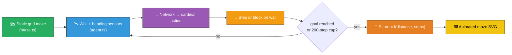

# 🗺️ Maze Navigation — Evolved Agent for a Grid Maze

> 🌱 **Generation 1 starts from random noise** — the captured milestones show the agent evolving
> from there into a network that walks from start to goal.

`maze_navigation.ts` evolves a NEAT-AI controller that navigates a fixed 12×12 grid maze from a
start cell to a goal cell using only local sensor inputs (wall distances plus a packed
heading-to-goal). The simulator (`maze.ts`), evolutionary loop, and animated SVG renderer (`svg.ts`)
all run in pure TypeScript; the only external dependency is NEAT-AI's `Creature.activate` to compute
each step's action.



## 🔧 How It Works



## 🗺️ Maze Layout

The default maze is encoded as a string-art template — `S` marks the start, `G` the goal, `#` walls
and `.` open cells. The path is an L-shape: nine cells east along the top row, then nine cells south
down the rightmost open column.

```text
############
#S.........#
##########.#
##########.#
##########.#
##########.#
##########.#
##########.#
##########.#
##########.#
##########G#
############
```

## 🎯 Inputs and Outputs

The agent observes a small sensor pack (5 channels):

| Channel  | Type       | Symbol    | Meaning                                             |
| -------- | ---------- | --------- | --------------------------------------------------- |
| Input 0  | observable | `wallN`   | Free cells to the north, capped at 6, normalised    |
| Input 1  | observable | `wallE`   | Free cells to the east                              |
| Input 2  | observable | `wallS`   | Free cells to the south                             |
| Input 3  | observable | `wallW`   | Free cells to the west                              |
| Input 4  | observable | `heading` | Packed unit-vector heading-to-goal: `(ux + uy) / 2` |
| Output 0 | action     | —         | Logistic activation; argmax → action **North**      |
| Output 1 | action     | —         | Logistic activation; argmax → action **East**       |
| Output 2 | action     | —         | Logistic activation; argmax → action **South**      |
| Output 3 | action     | —         | Logistic activation; argmax → action **West**       |

Each tick the controller chooses one of the four cardinal moves; if the destination is a wall or
off-grid the agent stays put. Episodes end when the agent reaches the goal or the 200-step cap
fires.

## 📏 Scoring

```text
score = 1 / (1 + manhattan_to_goal_at_terminal_step) − step_count × 0.001
```

Reaching the goal scores `1 − steps × 0.001` — a max of about 0.8 for a quick run. A controller that
gets stuck three cells from the goal scores `0.25` minus the step penalty, so the gradient toward
the goal is preserved even before the agent first arrives.

## 🚀 Running the Example

```bash
./maze_navigation/run.sh
```

Artefacts:

- `.synthetic-maze/creatures/champion.json` – the fittest controller from the run
- `.synthetic-maze/output/trajectory.json` – the champion's step-by-step trajectory log
- `docs/screenshots/maze_navigation.svg` – animated SVG of the champion's run

## 🧠 Tacit Knowledge

A few things that are not obvious from the code alone:

- **Linear policy is enough on the L-shape.** Five inputs and four logistic outputs (20 weights, 4
  biases) is a small enough search space that an 80-creature population finds a goal-reaching
  controller in tens of generations. There is no hidden layer — the wall-distance sensors carry
  enough information for the network to learn "head where there is space".
- **Argmax discretisation.** The four outputs are passed through logistics and then `argmax` — the
  controller commits to one of four cardinal moves every step. The `Stay` action is never emitted.
- **Walls block, they do not kill.** Bumping into a wall leaves the agent's position unchanged but
  still consumes a tick, so prolonged wall-bumping erodes the score via the per-step penalty.
- **Reproducibility.** All randomness flows through `common/deterministic_random.ts`. With a fixed
  seed the same champion is produced on every run.
- **Same maze every time.** The maze is encoded as a string-art template, parsed once at start-up,
  and reused by every controller in the population — fitness comparisons are fair.
