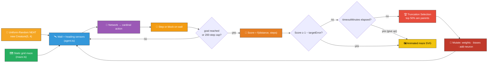
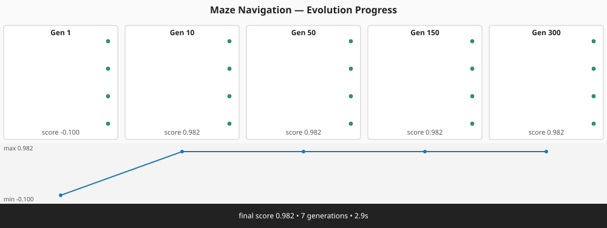
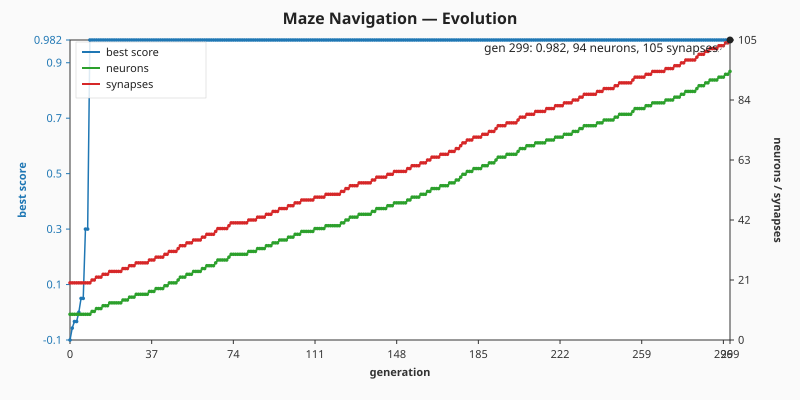
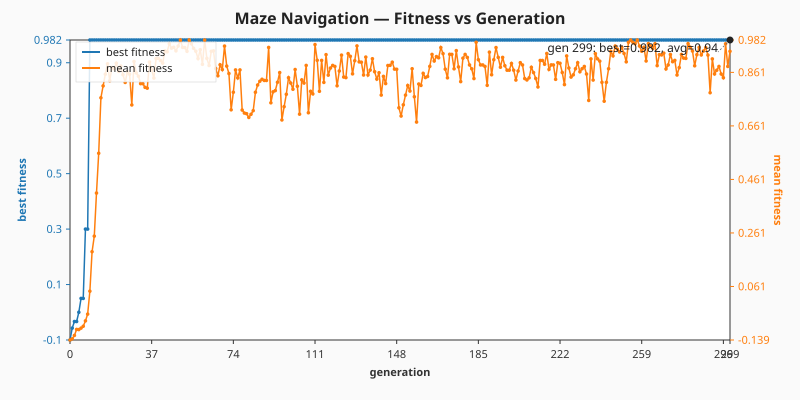
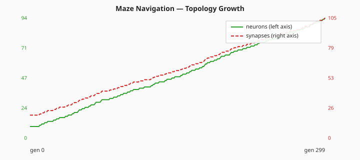

# 🗺️ Maze Navigation — Evolved Agent for a Grid Maze

> 🌱 **Generation 1 starts from random noise** — the initial population is built by NEAT-AI's
> uniform-random `Creature(5, 4)` constructor, with **no hand-crafted topology and no tuned weight
> init**. Structural mutation grows hidden neurons during evolution; the captured milestones show
> the agent climbing from a gen-1 wall-bumper to a network that walks straight from start to goal.

**Acronyms.** _NEAT_ = NeuroEvolution of Augmenting Topologies. _PRNG_ = pseudorandom number
generator.

`maze_navigation.ts` evolves a NEAT-AI controller that navigates a fixed 12×12 grid maze from a
start cell to a goal cell using only local sensor inputs (wall distances plus a packed
heading-to-goal). The simulator (`maze.ts`), evolutionary loop, and animated SVG renderer (`svg.ts`)
all run in pure TypeScript; the only external dependency is NEAT-AI's `Creature.activate` to compute
each step's action.


## 🔧 How It Works



## 🗺️ Maze Layout

The default maze is encoded as a string-art template — `S` marks the start, `G` the goal, `#` walls
and `.` open cells. The path is an L-shape: nine cells east along the top row, then nine cells south
down the rightmost open column.

```text
############
#S.........#
##########.#
##########.#
##########.#
##########.#
##########.#
##########.#
##########.#
##########.#
##########G#
############
```

## 🎯 Inputs and Outputs

The agent observes a small sensor pack (5 channels):

| Channel  | Type       | Symbol    | Meaning                                             |
| -------- | ---------- | --------- | --------------------------------------------------- |
| Input 0  | observable | `wallN`   | Free cells to the north, capped at 6, normalised    |
| Input 1  | observable | `wallE`   | Free cells to the east                              |
| Input 2  | observable | `wallS`   | Free cells to the south                             |
| Input 3  | observable | `wallW`   | Free cells to the west                              |
| Input 4  | observable | `heading` | Packed unit-vector heading-to-goal: `(ux + uy) / 2` |
| Output 0 | action     | —         | Argmax → action **North**                           |
| Output 1 | action     | —         | Argmax → action **East**                            |
| Output 2 | action     | —         | Argmax → action **South**                           |
| Output 3 | action     | —         | Argmax → action **West**                            |

Each tick the controller chooses one of the four cardinal moves; if the destination is a wall or
off-grid the agent stays put. Episodes end when the agent reaches the goal or the 200-step cap
fires.

## 📏 Scoring and Solved Threshold

```text
score = 1 / (1 + manhattan_to_goal_at_terminal_step) − step_count × 0.001
```

Reaching the goal scores at least `1 − 200 × 0.001 = 0.8` (the worst possible reached run, taking
the full step cap to arrive). The optimal 18-step path along the L-shape scores `1 − 0.018 = 0.982`.
A controller that gets stuck even one cell from the goal scores at most `1 / 2 − 0.001 = 0.499`. The
task is therefore declared **solved** when the champion's score reaches `SOLVED_THRESHOLD = 0.6` —
comfortably above every non-reached run yet trivially achievable by any trajectory that ends on the
goal cell.

### 🛑 Stop conditions

The evolutionary loop uses NEAT-AI's two standard stop conditions, configured via `EvolveOptions`:

- `targetError = 1 − SOLVED_THRESHOLD = 0.4` — evolution halts as soon as the champion's score
  reaches `1 − targetError = 0.6` (i.e. the agent reaches the goal).
- `timeoutMinutes = 5` — wall-clock backstop. Whichever fires first wins. Five minutes is generous
  for the L-corridor maze on a commodity laptop; the captured run below converged in under six
  seconds.

A per-step `activate()` is retained because the maze is an interactive simulation — the agent's next
sensor reading depends on the action it chose at the previous step, so there is no static binary
`.bin` training set the library could consume in a single batched pass.

## 🚀 Running the Example

```bash
./maze_navigation/run.sh
```

Artefacts:

- `.synthetic-maze/creatures/champion.json` – the fittest controller from the run
- `.synthetic-maze/output/trajectory.json` – the champion's step-by-step trajectory log
- `.synthetic-maze/snapshots/snapshot-gen-*.json` – running-champion snapshots captured at the
  configured checkpoints
- `docs/screenshots/maze_navigation.svg` – animated SVG of the champion's run
- `docs/screenshots/maze_navigation_evolution.svg` – multi-panel evolution-progression strip
  rendered from the captured snapshots
- `docs/screenshots/maze_navigation_evolution_chart.svg` – dual-axis evolution chart plotting best
  score and champion neuron / synapse counts against generation
- [`docs/data/maze_navigation/evolution.csv`](../docs/data/maze_navigation/evolution.csv) —
  per-generation telemetry (`generation,best_fitness,mean_fitness,neuron_count,synapse_count`)
- `docs/screenshots/maze_navigation/fitness.svg` – best/mean fitness chart vs generation
- `docs/screenshots/maze_navigation/topology.svg` – neuron and synapse counts vs generation

## Evolution Progress





### 📊 Measured telemetry (latest run, seed `12345`)

The full per-generation log is in
[`docs/data/maze_navigation/evolution.csv`](../docs/data/maze_navigation/evolution.csv). Numbers
below are quoted directly from that file; nothing is estimated.

| Generation | best_fitness | mean_fitness | neurons | synapses | Notes                              |
| ---------- | ------------ | ------------ | ------- | -------- | ---------------------------------- |
| 0          | -0.1         | -0.139       | 9       | 20       | uniform-random NEAT noise          |
| 9          | 0.982        | 0.043        | 9       | 20       | first generation to reach the goal |
| 49         | 0.982        | 0.959        | 21      | 32       | hidden neurons start to accumulate |
| 149        | 0.982        | 0.729        | 48      | 59       | structural drift continues         |
| 299        | 0.982        | 0.940        | 94      | 105      | final generation                   |

Run summary (also from the same CSV plus the runner's stdout):

- **Total generations**: 300 — the loop continued past the first solved generation so every
  configured checkpoint (`1, 10, 50, 150, 300`) could be captured for the progression strip.
- **Wall-clock**: 5.4 s on a commodity laptop, well inside the `timeoutMinutes = 5` budget.
- **Stop reason**: `target` — the champion's score met `1 − targetError = 0.6` and the snapshot
  cadence then ran to completion.
- **Champion**: reached the goal in **18 steps** (the optimal L-corridor path) with a final
  Manhattan distance of 0 and a fitness of 0.982.
- **Topology growth is genuine**: neuron count climbs from 9 → 94 (10.4×) and synapse count from 20
  → 105 (5.3×) between generation 0 and the final generation — confirming the seed is not being
  memorised.

#### Best/mean fitness chart



#### Neuron / synapse count chart



The runner captures a snapshot of the **running champion** at each of the canonical checkpoint
generations `[1, 10, 50, 150, 300]`. The cadence is tuned for variable-topology evolution from
uniform-random NEAT noise — denser early than the cart-pole cadence because the linear maze
controller typically converges in the first dozen generations.

Generation 1 is the **uniform-random NEAT population** straight from `new Creature(5, 4)` — direct
input → output connections with weights and biases drawn by the library's RNG. Its best member sits
well below `SOLVED_THRESHOLD` (best=-0.1, mean=-0.139 on the latest run). The intermediate
milestones show the controller learning to follow walls and head toward the goal; the final captured
snapshot meets the threshold and reaches the goal in the optimal 18 steps.

## 🧠 Tacit Knowledge

A few things that are not obvious from the code alone:

- **No hand-crafted topology.** `maze_navigation.ts` never hard-codes neurons or synapses. The
  initial population is built with `createSeededPopulation({ inputCount: 5, outputCount: 4, ... })`
  which delegates to `new Creature(5, 4)` for every member. Hidden neurons appear only when the
  add-neuron mutation operator splits an existing connection during evolution — structural mutation
  discovers them.
- **Linear policy is enough on the L-shape.** Five inputs and four outputs (20 weights, 4 biases) is
  a small enough search space that an 80-creature population, starting from uniform-random NEAT
  noise, finds a goal-reaching controller in tens of generations. There is no hidden layer required
  — the wall-distance sensors carry enough information for the network to learn "head where there is
  space". Hidden neurons grown by the add-neuron operator can refine the policy further but are not
  necessary to clear the L-shape.
- **Argmax discretisation.** The four outputs are passed through `argmax` — the controller commits
  to one of four cardinal moves every step regardless of the squash function the library picks for
  the output neurons. The `Stay` action is never emitted.
- **Walls block, they do not kill.** Bumping into a wall leaves the agent's position unchanged but
  still consumes a tick, so prolonged wall-bumping erodes the score via the per-step penalty.
- **Reproducibility.** All randomness flows through `common/deterministic_random.ts` and the
  library's seeded RNG (`createSeededRng(seed)`). With a fixed seed the same champion is produced on
  every run.
- **Same maze every time.** The maze is encoded as a string-art template, parsed once at start-up,
  and reused by every controller in the population — fitness comparisons are fair.
- **Audit-mandated stop conditions.** Evolution stops as soon as the champion's score reaches
  `1 − targetError` (default `0.6`) **or** `timeoutMinutes` minutes of wall-clock have elapsed
  (default `5`) — whichever fires first. The two stop conditions match NEAT-AI's standard
  `NeatOptions.targetError` / `NeatOptions.timeoutMinutes` fields. An optional `iterations` cap is
  available for unit tests that need a deterministic generation count without depending on
  wall-clock timing; the captured run never relies on it.

## 🧰 NEAT-AI Features Used

Maze Navigation is an evolution-from-noise agent demo, so the demonstrated capability is NEAT-AI's
evolutionary topology search driven by an episode-rollout fitness signal.

> 🔎 **Stripped-down operator subset.** This example deliberately exercises a narrow slice of
> NEAT-AI's full pipeline so the noise → competent story stays uncluttered. The production training
> pipeline (backpropagation, dropout, L1/L2 regularisation, K-fold, binary `.bin` data streams,
> distributed evolution, etc.) is intentionally **not** wired into this demo — see issue
> [#185](https://github.com/stSoftwareAU/NEAT-AI-Examples/issues/185) and the upstream
> production-pipeline notes in
> [`COMPARISON.md`](https://github.com/stSoftwareAU/NEAT-AI/blob/Develop/COMPARISON.md) for the
> wider feature set.

Features exercised (links go to upstream
[`COMPARISON.md`](https://github.com/stSoftwareAU/NEAT-AI/blob/Develop/COMPARISON.md)):

- **[Evolutionary Topology Search](https://github.com/stSoftwareAU/NEAT-AI/blob/Develop/COMPARISON.md#what-weve-implemented)**
  — structural mutation co-evolved with weights against the maze-traversal fitness signal.
- **[Genetic Operators](https://github.com/stSoftwareAU/NEAT-AI/blob/Develop/COMPARISON.md#what-weve-implemented)**
  — weight and bias mutation paired with selection pressure on the per-episode reward.
