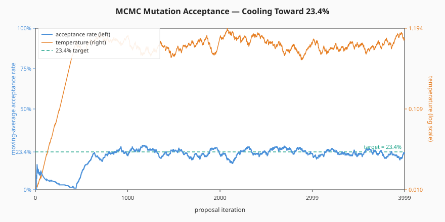
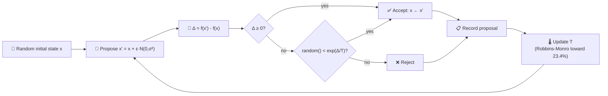
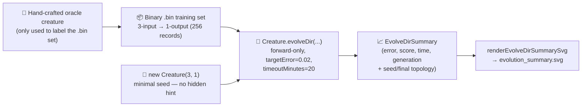
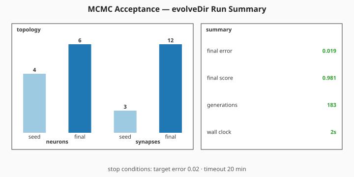

# 🌡️ MCMC Mutation Acceptance — Cooling Toward 23.4%

**Acronyms.** _MCMC_ = Markov chain Monte Carlo — a family of sampling algorithms that explore a
target distribution by walking a probability-weighted chain of proposals. _MH_ = Metropolis-Hastings
— the canonical MCMC accept/reject rule, defined inline below. _NEAT_ = NeuroEvolution of Augmenting
Topologies (the algorithm whose mutation operator borrows this acceptance pattern). _SVG_ = Scalable
Vector Graphics.

`mcmc_acceptance.ts` runs end-to-end in two stages:

1. **Analytical Metropolis-Hastings sampler** — walks a synthetic high-dimensional fitness landscape
   so the temperature controller's "cooling toward 23.4%" trajectory can be visualised on its own.
   This is the historical demo from issue #89.
2. **Minimal-seed NEAT-AI evolution** — per audit #215, an oracle-labelled `.bin` regression task
   evolved by `Creature.evolveDir(...)` from a minimal `new Creature(3, 1)` seed. Under telemetry
   rewire #303 the per-generation `onTrainingEvent` hook was removed; the run is now summarised via
   a single milestone SVG sourced from `evolveDir`'s return value (the canonical milestone-only
   telemetry surface — see issue #298).

## 🔬 Stage 1 — Analytical MH sampler

The temperature is updated after every proposal so that the empirical acceptance rate converges to
the canonical **23.4%** optimum from Roberts, Gelman & Gilks (1997).



This chart is driven by the analytical Metropolis-Hastings sampler — **not** by NEAT-AI
per-generation telemetry — so it survives the #303 telemetry rewire unchanged.

### 🧠 Why 23.4%?

Roberts, Gelman & Gilks (1997, _Annals of Applied Probability_) studied Gaussian random-walk
Metropolis-Hastings on high-dimensional targets and proved that, as the dimension `d → ∞`, the
asymptotically optimal acceptance rate is **0.234**. Below that rate the chain is stuck — proposal
steps are too large and almost always rejected. Above it the chain takes tiny steps and explores
slowly. The 23.4% sweet spot maximises expected squared jumping distance.

In NEAT-AI, the same logic governs mutation acceptance: heavy mutations should not all be rejected
(no learning) nor all accepted (random drift). Tuning the cooling schedule so the moving-average
acceptance rate sits near 23.4% keeps the search efficient.

### 🔧 How the sampler works



### The MH accept rule

For each proposal `x'` drawn from a symmetric Gaussian kernel, the acceptance probability is

```
A(x → x') = min(1, exp(Δ/T))
```

where `Δ = f(x') - f(x)` and `T` is the current temperature. Improving moves (`Δ ≥ 0`) are always
accepted; worsening moves are accepted with probability `exp(Δ/T)`, which falls off exponentially as
`T` cools.

### Adaptive cooling (Robbins-Monro)

Rather than committing to a fixed cooling schedule, the temperature is nudged after every step so
that the realised acceptance rate tracks the 0.234 target:

```
on accept:  T ← T · (1 − η · (1 − 0.234))
on reject:  T ← T · (1 + η · 0.234)
```

Higher `T` makes worsening proposals more likely to be accepted, so the controller cools (shrinks
`T`) on accepts and warms (grows `T`) on rejects. The expected log-multiplier is zero exactly when
the realised acceptance rate equals the target, so this is a stochastic-approximation solution to
the equation `E[A] = 0.234`.

## 🌱 Stage 2 — Minimal-seed NEAT-AI evolution (audit #215, telemetry rewire #303)



The audit replaces the previous "no NEAT-AI evolution at all" framing with a minimal-seed
`evolveDir` run on top of the analytical demo. Under #303 the per-generation `onTrainingEvent` hook
was removed; the run is summarised via a single milestone SVG sourced from `evolveDir`'s return
value plus the seed and final creature's topology.



### Latest Measured Run

| Metric                   | Value                                           |
| ------------------------ | ----------------------------------------------- |
| Generations              | 884                                             |
| Wall-clock               | 6.9 s (converged early under the 20 min budget) |
| Final per-record error   | 0.0183 (target 0.02 — reached)                  |
| Final score              | 0.9817                                          |
| Seed neurons / synapses  | 4 / 3                                           |
| Final neurons / synapses | 8 / 15                                          |
| `targetError` / timeout  | 0.02 / 20 min                                   |

Issue [#381](https://github.com/stSoftwareAU/NEAT-AI-Examples/issues/381) raised the wall-clock
backstop from 5 → 20 minutes for the `Refresh-2026-05` milestone (+15 minutes of additional
evolution budget) and lifted `maxIterations` from 1 000 → 4 000 in lock-step so wall-clock remains
the genuine limiter. On this run NEAT-AI reached `targetError` well inside the new backstop — the
extra budget was made available but not consumed.

### Why `evolveDir` rather than per-step `activate()`?

The training task is a pre-generated binary `(input, target)` regression set — the canonical
"binary-data + `evolveDir`" categorisation from the parent audit (#203). `evolveDir` exercises
NEAT-AI's full feature set (back-propagation, structure discovery, WASM / SIMD / GPU parallelism)
and is orders of magnitude faster than per-call `activate()` for supervised regression.

## 🚀 How to Run

```bash
./mcmc_acceptance/run.sh
```

The runner prints summary statistics for both stages and writes:

- `docs/screenshots/mcmc_acceptance.svg` — Stage 1's analytical dual-axis acceptance chart.
- `docs/screenshots/mcmc_acceptance/evolution_summary.svg` — Stage 2's milestone summary SVG sourced
  from the single `evolveDir` call.
- `.synthetic-mcmc/creatures/oracle.json` — The hand-crafted oracle creature (label oracle only).
- `.synthetic-mcmc/creatures/evolved.json` — The evolved champion produced from the minimal seed.

## 📤 Stage 1 Output

- `docs/screenshots/mcmc_acceptance.svg` — dual-axis chart showing:
  - **Blue** moving-average acceptance rate (left axis).
  - **Orange** temperature schedule on a log scale (right axis).
  - **Green dashed line** at the 23.4% target.

## 🧪 Tests

`mcmc_acceptance_test.ts` verifies:

- The analytical sampler emits one proposal record per iteration with finite, positive temperature
  and finite delta-fitness values.
- The moving-average acceptance rate is finite and lies in `[0, 1]` at every iteration.
- Late-run windowed acceptance rates are closer to 23.4% than early-run ones (i.e. the cooling
  schedule actually pulls the chain toward the target).
- The same seed produces identical proposals (determinism).
- The rendered SVG is well-formed and embeds the 23.4% target line.
- `createOracleCreature` returns a valid 3-input / 1-output topology.
- `runMinimalSeedEvolution` evolves from a minimal `new Creature(input, output)` seed and returns a
  milestone `EvolveDirSummary` with finite finalError / finalScore and finalNeurons / finalSynapses
  matching the in-place creature.
- `renderEvolveDirSummarySvg` renders the milestone summary derived from `runMinimalSeedEvolution`.

## 🧰 NEAT-AI Features Used

- **MCMC mutation acceptance** — Metropolis-Hastings acceptance test on candidate mutations, tuned
  for the ~23.4% acceptance ratio that minimises autocorrelation.
- **Minimal NEAT seed** — `new Creature(input, output)` with no hidden hint, no pre-built
  `network.json` seed; NEAT-AI random-initialises the rest.
- **`Creature.evolveDir`** over the binary `.bin` training stream (per
  [`docs/binary_training_stream.md`](../docs/binary_training_stream.md)) — orders of magnitude
  faster than per-call `activate()`.
- **Forward-only mutation** — `evolveDir` defaults to forward-only when `feedbackLoop` is not set,
  matching the audit's stop-condition + topology contract.
- **Milestone-only telemetry** — the run's `EvolveDirSummary` (final error / score, generations,
  wall-clock plus seed/final topology) is captured from the call's return value; no per-generation
  hook is used (#303).

Features exercised (links go to upstream
[`COMPARISON.md`](https://github.com/stSoftwareAU/NEAT-AI/blob/Develop/COMPARISON.md)):

- **[MCMC Mutation Acceptance](https://github.com/stSoftwareAU/NEAT-AI/blob/Develop/COMPARISON.md#9--mcmc-mutation-acceptance)**
  — Metropolis-Hastings acceptance test on candidate mutations, tuned for the ~23.4% acceptance
  ratio that minimises autocorrelation.
