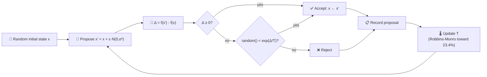

# 🌡️ MCMC Mutation Acceptance — Cooling Toward 23.4%

**Acronyms.** _MCMC_ = Markov chain Monte Carlo — a family of sampling algorithms that explore a
target distribution by walking a probability-weighted chain of proposals. _MH_ = Metropolis-Hastings
— the canonical MCMC accept/reject rule, defined inline below. _NEAT_ = NeuroEvolution of Augmenting
Topologies (the algorithm whose mutation operator borrows this acceptance pattern).

`mcmc_acceptance.ts` demonstrates the Metropolis-Hastings (MH) acceptance pattern that underpins
NEAT-AI's mutation-acceptance strategy: probabilistically accepting worse-fitness moves with a
cooling temperature schedule. The temperature is updated after every proposal so that the empirical
acceptance rate converges to the canonical **23.4%** optimum from Roberts, Gelman & Gilks (1997).


## 🚀 How to Run

```bash
./mcmc_acceptance/run.sh
```

The runner prints summary statistics and writes the dual-axis chart to
`docs/screenshots/mcmc_acceptance.svg`.

## 🧠 Why 23.4%?

Roberts, Gelman & Gilks (1997, _Annals of Applied Probability_) studied Gaussian random-walk
Metropolis-Hastings on high-dimensional targets and proved that, as the dimension `d → ∞`, the
asymptotically optimal acceptance rate is **0.234**. Below that rate the chain is stuck — proposal
steps are too large and almost always rejected. Above it the chain takes tiny steps and explores
slowly. The 23.4% sweet spot maximises expected squared jumping distance.

In NEAT-AI, the same logic governs mutation acceptance: heavy mutations should not all be rejected
(no learning) nor all accepted (random drift). Tuning the cooling schedule so the moving-average
acceptance rate sits near 23.4% keeps the search efficient.

## 🔧 How It Works



### The MH accept rule

For each proposal `x'` drawn from a symmetric Gaussian kernel, the acceptance probability is

```
A(x → x') = min(1, exp(Δ/T))
```

where `Δ = f(x') - f(x)` and `T` is the current temperature. Improving moves (`Δ ≥ 0`) are always
accepted; worsening moves are accepted with probability `exp(Δ/T)`, which falls off exponentially as
`T` cools.

### Adaptive cooling (Robbins-Monro)

Rather than committing to a fixed cooling schedule, the temperature is nudged after every step so
that the realised acceptance rate tracks the 0.234 target:

```
on accept:  T ← T · (1 − η · (1 − 0.234))
on reject:  T ← T · (1 + η · 0.234)
```

Higher `T` makes worsening proposals more likely to be accepted, so the controller cools (shrinks
`T`) on accepts and warms (grows `T`) on rejects. The expected log-multiplier is zero exactly when
the realised acceptance rate equals the target, so this is a stochastic-approximation solution to
the equation `E[A] = 0.234`.

### Synthetic landscape

The example walks a quadratic fitness surface `f(x) = -‖x‖²` in 10 dimensions. The exact landscape
is unimportant — the same acceptance dynamics apply to any target distribution.

## 📤 Output

- `docs/screenshots/mcmc_acceptance.svg` — dual-axis chart showing:
  - **Blue** moving-average acceptance rate (left axis).
  - **Orange** temperature schedule on a log scale (right axis).
  - **Green dashed line** at the 23.4% target.

## 🧪 Tests

`mcmc_acceptance_test.ts` verifies:

- The runner emits one proposal record per iteration with finite, positive temperature and finite
  delta-fitness values.
- The moving-average acceptance rate is finite and lies in `[0, 1]` at every iteration.
- Late-run windowed acceptance rates are closer to 23.4% than early-run ones (i.e. the cooling
  schedule actually pulls the chain toward the target).
- The same seed produces identical proposals (determinism).
- The rendered SVG is well-formed and embeds the 23.4% target line.
