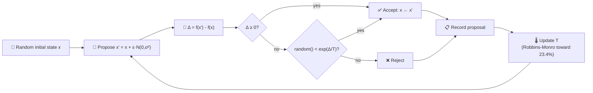
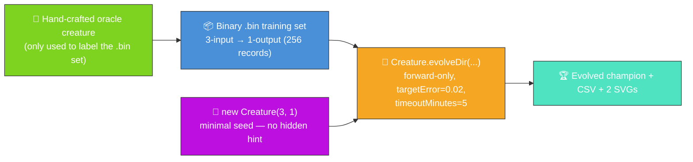
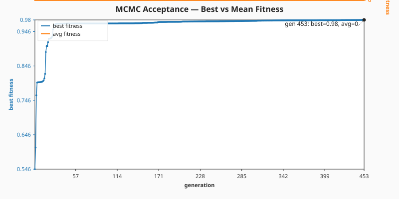
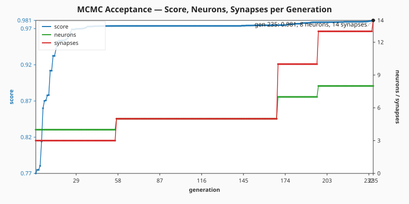

# 🌡️ MCMC Mutation Acceptance — Cooling Toward 23.4%

**Acronyms.** _MCMC_ = Markov chain Monte Carlo — a family of sampling algorithms that explore a
target distribution by walking a probability-weighted chain of proposals. _MH_ = Metropolis-Hastings
— the canonical MCMC accept/reject rule, defined inline below. _NEAT_ = NeuroEvolution of Augmenting
Topologies (the algorithm whose mutation operator borrows this acceptance pattern). _CSV_ =
Comma-Separated Values. _SVG_ = Scalable Vector Graphics.

`mcmc_acceptance.ts` runs end-to-end in two stages:

1. **Analytical Metropolis-Hastings sampler** — walks a synthetic high-dimensional fitness landscape
   so the temperature controller's "cooling toward 23.4%" trajectory can be visualised on its own.
   This is the historical demo from issue #89.
2. **Minimal-seed NEAT-AI evolution** — per audit #215, an oracle-labelled `.bin` regression task
   evolved by `Creature.evolveDir(...)` from a minimal `new Creature(3, 1)` seed, with measured
   per-generation telemetry. NEAT-AI's own mutation acceptance uses the Metropolis-Hastings rule the
   first stage explains, so this is the same acceptance dynamic in action on a real evolution
   problem.

## 🔬 Stage 1 — Analytical MH sampler

The temperature is updated after every proposal so that the empirical acceptance rate converges to
the canonical **23.4%** optimum from Roberts, Gelman & Gilks (1997).


### 🧠 Why 23.4%?

Roberts, Gelman & Gilks (1997, _Annals of Applied Probability_) studied Gaussian random-walk
Metropolis-Hastings on high-dimensional targets and proved that, as the dimension `d → ∞`, the
asymptotically optimal acceptance rate is **0.234**. Below that rate the chain is stuck — proposal
steps are too large and almost always rejected. Above it the chain takes tiny steps and explores
slowly. The 23.4% sweet spot maximises expected squared jumping distance.

In NEAT-AI, the same logic governs mutation acceptance: heavy mutations should not all be rejected
(no learning) nor all accepted (random drift). Tuning the cooling schedule so the moving-average
acceptance rate sits near 23.4% keeps the search efficient.

### 🔧 How the sampler works



### The MH accept rule

For each proposal `x'` drawn from a symmetric Gaussian kernel, the acceptance probability is

```
A(x → x') = min(1, exp(Δ/T))
```

where `Δ = f(x') - f(x)` and `T` is the current temperature. Improving moves (`Δ ≥ 0`) are always
accepted; worsening moves are accepted with probability `exp(Δ/T)`, which falls off exponentially as
`T` cools.

### Adaptive cooling (Robbins-Monro)

Rather than committing to a fixed cooling schedule, the temperature is nudged after every step so
that the realised acceptance rate tracks the 0.234 target:

```
on accept:  T ← T · (1 − η · (1 − 0.234))
on reject:  T ← T · (1 + η · 0.234)
```

Higher `T` makes worsening proposals more likely to be accepted, so the controller cools (shrinks
`T`) on accepts and warms (grows `T`) on rejects. The expected log-multiplier is zero exactly when
the realised acceptance rate equals the target, so this is a stochastic-approximation solution to
the equation `E[A] = 0.234`.

### Synthetic landscape

The example walks a quadratic fitness surface `f(x) = -‖x‖²` in 10 dimensions. The exact landscape
is unimportant — the same acceptance dynamics apply to any target distribution.

## 🌱 Stage 2 — Minimal-seed NEAT-AI evolution (audit #215)



The audit replaces the previous "no NEAT-AI evolution at all" framing with a minimal-seed
`evolveDir` run on top of the analytical demo. The oracle creature has amplified hidden-layer
weights so its sigmoid-of-sigmoids function is genuinely non-approximable by a single direct input →
output sigmoid — NEAT-AI is forced to grow hidden structure to satisfy the stop condition.

### Why `evolveDir` rather than per-step `activate()`?

The training task is a pre-generated binary `(input, target)` regression set — the canonical
"binary-data + `evolveDir`" categorisation from the parent audit (#203). `evolveDir` exercises
NEAT-AI's full feature set (back-propagation, structure discovery, WebAssembly (WASM) /
single-instruction-multiple-data (SIMD) / GPU parallelism) and is orders of magnitude faster than
per-call `activate()` for supervised regression. Per-step `activate()` is reserved for interactive
simulations and reinforcement learning (RL) agents.

### 📈 Latest measured run (`./mcmc_acceptance/run.sh`)

> The numbers below come from the most recent local run committed alongside this README. They are
> **measured, not estimated**, per the audit rule in #215.

| Metric                    | Value                 |
| ------------------------- | --------------------- |
| Total generations         | 453                   |
| Wall-clock                | 20.3 s                |
| Final best fitness        | 0.9802                |
| Final per-record error    | 0.0198 (target met)   |
| Evolved champion score    | 0.980178 (`scoreDir`) |
| Seed neurons / synapses   | 4 / 3                 |
| Final neurons / synapses  | 8 / 21                |
| Stop condition that fired | `targetError` reached |
| `targetError`             | 0.02                  |
| `timeoutMinutes` (safety) | 5                     |

Topology genuinely grew: NEAT-AI added **4 hidden neurons** and **18 synapses** on top of the
minimal direct-only seed, exactly the kind of structural exploration the MH acceptance rule enables.

#### Best vs mean fitness per generation



#### Score, neuron, and synapse counts per generation



#### Per-generation CSV

[`docs/data/mcmc_acceptance/evolution.csv`](../docs/data/mcmc_acceptance/evolution.csv) holds the
full per-generation telemetry with the schema mandated by the audit:

```text
generation,best_fitness,mean_fitness,neuron_count,synapse_count
```

### 🧪 What "reasonable solution" means here

The evolved champion's best fitness is **0.9802** against the binary `.bin` training set (higher is
better; the theoretical maximum is 1.0). The final per-record error of **0.0198** crossed the
`targetError = 0.02` threshold, so evolution stopped because the champion is producing labels within
about 2% of the oracle's outputs on average. That is a reasonable solution to the labelled task: the
evolved creature has reproduced the input → output behaviour of the hand-crafted oracle _without
ever seeing its topology_.

## 🚀 How to Run

```bash
./mcmc_acceptance/run.sh
```

The runner prints summary statistics for both stages and writes:

- `docs/screenshots/mcmc_acceptance.svg` — Stage 1's analytical dual-axis chart.
- `docs/screenshots/mcmc_acceptance/fitness.svg` — Stage 2's best vs mean fitness chart.
- `docs/screenshots/mcmc_acceptance/topology.svg` — Stage 2's neuron / synapse + score chart.
- `docs/data/mcmc_acceptance/evolution.csv` — Stage 2's per-generation telemetry CSV.
- `.synthetic-mcmc/creatures/oracle.json` — The hand-crafted oracle creature (label oracle only).
- `.synthetic-mcmc/creatures/evolved.json` — The evolved champion produced from the minimal seed.

## 📤 Stage 1 Output

- `docs/screenshots/mcmc_acceptance.svg` — dual-axis chart showing:
  - **Blue** moving-average acceptance rate (left axis).
  - **Orange** temperature schedule on a log scale (right axis).
  - **Green dashed line** at the 23.4% target.

## 🧪 Tests

`mcmc_acceptance_test.ts` verifies:

- The analytical sampler emits one proposal record per iteration with finite, positive temperature
  and finite delta-fitness values.
- The moving-average acceptance rate is finite and lies in `[0, 1]` at every iteration.
- Late-run windowed acceptance rates are closer to 23.4% than early-run ones (i.e. the cooling
  schedule actually pulls the chain toward the target).
- The same seed produces identical proposals (determinism).
- The rendered SVG is well-formed and embeds the 23.4% target line.
- The minimal-seed evolution helpers (`createOracleCreature`, `runMinimalSeedEvolution`,
  `formatEvolutionCsv`, `rowsToFitnessSamples`, `rowsToEvolutionSamples`) reject invalid configs and
  produce telemetry with the audit's schema.
- The committed `docs/data/mcmc_acceptance/evolution.csv` shows the topology genuinely changing
  between generation 1 and the final generation (acceptance criterion in #215).

## 🧰 NEAT-AI Features Used

- **MCMC mutation acceptance** — Metropolis-Hastings acceptance test on candidate mutations, tuned
  for the ~23.4% acceptance ratio that minimises autocorrelation.
- **Minimal NEAT seed** — `new Creature(input, output)` with no hidden hint, no pre-built
  `network.json` seed; NEAT-AI random-initialises the rest.
- **`Creature.evolveDir`** over the binary `.bin` training stream (per
  [`docs/binary_training_stream.md`](../docs/binary_training_stream.md)) — orders of magnitude
  faster than per-call `activate()`.
- **Forward-only mutation** — `evolveDir` defaults to forward-only when `feedbackLoop` is not set,
  matching the audit's stop-condition + topology contract.
- **`onTrainingEvent` callback** — feeds per-generation telemetry into the CSV and the two SVG
  charts without slowing the run.

Features exercised (links go to upstream
[`COMPARISON.md`](https://github.com/stSoftwareAU/NEAT-AI/blob/Develop/COMPARISON.md)):

- **[MCMC Mutation Acceptance](https://github.com/stSoftwareAU/NEAT-AI/blob/Develop/COMPARISON.md#9--mcmc-mutation-acceptance)**
  — Metropolis-Hastings acceptance test on candidate mutations, tuned for the ~23.4% acceptance
  ratio that minimises autocorrelation.
