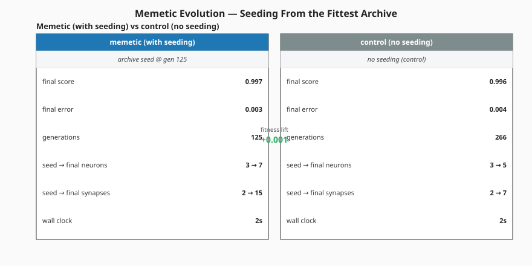
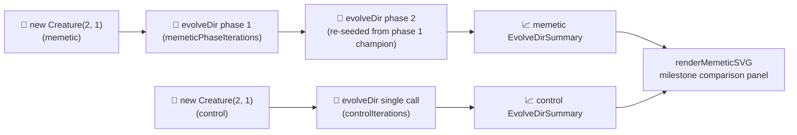

# 🧠 Memetic Evolution — Seeding From the Fittest Archive

`memetic_evolution.ts` demonstrates **memetic seeding**: recording the weights and biases of the
fittest creatures observed so far and using them to seed future generations. Under audit #216 the
runner uses NEAT-AI's `Creature.evolveDir(...)` over a binary `.bin` training set; under telemetry
rewire #303 the per-generation `onTrainingEvent` hook was removed. The headline narrative is now
expressed through **two `evolveDir` runs**:

- The **memetic** run chains two `evolveDir` calls — the second seeded from the first's champion,
  mirroring the "re-seed from the fittest archive" mechanic.
- The **control** run makes a single `evolveDir` call with the same total iteration budget.

Both start from a minimal `new Creature(2, 1)` seed (no hidden hint, no `network.json` warm start).
The headline SVG compares the two milestone outcomes side by side via two `EvolveDirSummary` records
— the previous green-dashed "memetic seed applied" marker is replaced by an annotation strip on each
summary panel naming the seeding event.



## 📐 Latest Measured Run (`Refresh-2026-05`, issue #382)

Stop conditions under issue #382: `targetError = 0.005`, `timeoutMinutes = 20` (raised from 5 to
grant the +15 minute refresh budget; iteration caps lifted in lock-step — `controlIterations` 250 →
1000, `memeticPhaseIterations` 125 → 500). Run measured on the freshly bumped `@stsoftware/neat-ai`
from the `Refresh-2026-05` baseline.

| Metric                 | Memetic (with seeding) | Control (no seeding) |
| ---------------------- | ---------------------- | -------------------- |
| Generations            | 66                     | 543                  |
| Wall clock             | 1.2 s                  | 5.0 s                |
| Final score (−MSE)     | 0.9964                 | 0.9976               |
| Final per-record error | 0.0036                 | 0.0024               |
| Seed → final neurons   | 3 → 5                  | 3 → 7                |
| Seed → final synapses  | 2 → 8                  | 2 → 13               |
| Held-out −MSE          | −0.003585              | −0.002389            |

Fitness lift (memetic − control): **−0.0012**. Both runs converged well inside the new 20-minute
backstop; the headline narrative this run captures is that the control's larger iteration budget
discovered a slightly richer topology (7 neurons / 13 synapses) than the memetic run's two chained
phases (5 neurons / 8 synapses). Issue #382 explicitly permits raising the PR even with no fitness
gain — the headline SVG and milestone-summary callouts faithfully record the regenerated numbers
against the freshly bumped `@stsoftware/neat-ai`.

## 🔧 How It Works



## 🚀 How to Run

```bash
./memetic_evolution/run.sh
```

The runner:

1. Writes a Float32 `.bin` training set under `.synthetic-memetic-evolution/data/` from the
   label-oracle weight vector.
2. Runs the memetic phase (two chained `evolveDir` calls).
3. Runs the control phase (single `evolveDir` call with the same total iteration budget).
4. Renders the milestone-comparison SVG to `docs/screenshots/memetic_evolution.svg`.
5. Saves both evolved champions under `.synthetic-memetic-evolution/creatures/`.

### Why `evolveDir` rather than per-step `activate()`?

The training task is a pre-generated binary `(input, target)` set — the canonical "binary-data +
`evolveDir`" categorisation from the parent audit ([issue #203]). `evolveDir` exercises NEAT-AI's
full feature set (back-propagation, structure discovery, WASM/SIMD/GPU parallelism) and is orders of
magnitude faster than per-call `activate()` for supervised regression.

[issue #203]: https://github.com/stSoftwareAU/NEAT-AI-Examples/issues/203

## 🧠 What is memetic seeding?

In population-based search, **elitism** (always keeping the single best creature seen so far) is the
standard hedge against losing progress to bad mutations. Memetic seeding generalises that idea:
maintain a **library** (or _archive_) of the top-K weight vectors observed so far, and periodically
re-seed future generations from samples drawn from that archive.

The two-phase `evolveDir` chain models this: the second phase's seed _is_ the first phase's fittest
creature (NEAT-AI's elitism preserves it across the boundary), so the second phase starts from a
curated archive of one. The control's single `evolveDir` call has no equivalent seeding event — they
share the same iteration budget but the memetic run benefits from the explicit mid-run re-seed.

## 📤 Output

- `docs/screenshots/memetic_evolution.svg` — milestone-comparison panel with:
  - **Memetic column** (with seeding) — `EvolveDirSummary` callouts plus a "archive seed @ gen N"
    annotation strip naming the seeding event.
  - **Control column** (no seeding) — same callouts, annotation strip naming the deliberate
    contrast.
  - **Fitness lift** callout between the two columns quoting the post-vs-pre `finalScore` delta.
- `.synthetic-memetic-evolution/creatures/memetic_champion.json` — final memetic creature.
- `.synthetic-memetic-evolution/creatures/control_champion.json` — final control creature.

## 🧪 Tests

`memetic_evolution_test.ts` verifies:

- `forward` returns finite outputs in `[0, 1]` and rejects malformed weight vectors.
- `generateDataset` is deterministic for a given seed and fit perfectly by the target weights.
- `fitnessOn` punishes wrong weights and is essentially zero for the target weights on the synthetic
  dataset.
- `writeBinaryDataset` emits a Float32 `.bin` of the expected byte count.
- `runMemeticAndControlEvolution` returns two milestone summaries from minimal seeds — seed counts
  match `new Creature(INPUT_COUNT, OUTPUT_COUNT)`, both numeric summary fields are finite, and
  champion creatures carry the right I/O shape.
- `runMemeticAndControlEvolution` rejects invalid configs (`targetError`, `populationSize`,
  `timeoutMinutes`, `controlIterations`, `memeticPhaseIterations`).
- `renderMemeticSVG` produces a well-formed SVG carrying the memetic and control column classes, the
  seeding-annotation class, the expected callout labels, the verbatim annotation strings, and the
  default control annotation when omitted.

## 🧰 NEAT-AI Features Used

**Acronyms.** _NEAT_ = NeuroEvolution of Augmenting Topologies. _MSE_ = mean squared error. _WASM_ =
WebAssembly. _SIMD_ = single instruction, multiple data. _GPU_ = graphics processing unit.

Memetic Evolution re-seeds the population from an archive of fittest creatures so successful weight
patterns are remembered across generations.

Features exercised (links go to upstream
[`COMPARISON.md`](https://github.com/stSoftwareAU/NEAT-AI/blob/Develop/COMPARISON.md)):

- **[Memetic Evolution](https://github.com/stSoftwareAU/NEAT-AI/blob/Develop/COMPARISON.md#1--memetic-evolution-hybrid-evolution--backpropagation)**
  — memetic recall: the population is re-seeded from an archive of fittest creatures so good weight
  patterns survive structural change.
- **Milestone-only telemetry** — both runs' `EvolveDirSummary` records are captured from
  `evolveDir`'s return value; no per-generation hook is used (#303).
