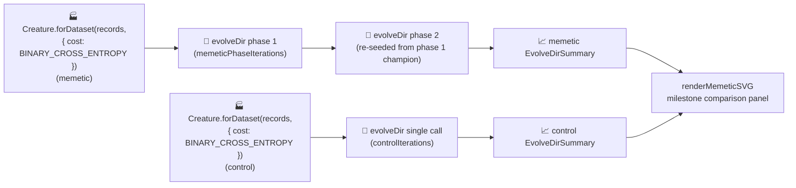

# 🧠 Memetic Evolution — Seeding From the Fittest Archive

> 🏭 **Both seeds are built by the NEAT-AI factory (issue #536).** Instead of a bare
> `new Creature(2, 1)`, each of the two `evolveDir` runs (memetic + control) now seeds from
> `Creature.forDataset(records, { cost: "BINARY_CROSS_ENTROPY" })`, which couples the output to a
> **LOGISTIC** sigmoid (matching the oracle's `[0, 1]` targets), pre-sizes a small hidden layer
> (Heaton's rule), and He/Xavier-scales the random weight init. Migrating **both** seeds keeps the
> memetic / control comparison fair. This is a milestone-sanctioned departure from the no-warm-start
> policy (see [Factory seed](#-factory-seed--a-milestone-sanctioned-departure) below); the
> bare-constructor baseline lives on as `buildRandomSeedCreature` for test / resume fixtures.

`memetic_evolution.ts` demonstrates **memetic seeding**: recording the weights and biases of the
fittest creatures observed so far and using them to seed future generations. Under audit #216 the
runner uses NEAT-AI's `Creature.evolveDir(...)` over a binary `.bin` training set; under telemetry
rewire #303 the per-generation `onTrainingEvent` hook was removed. The headline narrative is now
expressed through **two `evolveDir` runs**:

- The **memetic** run chains two `evolveDir` calls — the second seeded from the first's champion,
  mirroring the "re-seed from the fittest archive" mechanic.
- The **control** run makes a single `evolveDir` call with the same total iteration budget.

Both start from a data-derived factory seed
(`Creature.forDataset(records, { cost: "BINARY_CROSS_ENTROPY" })` — no `network.json` champion warm
start; only the seed topology and weight-init scaling are factory-derived, weights and biases stay
random). The headline SVG compares the two milestone outcomes side by side via two
`EvolveDirSummary` records — the previous green-dashed "memetic seed applied" marker is replaced by
an annotation strip on each summary panel naming the seeding event.


## 📐 Latest Measured Run (factory adoption, issue #536)

Stop conditions: `targetError = 0.005`, `timeoutMinutes = 20` (iteration caps `controlIterations`
1000, `memeticPhaseIterations` 500). Run measured after migrating both seeds to the NEAT-AI factory.

| Metric                 | Memetic (with seeding) | Control (no seeding) |
| ---------------------- | ---------------------- | -------------------- |
| Generations            | 84                     | 32                   |
| Wall clock             | 2.0 s                  | 0.5 s                |
| Final score (−MSE)     | 0.9953                 | 0.9982               |
| Final per-record error | 0.0047                 | 0.0018               |
| Seed → final neurons   | 6 → 6                  | 6 → 7                |
| Seed → final synapses  | 9 → 9                  | 9 → 16               |
| Held-out −MSE          | −0.004733              | −0.001844            |

Both runs still converge below `targetError` well inside the 20-minute backstop — and **faster**
than the previous bare-seed `Refresh-2026-05` baseline (control: 32 generations / 0.5 s vs 543 / 5.0
s; memetic: 84 generations / 2.0 s vs 66 / 1.2 s), because the factory seed starts each run with a
LOGISTIC output bounded to the `[0, 1]` target range and a pre-sized hidden layer instead of the
bare `new Creature(2, 1)` (Mish output, zero hidden). Both seeds begin from the **same** factory
topology (6 neurons / 9 synapses), so the memetic / control comparison stays fair — the only
difference is the memetic run's explicit mid-run re-seed. The factory chooses **only** the seed's
topology and weight scaling; `evolveDir` keeps its default scoring, so the evolution loop is
unchanged.

## 🔧 How It Works



## 🏭 Factory seed — a milestone-sanctioned departure

Both runs' seeds are minted by the NEAT-AI factory
`Creature.forDataset(records, { cost: "BINARY_CROSS_ENTROPY" })`. From problem-intrinsic facts only,
the factory:

- couples the output to a **LOGISTIC** activation chosen from the cost — the bounded `(0, 1)` range
  the oracle's `[0, 1]` sigmoid targets and the held-out −MSE scoring both assume (NEAT-AI #2793);
- sizes a **conservative hidden-capacity budget** from the problem shape (Heaton's rule → a small
  hidden layer);
- scales the random weight init per activation (He / Xavier).

**Only the seed's topology and scaling are factory-derived** — seed weights and biases remain
**random**, and every structural change beyond the seed still comes purely from `evolveDir`'s
unchanged mutation operators. `evolveDir` keeps its default scoring, so evolution behaves exactly as
it did before the factory was adopted (it simply converges from a better-shaped starting point).

This is a **deliberate, milestone-sanctioned departure** from the
[no-warm-start policy](../AGENTS.md#-no-warm-starts--evolution-must-start-from-random-noise) in
`AGENTS.md`, made under the factory-adoption tracker
([#517](https://github.com/stSoftwareAU/NEAT-AI-Examples/issues/517); see
[`docs/factory_adoption.md`](../docs/factory_adoption.md)). The bare `new Creature(2, 1)` baseline
is retained as `buildRandomSeedCreature` for test / resume fixtures.

### Why `BINARY_CROSS_ENTROPY`?

The label oracle (`forward`) emits a LOGISTIC probability in `[0, 1]`, so the training targets are
soft probabilities in that range. `BINARY_CROSS_ENTROPY` is the cost whose factory pairing yields a
**LOGISTIC** output (the same coupling as the XOR #520 and adaptive_mutation #533 adoptions) — the
activation whose `(0, 1)` range matches those targets and the held-out −MSE metric. A bare
`new Creature(2, 1)` instead ships an unbounded **Mish** output, so the factory seed is both better
shaped for the task and the reason both runs now converge faster.

## 🚀 How to Run

```bash
./memetic_evolution/run.sh
```

The runner:

1. Writes a Float32 `.bin` training set under `.synthetic-memetic-evolution/data/` from the
   label-oracle weight vector.
2. Runs the memetic phase (two chained `evolveDir` calls).
3. Runs the control phase (single `evolveDir` call with the same total iteration budget).
4. Renders the milestone-comparison SVG to `docs/screenshots/memetic_evolution.svg`.
5. Saves both evolved champions under `.synthetic-memetic-evolution/creatures/`.

### Why `evolveDir` rather than per-step `activate()`?

The training task is a pre-generated binary `(input, target)` set — the canonical "binary-data +
`evolveDir`" categorisation from the parent audit ([issue #203]). `evolveDir` exercises NEAT-AI's
full feature set (back-propagation, structure discovery, WASM/SIMD/GPU parallelism) and is orders of
magnitude faster than per-call `activate()` for supervised regression.

[issue #203]: https://github.com/stSoftwareAU/NEAT-AI-Examples/issues/203

## 🧠 What is memetic seeding?

In population-based search, **elitism** (always keeping the single best creature seen so far) is the
standard hedge against losing progress to bad mutations. Memetic seeding generalises that idea:
maintain a **library** (or _archive_) of the top-K weight vectors observed so far, and periodically
re-seed future generations from samples drawn from that archive.

The two-phase `evolveDir` chain models this: the second phase's seed _is_ the first phase's fittest
creature (NEAT-AI's elitism preserves it across the boundary), so the second phase starts from a
curated archive of one. The control's single `evolveDir` call has no equivalent seeding event — they
share the same iteration budget but the memetic run benefits from the explicit mid-run re-seed.

## 📤 Output

- `docs/screenshots/memetic_evolution.svg` — milestone-comparison panel with:
  - **Memetic column** (with seeding) — `EvolveDirSummary` callouts plus a "archive seed @ gen N"
    annotation strip naming the seeding event.
  - **Control column** (no seeding) — same callouts, annotation strip naming the deliberate
    contrast.
  - **Fitness lift** callout between the two columns quoting the post-vs-pre `finalScore` delta.
- `.synthetic-memetic-evolution/creatures/memetic_champion.json` — final memetic creature.
- `.synthetic-memetic-evolution/creatures/control_champion.json` — final control creature.

## 🧪 Tests

`memetic_evolution_test.ts` verifies:

- `forward` returns finite outputs in `[0, 1]` and rejects malformed weight vectors.
- `generateDataset` is deterministic for a given seed and fit perfectly by the target weights.
- `fitnessOn` punishes wrong weights and is essentially zero for the target weights on the synthetic
  dataset.
- `writeBinaryDataset` emits a Float32 `.bin` of the expected byte count.
- `datasetToFactoryRecords` mirrors the dataset's inputs/output into the `{ input, output }` record
  shape the factory scans.
- `buildRandomSeedCreature` is the deterministic bare baseline (zero hidden neurons), retained for
  test / resume fixtures.
- `buildSeedCreature` mints a factory seed with the right arity, a LOGISTIC output coupled to
  `BINARY_CROSS_ENTROPY`, a pre-sized hidden layer, deterministic weights/biases for a given seed,
  finite `[0, 1]` outputs, and rejects an empty record set.
- `runMemeticAndControlEvolution` returns two milestone summaries from factory seeds — each seed
  carries strictly more than `INPUT_COUNT + OUTPUT_COUNT` neurons (the factory hidden layer), both
  numeric summary fields are finite, and champion creatures carry the right I/O shape.
- `runMemeticAndControlEvolution` rejects invalid configs (`targetError`, `populationSize`,
  `timeoutMinutes`, `controlIterations`, `memeticPhaseIterations`).
- `renderMemeticSVG` produces a well-formed SVG carrying the memetic and control column classes, the
  seeding-annotation class, the expected callout labels, the verbatim annotation strings, and the
  default control annotation when omitted.

## 🧰 NEAT-AI Features Used

**Acronyms.** _NEAT_ = NeuroEvolution of Augmenting Topologies. _MSE_ = mean squared error. _WASM_ =
WebAssembly. _SIMD_ = single instruction, multiple data. _GPU_ = graphics processing unit.

Memetic Evolution re-seeds the population from an archive of fittest creatures so successful weight
patterns are remembered across generations.

Features exercised (links go to upstream
[`COMPARISON.md`](https://github.com/stSoftwareAU/NEAT-AI/blob/Develop/COMPARISON.md)):

- **[Memetic Evolution](https://github.com/stSoftwareAU/NEAT-AI/blob/Develop/COMPARISON.md#1--memetic-evolution-hybrid-evolution--backpropagation)**
  — memetic recall: the population is re-seeded from an archive of fittest creatures so good weight
  patterns survive structural change.
- **Milestone-only telemetry** — both runs' `EvolveDirSummary` records are captured from
  `evolveDir`'s return value; no per-generation hook is used (#303).
