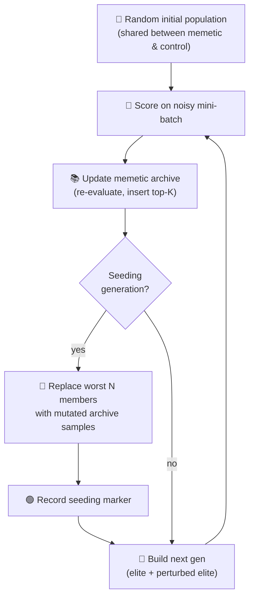

# 🧠 Memetic Evolution — Seeding From the Fittest Archive

`memetic_evolution.ts` demonstrates **memetic seeding**: recording the weights and biases of the
fittest creatures observed so far and using them to seed future generations. The example runs two
evolutions on the same synthetic weight-tuning task — one with memetic seeding enabled, one without
— and renders both fitness curves overlaid so the advantage of seeding from a curated archive is
visible at a glance.


## 🚀 How to Run

```bash
./memetic_evolution/run.sh
```

The runner prints summary statistics and writes the dual-curve chart to
`docs/screenshots/memetic_evolution.svg`.

## 🧠 What is memetic seeding?

In population-based search, **elitism** (always keeping the single best creature seen so far) is the
standard hedge against losing progress to bad mutations. Memetic seeding generalises that idea:
maintain a **library** (or _archive_) of the top-K weight vectors observed so far, ranked by their
**averaged** fitness across many evaluations, and periodically re-seed the population by mutating
samples drawn from that archive.

| Aspect          | Pure elitism                                    | Memetic seeding                                                |
| --------------- | ----------------------------------------------- | -------------------------------------------------------------- |
| Retained memory | Single best creature                            | Top-K best **distinct** weight vectors                         |
| Robustness      | Loses progress when a noisy fitness picks a dud | Averaged ranking smooths out single-evaluation flukes          |
| Diversity       | All offspring are perturbations of one parent   | Offspring also blend in mutations of historical elites         |
| Recovery        | Stuck once the elite gets noise-fooled to a dud | Archive can re-seed the population with genuinely-good weights |
| Cost            | One extra creature kept across generations      | K extra creatures plus their accumulated fitness statistics    |

## 🔧 How It Works



### The synthetic task

The "creature" is a fixed-topology weight vector for a small network — 2 inputs → 2 TANH hidden → 1
sigmoid output. The full vector has **9 parameters**: 4 input→hidden weights, 2 hidden biases, 2
hidden→output weights, and 1 output bias.

A target weight vector defines the truth: the synthetic dataset is generated by feeding 32
deterministic 2D inputs through that target network. Both algorithms search for the target weights
by minimising mean-squared error.

### Noisy mini-batch evaluation

Every generation each creature is scored on a small mini-batch (default: **2 records**) randomly
sampled from the 32-record dataset. The mini-batch is shared between the two runs at each generation
so they see identical noise — the only behavioural difference is the memetic seeding mechanism.

The mini-batch is small enough that the per-generation "best" creature is sometimes a fluke. This
exposes the failure mode the memetic archive is designed to mitigate:

- **Control run**: keeps the noisy mini-batch elite each generation. Sometimes the elite is a
  worse-true-fitness creature that got lucky on the batch; mutations around that dud waste
  generations.
- **Memetic run**: maintains an archive of the top-K weight vectors ranked by **averaged** observed
  fitness across many generations. The averaged ranking is much more stable, so the archive's top
  entry is a genuinely-fit creature even when the current generation's mini-batch elite is
  misleading. Periodically re-seeding the population from the archive pulls the search back toward
  genuinely-good weights.

### Archive maintenance

```
At each generation:
  1. Re-evaluate every archive entry on the new mini-batch.
     entry.meanFitness ← entry.meanFitness + (observed − entry.meanFitness) / entry.evaluations
  2. Re-sort the archive by meanFitness.
  3. Offer the current top performers as candidates; insert if they
     beat the worst archive entry.
```

The running mean is the standard online-update form, so memory is O(K) regardless of how many
generations the run lasts.

### Seeding schedule

Every `seedingInterval` generations (default: every 3), the memetic algorithm replaces its worst
`seedingReplacementCount` (default: 3) population members with mutated copies of the top archive
entries (round-robin), using a **smaller** mutation strength than normal so the seeded creatures
land near the archive's known-good weights rather than drifting away. Seeded generations are
recorded and rendered as green dashed vertical lines on the fitness chart.

## 📤 Output

- `docs/screenshots/memetic_evolution.svg` — single-panel chart showing:
  - **Blue** memetic fitness curve.
  - **Grey** control fitness curve.
  - **Green dashed** vertical markers at the generations where memetic seeding was applied.

## 🧪 Tests

`memetic_evolution_test.ts` verifies:

- The forward pass returns finite outputs in `[0, 1]` and rejects malformed weight vectors.
- The synthetic dataset is deterministic for a given seed and is fit perfectly by the target
  weights.
- The mini-batch sampler returns the requested batch size (capped at the dataset length).
- Both runs produce one record per generation with finite fitness values, and only memetic records
  carry the `seeded` flag.
- The same seed produces identical results across runs (full determinism).
- On the default seed the memetic run finishes with a final fitness ≥ control − tolerance, and
  outperforms the control by a measurable margin (the SVG demonstrates the lift visually).
- The rendered SVG is well-formed, embeds both curves as polylines, and includes the seeding-marker
  class so the markers are individually addressable for downstream styling.

## 🧰 NEAT-AI Features Used

**Acronym.** _NEAT_ = NeuroEvolution of Augmenting Topologies.

Memetic Evolution re-seeds the population from an archive of fittest creatures so successful weight
patterns are remembered across generations.

Features exercised (links go to upstream
[`COMPARISON.md`](https://github.com/stSoftwareAU/NEAT-AI/blob/Develop/COMPARISON.md)):

- **[Memetic Evolution](https://github.com/stSoftwareAU/NEAT-AI/blob/Develop/COMPARISON.md#1--memetic-evolution-hybrid-evolution--backpropagation)**
  — memetic recall: the population is re-seeded from an archive of fittest creatures so good weight
  patterns survive structural change.
