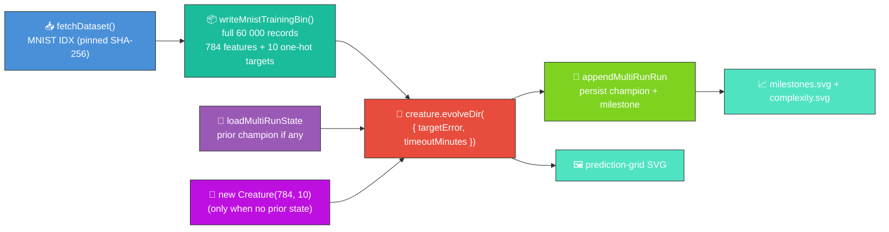
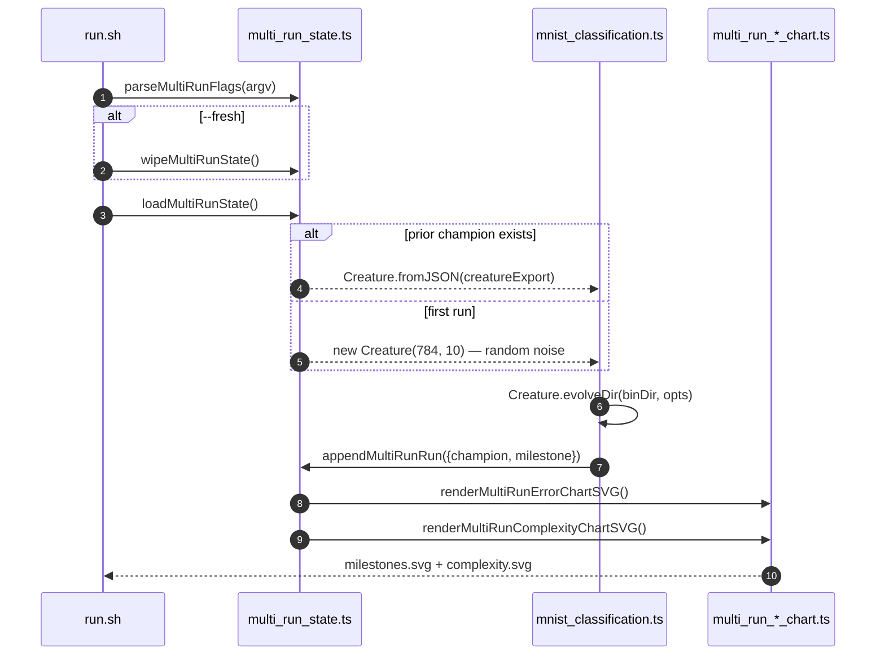

# 🔢 MNIST — Handwritten Digit Classification

**Acronyms.** _MNIST_ = Modified National Institute of Standards and Technology — the 70 000-image
handwritten-digit dataset (LeCun et al. 1998). _NEAT_ = NeuroEvolution of Augmenting Topologies.

A minimal-seed `Creature.evolveDir` run over the **full 60 000-record** MNIST training file, kept to
the audit-mandated stop conditions (`targetError` + `timeoutMinutes`) and wired into the multi-run
persistence + chart pipeline (issues
[#318](https://github.com/stSoftwareAU/NEAT-AI-Examples/issues/318),
[#319](https://github.com/stSoftwareAU/NEAT-AI-Examples/issues/319),
[#320](https://github.com/stSoftwareAU/NEAT-AI-Examples/issues/320),
[#327](https://github.com/stSoftwareAU/NEAT-AI-Examples/issues/327)) shared with the other in-scope
examples. Audit context: **#268** (parent) and **#270** (the runner rewrite this README reports
against).

> 🌱 **Generation 1 starts from random noise** (when no prior champion exists). The seed handed to
> NEAT-AI is `new Creature(784, 10)` — 784 input neurons, 10 output neurons, no hidden hint and no
> warm start. NEAT-AI random-initialises every weight, bias, and activation function from there.
> Subsequent runs without `--fresh` reload the saved champion as the seed and continue evolution.



## 📈 Latest measured run

Numbers below come from a single [`./mnist_classification/run.sh`](./run.sh) execution committed
alongside this README. The runner also writes them to
[`docs/data/mnist_classification/run_summary.json`](../docs/data/mnist_classification/run_summary.json)
so reviewers can verify every value. The milestone history (one record per run) lives at
[`docs/data/mnist_classification/milestones.json`](../docs/data/mnist_classification/milestones.json)
and the saved champion at
[`docs/data/mnist_classification/creature.json`](../docs/data/mnist_classification/creature.json).

The 5-minute default budget (and the wider audit-honest stop-condition policy) is well short of what
minimal-seed mutation-only evolution needs to drive argmax above chance on full 28×28 MNIST — the
demo quotes the measurement exactly as observed ("results are the results"). For a competent MNIST
classifier reach for NEAT-AI's hybrid memetic evolution; see the footer for links.

## 🚀 Running the example

```bash
# First run — random seed, writes creature + milestones + both charts.
./mnist_classification/run.sh --fresh

# Subsequent runs — resume from the saved champion and append a milestone.
./mnist_classification/run.sh

# Override the wall-clock budget and / or early-stop target error.
./mnist_classification/run.sh --timeout=10 --target-error=0.0005
```

The runner forwards every flag to the underlying Deno program, which parses them via
`parseMultiRunFlags` from [`common/multi_run_state.ts`](../common/multi_run_state.ts):

| Flag                  | Default | Meaning                                                               |
| --------------------- | ------- | --------------------------------------------------------------------- |
| `--fresh`             | absent  | Wipe prior creature, milestones, and both chart SVGs before evolving. |
| `--timeout=<minutes>` | 5       | Wall-clock budget for this invocation, integer minutes ≥ 1.           |
| `--target-error=<v>`  | 0.001   | Stop as soon as the champion's error falls below `v`.                 |

> ⚠️ **Choosing `--target-error` for one-hot MNIST (issue
> [#446](https://github.com/stSoftwareAU/NEAT-AI-Examples/issues/446)).** `Creature.evolveDir`'s
> `error` is the per-record mean squared error over the 10 one-hot output positions. For a `K`-way
> one-hot target the **trivial floor** is `1 / K` — an all-zero output predictor scores MSE =
> `1 / 10 = 0.1` on MNIST while remaining chance-level (~10 %) on argmax. Any `--target-error ≥ 0.1`
> is therefore satisfied by a classifier that has learned nothing useful; the runner logs a warning
> and the persisted `run_summary.json` records `targetErrorBelowTrivialFloor: false` for the run.
> Pick a threshold strictly below `1 / CLASS_COUNT` (the default `0.001` already is) if you want
> hitting it to mean the champion is materially better than chance.

Artefacts:

- `.synthetic-mnist/creatures/champion.json` – working-directory copy of the fittest classifier from
  this invocation (for ad-hoc inspection)
- `.synthetic-mnist/output/confusion.json` – class × class confusion matrix on the held-out test set
- [`docs/screenshots/mnist_classification.svg`](../docs/screenshots/mnist_classification.svg) – the
  committed animated prediction-grid screenshot
- [`docs/data/mnist_classification/creature.json`](../docs/data/mnist_classification/creature.json)
  – persisted champion that subsequent runs reload as the next seed
- [`docs/data/mnist_classification/milestones.json`](../docs/data/mnist_classification/milestones.json)
  – merged milestone history across every run, with both `runGen` and `cumulativeGen`
- [`docs/screenshots/mnist_classification/milestones.svg`](../docs/screenshots/mnist_classification/milestones.svg)
  – multi-run error-curve chart: error vs cumulative generation, with faint run-boundary guide lines
  (`renderMultiRunErrorChartSVG` from
  [`common/multi_run_error_chart.ts`](../common/multi_run_error_chart.ts))
- [`docs/screenshots/mnist_classification/complexity.svg`](../docs/screenshots/mnist_classification/complexity.svg)
  – multi-run complexity chart: neuron and synapse counts vs cumulative generation
  (`renderMultiRunComplexityChartSVG` from
  [`common/multi_run_complexity_chart.ts`](../common/multi_run_complexity_chart.ts))

> [!TIP]
> The script writes its working data to `.synthetic-mnist/`, a hidden directory ignored by git.

The runner downloads the IDX gzip files into `.synthetic-mnist/data/` (cached on disk after the
first run), encodes the full 60 000-record training file into `.synthetic-mnist/bin/mnist_train.bin`
in NEAT-AI's binary `.bin` stream format, evolves the seed, and writes the champion + confusion
matrix + prediction-grid SVG. See
[`docs/binary_training_stream.md`](../docs/binary_training_stream.md) for the on-disk record layout.

## 📈 Evolution Progress (Multi-Run)

Per issue [#298](https://github.com/stSoftwareAU/NEAT-AI-Examples/issues/298) NEAT-AI surfaces only
milestone-cadence telemetry. For the supervised MNIST run, `Creature.evolveDir` returns a single
end-of-run summary `{ error, score, time, generation }` — so each invocation contributes one
milestone to the merged history. The legacy single-run summary chart was superseded by the multi-run
chart pair under issue [#327](https://github.com/stSoftwareAU/NEAT-AI-Examples/issues/327). Each
subsequent run reloads the saved champion via
[`common/multi_run_state.ts`](../common/multi_run_state.ts), evolves further, and appends a fresh
milestone with a monotonically-increasing `cumulativeGen` — so the charts show one continuous noise
→ competent arc across every run combined.




Re-run `./mnist_classification/run.sh` (without `--fresh`) to extend both charts with another run.

### Champion prediction grid (held-out test set)


## 📊 Dataset

| Field             | Value                                                                                                                                     |
| ----------------- | ----------------------------------------------------------------------------------------------------------------------------------------- |
| Source            | [`storage.googleapis.com/cvdf-datasets/mnist`](https://storage.googleapis.com/cvdf-datasets/mnist) (CVDF-hosted MNIST mirror)             |
| Files used        | `train-images-idx3-ubyte.gz` (60 000) + `train-labels-idx1-ubyte.gz` + `t10k-images-idx3-ubyte.gz` (10 000) + `t10k-labels-idx1-ubyte.gz` |
| Format            | IDX-3 / IDX-1 binary, gzip-compressed                                                                                                     |
| Cache path        | `.synthetic-mnist/data/`                                                                                                                  |
| Integrity         | SHA-256 verified by `common/data_cache.ts`                                                                                                |
| Native resolution | 28 × 28 greyscale pixels (8-bit per pixel)                                                                                                |
| Pre-processing    | Native 28×28, normalised to `[0, 1]`                                                                                                      |
| Training subset   | All 60 000 training images encoded into `.synthetic-mnist/bin/mnist_train.bin` (Float32, 784 + 10)                                        |

## 🎯 Inputs and Outputs

| Channel      | Type       | Meaning                                                                |
| ------------ | ---------- | ---------------------------------------------------------------------- |
| Input 0..783 | feature    | Raw pixel intensity (`[0, 1]`) at the 28 × 28 grid position, row-major |
| Output 0..9  | activation | Class score; argmax over the ten outputs is the predicted digit        |

## ⚡ Where NEAT-AI is faster than this demo suggests

This README reports a stripped-down audit demo. NEAT-AI's production training pipeline pairs
evolutionary search with backpropagation and several accelerators that this demo deliberately sets
aside; reach for them on real workloads:

- [`memetic_evolution/README.md`](../memetic_evolution/README.md) — hybrid memetic evolution (NEAT
  structural search + backpropagation weight refinement).
- [`discovery/README.md`](../discovery/README.md) — error-driven Discovery analysis suggesting
  beneficial structural changes instead of rolling dice on every mutation.
- [`mcmc_acceptance/README.md`](../mcmc_acceptance/README.md) — Metropolis–Hastings acceptance to
  escape plateaus that pure greedy mutation gets stuck on.

## 🧰 NEAT-AI Features Used

This audit demo runs `Creature.evolveDir` exactly once per invocation from a minimal
`new Creature(784, 10)` seed (or the persisted champion from a prior run) over the full 60
000-record MNIST training file. The demonstrated capability is NEAT-AI's evolutionary topology
search driven by a binary `.bin` training stream; NEAT-AI's full training pipeline (backpropagation,
dropout, L1/L2, K-fold, synthetic synapses) is intentionally **not** wired into this audit run.

Features exercised (links go to upstream
[`COMPARISON.md`](https://github.com/stSoftwareAU/NEAT-AI/blob/Develop/COMPARISON.md)):

- **[Evolutionary Topology Search](https://github.com/stSoftwareAU/NEAT-AI/blob/Develop/COMPARISON.md#what-weve-implemented)**
  — structural mutation co-evolved with weights and biases against a per-record fitness signal.
- **[Genetic Operators](https://github.com/stSoftwareAU/NEAT-AI/blob/Develop/COMPARISON.md#what-weve-implemented)**
  — weight, bias, and add-node mutation paired with selection pressure on per-record error.
- **[Binary `.bin` training stream](https://github.com/stSoftwareAU/NEAT-AI/blob/Develop/COMPARISON.md#what-weve-implemented)**
  — `Creature.evolveDir` consumes pre-decoded Float32 records straight from disk (see
  [`docs/binary_training_stream.md`](../docs/binary_training_stream.md)).
