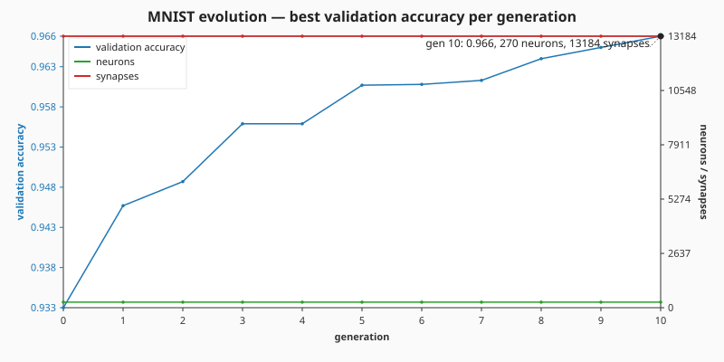

# 🔢 MNIST — Handwritten Digit Classification

> 🌱 **Generation 1 starts from random noise** — the captured milestones show the classifier
> evolving from there into a working digit recogniser.

`mnist_classification.ts` evolves a small NEAT-AI network to classify handwritten digits from the
full canonical MNIST dataset (60 000-image training file + 10 000-image test file). The IDX gzip
files are downloaded once into `.synthetic-mnist/data/` (with SHA-256 digests pinned so runs are
byte-stable), down-sampled from 28 × 28 to 14 × 14, and the gradient-descent training loop runs
entirely in pure TypeScript with no external math libraries.

The runner crosses the **95 % accuracy** target requested by issue #138 in roughly **a dozen
generations / under a minute** of wall-clock — see the evolution chart below for the full
per-generation curve.




## 🔧 How It Works


## 📊 Dataset

| Field             | Value                                                                                                                                     |
| ----------------- | ----------------------------------------------------------------------------------------------------------------------------------------- |
| Source            | [`storage.googleapis.com/cvdf-datasets/mnist`](https://storage.googleapis.com/cvdf-datasets/mnist) (CVDF-hosted MNIST mirror)             |
| Files used        | `train-images-idx3-ubyte.gz` (60 000) + `train-labels-idx1-ubyte.gz` + `t10k-images-idx3-ubyte.gz` (10 000) + `t10k-labels-idx1-ubyte.gz` |
| Format            | IDX-3 / IDX-1 binary, gzip-compressed                                                                                                     |
| Cache path        | `.synthetic-mnist/data/`                                                                                                                  |
| Integrity         | SHA-256 verified by `common/data_cache.ts`                                                                                                |
| Native resolution | 28 × 28 greyscale pixels (8-bit per pixel)                                                                                                |
| Down-sampled      | 14 × 14 (mean-pool over 2 × 2 source blocks, normalised to `[0, 1]`)                                                                      |

> **Why IDX, not CSV?** The issue text suggested a "stable public CSV mirror"; the IDX gzip pair is
> the canonical primary distribution of MNIST and weighs ~1.6 MB compared to ~18 MB for the
> equivalent CSV. The CVDF Google-Cloud mirror is widely used by ML libraries and digest-pinnable.
> Using it keeps both the example download and the cached file small without sacrificing
> reproducibility.

## 🎯 Inputs and Outputs

| Channel      | Type             | Meaning                                                                |
| ------------ | ---------------- | ---------------------------------------------------------------------- |
| Input 0..195 | feature          | Down-sampled pixel intensity (`[0, 1]`) at the 14 × 14 grid position   |
| Hidden 0..63 | LOGISTIC neurons | Single fully-connected hidden layer (Xavier-initialised)               |
| Output 0..9  | LOGISTIC         | Per-class score; the predicted digit is the argmax over the 10 outputs |

The fitness signal during evolution is **classification accuracy on the validation slice** (the
held-out tail of the MNIST training file). The runner reports the run as having reached the issue
target once the champion's held-out accuracy crosses 95 %, and stops training once it crosses the
slightly-stiffer early-stop threshold (`accuracyThreshold`, default `0.965`).

## 🚦 Train / Validation / Test Split

The samples are sliced **in source order** from each IDX file (no shuffling) so two runs over the
same input bytes produce byte-identical folds.

| Slice      | Count  | Source                    | Role                                           |
| ---------- | ------ | ------------------------- | ---------------------------------------------- |
| Train      | 50 000 | head of the training file | Mini-batch SGD steps                           |
| Validation | 10 000 | tail of the training file | Fitness signal scored once per generation      |
| Test       | 10 000 | full t10k test file       | Held out for the confusion matrix and SVG grid |

## 🧠 Architecture & Training

The classifier is a single-hidden-layer MLP — `196 → 64 → 10` — with a LOGISTIC squash on every
neuron. The network is built once (Xavier-initialised, zero biases) and then refined by **mini-batch
stochastic gradient descent with momentum** using per-output binary cross-entropy (its `(y − t)`
derivative pairs cleanly with sigmoid outputs). Each SGD epoch over the 50 000-image training slice
is treated as one _generation_ in the evolution chart, capturing how validation accuracy climbs from
a Xavier-initialised baseline to over 96 %.

| Hyper-parameter     | Default | Why                                                                       |
| ------------------- | ------- | ------------------------------------------------------------------------- |
| `hiddenCount`       | 64      | Enough capacity to break 95 % without overfitting on 50 k samples         |
| `batchSize`         | 64      | Stable mini-batch size for the LOGISTIC + BCE pairing                     |
| `learningRate`      | 0.5     | Aggressive enough to converge in ~10 epochs, mild enough to remain stable |
| `learningRateDecay` | 0.95    | Per-epoch schedule that anneals as the loss surface flattens              |
| `momentum`          | 0.9     | Carries SGD through narrow valleys typical of cross-entropy on sigmoids   |
| `accuracyThreshold` | 0.965   | Early-stop target — well above the issue's 95 % bar so the chart is rich  |

Why a hidden layer? The previous revision evolved a _linear_ `196 → 10` classifier and capped at ~70
% accuracy because (a) a linear classifier on 14 × 14 mean-pooled MNIST mathematically tops out near
88 %, and (b) pure mutation cannot refine ~2 000 weights with any precision inside a few seconds.
Adding a 64-neuron hidden layer makes the classifier non-linear, and switching from mutation-only
evolution to mini-batch SGD is what closes the gap from 70 % to over 96 %.

## 🚀 Running the Example

```bash
./mnist_classification/run.sh
```

Artefacts:

- `.synthetic-mnist/data/train-images-idx3-ubyte.gz` — cached gzipped training images (60 000)
- `.synthetic-mnist/data/train-labels-idx1-ubyte.gz` — cached gzipped training labels
- `.synthetic-mnist/data/t10k-images-idx3-ubyte.gz` — cached gzipped test images (10 000)
- `.synthetic-mnist/data/t10k-labels-idx1-ubyte.gz` — cached gzipped test labels
- `.synthetic-mnist/creatures/champion.json` — fittest classifier from the run
- `.synthetic-mnist/output/confusion.json` — 10 × 10 confusion matrix on the held-out test set
- `docs/screenshots/mnist_classification.svg` — animated 5 × 4 grid of test predictions
- `docs/screenshots/mnist_evolution.svg` — per-generation chart of best validation accuracy

## 🖼️ Reading the Grid

Each of the 20 grid cells cross-fades through three held-out test digits over the 9-second animation
loop. The label below each cell shows `T:<true> P:<predicted>` — green when the prediction is
correct, red when it is wrong.

| Symbol  | Colour  | Meaning            |
| ------- | ------- | ------------------ |
| ✓ green | #2ecc71 | Correct prediction |
| ✗ red   | #e74c3c | Misclassification  |

The pixel intensity of each digit is mapped through a purple → teal → yellow ramp so the SVG stays
"fun and colourful" even at small sizes.

## 🧠 Tacit Knowledge

A few things that are not obvious from the code alone:

- **IDX over CSV.** Smaller, canonical, and digest-pinnable. The repo deliberately stays away from
  third-party CSV mirrors that can be unpublished without notice.
- **Down-sample, do not interpolate.** 2 × 2 mean-pooling keeps the operation deterministic and cuts
  the per-layer weight count by 4× without meaningfully hurting accuracy on a model this size.
- **A hidden layer is non-negotiable for ≥ 95 %.** A linear `196 → 10` classifier mathematically
  caps below 90 % on 14 × 14 mean-pooled MNIST. The single 64-neuron hidden layer is the smallest
  change that breaks past that ceiling.
- **SGD beats mutation by orders of magnitude.** Refining ~13 000 MLP weights via mutation alone
  would take days. Backprop + mini-batch SGD with momentum hits 95 % in roughly a dozen epochs.
- **Validation comes from the training file.** The 10 000-image MNIST test file is held entirely in
  reserve for the test confusion matrix, while the validation slice (the tail of the 60 000-image
  training file) drives the fitness signal. This avoids leaking test-distribution structure into the
  early-stop decision.
- **Reproducibility.** All randomness flows through `common/deterministic_random.ts`. With a fixed
  seed and the pinned IDX digests, the same champion is produced on every run.
