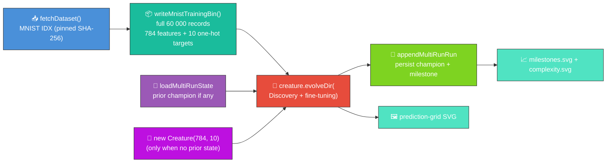
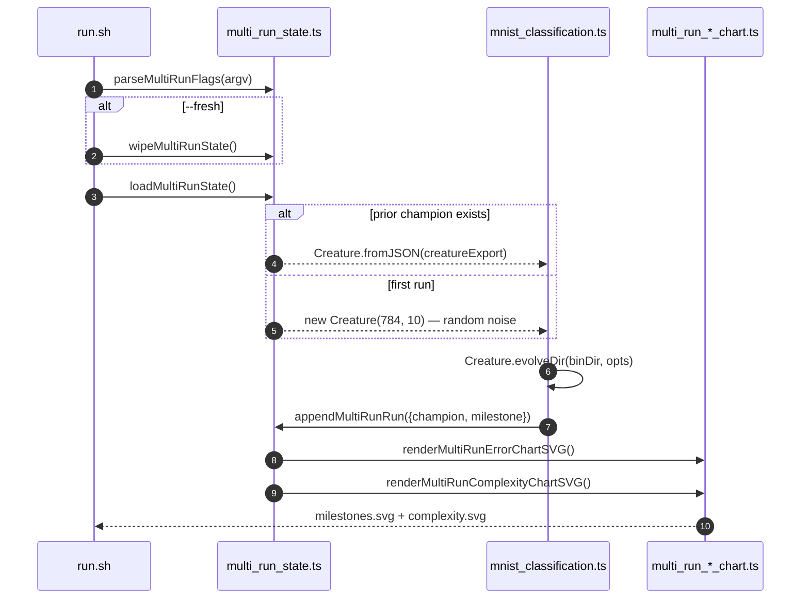

# 🔢 MNIST — Handwritten Digit Classification

**Acronyms.** _MNIST_ = Modified National Institute of Standards and Technology — the 70 000-image
handwritten-digit dataset (LeCun et al. 1998). _NEAT_ = NeuroEvolution of Augmenting Topologies.

Evolves a digit classifier with `Creature.evolveDir` over the **full 60 000-record** MNIST training
file (binary `.bin` stream), persisting the champion between runs so evolution continues where it
left off. Issues
[#318](https://github.com/stSoftwareAU/NEAT-AI-Examples/issues/318),
[#319](https://github.com/stSoftwareAU/NEAT-AI-Examples/issues/319),
[#320](https://github.com/stSoftwareAU/NEAT-AI-Examples/issues/320), and
[#327](https://github.com/stSoftwareAU/NEAT-AI-Examples/issues/327) wired the multi-run chart
pipeline shared with the other in-scope examples.

> 🌱 **First run only:** when no saved champion exists, NEAT-AI seeds `new Creature(784, 10)` —
> 784 input neurons, 10 output neurons — and random-initialises every weight, bias, and activation
> function. **Every subsequent run reloads the saved champion and continues evolution.** Do not
> pass `--fresh` unless you explicitly want to discard all prior progress.



## 📈 Latest measured run

Numbers below come from a single [`./mnist_classification/run.sh`](./run.sh) execution committed
alongside this README. The runner also writes them to
[`docs/data/mnist_classification/run_summary.json`](../docs/data/mnist_classification/run_summary.json)
so reviewers can verify every value. The milestone history (one record per run) lives at
[`docs/data/mnist_classification/milestones.json`](../docs/data/mnist_classification/milestones.json)
and the saved champion at
[`docs/data/mnist_classification/creature.json`](../docs/data/mnist_classification/creature.json).

## 🚀 Running the example

```bash
# Continue evolution from the saved champion (default workflow).
./mnist_classification/run.sh

# Longer wall-clock budget for this invocation.
./mnist_classification/run.sh --timeout=15

# Explicit reset — discards saved champion, milestones, and charts.
./mnist_classification/run.sh --fresh
```

The runner forwards flags to the underlying Deno program, which parses them via
`parseMultiRunFlags` from [`common/multi_run_state.ts`](../common/multi_run_state.ts):

| Flag                  | Default | Meaning                                                                 |
| --------------------- | ------- | ----------------------------------------------------------------------- |
| _(none)_              | —       | Resume from the saved champion when present; otherwise start from noise. |
| `--timeout=<minutes>` | 5       | Wall-clock budget for this invocation, integer minutes ≥ 1.             |
| `--fresh`             | absent  | **Discard** prior creature, milestones, and both chart SVGs before running. |

The early-stop `targetError` passed to `evolveDir` is **fixed at `0.0001`** — it is not overridable
from the CLI.

`run.sh` grants `--allow-ffi` so NEAT-AI can load the Rust Discovery library (structural growth)
and run the full supervised training pipeline inside `evolveDir`.

Artefacts:

- `.synthetic-mnist/creatures/champion.json` – working-directory copy of the fittest classifier from
  this invocation (for ad-hoc inspection)
- `.synthetic-mnist/output/confusion.json` – class × class confusion matrix on the held-out test set
- [`docs/screenshots/mnist_classification.svg`](../docs/screenshots/mnist_classification.svg) – the
  committed animated prediction-grid screenshot
- [`docs/data/mnist_classification/creature.json`](../docs/data/mnist_classification/creature.json)
  – persisted champion that subsequent runs reload as the next seed
- [`docs/data/mnist_classification/milestones.json`](../docs/data/mnist_classification/milestones.json)
  – merged milestone history across every run, with both `runGen` and `cumulativeGen`
- [`docs/screenshots/mnist_classification/milestones.svg`](../docs/screenshots/mnist_classification/milestones.svg)
  – multi-run error-curve chart: error vs cumulative generation, with faint run-boundary guide lines
  (`renderMultiRunErrorChartSVG` from
  [`common/multi_run_error_chart.ts`](../common/multi_run_error_chart.ts))
- [`docs/screenshots/mnist_classification/complexity.svg`](../docs/screenshots/mnist_classification/complexity.svg)
  – multi-run complexity chart: neuron and synapse counts vs cumulative generation
  (`renderMultiRunComplexityChartSVG` from
  [`common/multi_run_complexity_chart.ts`](../common/multi_run_complexity_chart.ts))

> [!TIP]
> The script writes its working data to `.synthetic-mnist/`, a hidden directory ignored by git.

The runner downloads the IDX gzip files into `.synthetic-mnist/data/` (cached on disk after the
first run), encodes the full 60 000-record training file into `.synthetic-mnist/bin/mnist_train.bin`
in NEAT-AI's binary `.bin` stream format, evolves the seed, and writes the champion + confusion
matrix + prediction-grid SVG. See
[`docs/binary_training_stream.md`](../docs/binary_training_stream.md) for the on-disk record layout.

## 📈 Evolution Progress (Multi-Run)

Per issue [#298](https://github.com/stSoftwareAU/NEAT-AI-Examples/issues/298) NEAT-AI surfaces only
milestone-cadence telemetry. For the supervised MNIST run, `Creature.evolveDir` returns a single
end-of-run summary `{ error, score, time, generation }` — so each invocation contributes one
milestone to the merged history. Each subsequent run reloads the saved champion via
[`common/multi_run_state.ts`](../common/multi_run_state.ts), evolves further, and appends a fresh
milestone with a monotonically-increasing `cumulativeGen` — so the charts show one continuous arc
across every run combined.




Re-run `./mnist_classification/run.sh` to extend both charts with another evolution chunk.

### Champion prediction grid (held-out test set)


## 📊 Dataset

| Field             | Value                                                                                                                                     |
| ----------------- | ----------------------------------------------------------------------------------------------------------------------------------------- |
| Source            | [`storage.googleapis.com/cvdf-datasets/mnist`](https://storage.googleapis.com/cvdf-datasets/mnist) (CVDF-hosted MNIST mirror)             |
| Files used        | `train-images-idx3-ubyte.gz` (60 000) + `train-labels-idx1-ubyte.gz` + `t10k-images-idx3-ubyte.gz` (10 000) + `t10k-labels-idx1-ubyte.gz` |
| Format            | IDX-3 / IDX-1 binary, gzip-compressed                                                                                                     |
| Cache path        | `.synthetic-mnist/data/`                                                                                                                  |
| Integrity         | SHA-256 verified by `common/data_cache.ts`                                                                                                |
| Native resolution | 28 × 28 greyscale pixels (8-bit per pixel)                                                                                                |
| Pre-processing    | Native 28×28, normalised to `[0, 1]`                                                                                                      |
| Training subset   | All 60 000 training images encoded into `.synthetic-mnist/bin/mnist_train.bin` (Float32, 784 + 10)                                        |

## 🎯 Inputs and Outputs

| Channel      | Type       | Meaning                                                                 |
| ------------ | ---------- | ----------------------------------------------------------------------- |
| Input 0..783 | feature    | Raw pixel intensity (`[0, 1]`) at the 28 × 28 grid position, row-major |
| Output 0..9  | activation | Class score; the predicted digit is whichever output is highest       |

## 🧰 NEAT-AI Features Used

Each invocation runs `Creature.evolveDir` from the persisted champion (or a minimal
`new Creature(784, 10)` seed on the very first run) over the full 60 000-record MNIST training
file. With `--allow-ffi` enabled in `run.sh`, NEAT-AI's supervised pipeline inside `evolveDir`
includes structural mutation, Rust Discovery analysis, and weight fine-tuning.

Features exercised (links go to upstream
[`COMPARISON.md`](https://github.com/stSoftwareAU/NEAT-AI/blob/Develop/COMPARISON.md)):

- **[Evolutionary Topology Search](https://github.com/stSoftwareAU/NEAT-AI/blob/Develop/COMPARISON.md#what-weve-implemented)**
  — structural mutation co-evolved with weights and biases against a per-record fitness signal.
- **[Genetic Operators](https://github.com/stSoftwareAU/NEAT-AI/blob/Develop/COMPARISON.md#what-weve-implemented)**
  — weight, bias, and add-node mutation paired with selection pressure on per-record error.
- **[Discovery](https://github.com/stSoftwareAU/NEAT-AI/blob/Develop/COMPARISON.md#what-weve-implemented)**
  — error-driven structural suggestions via the Rust Discovery library (requires `--allow-ffi`).
- **[Binary `.bin` training stream](https://github.com/stSoftwareAU/NEAT-AI/blob/Develop/COMPARISON.md#what-weve-implemented)**
  — `Creature.evolveDir` consumes pre-decoded Float32 records straight from disk (see
  [`docs/binary_training_stream.md`](../docs/binary_training_stream.md)).
