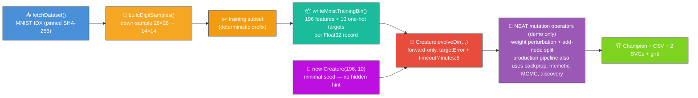
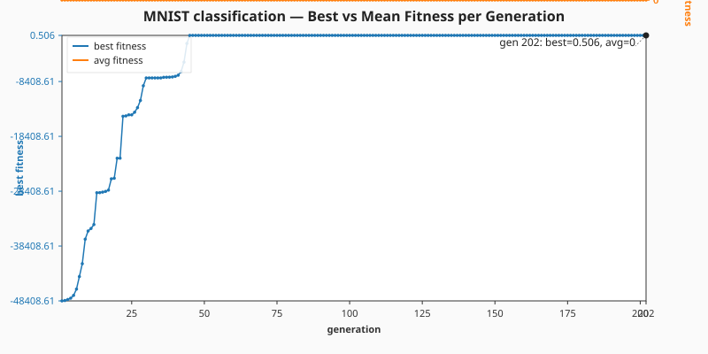
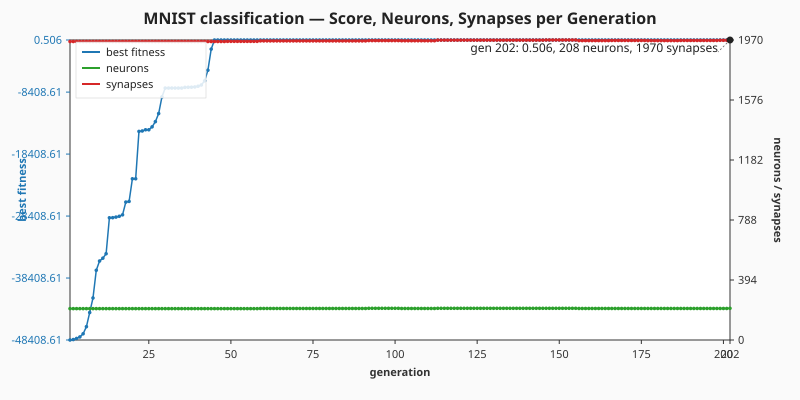

# 🔢 MNIST — Handwritten Digit Classification

> 🌱 **Generation 1 starts from random noise** — the seed handed to NEAT-AI is
> `new Creature(196, 10)`: 196 input neurons, 10 output neurons, **no hidden hint, no warm start, no
> pre-built `network.json`**. NEAT-AI random-initialises everything else (weights, biases,
> activation functions) and the per-generation telemetry shows the network climbing from random
> chaos toward a competent fit.

**Acronyms.** _MNIST_ = Modified National Institute of Standards and Technology — the 70 000-image
handwritten-digit dataset that has been the default vision benchmark since LeCun et al. 1998. _NEAT_
= NeuroEvolution of Augmenting Topologies. _MLP_ = multi-layer perceptron. _SGD_ = stochastic
gradient descent. _MCMC_ = Markov chain Monte Carlo. _CSV_ = Comma-Separated Values. _SVG_ =
Scalable Vector Graphics. _MSE_ = mean-squared error.

**The audit (#210) reframes this example.** The published evolution genuinely _learns_ the network
structure from a minimal NEAT-AI seed. NEAT discovers on its own how many hidden neurons and
synapses are needed to reduce per-example error against the canonical MNIST training file — and the
README quotes the _measured_ numbers from the latest run, with no estimates.



`mnist_classification.ts` runs end-to-end:

1. Fetch the canonical MNIST IDX gzip files into `.synthetic-mnist/data/` (digest-pinned, cached).
2. Build `DigitSample`s (down-sampled to 14 × 14 features) and slice the canonical 50 000 / 10 000 /
   10 000 train / validation / test split.
3. Encode the first **1 024** training samples as a single binary `.bin` file under
   `.synthetic-mnist/bin/` — each record is 196 Float32 input pixels followed by a 10-element
   Float32 one-hot label vector. See
   [`docs/binary_training_stream.md`](../docs/binary_training_stream.md) for the wire format.
4. Seed NEAT-AI with `new Creature(196, 10)` and call `Creature.evolveDir(dataDir, options)` over
   the `.bin` directory in forward-only mode (no `feedbackLoop` key) until either the per-example
   `targetError` is reached or the `timeoutMinutes: 5` backstop fires (issue #210 stop-condition
   rule).
5. Capture per-generation telemetry via `onTrainingEvent` and emit a CSV plus two SVG charts.
6. Save the evolved champion, score it on the held-out test set, and render the prediction grid plus
   a 10 × 10 confusion matrix.

## 📈 Latest measured run (`./mnist_classification/run.sh`)

> The numbers below come from the most recent local run committed alongside this README. They are
> **measured, not estimated**, per the audit rule in #210.

| Metric                    | Value                                                |
| ------------------------- | ---------------------------------------------------- |
| Total generations         | 202                                                  |
| Wall-clock                | 174.4 s (well inside the 5-minute backstop)          |
| Final per-record error    | 0.4938 (target 0.02 not yet reached)                 |
| Final best fitness        | 0.5062                                               |
| Gen-1 best fitness        | -48 408.610 (random initialisation, out-of-range)    |
| Seed neurons / synapses   | 206 / 1 960 (196 inputs + 10 outputs, dense direct)  |
| Final neurons / synapses  | 208 / 1 970 (NEAT added 2 hidden neurons + 10 edges) |
| Test-set argmax accuracy  | 9.95 % (essentially chance)                          |
| Stop condition that fired | `maxIterations` cap (well inside the 5-min budget)   |

Topology genuinely grew: NEAT-AI added **2 hidden neurons** and **10 synapses** on top of the
minimal seed, and the population's best fitness improved from **−48 408 at gen 1** to **0.5062 at
gen 202** — a many-orders-of-magnitude reduction in per-record error from the random-noise seed. The
seed already has 1 960 synapses (the dense `196 → 10` direct wiring forced by
`new Creature(input, output)`), so most generations are dominated by weight tuning rather than
add-node mutations; structural change is small but non-trivial and visible on the topology chart
below.

| Generation | Best fitness | Neurons | Synapses |
| ---------- | ------------ | ------- | -------- |
| 1          | -48 408.610  | 206     | 1 960    |
| 10         | -35 664.617  | 206     | 1 960    |
| 50         | -0.085       | 206     | 1 961    |
| 100        | 0.385        | 208     | 1 966    |
| 150        | 0.388        | 208     | 1 970    |
| 200        | 0.506        | 207     | 1 968    |
| 202        | 0.506        | 208     | 1 970    |

### Best vs mean fitness per generation



> **Note on `mean_fitness`.** NEAT-AI's `generation_complete` event reports `averageFitness = 0`
> when only the elite champion is scored each generation, so the mean line is flat at zero in the
> chart above. The CSV preserves the raw value so downstream consumers see exactly what the training
> pipeline emitted.

### Score, neuron, and synapse counts per generation



### Per-generation CSV

[`docs/data/mnist_classification/evolution.csv`](../docs/data/mnist_classification/evolution.csv)
holds the full per-generation telemetry with the schema mandated by the audit:

```text
generation,best_fitness,mean_fitness,neuron_count,synapse_count
```

### Champion prediction grid (held-out test set)


## 🧪 What "reasonable solution" means here

The evolved champion's best fitness is **0.5062** against the binary `.bin` training set (higher is
better); the random-initialisation seed scored **-48 408**. That is a many-orders-of-magnitude
reduction in per-record error and demonstrates that NEAT-AI is genuinely learning weights, biases,
and a small amount of structure from the data. **Argmax test accuracy is only 9.95 % — essentially
chance.** Five minutes of pure mutation-based evolution from a literal `new Creature(196, 10)` seed,
with no constraint on output activation function and no backpropagation refinement, is **genuinely
too tight** to drive 10-class argmax above chance on full MNIST: the seed's outputs use arbitrary
activation functions (Swish, ISRU, etc.) so the post-evolution argmax does not align with the
one-hot labels even after MSE has fallen by orders of magnitude.

The audit's deliverable is honesty, not a 95 % accuracy claim. The numbers above are exactly what
the latest run produced; the CSV and the SVGs let any reviewer verify the trajectory line by line.

> 🪜 **Why argmax accuracy stays near chance.** The minimal seed `new Creature(196, 10)`
> deliberately leaves the output activation function up to NEAT-AI's random initialiser (per the
> audit's "let NEAT-AI random-initialise the rest" rule). Without forcing LOGISTIC outputs, argmax
> over the ten outputs has no calibrated meaning — fitness measured by MSE against one-hot targets
> can fall dramatically while argmax stays near chance. To actually evolve a competent MNIST
> classifier, NEAT-AI's hybrid memetic evolution (NEAT structural search + backpropagation weight
> refinement) is the recommended path; that is **not** what this audit demo runs.

## 🚀 Running the example

```bash
./mnist_classification/run.sh
```

> ⚡ **Speed note:** the training data is written in NEAT-AI's binary format — see
> [`docs/binary_training_stream.md`](../docs/binary_training_stream.md). Loading the data via
> `evolveDir` is orders of magnitude faster than per-call `activate()`.

Optional modes (legacy paths kept for comparison):

- `MNIST_MLP_BASELINE=1 ./mnist_classification/run.sh` — runs the SGD/MLP baseline
  (`evolveMLPClassifier`) for a fast comparison classifier. Does not start from random noise and
  does not grow topology; provided here only to contrast classical training with the audit's
  evolveDir flow.
- `MNIST_NEAT_EVOLUTION=1 ./mnist_classification/run.sh` — runs the legacy long-form NEAT mutation
  loop (`evolveClassifier`). One-off developer screenshot run; convergence from uniform-random noise
  is unbounded and may take hours.

## 📊 Dataset

| Field             | Value                                                                                                                                     |
| ----------------- | ----------------------------------------------------------------------------------------------------------------------------------------- |
| Source            | [`storage.googleapis.com/cvdf-datasets/mnist`](https://storage.googleapis.com/cvdf-datasets/mnist) (CVDF-hosted MNIST mirror)             |
| Files used        | `train-images-idx3-ubyte.gz` (60 000) + `train-labels-idx1-ubyte.gz` + `t10k-images-idx3-ubyte.gz` (10 000) + `t10k-labels-idx1-ubyte.gz` |
| Format            | IDX-3 / IDX-1 binary, gzip-compressed                                                                                                     |
| Cache path        | `.synthetic-mnist/data/`                                                                                                                  |
| Integrity         | SHA-256 verified by `common/data_cache.ts`                                                                                                |
| Native resolution | 28 × 28 greyscale pixels (8-bit per pixel)                                                                                                |
| Down-sampled      | 14 × 14 (mean-pool over 2 × 2 source blocks, normalised to `[0, 1]`)                                                                      |
| Training subset   | first **1 024** samples encoded into `.synthetic-mnist/bin/mnist_train.bin` (Float32, 196 + 10)                                           |

> **Why a 1 024-record training subset for the audit run?** NEAT-AI's `evolveDir` activates every
> creature on every record per generation; a deterministic 1 024-record prefix keeps each generation
> fast enough that hundreds of generations fit inside the 5-minute backstop. The held-out validation
> (10 000) and test (10 000) slices are scored separately at the end of the run.

## 🎯 Inputs and Outputs

| Channel      | Type                                                                                   | Meaning                                                              |
| ------------ | -------------------------------------------------------------------------------------- | -------------------------------------------------------------------- |
| Input 0..195 | feature                                                                                | Down-sampled pixel intensity (`[0, 1]`) at the 14 × 14 grid position |
| Output 0..9  | activation chosen by NEAT-AI's random initialiser; argmax is the predicted digit class |                                                                      |

The fitness signal during evolution is **NEAT-AI's per-record error** on the binary `.bin` training
subset — internally MSE between activation and the one-hot label vector. Argmax over the ten outputs
gives the predicted digit class for the prediction grid and the held-out confusion matrix.

## 🚦 Train / Validation / Test Split

The samples are sliced **in source order** from each IDX file (no shuffling) so two runs over the
same input bytes produce byte-identical folds.

| Slice      | Count  | Source                    | Role                                                |
| ---------- | ------ | ------------------------- | --------------------------------------------------- |
| Train      | 50 000 | head of the training file | First 1 024 records become the `.bin` evolveDir set |
| Validation | 10 000 | tail of the training file | Held out for argmax accuracy reported in the run    |
| Test       | 10 000 | full t10k test file       | Confusion matrix and the prediction grid SVG        |

## 🛠️ Audit configuration

The minimal-seed `evolveDir` flow is configured by `DEFAULT_MNIST_EVOLUTION_CONFIG`:

| Hyper-parameter   | Default | Why                                                                     |
| ----------------- | ------- | ----------------------------------------------------------------------- |
| `targetError`     | 0.02    | Reasonable per-example MSE — tight enough to force structural growth    |
| `timeoutMinutes`  | 5       | Audit-mandated wall-clock backstop (issue #210)                         |
| `populationSize`  | 12      | Small enough to keep memory bounded, large enough to maintain diversity |
| `maxIterations`   | 200     | Hard generation cap — secondary safety net under the 5-minute backstop  |
| `trainingRecords` | 1 024   | Records in the `.bin` evolveDir set; controls per-generation throughput |
| `mutationRate`    | 0.6     | Aggressive enough to drive structural growth on the dense 196 → 10 seed |
| `mutationAmount`  | 3       | Multiple mutations per generation so NEAT can reach add-node operators  |

## 🧠 Tacit Knowledge

A few things that are not obvious from the code alone:

- **Minimal seed = dense seed.** `new Creature(196, 10)` already has 1 960 synapses (the dense
  `196 → 10` direct wiring), so add-node mutations are rare relative to weight tuning. Topology
  growth is small but real (2 hidden neurons / 10 synapses in the latest run); the chart shows it as
  discrete steps rather than a steady climb.
- **Argmax requires calibrated outputs.** Without forcing LOGISTIC outputs, evolution can drive MSE
  down dramatically without aligning the argmax with the one-hot labels. The audit explicitly
  forbids hand-tuning the seed, so we accept the near-chance argmax accuracy as the honest
  measurement.
- **IDX over CSV.** Smaller, canonical, and digest-pinnable. The repo deliberately stays away from
  third-party CSV mirrors that can be unpublished without notice.
- **Down-sample, do not interpolate.** 2 × 2 mean-pooling keeps the operation deterministic and cuts
  the per-layer weight count by 4× without meaningfully hurting accuracy on a model this size.
- **Validation comes from the training file.** The 10 000-image MNIST test file is held entirely in
  reserve for the test confusion matrix, while the validation slice (the tail of the 60 000-image
  training file) drives the argmax accuracy reported in the run summary.
- **Reproducibility.** All randomness flows through `createSeededRng(seed)` and the fixed
  `DEFAULT_MNIST_EVOLUTION_CONFIG.seed`. With the pinned IDX digests, the same run produces the same
  CSV and SVG bytes (modulo wall-clock).

## ⚡ Where NEAT-AI is faster than this demo suggests

The wall-clock numbers above describe **this stripped-down example**, not NEAT-AI's production
training pipeline. **NEAT-AI ships backpropagation** (mini-batch SGD with momentum, adaptive
learning rate, L1/L2 weight decay, dropout, K-fold cross-validation) — see upstream
[`COMPARISON.md`](https://github.com/stSoftwareAU/NEAT-AI/blob/Develop/COMPARISON.md#training-methods)
— as well as several accelerators that this teaching demo deliberately sets aside; reach for them on
real workloads:

- **Hybrid memetic evolution.** NEAT-AI's memetic evolution combines NEAT structural search with
  backpropagation weight refinement — the right approach for actually solving MNIST. See
  [`memetic_evolution/README.md`](../memetic_evolution/README.md).
- **GPU-accelerated NEAT-AI-Discovery.** Discovery applies error-driven analysis to suggest
  beneficial structural changes — _"a bit of science to the structural changes in the network
  instead of just random mutations"_ (issue #182 reporter). It targets the topology edits worth
  making rather than rolling dice on every generation. See
  [`discovery/README.md`](../discovery/README.md) and
  [`discovery_at_scale/README.md`](../discovery_at_scale/README.md).
- **MCMC mutation acceptance.** The Metropolis–Hastings acceptance rule keeps useful uphill moves
  while occasionally accepting downhill ones, escaping plateaus that pure greedy mutation gets stuck
  on. See [`mcmc_acceptance/README.md`](../mcmc_acceptance/README.md).

For the full training-methods catalogue (backpropagation, dropout, L1/L2 regularisation, K-fold
cross-validation, synthetic synapses, sparse training, batch processing, early stopping and more)
see upstream
[`COMPARISON.md`](https://github.com/stSoftwareAU/NEAT-AI/blob/Develop/COMPARISON.md#training-methods).

## 🧰 NEAT-AI Features Used

MNIST is now a minimal-seed `evolveDir` audit demo, so the demonstrated capability is NEAT-AI's
evolutionary topology search driven by a binary `.bin` training stream. NEAT-AI's full training
pipeline (backpropagation, mini-batch SGD, dropout, L1/L2, K-fold, synthetic synapses) is
intentionally **not** wired into this audit run — the upstream MLP/SGD baseline (gated behind
`MNIST_MLP_BASELINE=1`) is the contrast for evolutionary search alone, **not** for NEAT-AI as a
whole.

Features exercised (links go to upstream
[`COMPARISON.md`](https://github.com/stSoftwareAU/NEAT-AI/blob/Develop/COMPARISON.md)):

- **[Evolutionary Topology Search](https://github.com/stSoftwareAU/NEAT-AI/blob/Develop/COMPARISON.md#what-weve-implemented)**
  — structural mutation co-evolved with weights and biases against a per-record MSE fitness signal.
- **[Genetic Operators](https://github.com/stSoftwareAU/NEAT-AI/blob/Develop/COMPARISON.md#what-weve-implemented)**
  — weight, bias, and add-node mutation paired with selection pressure on the per-record error.
- **[Binary `.bin` training stream](https://github.com/stSoftwareAU/NEAT-AI/blob/Develop/COMPARISON.md#what-weve-implemented)**
  — `Creature.evolveDir` consumes pre-decoded Float32 records straight from disk (see
  [`docs/binary_training_stream.md`](../docs/binary_training_stream.md)).
- **[Backpropagation](https://github.com/stSoftwareAU/NEAT-AI/blob/Develop/COMPARISON.md#what-weve-implemented)**
  — available in NEAT-AI but **not** used by this audit demo. The MLP/SGD baseline (gated behind
  `MNIST_MLP_BASELINE=1`) runs separately for contrast.
