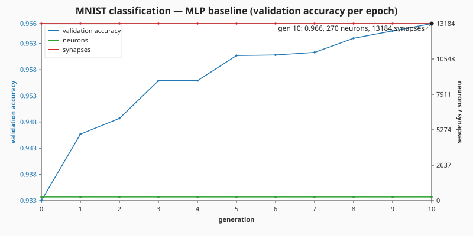

# 🔢 MNIST — Handwritten Digit Classification

> 🌱 **Generation 1 starts from random noise** — every creature in the initial population has the
> 196 inputs, 10 LOGISTIC outputs prescribed by the digit-classification problem and **direct input
> → output** connections with uniformly random weights and biases. No hidden topology is
> hand-specified; hidden neurons emerge purely from the add-node structural mutation operator. The
> captured milestones show the network climbing from ~10 % chance accuracy to a competent digit
> recogniser.

**Acronyms.** _MNIST_ = Modified National Institute of Standards and Technology — the 70 000-image
handwritten-digit dataset that has been the default vision benchmark since LeCun et al. 1998. _NEAT_
= NeuroEvolution of Augmenting Topologies. _MLP_ = multi-layer perceptron — the classical
fully-connected feed-forward network. _SGD_ = stochastic gradient descent — backpropagation that
updates weights from a small random sample (mini-batch) of the training data each step. _BCE_ =
binary cross-entropy, the standard per-output loss for sigmoid (LOGISTIC) classifiers.

`mnist_classification.ts` ships **two** classifiers, both operating over the canonical MNIST dataset
(60 000-image training file + 10 000-image test file) downloaded once into `.synthetic-mnist/data/`
(with SHA-256 digests pinned so runs are byte-stable), down-sampled from 28 × 28 to 14 × 14:

1. **NEAT evolution from random noise** (`evolveClassifier`) — the headline demo. Generation 1 is
   uniform-random and barely beats the 10 % random-guess baseline on a ten-class problem; weight
   mutation and add-node structural mutation grow the network toward the **95 %** accuracy target,
   capped at **50 000** generations.
2. **MLP/SGD baseline** (`evolveMLPClassifier`) — a separate `196 → 64 → 10` LOGISTIC multi-layer
   perceptron trained by mini-batch SGD with momentum. Crosses 95 % in under a minute and is what
   `quality.sh` runs by default so CI stays fast. This baseline is **not** the NEAT demo — it does
   not start from random noise and does not grow topology.

To run the long-form NEAT screenshot evolution (the one that produces the chart, progression strip,
and prediction grid in `docs/screenshots/`), set `MNIST_NEAT_EVOLUTION=1`:

```bash
MNIST_NEAT_EVOLUTION=1 ./mnist_classification/run.sh
```

This is **one-off developer work** — convergence from uniform-random noise is unbounded and may take
hours of wall-clock. The evolution stops as soon as the champion crosses 95 % validation accuracy or
the 50 000-generation hard cap is reached, whichever comes first. The default `quality.sh`
invocation runs the SGD baseline instead so CI completes promptly.




## 🔧 How It Works

```mermaid
flowchart LR
    DL["📥 fetchDataset()<br/>MNIST IDX (pinned)<br/>train + test"]
    DOWN["🔽 Down-sample<br/>28×28 → 14×14"]
    SPLIT["✂️ canonical 50k / 10k / 10k<br/>train · val · test"]
    NOISE["🌱 Uniform-random NEAT<br/>196 inputs · 10 LOGISTIC outputs<br/>direct input→output, random weights"]
    MUT["🧬 Mutation<br/>weight ± noise · add-node split"]
    SCORE["📏 Validation accuracy<br/>(per generation)"]
    CHART["📈 Evolution chart<br/>mnist_classification/evolution.svg"]
    STRIP["🎞️ Evolution-progression<br/>mnist_classification_evolution.svg"]
    CHAMP["💾 champion.json<br/>(best val acc)"]
    CONF["🧮 confusion.json"]
    GRID["🖼️ Animated 5×4 grid SVG<br/>green ✓ / red ✗"]

    DL --> DOWN --> SPLIT --> NOISE --> MUT --> SCORE
    SCORE -- below threshold & gen < cap --> MUT
    SCORE -- ≥ 95% or cap reached --> CHAMP --> CONF --> GRID
    SCORE --> CHART
    SCORE --> STRIP

    style DL fill:#4a90d9,stroke:#333,color:#fff
    style DOWN fill:#f5a623,stroke:#333,color:#fff
    style SPLIT fill:#f39c12,stroke:#333,color:#fff
    style NOISE fill:#1abc9c,stroke:#333,color:#fff
    style MUT fill:#e74c3c,stroke:#333,color:#fff
    style SCORE fill:#9b59b6,stroke:#333,color:#fff
    style CHART fill:#1f77b4,stroke:#333,color:#fff
    style STRIP fill:#1f77b4,stroke:#333,color:#fff
    style CHAMP fill:#7ed321,stroke:#333,color:#fff
    style CONF fill:#bd10e0,stroke:#333,color:#fff
    style GRID fill:#2ecc71,stroke:#333,color:#fff
```



## 📊 Dataset

| Field             | Value                                                                                                                                     |
| ----------------- | ----------------------------------------------------------------------------------------------------------------------------------------- |
| Source            | [`storage.googleapis.com/cvdf-datasets/mnist`](https://storage.googleapis.com/cvdf-datasets/mnist) (CVDF-hosted MNIST mirror)             |
| Files used        | `train-images-idx3-ubyte.gz` (60 000) + `train-labels-idx1-ubyte.gz` + `t10k-images-idx3-ubyte.gz` (10 000) + `t10k-labels-idx1-ubyte.gz` |
| Format            | IDX-3 / IDX-1 binary, gzip-compressed                                                                                                     |
| Cache path        | `.synthetic-mnist/data/`                                                                                                                  |
| Integrity         | SHA-256 verified by `common/data_cache.ts`                                                                                                |
| Native resolution | 28 × 28 greyscale pixels (8-bit per pixel)                                                                                                |
| Down-sampled      | 14 × 14 (mean-pool over 2 × 2 source blocks, normalised to `[0, 1]`)                                                                      |

> **Why IDX, not CSV?** The issue text suggested a "stable public CSV mirror"; the IDX gzip pair is
> the canonical primary distribution of MNIST and weighs ~1.6 MB compared to ~18 MB for the
> equivalent CSV. The CVDF Google-Cloud mirror is widely used by ML libraries and digest-pinnable.
> Using it keeps both the example download and the cached file small without sacrificing
> reproducibility.

## 🎯 Inputs and Outputs

| Channel      | Type             | Meaning                                                                |
| ------------ | ---------------- | ---------------------------------------------------------------------- |
| Input 0..195 | feature          | Down-sampled pixel intensity (`[0, 1]`) at the 14 × 14 grid position   |
| Hidden 0..63 | LOGISTIC neurons | Single fully-connected hidden layer (Xavier-initialised)               |
| Output 0..9  | LOGISTIC         | Per-class score; the predicted digit is the argmax over the 10 outputs |

The fitness signal during evolution is **classification accuracy on the validation slice** (the
held-out tail of the MNIST training file). For both classifiers the headline accuracy bar is **95
%** (`ACCURACY_TARGET`); the NEAT search additionally enforces a **hard generation cap** of **50
000** generations (`MAX_GENERATIONS`), and milestones are captured at generations
`[1, 10, 100, 1000, 10000, 50000]` so the progression strip fits a normal screen even for very deep
runs from uniform-random noise.

## 🚦 Train / Validation / Test Split

The samples are sliced **in source order** from each IDX file (no shuffling) so two runs over the
same input bytes produce byte-identical folds.

| Slice      | Count  | Source                    | Role                                           |
| ---------- | ------ | ------------------------- | ---------------------------------------------- |
| Train      | 50 000 | head of the training file | Mini-batch SGD steps                           |
| Validation | 10 000 | tail of the training file | Fitness signal scored once per generation      |
| Test       | 10 000 | full t10k test file       | Held out for the confusion matrix and SVG grid |

## 🧠 Architecture & Training

### NEAT evolution from uniform-random noise

Each gen-1 creature has the problem-prescribed input/output topology —
`196 inputs → 10 LOGISTIC
outputs` — wired by direct input → output connections. Weights and the
output bias are uniform-random; the LOGISTIC output squash is the only constraint set by the example
because argmax over LOGISTIC outputs is the natural way to interpret a digit-class prediction.
**Hidden neurons are not hand-specified.** They emerge purely from the add-node structural mutation
operator as evolution progresses, so the captured progression strip honestly tells the noise →
competent story.

| Hyper-parameter     | Default                    | Why                                                                                |
| ------------------- | -------------------------- | ---------------------------------------------------------------------------------- |
| `populationSize`    | 64                         | Enough diversity to keep evolution moving without slowing each generation too much |
| `mutationRate`      | 0.2                        | Per-gene perturbation probability                                                  |
| `mutationStrength`  | 0.4                        | Half-width of the uniform `[-m, +m]` weight/bias noise                             |
| `addNeuronRate`     | 0.02                       | Per-creature probability of an add-node structural mutation each generation        |
| `accuracyThreshold` | `ACCURACY_TARGET` (0.95)   | Hard accuracy target the champion must reach to stop early                         |
| `maxGenerations`    | `MAX_GENERATIONS` (50 000) | Hard generation cap — second stop guarantee                                        |

### MLP / SGD baseline (`evolveMLPClassifier`)

A separate `196 → 64 → 10` LOGISTIC multi-layer perceptron, Xavier-initialised and refined by
**mini-batch stochastic gradient descent with momentum** using per-output binary cross-entropy. Each
SGD epoch over the 50 000-image training slice is treated as one _generation_. The baseline exists
to keep `quality.sh` fast; it does **not** start from random noise and does **not** grow topology.

| Hyper-parameter     | Default | Why                                                                       |
| ------------------- | ------- | ------------------------------------------------------------------------- |
| `hiddenCount`       | 64      | Enough capacity to break 95 % without overfitting on 50 k samples         |
| `batchSize`         | 64      | Stable mini-batch size for the LOGISTIC + BCE pairing                     |
| `learningRate`      | 0.5     | Aggressive enough to converge in ~10 epochs, mild enough to remain stable |
| `learningRateDecay` | 0.95    | Per-epoch schedule that anneals as the loss surface flattens              |
| `momentum`          | 0.9     | Carries SGD through narrow valleys typical of cross-entropy on sigmoids   |
| `accuracyThreshold` | 0.965   | Early-stop target — well above the issue's 95 % bar so the chart is rich  |

## 🚀 Running the Example

```bash
./mnist_classification/run.sh
```

Artefacts:

- `.synthetic-mnist/data/train-images-idx3-ubyte.gz` — cached gzipped training images (60 000)
- `.synthetic-mnist/data/train-labels-idx1-ubyte.gz` — cached gzipped training labels
- `.synthetic-mnist/data/t10k-images-idx3-ubyte.gz` — cached gzipped test images (10 000)
- `.synthetic-mnist/data/t10k-labels-idx1-ubyte.gz` — cached gzipped test labels
- `.synthetic-mnist/creatures/champion.json` — fittest classifier from the run
- `.synthetic-mnist/output/confusion.json` — 10 × 10 confusion matrix on the held-out test set
- `.synthetic-mnist/snapshots/` — per-checkpoint snapshots of the running NEAT champion (NEAT run
  only)
- `docs/screenshots/mnist_classification.svg` — animated 5 × 4 grid of test predictions
- `docs/screenshots/mnist_classification/evolution.svg` — dual-axis per-generation chart (best
  validation accuracy + neuron / synapse counts)
- `docs/screenshots/mnist_classification_evolution.svg` — multi-panel evolution-progression strip
  (NEAT run only)

## 🖼️ Reading the Grid

Each of the 20 grid cells cross-fades through three held-out test digits over the 9-second animation
loop. The label below each cell shows `T:<true> P:<predicted>` — green when the prediction is
correct, red when it is wrong.

| Symbol  | Colour  | Meaning            |
| ------- | ------- | ------------------ |
| ✓ green | #2ecc71 | Correct prediction |
| ✗ red   | #e74c3c | Misclassification  |

The pixel intensity of each digit is mapped through a purple → teal → yellow ramp so the SVG stays
"fun and colourful" even at small sizes.

## 🧠 Tacit Knowledge

A few things that are not obvious from the code alone:

- **IDX over CSV.** Smaller, canonical, and digest-pinnable. The repo deliberately stays away from
  third-party CSV mirrors that can be unpublished without notice.
- **Down-sample, do not interpolate.** 2 × 2 mean-pooling keeps the operation deterministic and cuts
  the per-layer weight count by 4× without meaningfully hurting accuracy on a model this size.
- **A hidden layer is non-negotiable for ≥ 95 %.** A linear `196 → 10` classifier mathematically
  caps below 90 % on 14 × 14 mean-pooled MNIST. The NEAT search reaches 95 % by **growing** hidden
  neurons via add-node structural mutation; the SGD baseline reaches it via a hand-prescribed
  64-neuron hidden layer.
- **SGD beats NEAT by orders of magnitude in wall-clock.** Refining ~13 000 MLP weights via mutation
  alone is unbounded — the NEAT screenshot run is intentionally a one-off developer task, not part
  of CI. Backprop + mini-batch SGD with momentum hits 95 % in roughly a dozen epochs and is what
  `quality.sh` runs to keep CI fast.
- **Validation comes from the training file.** The 10 000-image MNIST test file is held entirely in
  reserve for the test confusion matrix, while the validation slice (the tail of the 60 000-image
  training file) drives the fitness signal. This avoids leaking test-distribution structure into the
  early-stop decision.
- **Reproducibility.** All randomness flows through `common/deterministic_random.ts`. With a fixed
  seed and the pinned IDX digests, the same champion is produced on every run.
