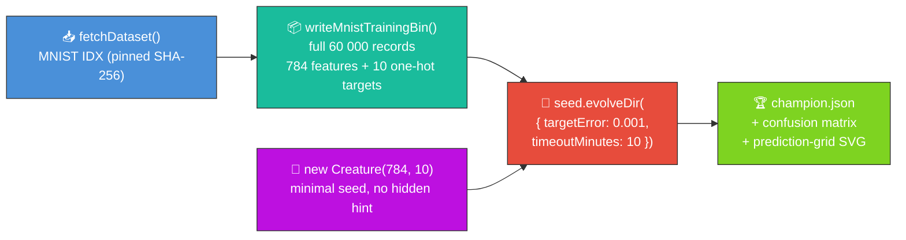

# 🔢 MNIST — Handwritten Digit Classification

**Acronyms.** _MNIST_ = Modified National Institute of Standards and Technology — the 70 000-image
handwritten-digit dataset (LeCun et al. 1998). _NEAT_ = NeuroEvolution of Augmenting Topologies.

A minimal-seed `Creature.evolveDir` run over the **full 60 000-record** MNIST training file, kept to
the audit-mandated stop conditions (`targetError` + `timeoutMinutes`) and quoting only the measured
numbers from a single 10-minute run. Audit context: **#268** (parent) and **#270** (the runner
rewrite this README reports against).

> 🌱 **Generation 1 starts from random noise.** The seed handed to NEAT-AI is
> `new Creature(784, 10)` — 784 input neurons, 10 output neurons, no hidden hint and no warm start.
> NEAT-AI random-initialises every weight, bias, and activation function from there.



## 📈 Latest measured run

Numbers below come from a single [`./mnist_classification/run.sh`](./run.sh) execution committed
alongside this README. The runner also writes them to
[`docs/data/mnist_classification/run_summary.json`](../docs/data/mnist_classification/run_summary.json)
so reviewers (and the [`readme_screenshot_honesty_test.ts`](./readme_screenshot_honesty_test.ts)
audit) can verify every value.

| Metric                           | Value                                                              |
| -------------------------------- | ------------------------------------------------------------------ |
| Training records                 | 60 000 (full MNIST training file)                                  |
| Wall-clock                       | 610 s (≈ 10 min 10 s — hit `timeoutMinutes`)                       |
| `targetError` / `timeoutMinutes` | 0.001 / 10                                                         |
| Seed neurons / synapses          | 794 / 7840 (784 inputs + 10 outputs, dense direct wiring)          |
| Final neurons / synapses         | 794 / 7841 (NEAT added 1 synapse; no new neurons in 10 min)        |
| Validation argmax accuracy       | 10.90 % (10 000-sample tail of the training file)                  |
| Test-set argmax accuracy         | 10.37 % (canonical 10 000-image test set)                          |
| Stop condition that fired        | `timeoutMinutes` (10-minute backstop, `targetError` never reached) |

The 10-minute budget is well short of what minimal-seed mutation-only evolution needs to drive
argmax above chance on full 28×28 MNIST — the run quotes the measurement exactly as observed
("results are the results"). For a competent MNIST classifier reach for NEAT-AI's hybrid memetic
evolution; see the footer for links.

📈 Per-generation telemetry — deferred until upstream NEAT-AI exposes hooks for `evolveDir`; tracked
in #273.

### Champion prediction grid (held-out test set)


## 🚀 Running the example

```bash
./mnist_classification/run.sh
```

The runner downloads the IDX gzip files into `.synthetic-mnist/data/` (cached on disk after the
first run), encodes the full 60 000-record training file into `.synthetic-mnist/bin/mnist_train.bin`
in NEAT-AI's binary `.bin` stream format, evolves the seed, and writes the champion + confusion
matrix + prediction-grid SVG. See
[`docs/binary_training_stream.md`](../docs/binary_training_stream.md) for the on-disk record layout.

## 📊 Dataset

| Field             | Value                                                                                                                                     |
| ----------------- | ----------------------------------------------------------------------------------------------------------------------------------------- |
| Source            | [`storage.googleapis.com/cvdf-datasets/mnist`](https://storage.googleapis.com/cvdf-datasets/mnist) (CVDF-hosted MNIST mirror)             |
| Files used        | `train-images-idx3-ubyte.gz` (60 000) + `train-labels-idx1-ubyte.gz` + `t10k-images-idx3-ubyte.gz` (10 000) + `t10k-labels-idx1-ubyte.gz` |
| Format            | IDX-3 / IDX-1 binary, gzip-compressed                                                                                                     |
| Cache path        | `.synthetic-mnist/data/`                                                                                                                  |
| Integrity         | SHA-256 verified by `common/data_cache.ts`                                                                                                |
| Native resolution | 28 × 28 greyscale pixels (8-bit per pixel)                                                                                                |
| Pre-processing    | Native 28×28, normalised to `[0, 1]`                                                                                                      |
| Training subset   | All 60 000 training images encoded into `.synthetic-mnist/bin/mnist_train.bin` (Float32, 784 + 10)                                        |

## 🎯 Inputs and Outputs

| Channel      | Type       | Meaning                                                                |
| ------------ | ---------- | ---------------------------------------------------------------------- |
| Input 0..783 | feature    | Raw pixel intensity (`[0, 1]`) at the 28 × 28 grid position, row-major |
| Output 0..9  | activation | Class score; argmax over the ten outputs is the predicted digit        |

## ⚡ Where NEAT-AI is faster than this demo suggests

This README reports a stripped-down audit demo. NEAT-AI's production training pipeline pairs
evolutionary search with backpropagation and several accelerators that this demo deliberately sets
aside; reach for them on real workloads:

- [`memetic_evolution/README.md`](../memetic_evolution/README.md) — hybrid memetic evolution (NEAT
  structural search + backpropagation weight refinement).
- [`discovery/README.md`](../discovery/README.md) — error-driven Discovery analysis suggesting
  beneficial structural changes instead of rolling dice on every mutation.
- [`mcmc_acceptance/README.md`](../mcmc_acceptance/README.md) — Metropolis–Hastings acceptance to
  escape plateaus that pure greedy mutation gets stuck on.

## 🧰 NEAT-AI Features Used

This audit demo runs `Creature.evolveDir` exactly once from a minimal `new Creature(784, 10)` seed
over the full 60 000-record MNIST training file. The demonstrated capability is NEAT-AI's
evolutionary topology search driven by a binary `.bin` training stream; NEAT-AI's full training
pipeline (backpropagation, dropout, L1/L2, K-fold, synthetic synapses) is intentionally **not**
wired into this audit run.

Features exercised (links go to upstream
[`COMPARISON.md`](https://github.com/stSoftwareAU/NEAT-AI/blob/Develop/COMPARISON.md)):

- **[Evolutionary Topology Search](https://github.com/stSoftwareAU/NEAT-AI/blob/Develop/COMPARISON.md#what-weve-implemented)**
  — structural mutation co-evolved with weights and biases against a per-record fitness signal.
- **[Genetic Operators](https://github.com/stSoftwareAU/NEAT-AI/blob/Develop/COMPARISON.md#what-weve-implemented)**
  — weight, bias, and add-node mutation paired with selection pressure on per-record error.
- **[Binary `.bin` training stream](https://github.com/stSoftwareAU/NEAT-AI/blob/Develop/COMPARISON.md#what-weve-implemented)**
  — `Creature.evolveDir` consumes pre-decoded Float32 records straight from disk (see
  [`docs/binary_training_stream.md`](../docs/binary_training_stream.md)).
