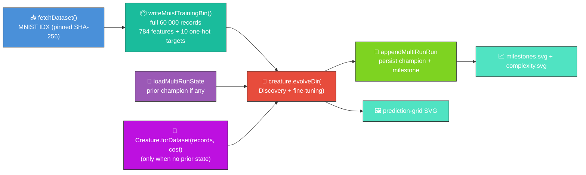
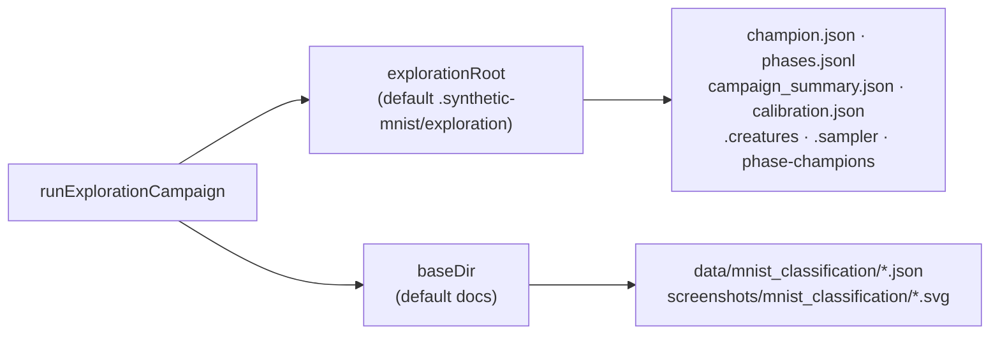
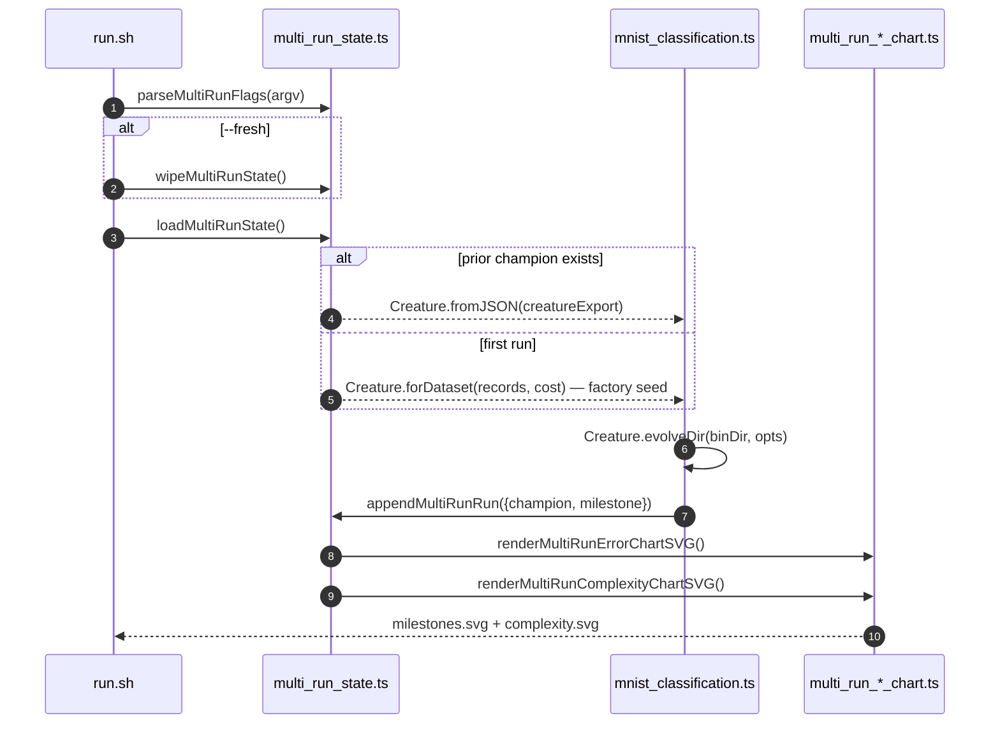
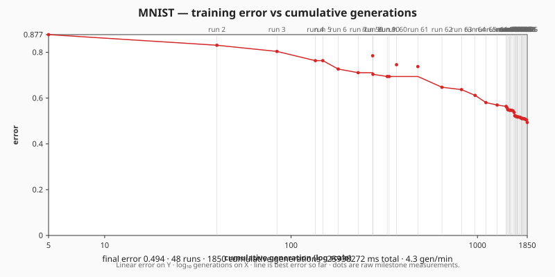
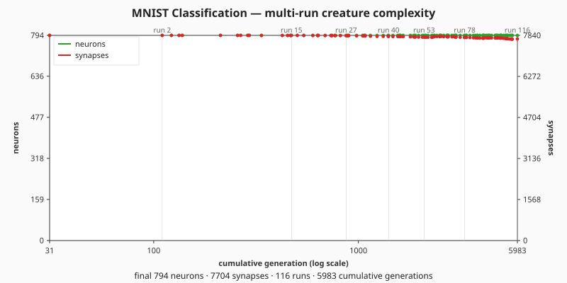
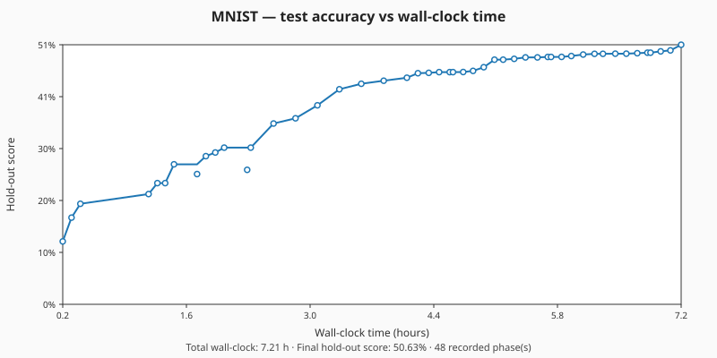

# 🔢 MNIST — Handwritten Digit Classification

**Acronyms.** _MNIST_ = Modified National Institute of Standards and Technology — the 70 000-image
handwritten-digit dataset (LeCun et al. 1998). _NEAT_ = NeuroEvolution of Augmenting Topologies.

Evolves a digit classifier with `Creature.evolveDir` over the **full 60 000-record** MNIST training
file (binary `.bin` stream), persisting the champion between runs so evolution continues where it
left off. Issues [#318](https://github.com/stSoftwareAU/NEAT-AI-Examples/issues/318),
[#319](https://github.com/stSoftwareAU/NEAT-AI-Examples/issues/319),
[#320](https://github.com/stSoftwareAU/NEAT-AI-Examples/issues/320), and
[#327](https://github.com/stSoftwareAU/NEAT-AI-Examples/issues/327) wired the multi-run chart
pipeline shared with the other in-scope examples.

> 🌱 **First run only:** when no saved champion exists, NEAT-AI builds the seed via
> `Creature.forDataset(records, { cost: "CROSS_ENTROPY" })` (issues #518, #523) — a data-derived
> factory seed with **SOFTMAX outputs** (cost-coupled), a **factory-sized hidden layer** (≈ 89
> neurons from the geometric-mean rule), and **dead-pixel pruning**. **Every subsequent run reloads
> the saved champion and continues evolution.** Do not pass `--fresh` unless you explicitly want to
> discard all prior progress.
>
> Training/selection uses **softmax + cross-entropy** (`costName: "CROSS_ENTROPY"`) — the standard
> differentiable training cost for multi-class classification. The legacy `CATEGORICAL_ERROR`
> (`1 − argmax accuracy`) is a non-differentiable step function that is being removed upstream
> ([NEAT-AI#2798](https://github.com/stSoftwareAU/NEAT-AI/issues/2798)); top-1 / argmax accuracy is
> still reported alongside the cross-entropy loss (see the test/validation accuracy figures below)
> but no longer drives evolution (issue
> [#523](https://github.com/stSoftwareAU/NEAT-AI-Examples/issues/523)).



## 📈 Latest measured run

Numbers below come from the persisted champion in
[`docs/data/mnist_classification/creature.json`](../docs/data/mnist_classification/creature.json)
and
[`docs/data/mnist_classification/run_summary.json`](../docs/data/mnist_classification/run_summary.json)
(multi-run resume at run 116, then a short Lamarck smoke refine that lifted hold-out accuracy). The
milestone history (one record per completed phase) lives at
[`docs/data/mnist_classification/milestones.json`](../docs/data/mnist_classification/milestones.json).
The earlier overnight campaign peak in
[`campaign_record.json`](../docs/data/mnist_classification/campaign_record.json) was **43.19%** test
/ **43.10%** validation across ~21.8 h (115 phases); the current lineage champion sits lower after
later resume runs and is the artefact this table describes.

A follow-up 3-hour alternating [NEAT-AI-Lamarck](https://github.com/stSoftwareAU/NEAT-AI-Lamarck) +
[NEAT-AI-Backpropagation](https://github.com/stSoftwareAU/NEAT-AI-Backpropagation) campaign (plain
`rust_scorer` / MSE, Phase-0 parity enabled) ran via
[`scripts/mnist_lamarck_backprop_campaign.sh`](../scripts/mnist_lamarck_backprop_campaign.sh). Train
MSE improved inside Lamarck slices, but **every** candidate failed the hold-out test-accuracy gate
(typical Lamarck ≈ 30.68% → 27.32%, backprop ≈ 30.68% → 30.16%), so the incumbent below was
retained.

| Metric                 |                                              Value |
| ---------------------- | -------------------------------------------------: |
| Test accuracy          |                                             30.68% |
| Validation accuracy    |                                             31.00% |
| Campaign wall-clock    |                               ~21.8 h (115 phases) |
| Topology               | 795 neurons / 7,709 synapses (forward-only 784→10) |
| Cumulative generations |                                              5,650 |

Regenerate charts and the prediction-grid SVG without evolving:

```bash
./mnist_classification/regenerate_recorded_artefacts.sh
```

## 🚀 Running the example

```bash
# Continue evolution from the saved champion (default workflow).
./mnist_classification/run.sh

# Longer wall-clock budget for this invocation.
./mnist_classification/run.sh --timeout=15

# Explicit reset — discards saved champion, milestones, and charts.
./mnist_classification/run.sh --fresh
```

The runner forwards flags to the underlying Deno program, which parses them via `parseMultiRunFlags`
from [`common/multi_run_state.ts`](../common/multi_run_state.ts):

| Flag                  | Default | Meaning                                                                                                                            |
| --------------------- | ------- | ---------------------------------------------------------------------------------------------------------------------------------- |
| _(none)_              | —       | Resume from the saved champion when present; otherwise build the fresh seed via the NEAT-AI factory (`Creature.forDataset`, #518). |
| `--timeout=<minutes>` | 5       | Wall-clock budget for this invocation, integer minutes ≥ 1.                                                                        |
| `--fresh`             | absent  | **Discard** prior creature, milestones, and both chart SVGs before running.                                                        |

The early-stop `targetError` passed to `evolveDir` is **fixed at `0.0001`** — it is not overridable
from the CLI.

`run.sh` grants `--allow-ffi` so NEAT-AI can load the Rust Discovery library (structural growth) and
run the full supervised training pipeline inside `evolveDir`.

Structural Discovery is left at the NEAT-AI default (`discoverySampleRate = 0.2`) for every real
run, including `--timeout=0` (no wall-clock backstop) — the topology grows beyond the factory seed
as evolution proceeds. Discovery is switched off **only** on the unit-test path, where its FFI
cleanup machinery trips Deno's `--allow-ffi` leak sanitiser (see issue #516).

### Generation 1 — data-derived factory seed (issue #518)

A fresh run (no prior persisted champion, or `--fresh` on the command line) builds the seed via the
NEAT-AI factory:

```ts
const records = readMnistTrainingRecords(binDir);
const seed = Creature.forDataset(records, { cost: "CROSS_ENTROPY" });
```

instead of a bare `new Creature(784, 10)` or a hardcoded `[128, 64]` hidden seed. The factory:

- couples the output activation to the cost (**SOFTMAX** — the canonical pairing for `CROSS_ENTROPY`
  on a multi-class problem);
- sizes a conservative hidden-capacity budget from the `(784, 10)` problem shape (the geometric-mean
  rule picks ≈ `√(784·10) ≈ 89` hidden neurons — well below the legacy `[128, 64]` lookup);
- **prunes dead inputs** — the constant border pixels of MNIST have near-zero variance, so synapses
  leaving them are zeroed at the start of evolution.

No dataset-specific architecture is hand-coded — every default is derived from the observation
count, output count, cost, and a scan of the training file, so the same approach transfers to
private/unknown problems.

Artefacts:

- `.synthetic-mnist/creatures/champion.json` – working-directory copy of the fittest classifier from
  this invocation (for ad-hoc inspection)
- `.synthetic-mnist/output/confusion.json` – class × class confusion matrix on the held-out test set
- [`docs/screenshots/mnist_classification.svg`](../docs/screenshots/mnist_classification.svg) – the
  committed animated prediction-grid screenshot
- [`docs/data/mnist_classification/creature.json`](../docs/data/mnist_classification/creature.json)
  – persisted champion that subsequent runs reload as the next seed
- [`docs/data/mnist_classification/milestones.json`](../docs/data/mnist_classification/milestones.json)
  – merged milestone history across every run, with both `runGen` and `cumulativeGen`
- [`docs/screenshots/mnist_classification/milestones.svg`](../docs/screenshots/mnist_classification/milestones.svg)
  – multi-run error-curve chart: error vs cumulative generation, with faint run-boundary guide lines
  (`renderMultiRunErrorChartSVG` from
  [`common/multi_run_error_chart.ts`](../common/multi_run_error_chart.ts))
- [`docs/screenshots/mnist_classification/complexity.svg`](../docs/screenshots/mnist_classification/complexity.svg)
  – multi-run complexity chart: neuron and synapse counts vs cumulative generation
  (`renderMultiRunComplexityChartSVG` from
  [`common/multi_run_complexity_chart.ts`](../common/multi_run_complexity_chart.ts))
- [`docs/screenshots/mnist_classification/timeline.svg`](../docs/screenshots/mnist_classification/timeline.svg)
  – wall-clock timeline: test accuracy vs cumulative evolution time
  (`renderMultiRunTimelineChartSVG` from
  [`common/multi_run_timeline_chart.ts`](../common/multi_run_timeline_chart.ts))
- [`docs/data/mnist_classification/campaign_record.json`](../docs/data/mnist_classification/campaign_record.json)
  – campaign metadata when using the recorded-evolution pipeline (start time, total wall-clock,
  phase count, best hold-out score)

> [!TIP]
> The script writes its working data to `.synthetic-mnist/`, a hidden directory ignored by git.

## 🔬 Recorded-evolution campaign (recommended for a fully trained champion)

The standard `run.sh` workflow appends one milestone per invocation. For a long-form run that
produces a **fully trained creature** with charts showing **how long the journey took**, use the
exploration campaign instead. It follows a sampled-exploration cadence: early phases subsample the
training set and use a low `costOfGrowth` so NEAT can grow structure quickly; the final phase trains
on the full 60 000-record set.

Every phase is persisted immediately under `docs/` — safe to interrupt overnight runs and resume
later.

```bash
# One ~60 min loop (two repeats of structure-1…4 + polish). Resumes by default.
./mnist_classification/exploration_campaign.sh

# Wipe creature, milestones, charts, and campaign_record.json — re-record from
# scratch using the data-derived factory seed (issue #518).
./mnist_classification/exploration_campaign.sh --fresh

# Optional intelligent-design squash scan after the evolution loop.
./mnist_classification/exploration_campaign.sh --squash-scan

# Tune loop duration and repeat count (default: 60 min, 2 repeats).
./mnist_classification/exploration_campaign.sh --loop-minutes=60 --repeats=2

# Overnight loop until test accuracy reaches 90% (or MNIST_CAMPAIGN_MAX_HOURS elapses).
./mnist_classification/recorded_evolution_campaign.sh
./mnist_classification/recorded_evolution_campaign.sh --fresh
```

Each loop runs **two repeats** of the five-phase cadence (10 phases total):

| Phase         | Sample rate | costOfGrowth | Budget                                   |
| ------------- | ----------- | ------------ | ---------------------------------------- |
| structure-1…4 | 5%–15%      | 5e-10 → 1e-7 | ~6 min each — as many generations as fit |
| polish        | 100%        | 0            | **2 generations** max (5 min backstop)   |

Structure phases subsample training fitness but always score hold-out on the full validation + test
sets. Polish uses the full 60 000-record set for only a few generations so the loop stays near 60
minutes while still giving intelligent-design a well-trained champion.

| Flag / env                 | Meaning                                                                                                                                                               |
| -------------------------- | --------------------------------------------------------------------------------------------------------------------------------------------------------------------- |
| `--fresh`                  | Wipe `creature.json`, `milestones.json`, all three chart SVGs, `campaign_record.json`, and `run_summary.json`, then begin a new campaign clock from the factory seed. |
| `--squash-scan`            | Run an intelligent-design activation scan (GELU, Swish, LeakyReLU, Mish) after the loop.                                                                              |
| `--loop-minutes=<n>`       | Target wall-clock per invocation (default `60`).                                                                                                                      |
| `--repeats=<n>`            | How many times to repeat structure-1…4 + polish (default `2`).                                                                                                        |
| `MNIST_TARGET_ACCURACY`    | Stop the overnight loop at this test accuracy (default `0.90`).                                                                                                       |
| `MNIST_CAMPAIGN_MAX_HOURS` | Wall-clock budget for the overnight loop (default `48`).                                                                                                              |
| `MNIST_LOOP_MINUTES`       | Same as `--loop-minutes` for the overnight shell wrapper.                                                                                                             |
| `MNIST_LOOP_REPEATS`       | Same as `--repeats` for the overnight shell wrapper.                                                                                                                  |

Scratch logs (gitignored): `.synthetic-mnist/exploration/` (`phases.jsonl`, `overnight.log`).

### Where the campaign writes

`runExplorationCampaign` writes to two roots, both redirectable so tests never touch the working
tree or the committed `docs/` (issue
[#727](https://github.com/stSoftwareAU/NEAT-AI-Examples/issues/727)):



| Option            | Default                        | Purpose                                                  |
| ----------------- | ------------------------------ | -------------------------------------------------------- |
| `explorationRoot` | `.synthetic-mnist/exploration` | Gitignored scratch: champion, phase log, population pool |
| `baseDir`         | `docs`                         | Recorded artefacts: milestones, charts, run summary      |
| `evolveOverrides` | _(unset)_                      | Unit-test-only evolveDir caps — never set by the runner  |

### Minimum native scorer capability

MNIST evolves with `costName: "CROSS_ENTROPY"` (see
[`mnist_classification.ts`](./mnist_classification.ts), issue
[#523](https://github.com/stSoftwareAU/NEAT-AI-Examples/issues/523)). Batch scoring through the
sibling [`NEAT-AI-scorer`](https://github.com/stSoftwareAU/NEAT-AI-scorer) binary only works
end-to-end when that cost is advertised by the built `rust_scorer`. The scorer must support **all
seven** built-in NEAT-AI cost functions (`MSE`, `MAE`, `BINARY_CROSS_ENTROPY`, `CROSS_ENTROPY`,
`HINGE`, `MAPE`, `CATEGORICAL_ERROR`); MNIST in particular requires `CROSS_ENTROPY` —
[`NEAT-AI-scorer#134`](https://github.com/stSoftwareAU/NEAT-AI-scorer/issues/134) tracks the
upstream implementation.

The recorded-evolution wrapper probes `rust_scorer --help` once at start-up via
`ensure_rust_scorer_supports_cost CROSS_ENTROPY` (see
[`common/ensure_neat_ai_native_scorer.sh`](../common/ensure_neat_ai_native_scorer.sh)). The probe
runs against a throwaway help invocation, never the champion creature, so it cannot violate the
warm-start policy. Behaviour when `CROSS_ENTROPY` is missing:

- Default — emit an actionable stderr warning and silently fall back to the JS scorer for the rest
  of the run.
- `MNIST_REQUIRE_NATIVE_SCORER=1` — promote the warning to a hard failure so the operator notices on
  the first generation rather than after a night of per-creature fallback. The wrapper translates
  this into the generic `NEAT_AI_REQUIRE_NATIVE_SCORER=1` consumed by the shared helper.

Tracked under [#502](https://github.com/stSoftwareAU/NEAT-AI-Examples/issues/502).

When a better training recipe is found, reset and re-record with `--fresh` — the statistics and
charts reset together.

> [!NOTE]
> Per the factory-adoption tracker
> ([#517](https://github.com/stSoftwareAU/NEAT-AI-Examples/issues/517)) and issue
> [#518](https://github.com/stSoftwareAU/NEAT-AI-Examples/issues/518), the fresh-run seed for MNIST
> is now data-derived via `Creature.forDataset(records, { cost: "CROSS_ENTROPY" })` (cost updated
> under issue [#523](https://github.com/stSoftwareAU/NEAT-AI-Examples/issues/523)) instead of
> uniform-random noise or a hardcoded `[128, 64]` hidden lookup. This is a deliberate,
> milestone-sanctioned departure from the project-wide no-warm-start policy — only the _seed_ is
> data-derived (cost-coupled SOFTMAX output, factory-sized hidden layer, dead-pixel pruning); the
> `evolveDir` configuration is unchanged so structural growth still comes from NEAT-AI's mutation
> operators.

The runner downloads the IDX gzip files into `.synthetic-mnist/data/` (cached on disk after the
first run), encodes the full 60 000-record training file into `.synthetic-mnist/bin/mnist_train.bin`
in NEAT-AI's binary `.bin` stream format, evolves the seed, and writes the champion + confusion
matrix + prediction-grid SVG. See
[`docs/binary_training_stream.md`](../docs/binary_training_stream.md) for the on-disk record layout.

## 📈 Evolution Progress (Multi-Run)

Per issue [#298](https://github.com/stSoftwareAU/NEAT-AI-Examples/issues/298) NEAT-AI surfaces only
milestone-cadence telemetry. For the supervised MNIST run, `Creature.evolveDir` returns a single
end-of-run summary `{ error, score, time, generation }` — so each invocation contributes one
milestone to the merged history. Each subsequent run reloads the saved champion via
[`common/multi_run_state.ts`](../common/multi_run_state.ts), evolves further, and appends a fresh
milestone with a monotonically-increasing `cumulativeGen` — so the charts show one continuous arc
across every run combined.









Re-run `./mnist_classification/run.sh` to extend the error and complexity charts with another
evolution chunk, or use `./mnist_classification/exploration_campaign.sh` for the full
recorded-evolution pipeline.

### Champion prediction grid (held-out test set)



## 📊 Dataset

| Field             | Value                                                                                                                                     |
| ----------------- | ----------------------------------------------------------------------------------------------------------------------------------------- |
| Source            | [`storage.googleapis.com/cvdf-datasets/mnist`](https://storage.googleapis.com/cvdf-datasets/mnist) (CVDF-hosted MNIST mirror)             |
| Files used        | `train-images-idx3-ubyte.gz` (60 000) + `train-labels-idx1-ubyte.gz` + `t10k-images-idx3-ubyte.gz` (10 000) + `t10k-labels-idx1-ubyte.gz` |
| Format            | IDX-3 / IDX-1 binary, gzip-compressed                                                                                                     |
| Cache path        | `.synthetic-mnist/data/`                                                                                                                  |
| Integrity         | SHA-256 verified by `common/data_cache.ts`                                                                                                |
| Native resolution | 28 × 28 greyscale pixels (8-bit per pixel)                                                                                                |
| Pre-processing    | Native 28×28, normalised to `[0, 1]`                                                                                                      |
| Training subset   | All 60 000 training images encoded into `.synthetic-mnist/bin/mnist_train.bin` (Float32, 784 + 10)                                        |

## 🎯 Inputs and Outputs

| Channel      | Type       | Meaning                                                                |
| ------------ | ---------- | ---------------------------------------------------------------------- |
| Input 0..783 | feature    | Raw pixel intensity (`[0, 1]`) at the 28 × 28 grid position, row-major |
| Output 0..9  | activation | Class score; the predicted digit is whichever output is highest        |

## 🧰 NEAT-AI Features Used

Each invocation runs `Creature.evolveDir` from the persisted champion (or a minimal
`new Creature(784, 10)` seed on the very first run) over the full 60 000-record MNIST training file.
With `--allow-ffi` enabled in `run.sh`, NEAT-AI's supervised pipeline inside `evolveDir` includes
structural mutation, Rust Discovery analysis, and weight fine-tuning.

Features exercised (links go to upstream
[`COMPARISON.md`](https://github.com/stSoftwareAU/NEAT-AI/blob/Develop/COMPARISON.md)):

- **[Evolutionary Topology Search](https://github.com/stSoftwareAU/NEAT-AI/blob/Develop/COMPARISON.md#what-weve-implemented)**
  — structural mutation co-evolved with weights and biases against a per-record fitness signal.
- **[Genetic Operators](https://github.com/stSoftwareAU/NEAT-AI/blob/Develop/COMPARISON.md#what-weve-implemented)**
  — weight, bias, and add-node mutation paired with selection pressure on per-record error.
- **[Discovery](https://github.com/stSoftwareAU/NEAT-AI/blob/Develop/COMPARISON.md#what-weve-implemented)**
  — error-driven structural suggestions via the Rust Discovery library (requires `--allow-ffi`).
- **[Binary `.bin` training stream](https://github.com/stSoftwareAU/NEAT-AI/blob/Develop/COMPARISON.md#what-weve-implemented)**
  — `Creature.evolveDir` consumes pre-decoded Float32 records straight from disk (see
  [`docs/binary_training_stream.md`](../docs/binary_training_stream.md)).
