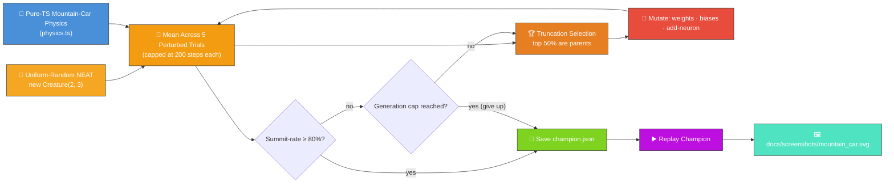
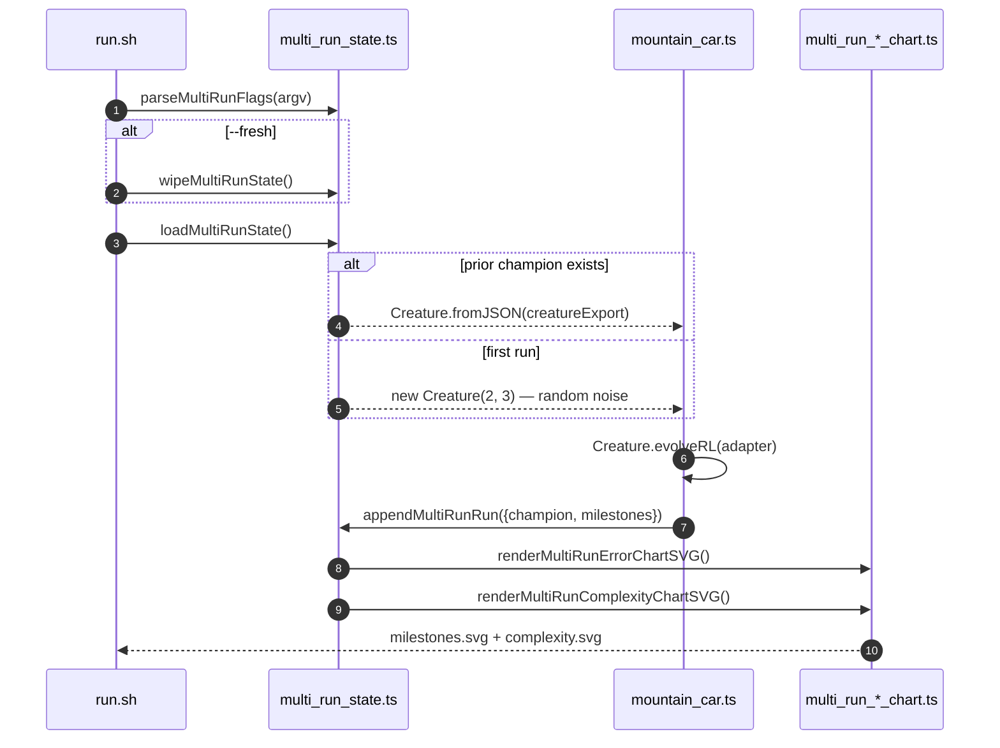
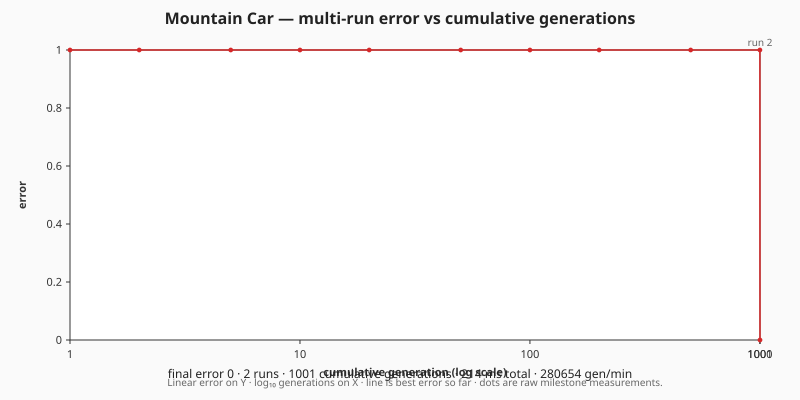
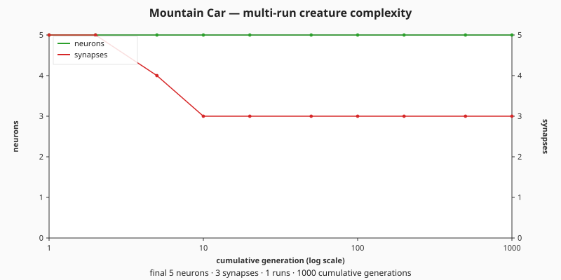

# 🚗 Mountain Car — Swing-up to the Summit

> 🌱 **Generation 1 starts from random noise** — the initial population is built by NEAT-AI's
> uniform-random `Creature(2, 3)` constructor, with **no hand-crafted topology and no tuned weight
> init**. Gen 1 mostly wastes fuel rocking inside the valley; the captured milestones show the
> controller learning to swing back-and-forth across the bowl until the final champion crests the
> goal flag.

**Acronyms.** _NEAT_ = NeuroEvolution of Augmenting Topologies. _RL_ = reinforcement learning (the
agent-and-reward paradigm Mountain Car comes from). _PRNG_ = pseudorandom number generator.

`mountain_car.ts` evolves a NEAT-AI controller that drives an under-powered car up a sinusoidal hill
— the second canonical OpenAI-Gym RL benchmark. The engine is too weak to climb the slope directly,
so the controller has to learn to swing back-and-forth across the valley to build enough momentum to
crest the goal flag. Both the simulator and the evolutionary loop run entirely in pure TypeScript,
with the only external dependency being NEAT-AI's `Creature.activate` to compute each step's action.


## 🔧 How It Works



## 🎯 Inputs and Outputs

| Channel  | Type       | Symbol | Meaning                                                   |
| -------- | ---------- | ------ | --------------------------------------------------------- |
| Input 0  | observable | `x`    | Horizontal position along the hill, bounded `[-1.2, 0.6]` |
| Input 1  | observable | `v`    | Horizontal velocity, bounded `[-0.07, 0.07]`              |
| Output 0 | action     | —      | Argmax → push left (`-1`)                                 |
| Output 1 | action     | —      | Argmax → coast (`0`)                                      |
| Output 2 | action     | —      | Argmax → push right (`+1`)                                |

The episode ends as a **success** the first timestep `x ≥ 0.5` (the goal flag) and as a **failure**
after 200 timesteps of the canonical `MountainCar-v0` horizon. Each candidate is scored against
**five different perturbed-start trials**: the starting `x` is sampled uniformly from
`[-0.55, -0.45]` (the canonical `-0.5` ± `0.05`) so a controller cannot solve the task by exploiting
a single favourable launch. The `score` reported is the **mean** per-trial score, and the run is
"solved" when the champion's **summit-reached fraction** reaches the `SOLVED_THRESHOLD` of **0.8**
(equivalently `targetError = 0.2`) — eight in ten trials must crest the flag within the step cap.

### Stop conditions (audit issue #221)

Evolution uses the standard NEAT-AI stop conditions:

- **`targetError = 0.2`** — halt as soon as the champion's summit rate reaches `1 - targetError`,
  i.e. ≥ 80% of the perturbed-start trials crest the flag.
- **`timeoutMinutes = 5`** — wall-clock backstop in case the target is never reached.

Whichever fires first wins. The default seed reaches the target in well under a minute on a
commodity laptop, so the backstop is never hit in practice. Per-step `Creature.activate()` is
retained because the environment is interactive — there is no pre-generated binary training set that
`Creature.evolveDir(...)` could consume; each step's action depends on the previous step's state.

## 🚀 Running the Example

```bash
# First run — random seed, writes creature + milestones + both charts.
./mountain_car/run.sh --fresh

# Subsequent runs — resume from the saved champion and append milestones.
./mountain_car/run.sh

# Override the wall-clock budget and / or early-stop target error.
./mountain_car/run.sh --timeout=10 --target-error=0.005
```

The runner forwards every flag to the underlying Deno program, which parses them via
`parseMultiRunFlags` from [`common/multi_run_state.ts`](../common/multi_run_state.ts):

| Flag                  | Default | Meaning                                                               |
| --------------------- | ------- | --------------------------------------------------------------------- |
| `--fresh`             | absent  | Wipe prior creature, milestones, and both chart SVGs before evolving. |
| `--timeout=<minutes>` | 5       | Wall-clock budget for this invocation, integer minutes ≥ 1.           |
| `--target-error=<v>`  | 0.01    | Stop as soon as the champion's normalised error falls below `v`.      |

Artefacts:

- `.synthetic-mountain-car/creatures/champion.json` – the fittest controller from this invocation
  (working-directory copy for ad-hoc inspection)
- `docs/screenshots/mountain_car.svg` – animated SVG showing the champion's drive up the hill
- [`docs/data/mountain_car/creature.json`](../docs/data/mountain_car/creature.json) – persisted
  champion that subsequent runs reload as the next seed
- [`docs/data/mountain_car/milestones.json`](../docs/data/mountain_car/milestones.json) – merged
  milestone history across every run, with both `runGen` and `cumulativeGen`
- [`docs/screenshots/mountain_car/milestones.svg`](../docs/screenshots/mountain_car/milestones.svg)
  – multi-run error-curve chart: error vs cumulative generation, with faint run-boundary guide lines
  (`renderMultiRunErrorChartSVG` from
  [`common/multi_run_error_chart.ts`](../common/multi_run_error_chart.ts))
- [`docs/screenshots/mountain_car/complexity.svg`](../docs/screenshots/mountain_car/complexity.svg)
  – multi-run complexity chart: neuron and synapse counts vs cumulative generation
  (`renderMultiRunComplexityChartSVG` from
  [`common/multi_run_complexity_chart.ts`](../common/multi_run_complexity_chart.ts))

## 📈 Evolution Progress (Multi-Run)

Per issue [#298](https://github.com/stSoftwareAU/NEAT-AI-Examples/issues/298) NEAT-AI surfaces only
milestone-cadence telemetry (`evolverl_milestone` events at generations
`1, 2, 5, 10, 20, 50, 100, 200, 500, 1000`, then powers of ten). The legacy per-generation evolution
strip, fitness chart, and topology chart have been replaced — and as of issue
[#323](https://github.com/stSoftwareAU/NEAT-AI-Examples/issues/323) the single-run milestone chart
itself (`docs/screenshots/mountain_car_milestones.svg`) is superseded by the multi-run chart pair
above. Each subsequent run reloads the saved champion via
[`common/multi_run_state.ts`](../common/multi_run_state.ts), evolves further, and appends fresh
milestones with a monotonically-increasing `cumulativeGen` — so the charts show one continuous noise
→ competent → polished arc across every run combined.







Re-run `./mountain_car/run.sh` (without `--fresh`) to extend both charts with a new run.

Generation 1 — the first milestone — is the **uniform-random NEAT population** straight from
`new Creature(2, 3)`: direct input → output connections with weights and biases drawn by the
library's RNG. Most gen-1 creatures waste their 200 steps rocking inside the valley without ever
cresting the flag, so the population mean per-trial score sits at the failure baseline (well below
any successful score). Subsequent milestones (gens 10 / 100 / 1000) show the controller growing
structure and shifting weights into a swing-up region of the search space; the final milestone meets
the 80% summit-rate threshold across the perturbed-start batch.

## 🧠 Tacit Knowledge

A few things that are not obvious from the code alone:

- **No hand-crafted topology.** `mountain_car.ts` never hard-codes neurons or synapses. The initial
  population is built with `createSeededPopulation({ inputCount: 2, outputCount: 3, ... })` which
  delegates to `new Creature(2, 3)` for every member. Hidden neurons appear only when the add-neuron
  mutation operator splits an existing connection during evolution — structural mutation discovers
  them.
- **Engine is deliberately under-powered.** The acceleration coefficient (`0.001`) is smaller than
  the gravity coefficient on the slope (`0.0025`) at most positions. A purely greedy "push toward
  the goal" controller cannot solve it — the car stalls before the summit. Mountain Car is the
  textbook showcase for evolutionary search precisely because of this non-greedy structure.
- **Argmax discretisation.** The three outputs are passed through the library's default squash and
  then `argmax` — the controller commits to one of `{-1, 0, +1}` every step. Ties favour the lower
  index but in practice the outputs differ enough that ties are vanishingly rare.
- **Perturbed starts.** Every candidate is scored on five different starting positions (the same
  five for every member, every generation) so the search cannot "win" by memorising a single
  symmetric launch. The `0.05` half-width keeps every start inside the valley bowl so the swing-up
  problem stays well-posed.
- **Left-wall collision matters.** When the car slams into `x = -1.2` the velocity is reset to zero.
  Without this, the simulation would let the car push leftward indefinitely past the wall, breaking
  the episode dynamics.
- **Reproducibility.** The library's global RNG is reseeded at the start of each evolve call via
  `setRandomNumberGenerator(createSeededRng(seed))`, and our local PRNG
  (`common/deterministic_random.ts`) drives mutation. With a fixed seed the same champion is
  produced on every run.
- **`targetError` + `timeoutMinutes` stop conditions.** Audit issue #221 replaced the old
  `maxGenerations` cap with the standard NEAT-AI pair: evolution halts as soon as the champion's
  summit rate reaches `1 - targetError` (default `0.2` → 80%) or the wall-clock backstop
  `timeoutMinutes` (default `5`) elapses. `evolveMountainCarController` returns `stopReason`
  (`"target"` or `"timeout"`) so callers can tell which fired.
- **Per-step `Creature.activate()`, not `evolveDir`.** Mountain Car is interactive — each step's
  action depends on the previous step's state — so we cannot pre-generate a binary `.bin` training
  set. Evolution scores every candidate by rolling the simulator forward step-by-step inside the
  evolution loop. See parent issue #203 for the broader audit context.
- **OpenAI Gym lineage.** Update rules, bounds, action set, and the 200-step horizon all match the
  canonical `MountainCar-v0` benchmark, so behaviour matches the textbook reference. Despite that
  pedigree, the simulator is plain TypeScript so the project remains "Deno + JSR" with no extra
  runtime.

## 🧰 NEAT-AI Features Used

Mountain Car is an evolution-from-noise agent demo, so the demonstrated capability is NEAT-AI's
evolutionary topology search driven by an episode-rollout fitness signal.

> 🔎 **Stripped-down operator subset.** This example deliberately exercises a narrow slice of
> NEAT-AI's full pipeline so the noise → competent story stays uncluttered. The production training
> pipeline (backpropagation, dropout, L1/L2 regularisation, K-fold, binary `.bin` data streams,
> distributed evolution, etc.) is intentionally **not** wired into this demo — see issue
> [#185](https://github.com/stSoftwareAU/NEAT-AI-Examples/issues/185) and the upstream
> production-pipeline notes in
> [`COMPARISON.md`](https://github.com/stSoftwareAU/NEAT-AI/blob/Develop/COMPARISON.md) for the
> wider feature set.

Features exercised (links go to upstream
[`COMPARISON.md`](https://github.com/stSoftwareAU/NEAT-AI/blob/Develop/COMPARISON.md)):

- **[Evolutionary Topology Search](https://github.com/stSoftwareAU/NEAT-AI/blob/Develop/COMPARISON.md#what-weve-implemented)**
  — structural mutation co-evolved with weights against the energy-build-up fitness signal.
- **[Genetic Operators](https://github.com/stSoftwareAU/NEAT-AI/blob/Develop/COMPARISON.md#what-weve-implemented)**
  — weight and bias mutation paired with selection pressure on the per-episode reward.
