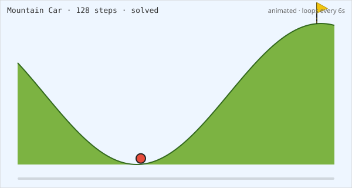
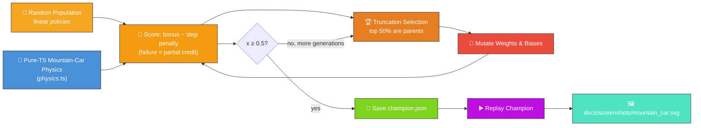
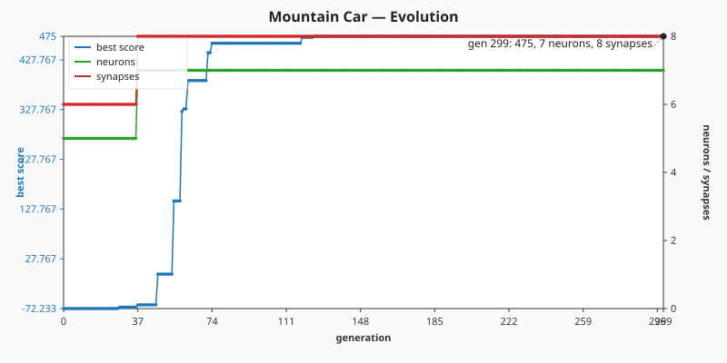

# 🚗 Mountain Car — Swing-up to the Summit

> 🌱 **Generation 1 starts from random noise** — the captured milestones show the controller
> evolving from there into a network that swings the car up to the goal flag.

`mountain_car.ts` evolves a NEAT-AI controller that drives an under-powered car up a sinusoidal hill
— the second canonical OpenAI-Gym RL benchmark. The engine is too weak to climb the slope directly,
so the controller has to learn to swing back-and-forth across the valley to build enough momentum to
crest the goal flag. Both the simulator and the evolutionary loop run entirely in pure TypeScript,
with the only external dependency being NEAT-AI's `Creature.activate` to compute each step's action.



## 🔧 How It Works



## 🎯 Inputs and Outputs

| Channel  | Type       | Symbol | Meaning                                                   |
| -------- | ---------- | ------ | --------------------------------------------------------- |
| Input 0  | observable | `x`    | Horizontal position along the hill, bounded `[-1.2, 0.6]` |
| Input 1  | observable | `v`    | Horizontal velocity, bounded `[-0.07, 0.07]`              |
| Output 0 | action     | —      | Logistic activation; argmax → push left (`-1`)            |
| Output 1 | action     | —      | Logistic activation; argmax → coast (`0`)                 |
| Output 2 | action     | —      | Logistic activation; argmax → push right (`+1`)           |

The episode ends as a **success** the first timestep `x ≥ 0.5` (the goal flag) and as a **failure**
after 200 timesteps of the canonical `MountainCar-v0` horizon. Successful runs score
`SUCCESS_BONUS − (SUCCESS_BONUS · steps / 200)`, so faster solves outscore slower ones; failed runs
receive a flat penalty plus a small bonus for the highest peak reached so the evolutionary search
still has a gradient to follow before any genome solves the task.

## 🚀 Running the Example

```bash
./mountain_car/run.sh
```

Artefacts:

- `.synthetic-mountain-car/creatures/champion.json` – the fittest controller from the run
- `docs/screenshots/mountain_car.svg` – an animated SVG showing the champion's drive up the hill
- `docs/screenshots/mountain_car/evolution.svg` – dual-axis evolution chart plotting best score and
  champion neuron / synapse counts against generation

## 📈 Evolution Chart



## 🧠 Tacit Knowledge

A few things that are not obvious from the code alone:

- **Engine is deliberately under-powered.** The acceleration coefficient (`0.001`) is smaller than
  the gravity coefficient on the slope (`0.0025`) at most positions. A purely greedy "push toward
  the goal" controller cannot solve it — the car stalls before the summit. Mountain Car is the
  textbook showcase for evolutionary search precisely because of this non-greedy structure.
- **Linear policy is enough.** Two inputs and three logistic outputs (six weights, three biases)
  make a small enough search space that a 30-creature population finds a swing-up controller in tens
  of generations. There is no hidden layer.
- **Argmax discretisation.** The three outputs are passed through logistics and then `argmax` — the
  controller commits to one of `{-1, 0, +1}` every step. Ties favour the lower index but in practice
  the logistic outputs differ enough that ties are vanishingly rare.
- **Left-wall collision matters.** When the car slams into `x = -1.2` the velocity is reset to zero.
  Without this, the simulation would let the car push leftward indefinitely past the wall, breaking
  the episode dynamics.
- **Reproducibility.** All randomness flows through `common/deterministic_random.ts`. With a fixed
  seed the same champion is produced on every run.
- **OpenAI Gym lineage.** Update rules, bounds, action set, and the 200-step horizon all match the
  canonical `MountainCar-v0` benchmark, so behaviour matches the textbook reference. Despite that
  pedigree, the simulator is plain TypeScript so the project remains "Deno + JSR" with no extra
  runtime.
