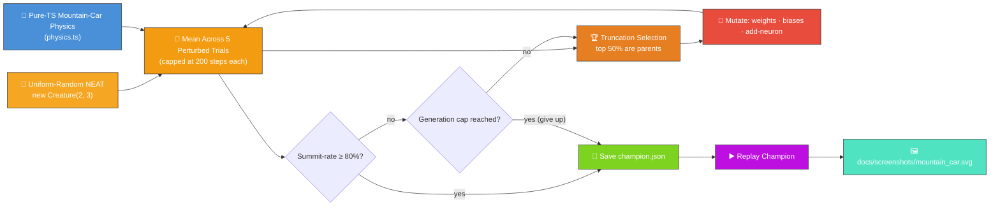
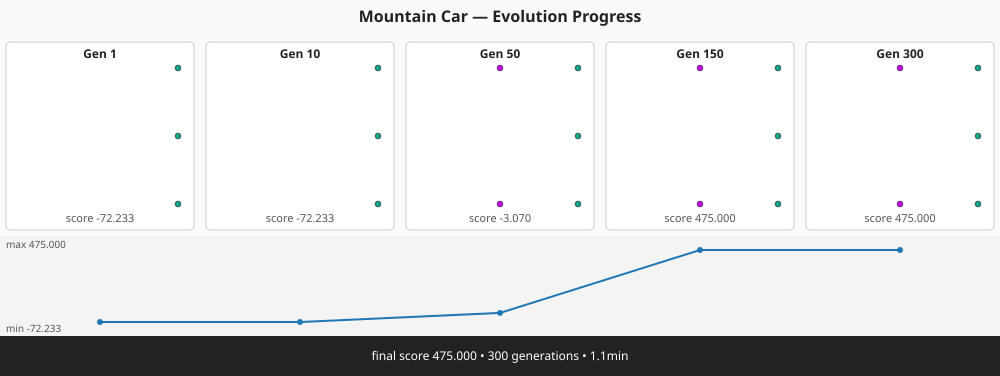

# 🚗 Mountain Car — Swing-up to the Summit

> 🌱 **Generation 1 starts from random noise** — the initial population is built by NEAT-AI's
> uniform-random `Creature(2, 3)` constructor, with **no hand-crafted topology and no tuned weight
> init**. Gen 1 mostly wastes fuel rocking inside the valley; the captured milestones show the
> controller learning to swing back-and-forth across the bowl until the final champion crests the
> goal flag.

**Acronyms.** _NEAT_ = NeuroEvolution of Augmenting Topologies. _RL_ = reinforcement learning (the
agent-and-reward paradigm Mountain Car comes from). _PRNG_ = pseudorandom number generator.

`mountain_car.ts` evolves a NEAT-AI controller that drives an under-powered car up a sinusoidal hill
— the second canonical OpenAI-Gym RL benchmark. The engine is too weak to climb the slope directly,
so the controller has to learn to swing back-and-forth across the valley to build enough momentum to
crest the goal flag. Both the simulator and the evolutionary loop run entirely in pure TypeScript,
with the only external dependency being NEAT-AI's `Creature.activate` to compute each step's action.


## 🔧 How It Works



## 🎯 Inputs and Outputs

| Channel  | Type       | Symbol | Meaning                                                   |
| -------- | ---------- | ------ | --------------------------------------------------------- |
| Input 0  | observable | `x`    | Horizontal position along the hill, bounded `[-1.2, 0.6]` |
| Input 1  | observable | `v`    | Horizontal velocity, bounded `[-0.07, 0.07]`              |
| Output 0 | action     | —      | Argmax → push left (`-1`)                                 |
| Output 1 | action     | —      | Argmax → coast (`0`)                                      |
| Output 2 | action     | —      | Argmax → push right (`+1`)                                |

The episode ends as a **success** the first timestep `x ≥ 0.5` (the goal flag) and as a **failure**
after 200 timesteps of the canonical `MountainCar-v0` horizon. Each candidate is scored against
**five different perturbed-start trials**: the starting `x` is sampled uniformly from
`[-0.55, -0.45]` (the canonical `-0.5` ± `0.05`) so a controller cannot solve the task by exploiting
a single favourable launch. The `score` reported is the **mean** per-trial score, and the run is
"solved" when the champion's **summit-reached fraction** reaches the `SOLVED_THRESHOLD` of **0.8** —
eight in ten trials must crest the flag within the step cap. Evolution stops as soon as that
threshold is met or the **hard generation cap** of 300 is reached, whichever comes first.

## 🚀 Running the Example

```bash
./mountain_car/run.sh
```

Artefacts:

- `.synthetic-mountain-car/creatures/champion.json` – the fittest controller from the run
- `.synthetic-mountain-car/snapshots/snapshot-gen-*.json` – running-champion snapshots captured at
  the configured checkpoints
- `docs/screenshots/mountain_car.svg` – animated SVG showing the champion's drive up the hill
- `docs/screenshots/mountain_car_evolution.svg` – multi-panel evolution-progression strip rendered
  from the captured snapshots
- `docs/screenshots/mountain_car/evolution.svg` – dual-axis evolution chart plotting best score and
  champion neuron / synapse counts against generation

## 📈 Evolution Progress




The runner captures a snapshot of the **running champion** at each of the checkpoint generations
`[1, 10, 50, 150, 300]` (those that fall inside the configured `maxGenerations`). The cadence is
chosen to match variable-topology evolution from uniform-random noise: gen 1 is pure noise, gens 10
/ 50 / 150 show the controller growing structure and shifting weights, and the final captured panel
shows the swing-up policy cresting the flag. The chart fits a normal window — the milestones are
spaced so the score-progression polyline is readable end-to-end.

Generation 1 is the **uniform-random NEAT population** straight from `new Creature(2, 3)` — direct
input → output connections with weights and biases drawn by the library's RNG. Most gen-1 creatures
waste their 200 steps rocking inside the valley without ever cresting the flag, so the population
mean per-trial score sits at the failure baseline (well below any successful score). The
intermediate milestones show the controller learning the swing-up strategy; the final champion meets
the 80% summit-rate threshold across the perturbed-start batch.

## 🧠 Tacit Knowledge

A few things that are not obvious from the code alone:

- **No hand-crafted topology.** `mountain_car.ts` never hard-codes neurons or synapses. The initial
  population is built with `createSeededPopulation({ inputCount: 2, outputCount: 3, ... })` which
  delegates to `new Creature(2, 3)` for every member. Hidden neurons appear only when the add-neuron
  mutation operator splits an existing connection during evolution — structural mutation discovers
  them.
- **Engine is deliberately under-powered.** The acceleration coefficient (`0.001`) is smaller than
  the gravity coefficient on the slope (`0.0025`) at most positions. A purely greedy "push toward
  the goal" controller cannot solve it — the car stalls before the summit. Mountain Car is the
  textbook showcase for evolutionary search precisely because of this non-greedy structure.
- **Argmax discretisation.** The three outputs are passed through the library's default squash and
  then `argmax` — the controller commits to one of `{-1, 0, +1}` every step. Ties favour the lower
  index but in practice the outputs differ enough that ties are vanishingly rare.
- **Perturbed starts.** Every candidate is scored on five different starting positions (the same
  five for every member, every generation) so the search cannot "win" by memorising a single
  symmetric launch. The `0.05` half-width keeps every start inside the valley bowl so the swing-up
  problem stays well-posed.
- **Left-wall collision matters.** When the car slams into `x = -1.2` the velocity is reset to zero.
  Without this, the simulation would let the car push leftward indefinitely past the wall, breaking
  the episode dynamics.
- **Reproducibility.** The library's global RNG is reseeded at the start of each evolve call via
  `setRandomNumberGenerator(createSeededRng(seed))`, and our local PRNG
  (`common/deterministic_random.ts`) drives mutation. With a fixed seed the same champion is
  produced on every run.
- **Hard generation cap.** Evolution stops at `maxGenerations` even if the threshold has not been
  reached, so a stuck run never blocks the example forever. The cap is enforced in
  `evolveMountainCarController` and verified by the `honours the hard generation cap` test.
- **OpenAI Gym lineage.** Update rules, bounds, action set, and the 200-step horizon all match the
  canonical `MountainCar-v0` benchmark, so behaviour matches the textbook reference. Despite that
  pedigree, the simulator is plain TypeScript so the project remains "Deno + JSR" with no extra
  runtime.
