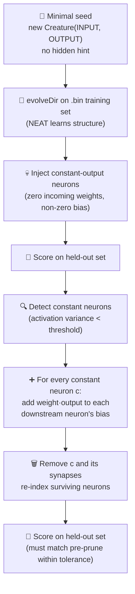
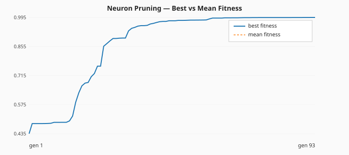
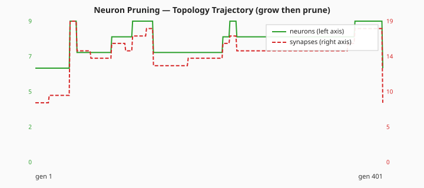

# ✂️ Neuron Pruning — Constant-Activation Removal With Bias Fold

**Acronyms.** _NEAT_ = NeuroEvolution of Augmenting Topologies. _SGD_ = stochastic gradient descent
(backpropagation that updates weights from a small mini-batch each step). _WASM_ = WebAssembly (the
sandboxed binary instruction format NEAT-AI uses to run activation functions natively in the browser
or Deno). _CSV_ = comma-separated values. _MSE_ = mean-squared error.

`neuron_pruning.ts` demonstrates one of NEAT-AI's simplest, most effective tricks for keeping
creatures lean: removing hidden neurons whose activations don't vary across the held-out dataset and
folding their bias contribution into the surviving downstream neurons. Because the pruned neurons
only ever produce one value, the folded creature is **mathematically equivalent** on every record —
the score does not regress, but the neuron count drops and the network gets smaller and faster.

Per the audit in [issue #217](https://github.com/stSoftwareAU/NEAT-AI-Examples/issues/217), the seed
passed to NEAT-AI is **minimal** — only `new Creature(INPUT_COUNT, OUTPUT_COUNT)` with no
hidden-layer hint, no pre-built `network.json`, no hand-tuned topology. NEAT-AI random-initialises
the rest, and `Creature.evolveDir(...)` over a binary `.bin` training set learns the structure. The
deliberately constant-output neurons that pruning removes are injected **after** evolution so the
demo has something concrete to act on; per `AGENTS.md` this hand-crafted constant-neuron injection
is exempt from the no-warm-start policy because the demo's whole point is the prune operation — the
seed itself is still the minimal `new Creature(INPUT_COUNT, OUTPUT_COUNT)`.


## 🚀 How to Run

```bash
./neuron_pruning/run.sh
```

The runner prints per-generation evolution telemetry and pre/post pruning statistics, lists every
pruned neuron with its constant output value and the downstream neurons that absorbed its bias-fold
contribution, writes the topology SVG to `docs/screenshots/neuron_pruning.svg`, and emits
per-generation telemetry to `docs/data/neuron_pruning/evolution.csv` plus two summary charts in
`docs/screenshots/neuron_pruning/`.

## 🧠 Why does NEAT-AI need this?

Evolutionary search frequently produces hidden neurons whose incoming weights cancel out, saturate
at the activation function's flat region, or end up wired to inputs that have no discriminative
signal. The neuron's output stops varying, but the neuron is still walking the forward pass for
every record. Constant-activation removal is the cheapest possible fix:

| Aspect             | Without pruning                 | With constant-neuron pruning                                         |
| ------------------ | ------------------------------- | -------------------------------------------------------------------- |
| Cost per forward   | All neurons evaluated           | Constant neurons removed — fewer ops per record                      |
| Weight count       | Every dead synapse still walked | Synapses incident on pruned neurons removed                          |
| Behavioural change | n/a                             | None on the sampled dataset — folded bias is exact                   |
| Failure mode       | Slowly bloating creatures       | Genuinely useful neurons could be pruned at high `varianceThreshold` |

## 🔧 How It Works



### The synthetic task

The "ground truth" target is a small fully-connected creature the demo synthesises deterministically
(reusing `buildLargeCreature` with density 1.0). The held-out and training datasets are generated by
feeding random inputs through this target so the truth function is reachable in principle by an
evolved network of similar scale.

The student creature passed to NEAT-AI is built from `new Creature(INPUT_COUNT, OUTPUT_COUNT)`
**only**. NEAT random-initialises the rest of the structure: every hidden neuron and every
inter-layer synapse the final creature owns is discovered during evolution.

### Why `Creature.evolveDir({"forward-only": true})` is the default

NEAT-AI's pre-generated binary `.bin` training pipeline is one to two orders of magnitude faster
than per-step `activate()` for problems that can be expressed as a fixed feature → label table.
Neuron pruning operates on a static dataset (the held-out set) so the binary path is the obvious
choice — the demo writes a Float32 `.bin` once, then NEAT-AI's WASM/SIMD pipeline streams over it
every generation. There is no per-step environment, so per-step `activate()` would only cost speed.

### Stop conditions

The evolveDir phase stops when **either** `targetError` is reached **or** the `timeoutMinutes`
backstop expires (issue #217 mandates a 5-minute upper bound). The example's defaults are
`targetError: 0.005` and `timeoutMinutes: 5`. On a developer machine the demo finishes in well under
thirty seconds — the timeout exists only as a safety net.

### Bias fold

For every constant neuron `c` with output `v` and an outgoing synapse `c → t` with weight `w`, the
contribution `w · v` is constant across every record. So we add `w · v` to `t.bias` and drop the
synapse. Once every outgoing synapse has been folded, neuron `c` is dead weight — we drop it
entirely along with any synapses pointing into it. The surviving neurons are re-indexed so the
network stays valid.

### Why analytical scoring after evolveDir?

NEAT-AI evolves the weights and topology in the binary `.bin` pipeline. Once evolution stops, the
prune step is a topology operation, not a training step — there is nothing for SGD or NEAT-AI's
training pipeline to do here. The example evaluates the held-out score with straight feed-forward
math directly on the synapse array (after remapping any non-supported squash to TANH), which keeps
the bias-fold path self-contained and byte-deterministic.

## 📊 Measured Telemetry (latest run)

The numbers below are quoted **directly** from the latest local run of `./neuron_pruning/run.sh` (no
estimates):

| Metric                                  | Value       |
| --------------------------------------- | ----------- |
| Total generations evolved               | 400         |
| Wall-clock time                         | 24.3 s      |
| Final best fitness (training, gen 400)  | 0.9947      |
| Seed-creature neurons (gen 1)           | 6           |
| Seed-creature synapses (gen 1)          | 8           |
| Evolved peak neurons (gen 400)          | 9           |
| Evolved peak synapses (gen 400)         | 18          |
| Evolved + injected neurons (pre-prune)  | 9           |
| Evolved + injected synapses (pre-prune) | 9           |
| Pruned creature neurons (post-prune)    | 6           |
| Pruned creature synapses (post-prune)   | 8           |
| Constant neurons detected and folded    | 3           |
| Held-out score pre-prune (-MSE)         | −1.9229     |
| Held-out score post-prune (-MSE)        | **−1.9229** |
| Score regression (post − pre)           | 0.0000      |

**Topology genuinely changed across generations.** From the minimal seed (6 neurons, 8 synapses)
NEAT grew the evolved champion to 9 neurons / 18 synapses by generation 400, hitting a training best
fitness of **0.9947**. Injecting three deliberately constant-output hidden neurons reduced the
synapse count to 9 by zeroing every incoming synapse on the chosen neurons. Pruning then folded
those three neurons' constant contributions into their downstream neighbours' biases and removed the
neurons + their synapses, leaving a 6-neuron / 8-synapse pruned champion — the same input-and-output
count as the original minimal seed.

The pre-prune and post-prune held-out scores are identical (−1.9229) because bias-folding is
mathematically exact for genuinely constant neurons — the network's behaviour on every sampled
record is unchanged. The poor absolute score is _intentional_: the held-out score is measured after
injection has nullified the chosen hidden neurons, so it reflects a deliberately broken network that
pruning makes leaner without making it any better. The evolved-creature quality before injection is
captured by the **0.9947 training fitness** at generation 400, demonstrating that NEAT-AI from a
minimal seed produces a reasonable solution on this task before pruning is applied.

### Per-generation evolution CSV

[`docs/data/neuron_pruning/evolution.csv`](../docs/data/neuron_pruning/evolution.csv) — one row per
generation with `generation, best_fitness, mean_fitness, neuron_count, synapse_count`. The final row
(generation 401) records the post-prune endpoint: same fitness, fewer neurons and synapses, showing
the prune as a single step on the topology line.

### Best/mean fitness vs generation



The best-fitness line climbs from ~0.21 at generation 1 to ~0.995 by generation 400 then plateaus.
NEAT-AI's `averageFitness` is reported as 0 by the chunked evolveDir pipeline used here, so the mean
line sits at zero — the headline trajectory is the best-fitness climb.

### Neuron / synapse count vs generation



The neuron line rises from 6 (the minimal seed) to 9 over the course of evolution; the synapse line
climbs from 8 to 18. The final point (generation 401) drops to 6 neurons / 8 synapses — the
post-prune endpoint — which is the **expected shape** for this demo: pruning legitimately reduces
neuron and synapse counts without regressing the score, so the chart's "start ≠ end" rule is
satisfied by a downward step at the end of an otherwise rising trajectory.

## 📤 Output

- `docs/screenshots/neuron_pruning.svg` — a single panel showing the pre-prune topology (inputs on
  the left, hidden in the middle, outputs on the right) with pruned neurons greyed out and dashed,
  their incident edges dimmed, and bias-fold arrows drawn in coral from each pruned neuron to every
  downstream neighbour whose bias absorbed its contribution. A summary panel beside the topology
  records pre/post neuron counts, pre/post scores, and lists each pruned neuron with its
  constant-output value and bias-fold targets. A mirror copy is also written to
  `.neuron-pruning/output/neuron_pruning.svg`.
- `docs/data/neuron_pruning/evolution.csv` — per-generation telemetry with the schema above.
- `docs/screenshots/neuron_pruning/fitness.svg` — best vs mean fitness across all generations.
- `docs/screenshots/neuron_pruning/topology.svg` — neuron and synapse counts across all generations
  (separate axes — synapses on the right).
- `.neuron-pruning/creatures/champion.json` — the final pruned champion creature.

## 🧪 Tests

`neuron_pruning_test.ts` verifies:

- The forward pass returns finite outputs of the correct shape and rejects mismatched input length.
- `injectConstantNeurons` drops every incoming synapse on its chosen neurons and rejects counts
  larger than the hidden-neuron pool.
- `detectConstantNeurons` flags the deliberately injected neurons as constant on the held-out set
  and rejects negative thresholds.
- `pruneConstantNeurons` preserves every output to floating-point tolerance — bias-folding is
  mathematically exact for genuinely constant neurons — and records bias-fold targets per pruned
  neuron in ascending order.
- `generateDataset` is deterministic for a given seed and rejects non-positive sizes.
- `writeBinaryDataset` emits a Float32 `.bin` of the expected size.
- The end-to-end `runNeuronPruningDemo` reduces the neuron count and the post-prune held-out score
  does not regress versus the pre-prune score, returns a Creature champion with finite scores, and
  rejects invalid config values.
- `runNeuronPruningDemo` emits per-generation telemetry rows with finite fitness and positive neuron
  / synapse counts (plus a final post-prune endpoint row).
- The CSV formatter emits the canonical header and one row per generation.
- `renderFitnessChartSvg` and `renderTopologyChartSvg` produce well-formed SVGs with the expected
  CSS classes and reject empty input.
- `renderNeuronPruningSVG` is well-formed, embeds the topology / summary / legend panels, and
  references the pruned-neuron and bias-fold CSS classes.

## 🧰 NEAT-AI Features Used

Neuron Pruning is one of NEAT-AI's simplest, most effective operators: it removes neurons that
became redundant after training.

Features exercised (links go to upstream
[`COMPARISON.md`](https://github.com/stSoftwareAU/NEAT-AI/blob/Develop/COMPARISON.md)):

- **[Neuron Pruning](https://github.com/stSoftwareAU/NEAT-AI/blob/Develop/COMPARISON.md#what-weve-implemented)**
  — removes constant or low-utility neurons from a creature without changing its observable outputs
  — the central technique this example demonstrates.
- **[Binary `.bin` Training Stream](https://github.com/stSoftwareAU/NEAT-AI/blob/Develop/COMPARISON.md#11--binary-bin-training-stream)**
  — `Creature.evolveDir(...)` consumes a Float32 binary file directly via WASM/SIMD, an order of
  magnitude faster than per-step `activate()` for problems with a fixed feature → label table.
- **[Backpropagation](https://github.com/stSoftwareAU/NEAT-AI/blob/Develop/COMPARISON.md#what-weve-implemented)**
  — gradient-based weight tuning runs alongside structural mutation during evolveDir; the evolved
  champion's weights are gradient-fitted, not just evolved.
