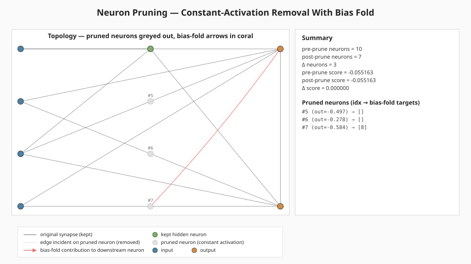
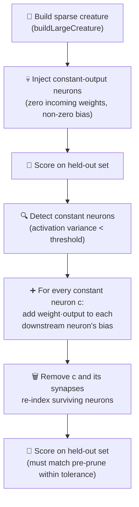

# ✂️ Neuron Pruning — Constant-Activation Removal With Bias Fold

**Acronyms.** _NEAT_ = NeuroEvolution of Augmenting Topologies. _SGD_ = stochastic gradient descent
(backpropagation that updates weights from a small mini-batch each step).

`neuron_pruning.ts` demonstrates one of NEAT-AI's simplest, most effective tricks for keeping large
creatures lean: removing hidden neurons whose activations don't vary across the held-out dataset and
folding their bias contribution into the surviving downstream neurons. Because the pruned neurons
only ever produce one value, the folded creature is **mathematically equivalent** on every record —
the score does not regress, but the neuron count drops and the network gets smaller and faster.



## 🚀 How to Run

```bash
./neuron_pruning/run.sh
```

The runner prints pre/post neuron counts and held-out scores, lists every pruned neuron with its
constant output value and the downstream neurons that absorbed its bias-fold contribution, and
writes the topology SVG to `.neuron-pruning/output/neuron_pruning.svg`. The whole run completes in
well under a second on a developer machine.

## 🧠 Why does NEAT-AI need this?

Evolutionary search frequently produces hidden neurons whose incoming weights cancel out, saturate
at the activation function's flat region, or end up wired to inputs that have no discriminative
signal. The neuron's output stops varying, but the neuron is still walking the forward pass for
every record. Constant-activation removal is the cheapest possible fix:

| Aspect             | Without pruning                 | With constant-neuron pruning                                         |
| ------------------ | ------------------------------- | -------------------------------------------------------------------- |
| Cost per forward   | All neurons evaluated           | Constant neurons removed — fewer ops per record                      |
| Weight count       | Every dead synapse still walked | Synapses incident on pruned neurons removed                          |
| Behavioural change | n/a                             | None on the sampled dataset — folded bias is exact                   |
| Failure mode       | Slowly bloating creatures       | Genuinely useful neurons could be pruned at high `varianceThreshold` |

## 🔧 How It Works



### The synthetic task

The "target" is a sparse creature produced by `buildLargeCreature` (issue #83) using small default
sizes (4 inputs, 16 hidden, 2 outputs, density 0.3 — about 18 hidden synapses). The held-out dataset
is generated by feeding random inputs through this target so the truth function is reachable in
principle without the constant neurons.

The "demo" creature starts as a copy of that target, then has `constantNeurons` of its hidden
neurons converted into deliberately constant-output neurons by zeroing their incoming weights and
assigning a non-zero bias. Every record now produces `activate(squash, bias)` from those neurons — a
fixed value the optimiser would happily absorb into a downstream bias if it could.

### Bias fold

For every constant neuron `c` with output `v` and an outgoing synapse `c → t` with weight `w`, the
contribution `w · v` is constant across every record. So we add `w · v` to `t.bias` and drop the
synapse. Once every outgoing synapse has been folded, neuron `c` is dead weight — we drop it
entirely along with any synapses pointing into it. The surviving neurons are re-indexed so the
network stays valid.

### Why analytical scoring instead of NEAT-AI's training pipeline?

Pruning is a topology operation, not a training step — there is nothing for SGD or NEAT-AI's
training pipeline to do here. The example evaluates the held-out score with straight feed-forward
math directly on the synapse array, which keeps the demo self-contained and byte-deterministic.

## 📤 Output

- `docs/screenshots/neuron_pruning.svg` — a single panel showing the pre-prune topology (inputs on
  the left, hidden in the middle, outputs on the right) with pruned neurons greyed out and dashed,
  their incident edges dimmed, and bias-fold arrows drawn in coral from each pruned neuron to every
  downstream neighbour whose bias absorbed its contribution. A summary panel beside the topology
  records pre/post neuron counts, pre/post scores, and lists each pruned neuron with its
  constant-output value and bias-fold targets. A mirror copy is also written to
  `.neuron-pruning/output/neuron_pruning.svg`.

## 🧪 Tests

`neuron_pruning_test.ts` verifies:

- The forward pass returns finite outputs of the correct shape and rejects mismatched input length.
- `injectConstantNeurons` drops every incoming synapse on its chosen neurons.
- `detectConstantNeurons` flags the deliberately injected neurons as constant on the held-out set.
- `pruneConstantNeurons` preserves every output to floating-point tolerance — bias-folding is
  mathematically exact for genuinely constant neurons.
- The end-to-end run **strictly reduces** the neuron count and the post-prune held-out score does
  not regress versus the pre-prune score.
- The whole run is byte-deterministic for the same config.
- The rendered SVG is well-formed, embeds the topology / summary / legend panels, and references the
  pruned-neuron and bias-fold CSS classes.

## 🧰 NEAT-AI Features Used

Neuron Pruning is one of NEAT-AI's simplest, most effective operators: it removes neurons that
became redundant after training.

Features exercised (links go to upstream
[`COMPARISON.md`](https://github.com/stSoftwareAU/NEAT-AI/blob/Develop/COMPARISON.md)):

- **[Neuron Pruning](https://github.com/stSoftwareAU/NEAT-AI/blob/Develop/COMPARISON.md#what-weve-implemented)**
  — removes constant or low-utility neurons from a creature without changing its observable outputs
  — the central technique this example demonstrates.
