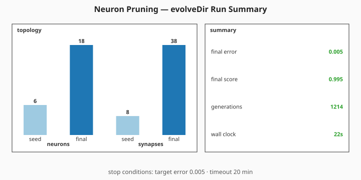
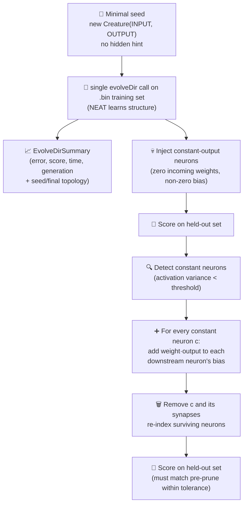

# ✂️ Neuron Pruning — Constant-Activation Removal With Bias Fold

**Acronyms.** _NEAT_ = NeuroEvolution of Augmenting Topologies. _SGD_ = stochastic gradient descent
(backpropagation that updates weights from a small mini-batch each step). _WASM_ = WebAssembly (the
sandboxed binary instruction format NEAT-AI uses to run activation functions natively in the browser
or Deno). _MSE_ = mean-squared error.

`neuron_pruning.ts` demonstrates one of NEAT-AI's simplest, most effective tricks for keeping
creatures lean: removing hidden neurons whose activations don't vary across the held-out dataset and
folding their bias contribution into the surviving downstream neurons. Because the pruned neurons
only ever produce one value, the folded creature is **mathematically equivalent** on every record —
the score does not regress, but the neuron count drops and the network gets smaller and faster.

Per the audit in [issue #217](https://github.com/stSoftwareAU/NEAT-AI-Examples/issues/217), the seed
passed to NEAT-AI is **minimal** — only `new Creature(INPUT_COUNT, OUTPUT_COUNT)` with no
hidden-layer hint, no pre-built `network.json`, no hand-tuned topology. Under telemetry rewire
[issue #303](https://github.com/stSoftwareAU/NEAT-AI-Examples/issues/303) the per-generation
`onTrainingEvent` hook was removed; the run is now summarised via a single milestone SVG sourced
from `evolveDir`'s return value (the canonical milestone-only telemetry surface — see #298). The
deliberately constant-output neurons that pruning removes are injected **after** evolution so the
demo has something concrete to act on; per `AGENTS.md` this hand-crafted constant-neuron injection
is exempt from the no-warm-start policy because the demo's whole point is the prune operation — the
seed itself is still the minimal `new Creature(INPUT_COUNT, OUTPUT_COUNT)`.


The headline topology before/after panel above is unchanged in shape. Its held-out score callouts
are now sourced from the milestone summary path below.



## 🚀 How to Run

```bash
./neuron_pruning/run.sh
```

The runner prints pre/post pruning statistics, lists every pruned neuron with its constant output
value and the downstream neurons that absorbed its bias-fold contribution, writes the topology SVG
to `docs/screenshots/neuron_pruning.svg`, and writes the milestone summary SVG to
`docs/screenshots/neuron_pruning/evolution_summary.svg`.

## 🧠 Why does NEAT-AI need this?

Evolutionary search frequently produces hidden neurons whose incoming weights cancel out, saturate
at the activation function's flat region, or end up wired to inputs that have no discriminative
signal. The neuron's output stops varying, but the neuron is still walking the forward pass for
every record. Constant-activation removal is the cheapest possible fix:

| Aspect             | Without pruning                 | With constant-neuron pruning                                         |
| ------------------ | ------------------------------- | -------------------------------------------------------------------- |
| Cost per forward   | All neurons evaluated           | Constant neurons removed — fewer ops per record                      |
| Weight count       | Every dead synapse still walked | Synapses incident on pruned neurons removed                          |
| Behavioural change | n/a                             | None on the sampled dataset — folded bias is exact                   |
| Failure mode       | Slowly bloating creatures       | Genuinely useful neurons could be pruned at high `varianceThreshold` |

## 🔧 How It Works



### The synthetic task

The "ground truth" target is a small fully-connected creature the demo synthesises deterministically
(reusing `buildLargeCreature` with density 1.0). The held-out and training datasets are generated by
feeding random inputs through this target so the truth function is reachable in principle by an
evolved network of similar scale.

The student creature passed to NEAT-AI is built from `new Creature(INPUT_COUNT, OUTPUT_COUNT)`
**only**. NEAT random-initialises the rest of the structure: every hidden neuron and every
inter-layer synapse the final creature owns is discovered during evolution.

### Why `Creature.evolveDir({"forward-only": true})` is the default

NEAT-AI's pre-generated binary `.bin` training pipeline is one to two orders of magnitude faster
than per-step `activate()` for problems that can be expressed as a fixed feature → label table.
Neuron pruning operates on a static dataset (the held-out set) so the binary path is the obvious
choice — the demo writes a Float32 `.bin` once, then NEAT-AI's WASM/SIMD pipeline streams over it
every generation. There is no per-step environment, so per-step `activate()` would only cost speed.

### Stop conditions

The evolveDir phase stops when **either** `targetError` is reached **or** the `timeoutMinutes`
backstop expires. Issue #217 originally mandated a 5-minute upper bound; issue
[#385](https://github.com/stSoftwareAU/NEAT-AI-Examples/issues/385) raises this to 20 minutes (+15
wall-clock minutes) for the `Refresh-2026-05` milestone refresh. The example's defaults are
`targetError: 0.005` and `timeoutMinutes: 20`. On a developer machine the demo still finishes in
well under thirty seconds — the larger timeout exists only as a safety net for slower or busier
hardware.

### Bias fold

For every constant neuron `c` with output `v` and an outgoing synapse `c → t` with weight `w`, the
contribution `w · v` is constant across every record. So we add `w · v` to `t.bias` and drop the
synapse. Once every outgoing synapse has been folded, neuron `c` is dead weight — we drop it
entirely along with any synapses pointing into it. The surviving neurons are re-indexed so the
network stays valid.

### Why analytical scoring after evolveDir?

NEAT-AI evolves the weights and topology in the binary `.bin` pipeline. Once evolution stops, the
prune step is a topology operation, not a training step — there is nothing for SGD or NEAT-AI's
training pipeline to do here. The example evaluates the held-out score with straight feed-forward
math directly on the synapse array (after remapping any non-supported squash to TANH), which keeps
the bias-fold path self-contained and byte-deterministic.

## 📊 Milestone Telemetry

The single `evolveDir` call's return value is captured as an `EvolveDirSummary` and exposed on the
demo's result (`evolutionSummary`). The headline summary panel quotes:

- `finalError` / `finalScore` reached by NEAT-AI.
- `generations` completed before the run stopped.
- `wallClockMs` — total time the evolveDir call took.
- `seedNeurons`/`seedSynapses` vs `finalNeurons`/`finalSynapses` — the bar pair on the topology side
  of the milestone SVG.

Held-out score callouts on the topology panel (pre-prune / post-prune scores) are computed locally
against the held-out dataset and surfaced alongside the milestone summary so the bias-fold step's
"no regression" guarantee is visible at a glance.

## 📤 Output

- `docs/screenshots/neuron_pruning.svg` — topology before/after panel: inputs on the left, hidden in
  the middle, outputs on the right, pruned neurons greyed out and dashed, their incident edges
  dimmed, bias-fold arrows in coral. A summary panel beside the topology records pre/post neuron
  counts, pre/post held-out scores, and lists each pruned neuron with its constant-output value and
  bias-fold targets. A mirror copy is also written to `.neuron-pruning/output/neuron_pruning.svg`.
- `docs/screenshots/neuron_pruning/evolution_summary.svg` — milestone summary SVG sourced from the
  single `evolveDir` call's return value.
- `.neuron-pruning/creatures/champion.json` — the final pruned champion creature.

## 🧪 Tests

`neuron_pruning_test.ts` verifies:

- The forward pass returns finite outputs of the correct shape and rejects mismatched input length.
- `injectConstantNeurons` drops every incoming synapse on its chosen neurons and rejects counts
  larger than the hidden-neuron pool.
- `detectConstantNeurons` flags the deliberately injected neurons as constant on the held-out set
  and rejects negative thresholds.
- `pruneConstantNeurons` preserves every output to floating-point tolerance — bias-folding is
  mathematically exact for genuinely constant neurons — and records bias-fold targets per pruned
  neuron in ascending order.
- `generateDataset` is deterministic for a given seed and rejects non-positive sizes.
- `writeBinaryDataset` emits a Float32 `.bin` of the expected size.
- `runNeuronPruningDemo` reduces the neuron count and the post-prune held-out score does not regress
  versus the pre-prune score, returns a Creature champion with finite scores, and rejects invalid
  config values.
- `runNeuronPruningDemo` returns a milestone summary (`evolutionSummary`) from a single `evolveDir`
  call — seed counts match the minimal `new Creature(INPUT_COUNT, OUTPUT_COUNT)`, final topology
  counts match the post-prune state on the result, and numeric summary fields are finite.
- `renderNeuronPruningSVG` is well-formed, embeds the topology / summary / legend panels, and
  references the pruned-neuron and bias-fold CSS classes.
- `renderEvolveDirSummarySvg` renders the milestone summary derived from `runNeuronPruningDemo`,
  carrying the four callout labels and the topology counts.

## 🧰 NEAT-AI Features Used

Neuron Pruning is one of NEAT-AI's simplest, most effective operators: it removes neurons that
became redundant after training.

Features exercised (links go to upstream
[`COMPARISON.md`](https://github.com/stSoftwareAU/NEAT-AI/blob/Develop/COMPARISON.md)):

- **[Neuron Pruning](https://github.com/stSoftwareAU/NEAT-AI/blob/Develop/COMPARISON.md#what-weve-implemented)**
  — removes constant or low-utility neurons from a creature without changing its observable outputs
  — the central technique this example demonstrates.
- **[Binary `.bin` Training Stream](https://github.com/stSoftwareAU/NEAT-AI/blob/Develop/COMPARISON.md#11--binary-bin-training-stream)**
  — `Creature.evolveDir(...)` consumes a Float32 binary file directly via WASM/SIMD, an order of
  magnitude faster than per-step `activate()` for problems with a fixed feature → label table.
- **[Backpropagation](https://github.com/stSoftwareAU/NEAT-AI/blob/Develop/COMPARISON.md#what-weve-implemented)**
  — gradient-based weight tuning runs alongside structural mutation during evolveDir; the evolved
  champion's weights are gradient-fitted, not just evolved.
- **Milestone-only telemetry** — the run's `EvolveDirSummary` is captured from the `evolveDir`
  return value; no per-generation hook is used (#303).
