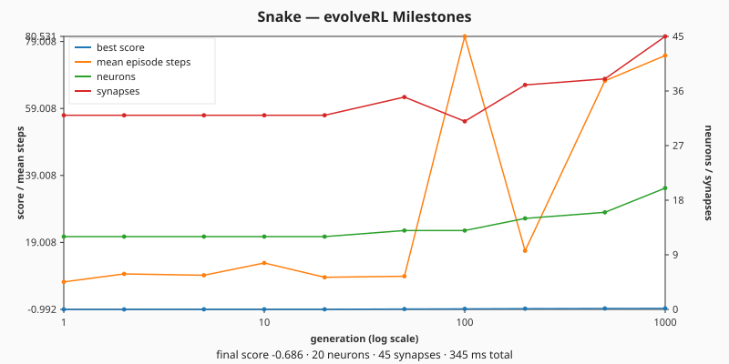
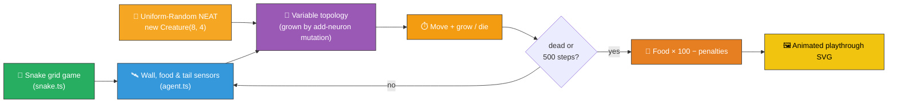

# 🐍 Snake — Evolved Controller for the Classic Grid Game

> 🌱 **Generation 1 starts from random noise.** `Creature.evolveRL()` is seeded with a brand-new
> `new Creature(8, 4)` — the library's uniform-random minimal genome with direct input → output
> connections, random weights, and a random output bias. **No hand-crafted topology, no tuned weight
> init.** Hidden neurons emerge only from NEAT-AI's structural mutation operators during evolution.

**Acronyms.** _NEAT_ = NeuroEvolution of Augmenting Topologies. _RL_ = reinforcement learning. _XOR_
= exclusive OR. _MNIST_ = Modified National Institute of Standards and Technology handwritten-digit
dataset (referenced from the supervised-vs-agent comparison).

`snake_game.ts` evolves a NEAT-AI controller that plays the classic Snake grid game on a 12×12
board. The snake starts three segments long, must eat food cells to grow, and dies the moment it
runs into a wall or its own body. The simulator (`snake.ts`) is pure TypeScript; the evolutionary
loop is driven entirely by NEAT-AI's class-shaped `Creature.evolveRL()` API (issue #291, replaces
#238).


## 📈 Milestone Statistics

Per [#298](https://github.com/stSoftwareAU/NEAT-AI-Examples/issues/298) NEAT-AI exposes only
**milestone-cadence** telemetry — `evolverl_milestone` events at generations
`1, 2, 5, 10, 20, 50, 100, 200, 500, 1000`, then powers of ten. The runner captures every milestone
payload returned by `Creature.evolveRL()` and renders them as a dual-axis SVG chart via
[`common/milestone_chart.ts`](../common/milestone_chart.ts) (from
[#287](https://github.com/stSoftwareAU/NEAT-AI-Examples/issues/287)).

**Left axis:** best score and mean episode steps. **Right axis:** champion neuron and synapse
counts. The chart replaces the legacy per-generation snake_game_evolution.svg / evolution.svg /
fitness.svg / topology.svg artefacts — those required a per-generation handler that NEAT-AI no
longer surfaces.



## 🔧 How It Works



## 🎯 Inputs and Outputs

The agent observes a small sensor pack (8 channels — well below the issue's 12-input budget):

| Channel  | Type       | Symbol        | Meaning                                             |
| -------- | ---------- | ------------- | --------------------------------------------------- |
| Input 0  | observable | `wallForward` | Cells of free space ahead, normalised by `gridSize` |
| Input 1  | observable | `wallLeft`    | Cells of free space to the snake's left             |
| Input 2  | observable | `wallRight`   | Cells of free space to the snake's right            |
| Input 3  | observable | `foodDx`      | `(food.x − head.x) / gridSize` (signed)             |
| Input 4  | observable | `foodDy`      | `(food.y − head.y) / gridSize` (signed)             |
| Input 5  | observable | `tailDx`      | `(tail.x − head.x) / gridSize` (signed)             |
| Input 6  | observable | `tailDy`      | `(tail.y − head.y) / gridSize` (signed)             |
| Input 7  | observable | `length`      | `body.length / (gridSize × gridSize)`               |
| Output 0 | action     | —             | Argmax → heading **Up**                             |
| Output 1 | action     | —             | Argmax → heading **Right**                          |
| Output 2 | action     | —             | Argmax → heading **Down**                           |
| Output 3 | action     | —             | Argmax → heading **Left**                           |

Each tick the controller chooses one of four headings; a 180° reversal request is rejected and the
snake keeps its previous heading. Episodes end when the snake collides with a wall or its own body,
or when the 500-step cap is reached.

## 📏 Scoring

```text
score = (food eaten × 100) − (steps × 0.1) − (50 if died else 0)
```

Eating one food gives +100, easily out-weighing the per-step penalty so survival without eating
cannot beat eating quickly. The 50-point death penalty rewards staying alive when food is genuinely
out of reach.

The task is "solved" when the champion's **best per-seed food eaten reaches `SOLVED_THRESHOLD = 3`**
— the same number the SVG playthrough renders after picking the strongest replay seed — **and** the
running champion's mean across the five evaluation seeds is at least `SOLVED_AVG_FLOOR = 1.5` (so a
fragile elite that aces a single seed and fails the rest cannot be flagged as solved).

### Stop conditions

Evolution uses NEAT-AI's standard stop conditions, fed straight into `EvolveRLOptions`:

- **`targetError = 0.05`** — halt as soon as the mean cumulative episode reward across the
  per-generation seed batch reaches `-0.05`. Under `SnakeAdapter`'s reward shaping (terminal `-1`
  baseline, `+1 / SOLVED_THRESHOLD` per food eaten, Manhattan-distance shaping bounded by ~`±0.5`)
  this is a strict gate that only fires when the champion is reliably eating food.
- **`timeoutMinutes = 5`** — wall-clock backstop in case the target is never reached.

Whichever fires first wins. The post-evolution `solved` flag is computed independently from the
held-out `DEFAULT_EVAL_SEEDS` so a champion that overfits to evolveRL's per-generation seed rotation
is not flagged solved by mistake.

## 🚀 Running the Example

```bash
./snake_game/run.sh
```

Artefacts:

- `.synthetic-snake/creatures/champion.json` – the fittest controller from the run
- `docs/screenshots/snake_game.svg` – animated SVG of the champion's playthrough
- `docs/screenshots/snake_game_milestones.svg` – `Creature.evolveRL()` milestone-statistics chart
  (best score and mean episode steps on the left axis; champion neuron and synapse counts on the
  right axis)

## ❓ FAQ — Streaming observations vs batch supervised training

Issue [#125](https://github.com/stSoftwareAU/NEAT-AI-Examples/issues/125) raised four conceptual
questions about whether NEAT-AI's API actually fits a stream-of-observations game like Snake. The
short answers, anchored in this example, are:

**Is the NEAT-AI API set up for a stream of observations?** Yes — `Creature.activate(input)` is a
single forward pass; calling it once per simulator tick _is_ the streaming primitive. The simulator
owns the world state and decides what the next observation looks like; the creature owns its weights
and produces an action. There is no built-in `for row of dataset` loop assumed anywhere.

**How is this normally done?** Episode rollout — for each tick: observe → activate → decode action →
step the world; break on terminal. `SnakeAdapter.step` in `snake_game.ts` is one screenful of
exactly that loop, wired up to satisfy NEAT-AI's `EpisodeAdapter` contract. Every agent example in
this repo (`cart_pole`, `lunar_lander`, `mountain_car`, `maze_navigation`) follows the same shape
with different physics.

**Does each creature in the population get a different observation stream?** Yes — once two
creatures pick different actions on tick 1, their state trajectories diverge, so every later
observation differs. To keep the comparison fair, NEAT-AI rotates a per-generation seed set derived
from `EvolveRLOptions.seed`; every creature in a given generation faces the same initial state and
food sequence (given equivalent decisions), so the divergence is entirely on them.

**How does this work elsewhere — and is it different from "20 GiB of training data"?** Yes,
fundamentally. This is a Reinforcement-Learning-shaped problem, not batch supervised learning.
Population × generations × episode-length still parallelises trivially because each rollout is
independent, but each creature must run its own simulator, so total wall-clock cost grows with
episode length rather than with dataset size — there is no fixed dataset to pre-load and reuse.

For the side-by-side comparison with the supervised paradigm (XOR, MNIST, Stock Market) and the
Mermaid diagram of both loops, see the
[**🧭 Two Training Paradigms — Supervised vs Agent Evolution**](../README.md#-two-training-paradigms--supervised-vs-agent-evolution)
section in the top-level README.

## 🧠 Tacit Knowledge

A few things that are not obvious from the code alone:

- **No hand-crafted topology.** `snake_game.ts` never hard-codes neurons or synapses. The seed
  creature is a vanilla `new Creature(8, 4)` — direct input → output connections with random weights
  and a random output bias. Hidden neurons appear only when NEAT-AI's structural mutation operators
  split an existing connection during evolution.
- **Multi-episode fitness.** Each creature is evaluated across `episodesPerCreature = 5` distinct
  food-spawn seeds and ranked by mean cumulative reward, so a controller has to generalise rather
  than overfit to a single playthrough.
- **Distance shaping.** `SnakeAdapter.step` includes a tiny Manhattan-distance shaping reward
  (`±ADAPTER_SHAPING_COEFF ≈ 1e-3` per cell of progress). This breaks the flat fitness landscape
  that would otherwise trap the population at "ate no food" — mutations that nudge the head closer
  get credit even before the snake actually reaches food.
- **Argmax discretisation.** The four outputs are passed through `argmax` — the controller commits
  to one of four headings every step. Ties favour lower indices but in practice the outputs differ
  enough that ties are vanishingly rare.
- **180° reversals are rejected.** Snake gameplay requires this so the snake cannot trivially
  collide with its own neck. Asking the controller to reverse simply leaves the heading unchanged.
- **Tail moves before collision check.** When the snake does not eat, the tail cell is freed before
  the head's new cell is checked for body overlap — so the snake can chase its own tail safely,
  matching classic Snake semantics.
- **`targetError` + `timeoutMinutes` stop conditions.** Evolution is delegated to
  `Creature.evolveRL()` with the standard NEAT-AI stop conditions: evolution halts as soon as the
  mean cumulative episode reward reaches `-targetError` (default `0.05`), or the wall-clock backstop
  `timeoutMinutes` (default `5`) elapses. `evolveSnakeController` returns `stopReason` (`"target"`,
  `"timeout"`, or `"iterations"`) so callers can tell which fired. The `iterations` cap is exposed
  for fast unit tests that need a deterministic generation count without depending on wall-clock
  timing.
- **`Creature.evolveRL()` owns the GA.** Snake is interactive (each step's action depends on the
  previous state), so the loop runs through NEAT-AI's first-class reinforcement-learning evolver
  rather than `evolveDir`. Mutation, crossover, elitism, plateau detection, and stop-condition
  handling are all NEAT-AI's responsibility under `evolveRL()` (#291, replaces #238).
- **No `onTrainingEvent` handler.** Per
  [#298](https://github.com/stSoftwareAU/NEAT-AI-Examples/issues/298) NEAT-AI surfaces only
  milestone-cadence telemetry — the example collects the milestone payloads via
  `EvolveRLOptions.statistics = true` and renders them via `renderMilestoneChartSVG`.
- **Per-episode seed.** Every simulator episode (initial state + food sequence) is driven by a
  deterministic PRNG seeded from `SnakeAdapter.reset(rngSeed)`. NEAT-AI rotates the per-generation
  seed set internally derived from `EvolveRLOptions.seed`.

## 🧰 NEAT-AI Features Used

Snake is a streaming-observation agent demo evolved from noise, so the demonstrated capability is
NEAT-AI's evolutionary topology search driven by an episode-rollout fitness signal.

> 🔎 **Stripped-down operator subset.** This example deliberately exercises a narrow slice of
> NEAT-AI's full pipeline so the noise → competent story stays uncluttered. The production training
> pipeline (backpropagation, dropout, L1/L2 regularisation, K-fold, binary `.bin` data streams,
> distributed evolution, etc.) is intentionally **not** wired into this demo — see issue
> [#185](https://github.com/stSoftwareAU/NEAT-AI-Examples/issues/185) and the upstream
> production-pipeline notes in
> [`COMPARISON.md`](https://github.com/stSoftwareAU/NEAT-AI/blob/Develop/COMPARISON.md) for the
> wider feature set.

Features exercised (links go to upstream
[`COMPARISON.md`](https://github.com/stSoftwareAU/NEAT-AI/blob/Develop/COMPARISON.md)):

- **[Evolutionary Topology Search](https://github.com/stSoftwareAU/NEAT-AI/blob/Develop/COMPARISON.md#what-weve-implemented)**
  — structural mutation co-evolved with weights against the apple-eating fitness signal across
  streamed `Creature.activate` calls.
- **[Genetic Operators](https://github.com/stSoftwareAU/NEAT-AI/blob/Develop/COMPARISON.md#what-weve-implemented)**
  — weight and bias mutation paired with selection pressure on the survival-and-score fitness
  function.
