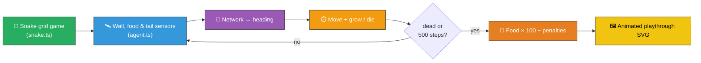

# 🐍 Snake — Evolved Controller for the Classic Grid Game

`snake_game.ts` evolves a NEAT-AI controller that plays the classic Snake grid game on a 12×12
board. The snake starts three segments long, must eat food cells to grow, and dies the moment it
runs into a wall or its own body. Both the simulator (`snake.ts`) and the evolutionary loop run
entirely in pure TypeScript; the only external dependency is NEAT-AI's `Creature.activate` to
compute each step's heading.


## 🔧 How It Works



## 🎯 Inputs and Outputs

The agent observes a small sensor pack (8 channels — well below the issue's 12-input budget):

| Channel  | Type       | Symbol        | Meaning                                             |
| -------- | ---------- | ------------- | --------------------------------------------------- |
| Input 0  | observable | `wallForward` | Cells of free space ahead, normalised by `gridSize` |
| Input 1  | observable | `wallLeft`    | Cells of free space to the snake's left             |
| Input 2  | observable | `wallRight`   | Cells of free space to the snake's right            |
| Input 3  | observable | `foodDx`      | `(food.x − head.x) / gridSize` (signed)             |
| Input 4  | observable | `foodDy`      | `(food.y − head.y) / gridSize` (signed)             |
| Input 5  | observable | `tailDx`      | `(tail.x − head.x) / gridSize` (signed)             |
| Input 6  | observable | `tailDy`      | `(tail.y − head.y) / gridSize` (signed)             |
| Input 7  | observable | `length`      | `body.length / (gridSize × gridSize)`               |
| Output 0 | action     | —             | Logistic activation; argmax → heading **Up**        |
| Output 1 | action     | —             | Logistic activation; argmax → heading **Right**     |
| Output 2 | action     | —             | Logistic activation; argmax → heading **Down**      |
| Output 3 | action     | —             | Logistic activation; argmax → heading **Left**      |

Each tick the controller chooses one of four headings; a 180° reversal request is rejected and the
snake keeps its previous heading. Episodes end when the snake collides with a wall or its own body,
or when the 500-step cap is reached.

## 📏 Scoring

```text
score = (food eaten × 100) − (steps × 0.1) − (50 if died else 0)
```

Eating one food gives +100, easily out-weighing the per-step penalty so survival without eating
cannot beat eating quickly. The 50-point death penalty rewards staying alive when food is genuinely
out of reach.

## 🚀 Running the Example

```bash
./snake_game/run.sh
```

Artefacts:

- `.synthetic-snake/creatures/champion.json` – the fittest controller from the run
- `docs/screenshots/snake_game.svg` – animated SVG of the champion's playthrough

## 🧠 Tacit Knowledge

A few things that are not obvious from the code alone:

- **Linear policy is enough.** Eight inputs and four logistic outputs (32 weights, 4 biases) is a
  small enough search space that a 60-creature population finds a food-seeking controller in tens of
  generations. There is no hidden layer.
- **Argmax discretisation.** The four outputs are passed through logistics and then `argmax` — the
  controller commits to one of four headings every step. Ties favour lower indices but in practice
  the logistic outputs differ enough that ties are vanishingly rare.
- **180° reversals are rejected.** Snake gameplay requires this so the snake cannot trivially
  collide with its own neck. Asking the controller to reverse simply leaves the heading unchanged.
- **Tail moves before collision check.** When the snake does not eat, the tail cell is freed before
  the head's new cell is checked for body overlap — so the snake can chase its own tail safely,
  matching classic Snake semantics.
- **Reproducibility.** All randomness flows through `common/deterministic_random.ts`. With a fixed
  seed the same champion is produced on every run.
- **Per-episode seed is shared.** Every creature in a generation faces the same initial state and
  the same food sequence (given equivalent decisions), so fitness comparisons are fair.
