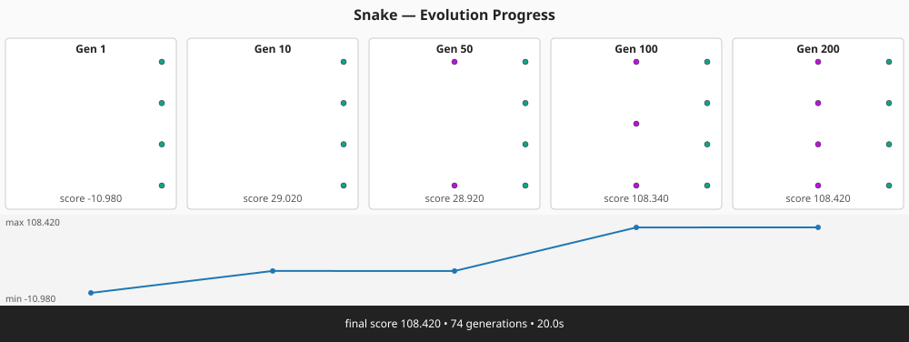
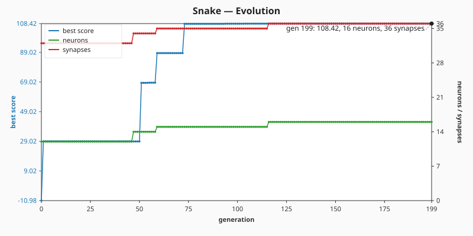
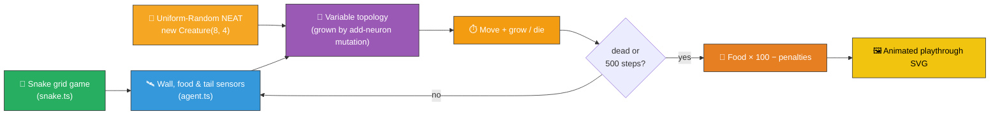

# 🐍 Snake — Evolved Controller for the Classic Grid Game

> 🌱 **Generation 1 starts from random noise.** The initial population is built by NEAT-AI's
> uniform-random `Creature(8, 4)` constructor — direct input → output connections with weights and
> biases drawn by the library's RNG. **No hand-crafted topology, no tuned weight init.** Hidden
> neurons emerge only from the add-neuron structural mutation operator during evolution.

**Acronyms.** _NEAT_ = NeuroEvolution of Augmenting Topologies. _RL_ = reinforcement learning. _XOR_
= exclusive OR. _MNIST_ = Modified National Institute of Standards and Technology handwritten-digit
dataset (referenced from the supervised-vs-agent comparison).

`snake_game.ts` evolves a NEAT-AI controller that plays the classic Snake grid game on a 12×12
board. The snake starts three segments long, must eat food cells to grow, and dies the moment it
runs into a wall or its own body. Both the simulator (`snake.ts`) and the evolutionary loop run
entirely in pure TypeScript; the only external dependency is NEAT-AI's `Creature.activate` to
compute each step's heading.



## 🧬 Evolution Progress

The runner captures snapshots of the running champion at five checkpoints (generations
`[1, 10, 50, 100, 200]`, those that fall inside the configured `maxGenerations`) and renders them
into a multi-panel SMIL-animated strip — so you can see the topology and score grow as the
controller learns to eat food. **Gen 1 is uniform-random NEAT noise that bumps into walls;** the
intermediate milestones at gens 10 / 50 / 100 show the controller learning to chase food as
add-neuron mutations grow hidden structure; the final captured snapshot meets the food-count
threshold.



## 📈 Evolution Chart

The runner also emits a dual-axis chart plotting the per-generation best score (left axis) alongside
the champion's neuron and synapse counts (right axis) for the full run. Because the topology starts
minimal (no hidden neurons) and grows gradually through structural mutation, the neuron and synapse
curves climb visibly across the run.



## 🔧 How It Works



## 🎯 Inputs and Outputs

The agent observes a small sensor pack (8 channels — well below the issue's 12-input budget):

| Channel  | Type       | Symbol        | Meaning                                             |
| -------- | ---------- | ------------- | --------------------------------------------------- |
| Input 0  | observable | `wallForward` | Cells of free space ahead, normalised by `gridSize` |
| Input 1  | observable | `wallLeft`    | Cells of free space to the snake's left             |
| Input 2  | observable | `wallRight`   | Cells of free space to the snake's right            |
| Input 3  | observable | `foodDx`      | `(food.x − head.x) / gridSize` (signed)             |
| Input 4  | observable | `foodDy`      | `(food.y − head.y) / gridSize` (signed)             |
| Input 5  | observable | `tailDx`      | `(tail.x − head.x) / gridSize` (signed)             |
| Input 6  | observable | `tailDy`      | `(tail.y − head.y) / gridSize` (signed)             |
| Input 7  | observable | `length`      | `body.length / (gridSize × gridSize)`               |
| Output 0 | action     | —             | Argmax → heading **Up**                             |
| Output 1 | action     | —             | Argmax → heading **Right**                          |
| Output 2 | action     | —             | Argmax → heading **Down**                           |
| Output 3 | action     | —             | Argmax → heading **Left**                           |

Each tick the controller chooses one of four headings; a 180° reversal request is rejected and the
snake keeps its previous heading. Episodes end when the snake collides with a wall or its own body,
or when the 500-step cap is reached.

## 📏 Scoring

```text
score = (food eaten × 100) − (steps × 0.1) − (50 if died else 0)
```

Eating one food gives +100, easily out-weighing the per-step penalty so survival without eating
cannot beat eating quickly. The 50-point death penalty rewards staying alive when food is genuinely
out of reach.

The task is "solved" when the champion's **best per-seed food eaten reaches `SOLVED_THRESHOLD = 3`**
— the same number the SVG playthrough renders after picking the strongest replay seed — **and** the
running champion's mean across the five evaluation seeds is at least `SOLVED_AVG_FLOOR = 1.5` (so
the early stop cannot fire on a fragile elite that aces a single seed and fails the rest). Evolution
stops as soon as both conditions are met or the **hard generation cap of 200** is reached, whichever
comes first. This matches closed issue #137's "champion ate at least three food on the replay
episode" target — but the bar means more here because the controller now starts from uniform-random
NEAT noise (no hand-crafted layered seed).

## 🚀 Running the Example

```bash
./snake_game/run.sh
```

Artefacts:

- `.synthetic-snake/creatures/champion.json` – the fittest controller from the run
- `.synthetic-snake/snapshots/snapshot-gen-N.json` – champion captured at each checkpoint
- `docs/screenshots/snake_game.svg` – animated SVG of the champion's playthrough
- `docs/screenshots/snake_game_evolution.svg` – multi-panel evolution-progress strip
- `docs/screenshots/snake_game/evolution.svg` – dual-axis evolution chart plotting best score and
  champion neuron / synapse counts against generation

## ❓ FAQ — Streaming observations vs batch supervised training

Issue [#125](https://github.com/stSoftwareAU/NEAT-AI-Examples/issues/125) raised four conceptual
questions about whether NEAT-AI's API actually fits a stream-of-observations game like Snake. The
short answers, anchored in this example, are:

**Is the NEAT-AI API set up for a stream of observations?** Yes — `Creature.activate(input)` is a
single forward pass; calling it once per simulator tick _is_ the streaming primitive. The simulator
owns the world state and decides what the next observation looks like; the creature owns its weights
and produces an action. There is no built-in `for row of dataset` loop assumed anywhere.

**How is this normally done?** Episode rollout — for each tick: observe → activate → decode action →
step the world; break on terminal. The `scoreController` function in `snake_game.ts` is a 15-line
implementation of exactly that loop. Every agent example in this repo (`cart_pole`, `lunar_lander`,
`mountain_car`, `maze_navigation`) follows the same shape with different physics.

**Does each creature in the population get a different observation stream?** Yes — once two
creatures pick different actions on tick 1, their state trajectories diverge, so every later
observation differs. To keep the comparison fair, the _initial_ state and food sequence are derived
from a per-generation seed shared across creatures (the `episodeSeed` argument threaded into
`scoreController`), so all creatures face the same world setup before they start acting; the
divergence is entirely on them.

**How does this work elsewhere — and is it different from "20 GiB of training data"?** Yes,
fundamentally. This is a Reinforcement-Learning-shaped problem, not batch supervised learning.
Population × generations × episode-length still parallelises trivially because each rollout is
independent, but each creature must run its own simulator, so total wall-clock cost grows with
episode length rather than with dataset size — there is no fixed dataset to pre-load and reuse.

For the side-by-side comparison with the supervised paradigm (XOR, MNIST, Stock Market) and the
Mermaid diagram of both loops, see the
[**🧭 Two Training Paradigms — Supervised vs Agent Evolution**](../README.md#-two-training-paradigms--supervised-vs-agent-evolution)
section in the top-level README.

## 🧠 Tacit Knowledge

A few things that are not obvious from the code alone:

- **No hand-crafted topology.** `snake_game.ts` never hard-codes neurons or synapses. The initial
  population is built with `createSeededPopulation({ inputCount: 8, outputCount: 4, ... })` which
  delegates to `new Creature(8, 4)` for every member — direct input → output connections with random
  weights and a random output bias. Hidden neurons appear only when the add-neuron mutation operator
  splits an existing connection during evolution; structural mutation discovers them.
- **Multi-episode fitness.** Each creature is evaluated across five distinct food-spawn seeds and
  ranked by mean fitness, so a controller has to generalise rather than overfit to a single
  playthrough.
- **Distance shaping.** Fitness includes a small Manhattan-distance shaping reward (`±0.5` per cell
  of progress toward the food). This breaks the flat fitness landscape that previously trapped the
  population at "ate one food" — mutations that nudge the head closer get credit even before the
  snake actually reaches food.
- **Argmax discretisation.** The four outputs are passed through `argmax` — the controller commits
  to one of four headings every step. Ties favour lower indices but in practice the outputs differ
  enough that ties are vanishingly rare.
- **180° reversals are rejected.** Snake gameplay requires this so the snake cannot trivially
  collide with its own neck. Asking the controller to reverse simply leaves the heading unchanged.
- **Tail moves before collision check.** When the snake does not eat, the tail cell is freed before
  the head's new cell is checked for body overlap — so the snake can chase its own tail safely,
  matching classic Snake semantics.
- **Hard generation cap.** Evolution stops at `maxGenerations` even if the threshold has not been
  reached, so a stuck run never blocks the example forever. The cap is enforced in
  `evolveSnakeController` and verified by the `honours the hard generation cap` test.
- **Reproducibility.** All randomness flows through `common/deterministic_random.ts` and the
  library's seeded RNG. With a fixed seed the same champion is produced on every run.
- **Per-episode seed is shared.** Every creature in a generation faces the same initial state and
  the same food sequence (given equivalent decisions), so fitness comparisons are fair.

## 🧰 NEAT-AI Features Used

Snake is a streaming-observation agent demo evolved from noise, so the demonstrated capability is
NEAT-AI's evolutionary topology search driven by an episode-rollout fitness signal.

> 🔎 **Stripped-down operator subset.** This example deliberately exercises a narrow slice of
> NEAT-AI's full pipeline so the noise → competent story stays uncluttered. The production training
> pipeline (backpropagation, dropout, L1/L2 regularisation, K-fold, binary `.bin` data streams,
> distributed evolution, etc.) is intentionally **not** wired into this demo — see issue
> [#185](https://github.com/stSoftwareAU/NEAT-AI-Examples/issues/185) and the upstream
> production-pipeline notes in
> [`COMPARISON.md`](https://github.com/stSoftwareAU/NEAT-AI/blob/Develop/COMPARISON.md) for the
> wider feature set.

Features exercised (links go to upstream
[`COMPARISON.md`](https://github.com/stSoftwareAU/NEAT-AI/blob/Develop/COMPARISON.md)):

- **[Evolutionary Topology Search](https://github.com/stSoftwareAU/NEAT-AI/blob/Develop/COMPARISON.md#what-weve-implemented)**
  — structural mutation co-evolved with weights against the apple-eating fitness signal across
  streamed `Creature.activate` calls.
- **[Genetic Operators](https://github.com/stSoftwareAU/NEAT-AI/blob/Develop/COMPARISON.md#what-weve-implemented)**
  — weight and bias mutation paired with selection pressure on the survival-and-score fitness
  function.
