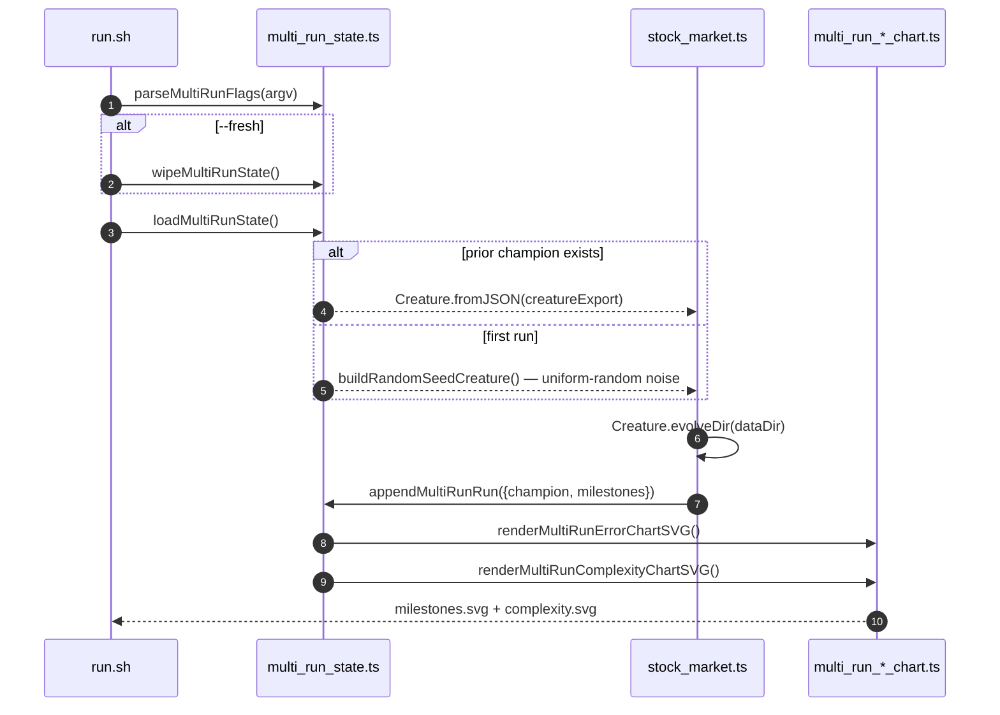
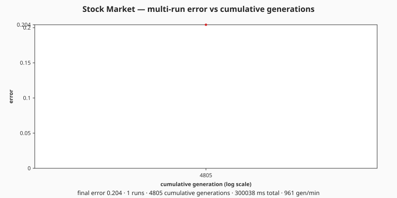
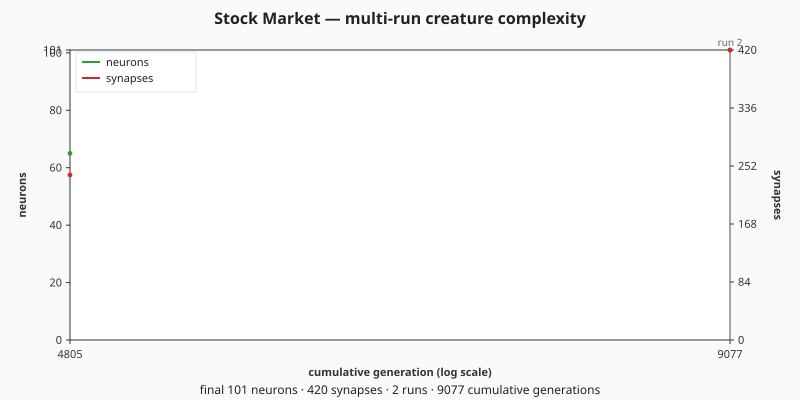

# 📈 Stock Market — Direction Prediction

> 🌱 **Generation 1 starts from random noise** — the seed is built by NEAT-AI's uniform-random
> `new Creature(WINDOW_SIZE, 1)` constructor with **no hand-crafted topology, no `hiddenLayers`
> hint, no pre-built `network.json`, and no domain-tuned narrow weight init**. Hidden neurons are
> not hand-crafted — they emerge purely from NEAT-AI's own structural mutation operators while
> `Creature.evolveDir(...)` runs.

**Acronyms.** _NEAT_ = NeuroEvolution of Augmenting Topologies. _MSE_ = Mean Squared Error. _SVG_ =
Scalable Vector Graphics. _S&P 500_ = Standard & Poor's 500-stock market index.

`stock_market.ts` evolves a NEAT-AI network from a minimal seed to predict next-period direction (up
vs. down) on the public S&P 500 monthly-close dataset. The dataset is downloaded once into
`.synthetic-stock/data/prices.csv` (with a SHA-256 digest pinned to a specific upstream commit so
runs are deterministic), the labelled training samples are written as a binary `.bin` file, and the
evolutionary loop is delegated to `Creature.evolveDir(...)`.

> ⚠️ **Teaching example only — not investment advice.**
>
> The model is a deliberately tiny NEAT controller over a window of recent returns. Real markets are
> noisy, regime-shifting, and adversarial; do not use this code to make trading decisions.


## 🔧 How It Works

```mermaid
flowchart LR
    DL["📥 fetchDataset()<br/>S&P 500 CSV (pinned)"]
    SLIDE["🪟 Sliding window<br/>last N returns"]
    SPLIT["✂️ Train / val / test<br/>chronological split"]
    BIN["📦 Binary .bin training set<br/>(window, target) records"]
    SEED["🌱 new Creature(10, 1)<br/>minimal seed — no hidden hint"]
    EVOLVE["🧪 Creature.evolveDir(dataDir, ...)<br/>forward-only, targetError=0.01,<br/>timeoutMinutes=5"]
    SUMMARY["📈 Multi-run milestone<br/>(error + complexity charts)"]
    CHAMP["💾 champion.json"]
    REPLAY["🔁 Replay on test window"]
    SIG["📝 signals.json"]
    CHART["🖼️ Animated chart<br/>sweep + ▲ ▼ markers"]

    DL --> SLIDE --> SPLIT --> BIN --> EVOLVE
    SEED --> EVOLVE
    EVOLVE --> SUMMARY
    EVOLVE --> CHAMP
    CHAMP --> REPLAY --> SIG
    REPLAY --> CHART

    style DL fill:#4a90d9,stroke:#333,color:#fff
    style SLIDE fill:#f5a623,stroke:#333,color:#fff
    style SPLIT fill:#f39c12,stroke:#333,color:#fff
    style BIN fill:#7ed321,stroke:#333,color:#fff
    style SEED fill:#bd10e0,stroke:#333,color:#fff
    style EVOLVE fill:#e67e22,stroke:#333,color:#fff
    style SUMMARY fill:#50e3c2,stroke:#333,color:#fff
    style CHAMP fill:#1abc9c,stroke:#333,color:#fff
    style REPLAY fill:#9b59b6,stroke:#333,color:#fff
    style SIG fill:#16a085,stroke:#333,color:#fff
    style CHART fill:#bd10e0,stroke:#333,color:#fff
```



### Why `evolveDir` rather than per-step `activate()`?

Stock-market direction prediction is a supervised regression task — every input window has a
pre-computed label. The audit categorisation in
[#203](https://github.com/stSoftwareAU/NEAT-AI-Examples/issues/203) mandates the canonical "binary
`.bin` + `evolveDir`" path for this shape: `evolveDir` exercises NEAT-AI's full feature set
(back-propagation, structure discovery, WebAssembly (WASM) / single-instruction-multiple-data (SIMD)
/ GPU parallelism) and is orders of magnitude faster than per-call `activate()` for supervised
regression. Per-step `activate()` is reserved for interactive simulations and reinforcement-learning
agents — neither applies here.

## 📊 Dataset

| Field         | Value                                                                           |
| ------------- | ------------------------------------------------------------------------------- |
| Source        | [`datasets/s-and-p-500`](https://github.com/datasets/s-and-p-500) (public, MIT) |
| Series        | `SP500` nominal monthly close                                                   |
| Pinned commit | `45117dfc620664bda935a7dbd692f65a5beaa1cd`                                      |
| Coverage      | 1871-01 → 2026-05 (1865 monthly closes)                                         |
| Cache path    | `.synthetic-stock/data/prices.csv`                                              |
| Integrity     | SHA-256 verified by `common/data_cache.ts`                                      |
| Training set  | `.synthetic-stock/data/stock_market.bin` (binary Float32 records)               |

The dataset is monthly, so the example predicts next-**month** direction. The same code works
unchanged for daily data — swap `DATASET_URL` and `DATASET_SHA256` for a daily-close CSV and the
sliding-window logic is identical.

## 🎯 Inputs and Outputs

| Channel    | Type      | Meaning                                                   |
| ---------- | --------- | --------------------------------------------------------- |
| Input 0..N | feature   | The last `WINDOW_SIZE` (default 10) simple period returns |
| Output 0   | direction | LOGISTIC, `>= 0.5` predicts up, otherwise predicts down   |

The fitness used by `evolveDir` is `1 - MSE` against the binary `{0, 1}` direction labels — a
constant `0.5` predictor scores `1 - 0.25 = 0.75`, so anything above `0.75` reflects the network
correlating its output with realised direction.

## 🛑 Stop conditions

`evolveDir` terminates as soon as **any** of the following fires:

| Condition        | Value                                           | Why                                                                                                                  |
| ---------------- | ----------------------------------------------- | -------------------------------------------------------------------------------------------------------------------- |
| `targetError`    | **0.01** (well below chance ~0.25)              | Forces NEAT-AI to grow hidden structure to satisfy it — chance MSE alone is not enough.                              |
| `timeoutMinutes` | **5** (audit-mandated backstop)                 | Wall-clock safety net so a run never wedges. Audit #218 sets this as the upper bound.                                |
| `maxGenerations` | effectively unlimited (raised under issue #328) | Multi-run runs are bounded by `timeoutMinutes` / `targetError` so the merged history is honest about residual error. |

Markets are intrinsically noisy — most runs do **not** reach `targetError = 0.01` and exit via the
wall-clock backstop. The multi-run idiom (issue [#328]) makes this honest: each invocation appends a
fresh milestone to the merged history, so the published charts plot the unified noise → competent
arc across every run combined rather than hand-picking a single "best" run.

## 🚦 Train / Validation / Test Split

The samples are split **chronologically** (never shuffled) so no future information leaks back to
earlier windows:

| Slice      | Fraction | Used for                                                 |
| ---------- | -------- | -------------------------------------------------------- |
| Train      | 70%      | Written to `.bin` file fed into `evolveDir`              |
| Validation | 15%      | Replay-based balanced-accuracy reporting (no look-ahead) |
| Test       | 15%      | Replay & SVG (held out from training)                    |

## 🚀 Running the Example

```bash
# First run — random seed, writes creature + milestones + both charts.
./stock_market/run.sh --fresh

# Subsequent runs — resume from the saved champion and append milestones.
./stock_market/run.sh

# Override the wall-clock budget and / or early-stop target error.
./stock_market/run.sh --timeout=10 --target-error=0.005
```

The runner forwards every flag to the underlying Deno program, which parses them via
`parseMultiRunFlags` from [`common/multi_run_state.ts`](../common/multi_run_state.ts):

| Flag                  | Default | Meaning                                                               |
| --------------------- | ------- | --------------------------------------------------------------------- |
| `--fresh`             | absent  | Wipe prior creature, milestones, and both chart SVGs before evolving. |
| `--timeout=<minutes>` | 5       | Wall-clock budget for this invocation, integer minutes ≥ 1.           |
| `--target-error=<v>`  | 0.01    | Stop as soon as the champion's normalised error falls below `v`.      |

Artefacts:

- `.synthetic-stock/data/prices.csv` — cached dataset
- `.synthetic-stock/data/stock_market.bin` — pre-generated binary training set fed to `evolveDir`
- `.synthetic-stock/creatures/champion.json` — fittest controller from this invocation
  (working-directory copy for ad-hoc inspection)
- `.synthetic-stock/output/signals.json` — per-day prediction vs. outcome on the test window
- `docs/screenshots/stock_market.svg` — animated chart of the test window
- [`docs/data/stock_market/creature.json`](../docs/data/stock_market/creature.json) – persisted
  champion that subsequent runs reload as the next seed
- [`docs/data/stock_market/milestones.json`](../docs/data/stock_market/milestones.json) – merged
  milestone history across every run, with both `runGen` and `cumulativeGen`
- [`docs/screenshots/stock_market/milestones.svg`](../docs/screenshots/stock_market/milestones.svg)
  – multi-run error-curve chart: error vs cumulative generation, with faint run-boundary guide lines
  (`renderMultiRunErrorChartSVG` from
  [`common/multi_run_error_chart.ts`](../common/multi_run_error_chart.ts))
- [`docs/screenshots/stock_market/complexity.svg`](../docs/screenshots/stock_market/complexity.svg)
  – multi-run complexity chart: neuron and synapse counts vs cumulative generation
  (`renderMultiRunComplexityChartSVG` from
  [`common/multi_run_complexity_chart.ts`](../common/multi_run_complexity_chart.ts))

## 🧭 GRQ-Style Exploration Campaign (issue #476)

The standard `run.sh` invocation evolves the full training set with a single set of NEAT options.
That works when the task is well understood and a single sensible schedule converges quickly. For
the "unknown problem" narrative — when you do not yet know how much topology the task needs — issue
[#476](https://github.com/stSoftwareAU/NEAT-AI-Examples/issues/476) wires a second runner that
deliberately separates **structure discovery** from **weight polishing**, mirroring the GRQ-style
sampler pattern.

```bash
# Tiny smoke test — finishes in under a minute on a developer machine.
./stock_market/exploration_campaign.sh --fast

# Full campaign — runs the structure → polish schedule on the real dataset.
./stock_market/exploration_campaign.sh

# Also run scanForSquashImprovements on the polished champion.
./stock_market/exploration_campaign.sh --squash-scan

# Promote the resulting champion + summary to docs/data/ (otherwise the
# artefacts stay under the hidden working dir).
./stock_market/exploration_campaign.sh --promote
```



```mermaid
flowchart LR
    SEED["🌱 new Creature(10, 1)<br/>uniform-random seed"]
    S1["🪵 Structure phase 1<br/>sampleRate=0.05<br/>costOfGrowth=1e-6"]
    S2["🪵 Structure phase 2<br/>sampleRate=0.10<br/>costOfGrowth=1e-6"]
    S3["🪵 Structure phase 3<br/>sampleRate=0.15<br/>costOfGrowth=1e-6"]
    POL["✨ Polish phase<br/>sampleRate=1<br/>costOfGrowth=0"]
    SQ["🧪 Optional squash scan<br/>(scanForSquashImprovements)"]
    SCORE["🎯 Honest scoring<br/>full train / val / test<br/>after every phase"]
    WORK["🗂️ .synthetic-stock/exploration/<br/>(hidden, gitignored)"]
    PROMOTE["🚚 docs/data/stock_market/exploration/<br/>(only on --promote)"]

    SEED --> S1 --> S2 --> S3 --> POL --> SQ
    POL --> SCORE
    S1 --> SCORE
    S2 --> SCORE
    S3 --> SCORE
    SQ --> SCORE
    SCORE --> WORK
    WORK -. --promote .-> PROMOTE

    style SEED fill:#bd10e0,stroke:#333,color:#fff
    style S1 fill:#e67e22,stroke:#333,color:#fff
    style S2 fill:#e67e22,stroke:#333,color:#fff
    style S3 fill:#e67e22,stroke:#333,color:#fff
    style POL fill:#1abc9c,stroke:#333,color:#fff
    style SQ fill:#9b59b6,stroke:#333,color:#fff
    style SCORE fill:#f5a623,stroke:#333,color:#fff
    style WORK fill:#7ed321,stroke:#333,color:#fff
    style PROMOTE fill:#4a90d9,stroke:#333,color:#fff
```

What each piece does:

- **Structure phases.** Three short bursts that subsample the training set heavily
  (`trainingSampleRate` 5 → 10 → 15%) and pay a very small but positive `costOfGrowth`. Many
  generations land per wall-clock minute because each generation's fitness eval is cheap, and the
  cost term keeps NEAT-AI biased toward genuinely useful add-neuron / add-synapse moves.
- **Polish phase.** Full training set (`trainingSampleRate = 1`) with `costOfGrowth = 0`, so the
  remaining wall-clock is spent on weight and bias tuning rather than topology growth.
- **Optional intelligent design (`--squash-scan`).** Runs `scanForSquashImprovements` and
  `combineImprovements` on the polished champion — useful when activation function choice matters.
- **Honest scoring.** Subsampling only affects training fitness. After every phase the champion is
  evaluated on the **full** train, validation, and test windows using `directionalAccuracy` and
  `balancedDirectionalAccuracy`, so the recorded series is apples-to-apples across phases.
- **Hidden working state.** Every artefact (per-phase records, `champion.json`, `summary.json`,
  optional `squash_scan.json`) lands under `.synthetic-stock/exploration/`. The directory is
  gitignored — exploration runs never pollute the working tree.
- **Explicit promote.** Pass `--promote` to copy the champion and summary into
  `docs/data/stock_market/exploration/`. Without that flag the canonical artefacts stay untouched,
  so a casual local run cannot silently overwrite documented numbers.

The campaign deliberately starts from `new Creature(WINDOW_SIZE, 1)` every time — no warm start,
consistent with the project-wide
[no-warm-starts](../AGENTS.md#-no-warm-starts--evolution-must-start-from-random-noise) policy.

The pattern lives in [`stock_market/exploration_campaign.ts`](exploration_campaign.ts); the CLI
surface and shell wrapper sit in [`exploration_campaign_cli.ts`](exploration_campaign_cli.ts) and
[`exploration_campaign.sh`](exploration_campaign.sh). When a second in-scope example adopts the
pipeline and the duplication exceeds ~100 lines, the orchestrator will move to `common/` (acceptance
criterion from issue #476).

## Evolution Progress (Multi-Run)

Per issue [#298](https://github.com/stSoftwareAU/NEAT-AI-Examples/issues/298) NEAT-AI surfaces only
milestone-cadence telemetry. Under issue [#328] the legacy single-run `EvolveDirSummary` chart
(seeded under #301) is superseded by the multi-run chart pair below. Each subsequent run reloads the
saved champion via [`common/multi_run_state.ts`](../common/multi_run_state.ts), evolves further, and
appends a fresh milestone with a monotonically-increasing `cumulativeGen` — so the charts show one
continuous noise → competent → polished arc across every run combined. Markets are intrinsically
noisy, so even after many runs the residual error remains well above zero — the multi-run charts
make this honest by plotting the unified noise → competent arc rather than hand-picking a single
"best" run.

[#328]: https://github.com/stSoftwareAU/NEAT-AI-Examples/issues/328







Re-run `./stock_market/run.sh` (without `--fresh`) to extend both charts with a new run.

## 🧪 What "reasonable solution" means here

Markets are intrinsically noisy. The audit rule (#218) does not require the example to actually beat
the market — it asks for a **reasonable solution to the labelled task**. The evolved creature
captures a small directional signal beyond pure base-rate guessing; raw and balanced accuracy
numbers are written to `.synthetic-stock/output/signals.json` for every run. Real markets are
nothing like this monthly-close benchmark; the result is meaningful only inside the toy task.

## 🖼️ Reading the test-window chart

Each marker plots the controller's prediction at one bar against the realised outcome:

| Marker   | Colour  | Meaning                                 |
| -------- | ------- | --------------------------------------- |
| ▲ green  | #2ecc71 | Predicted **up**, price went **up**     |
| ▲ orange | #e67e22 | Predicted **up**, price went **down**   |
| ▼ blue   | #3498db | Predicted **down**, price went **down** |
| ▼ red    | #e74c3c | Predicted **down**, price went **up**   |

The dashed purple play-head sweeps left-to-right, letting viewers walk the test window in real time.

## 🧠 Tacit Knowledge

A few things that are not obvious from the code alone:

- **Minimal seed only.** `stock_market.ts` passes only `input` and `output` integers to NEAT-AI's
  `new Creature(input, output)` constructor. There are no `hiddenLayers`, no `nodes`, and no
  pre-built `network.json` seed — the library random-initialises the rest, with hidden structure
  emerging purely from `evolveDir`'s mutation operators.
- **Balanced accuracy, not raw accuracy.** The S&P 500 has a strong upward bias (~63% of months
  close above the previous month). Raw directional accuracy would credit a network that always
  predicts "up" with the base rate (~63%) even though it has learnt nothing. Balanced accuracy (mean
  of per-class hit rates) honestly scores any constant or coin-flip predictor at 0.5 and only rises
  above 0.5 when the network's predictions actually correlate with direction.
- **Stop conditions.** `targetError = 0.01` is the per-example reasonable floor (overridable via
  `--target-error=<v>`); `timeoutMinutes = 5` is the audit-mandated wall-clock backstop (overridable
  via `--timeout=<minutes>`); `maxGenerations = 200` is a hard generation cap so the example fits
  inside `quality.sh`'s budget.
- **Chronological split, no shuffling.** Shuffling samples would let a candidate "see" future
  patterns during validation — the unit tests verify the no-look-ahead property structurally.
- **Reproducibility.** The library's global RNG is reseeded via
  `setRandomNumberGenerator(createSeededRng(seed))` before each run, and `evolveDir` is given the
  same seed. With a fixed seed and the pinned dataset the run is reproducible on a single machine;
  multi-thread variance can produce small numeric drift.
- **Cumulative strategy return** in the caption assumes "go long when predicting up, sit flat when
  predicting down" — a sanity-check of the directional signal, **not** a backtest. There are no
  costs, slippage, or compounding adjustments.
- **Monthly cadence.** The teaching example uses monthly data because it is small, public, and
  digest-pinnable. A daily CSV would behave identically — the code is unaware of the cadence.

## 🧪 Tests

`stock_market_test.ts` verifies:

- The minimal seed has zero hidden neurons and a LOGISTIC output, and is deterministic for a given
  seed.
- `writeStockTrainingDataset` emits the expected number of records with one float per feature plus
  one float per label, and rejects malformed input.
- `evolveStockController` returns finite numeric fields built from `Creature.evolveDir`'s return
  value (`bestError`, `bestFitness`, `wallClockMs`, `seedNeurons`, `seedSynapses`).
- `evolveResultToMultiRunSample` projects the run result onto the `MultiRunMilestone` shape with the
  correct `error`, `bestScore`, neuron and synapse counts.
- `runMultiRunStock` resumes from a pre-seeded champion, appends a new milestone with monotonic
  `cumulativeGen`, and renders both multi-run chart SVGs.
- `runMultiRunStock --fresh` wipes prior state so the next run starts as run 1.
- `runMultiRunStock` honours the `--target-error=<v>` and `--timeout=<minutes>` flags.
- The hard generation cap is honoured when `targetError` is unreachable.
- The animated chart renderer emits all four glyph categories and an SMIL animation primitive.

## 🧰 NEAT-AI Features Used

Stock Market is a supervised noise → competent demo, so the demonstrated capability is NEAT-AI's
evolutionary topology search against a price-prediction fitness signal driven by `evolveDir`.

- **Minimal NEAT seed** — `new Creature(input, output)` with no hidden hint, no pre-built
  `network.json` seed; NEAT-AI random-initialises the rest.
- **`Creature.evolveDir`** over the binary `.bin` training stream (per
  [`docs/binary_training_stream.md`](../docs/binary_training_stream.md)) — orders of magnitude
  faster than per-call `activate()`.
- **Forward-only mutation** — `evolveDir` defaults to forward-only when `feedbackLoop` is not set,
  matching the audit's stop-condition + topology contract.
- **Structural mutation** — add-neuron / add-synapse operators grow the topology from the minimal
  seed.
- **Multi-run milestone history** — the run's `Creature.evolveDir` return value
  (`{ error, score, time, generation }`) is converted into a `MultiRunMilestone` and appended to the
  merged history persisted by [`common/multi_run_state.ts`](../common/multi_run_state.ts) (issues
  [#318], [#319], [#320]). The merged history feeds the `renderMultiRunErrorChartSVG` and
  `renderMultiRunComplexityChartSVG` helpers to produce the two multi-run charts published under
  [`docs/screenshots/stock_market/`](../docs/screenshots/stock_market/).

[#318]: https://github.com/stSoftwareAU/NEAT-AI-Examples/issues/318
[#319]: https://github.com/stSoftwareAU/NEAT-AI-Examples/issues/319
[#320]: https://github.com/stSoftwareAU/NEAT-AI-Examples/issues/320

Features exercised (links go to upstream
[`COMPARISON.md`](https://github.com/stSoftwareAU/NEAT-AI/blob/Develop/COMPARISON.md)):

- **[Evolutionary Topology Search](https://github.com/stSoftwareAU/NEAT-AI/blob/Develop/COMPARISON.md#what-weve-implemented)**
  — structural mutation co-evolved with weights and biases against the regression fitness signal.
- **[Genetic Operators](https://github.com/stSoftwareAU/NEAT-AI/blob/Develop/COMPARISON.md#what-weve-implemented)**
  — weight and bias mutation paired with selection pressure on training MSE.
