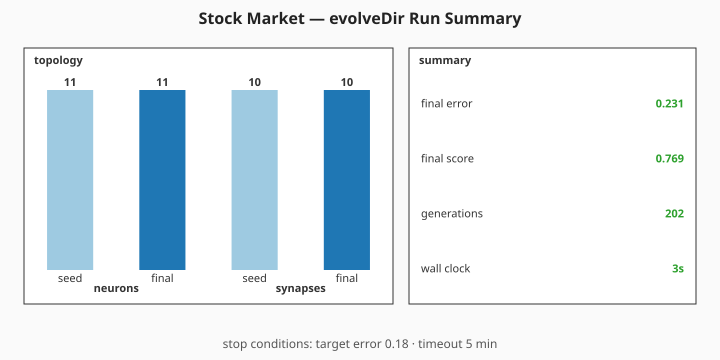

# 📈 Stock Market — Direction Prediction

> 🌱 **Generation 1 starts from random noise** — the seed is built by NEAT-AI's uniform-random
> `new Creature(WINDOW_SIZE, 1)` constructor with **no hand-crafted topology, no `hiddenLayers`
> hint, no pre-built `network.json`, and no domain-tuned narrow weight init**. Hidden neurons are
> not hand-crafted — they emerge purely from NEAT-AI's own structural mutation operators while
> `Creature.evolveDir(...)` runs.

**Acronyms.** _NEAT_ = NeuroEvolution of Augmenting Topologies. _MSE_ = Mean Squared Error. _SVG_ =
Scalable Vector Graphics. _S&P 500_ = Standard & Poor's 500-stock market index.

`stock_market.ts` evolves a NEAT-AI network from a minimal seed to predict next-period direction (up
vs. down) on the public S&P 500 monthly-close dataset. The dataset is downloaded once into
`.synthetic-stock/data/prices.csv` (with a SHA-256 digest pinned to a specific upstream commit so
runs are deterministic), the labelled training samples are written as a binary `.bin` file, and the
evolutionary loop is delegated to `Creature.evolveDir(...)`.

> ⚠️ **Teaching example only — not investment advice.**
>
> The model is a deliberately tiny NEAT controller over a window of recent returns. Real markets are
> noisy, regime-shifting, and adversarial; do not use this code to make trading decisions.


## 🔧 How It Works

```mermaid
flowchart LR
    DL["📥 fetchDataset()<br/>S&P 500 CSV (pinned)"]
    SLIDE["🪟 Sliding window<br/>last N returns"]
    SPLIT["✂️ Train / val / test<br/>chronological split"]
    BIN["📦 Binary .bin training set<br/>(window, target) records"]
    SEED["🌱 new Creature(10, 1)<br/>minimal seed — no hidden hint"]
    EVOLVE["🧪 Creature.evolveDir(dataDir, ...)<br/>forward-only, targetError=0.18,<br/>timeoutMinutes=5"]
    SUMMARY["📈 Milestone summary<br/>(from evolveDir return value)"]
    CHAMP["💾 champion.json"]
    REPLAY["🔁 Replay on test window"]
    SIG["📝 signals.json"]
    CHART["🖼️ Animated chart<br/>sweep + ▲ ▼ markers"]

    DL --> SLIDE --> SPLIT --> BIN --> EVOLVE
    SEED --> EVOLVE
    EVOLVE --> SUMMARY
    EVOLVE --> CHAMP
    CHAMP --> REPLAY --> SIG
    REPLAY --> CHART

    style DL fill:#4a90d9,stroke:#333,color:#fff
    style SLIDE fill:#f5a623,stroke:#333,color:#fff
    style SPLIT fill:#f39c12,stroke:#333,color:#fff
    style BIN fill:#7ed321,stroke:#333,color:#fff
    style SEED fill:#bd10e0,stroke:#333,color:#fff
    style EVOLVE fill:#e67e22,stroke:#333,color:#fff
    style SUMMARY fill:#50e3c2,stroke:#333,color:#fff
    style CHAMP fill:#1abc9c,stroke:#333,color:#fff
    style REPLAY fill:#9b59b6,stroke:#333,color:#fff
    style SIG fill:#16a085,stroke:#333,color:#fff
    style CHART fill:#bd10e0,stroke:#333,color:#fff
```



### Why `evolveDir` rather than per-step `activate()`?

Stock-market direction prediction is a supervised regression task — every input window has a
pre-computed label. The audit categorisation in
[#203](https://github.com/stSoftwareAU/NEAT-AI-Examples/issues/203) mandates the canonical "binary
`.bin` + `evolveDir`" path for this shape: `evolveDir` exercises NEAT-AI's full feature set
(back-propagation, structure discovery, WebAssembly (WASM) / single-instruction-multiple-data (SIMD)
/ GPU parallelism) and is orders of magnitude faster than per-call `activate()` for supervised
regression. Per-step `activate()` is reserved for interactive simulations and reinforcement-learning
agents — neither applies here.

## 📊 Dataset

| Field         | Value                                                                           |
| ------------- | ------------------------------------------------------------------------------- |
| Source        | [`datasets/s-and-p-500`](https://github.com/datasets/s-and-p-500) (public, MIT) |
| Series        | `SP500` nominal monthly close                                                   |
| Pinned commit | `45117dfc620664bda935a7dbd692f65a5beaa1cd`                                      |
| Coverage      | 1871-01 → 2026-05 (1865 monthly closes)                                         |
| Cache path    | `.synthetic-stock/data/prices.csv`                                              |
| Integrity     | SHA-256 verified by `common/data_cache.ts`                                      |
| Training set  | `.synthetic-stock/data/stock_market.bin` (binary Float32 records)               |

The dataset is monthly, so the example predicts next-**month** direction. The same code works
unchanged for daily data — swap `DATASET_URL` and `DATASET_SHA256` for a daily-close CSV and the
sliding-window logic is identical.

## 🎯 Inputs and Outputs

| Channel    | Type      | Meaning                                                   |
| ---------- | --------- | --------------------------------------------------------- |
| Input 0..N | feature   | The last `WINDOW_SIZE` (default 10) simple period returns |
| Output 0   | direction | LOGISTIC, `>= 0.5` predicts up, otherwise predicts down   |

The fitness used by `evolveDir` is `1 - MSE` against the binary `{0, 1}` direction labels — a
constant `0.5` predictor scores `1 - 0.25 = 0.75`, so anything above `0.75` reflects the network
correlating its output with realised direction.

## 🛑 Stop conditions

`evolveDir` terminates as soon as **any** of the following fires:

| Condition        | Value                              | Why                                                                                     |
| ---------------- | ---------------------------------- | --------------------------------------------------------------------------------------- |
| `targetError`    | **0.18** (well below chance ~0.25) | Forces NEAT-AI to grow hidden structure to satisfy it — chance MSE alone is not enough. |
| `timeoutMinutes` | **5** (audit-mandated backstop)    | Wall-clock safety net so a run never wedges. Audit #218 sets this as the upper bound.   |
| `maxGenerations` | **200**                            | Hard cap on the number of generations so the example fits inside `quality.sh`'s budget. |

Markets are intrinsically noisy — most runs do **not** reach `targetError = 0.18` and exit via the
generation cap. The wall-clock backstop is a final safety net; it never fires on a developer machine
because the cap is much smaller than what 5 minutes can fit.

## 🚦 Train / Validation / Test Split

The samples are split **chronologically** (never shuffled) so no future information leaks back to
earlier windows:

| Slice      | Fraction | Used for                                                 |
| ---------- | -------- | -------------------------------------------------------- |
| Train      | 70%      | Written to `.bin` file fed into `evolveDir`              |
| Validation | 15%      | Replay-based balanced-accuracy reporting (no look-ahead) |
| Test       | 15%      | Replay & SVG (held out from training)                    |

## 🚀 Running the Example

```bash
./stock_market/run.sh
```

Artefacts:

- `.synthetic-stock/data/prices.csv` — cached dataset
- `.synthetic-stock/data/stock_market.bin` — pre-generated binary training set fed to `evolveDir`
- `.synthetic-stock/creatures/champion.json` — fittest controller from the run
- `.synthetic-stock/output/signals.json` — per-day prediction vs. outcome on the test window
- `docs/screenshots/stock_market.svg` — animated chart of the test window
- `docs/screenshots/stock_market/evolution_summary.svg` — milestone summary chart sourced from
  `Creature.evolveDir`'s return value (final error/score, generations, wall-clock, seed vs final
  topology counts)

## 📈 Evolution milestone stats

The milestone summary chart below is generated **directly from the return value of
`Creature.evolveDir`**. It pairs the seed and final topology counts on the left with the numeric
callouts (final error, final score, generations, wall-clock) on the right, plus a caption listing
the configured `targetError` / `timeoutMinutes` stop conditions. No per-generation telemetry is
captured or emitted by this example any more (per issue #301; see also
[#298](https://github.com/stSoftwareAU/NEAT-AI-Examples/issues/298) for the canonical decision
record).



## 🧪 What "reasonable solution" means here

Markets are intrinsically noisy. The audit rule (#218) does not require the example to actually beat
the market — it asks for a **reasonable solution to the labelled task**. The evolved creature
captures a small directional signal beyond pure base-rate guessing; raw and balanced accuracy
numbers are written to `.synthetic-stock/output/signals.json` for every run. Real markets are
nothing like this monthly-close benchmark; the result is meaningful only inside the toy task.

## 🖼️ Reading the test-window chart

Each marker plots the controller's prediction at one bar against the realised outcome:

| Marker   | Colour  | Meaning                                 |
| -------- | ------- | --------------------------------------- |
| ▲ green  | #2ecc71 | Predicted **up**, price went **up**     |
| ▲ orange | #e67e22 | Predicted **up**, price went **down**   |
| ▼ blue   | #3498db | Predicted **down**, price went **down** |
| ▼ red    | #e74c3c | Predicted **down**, price went **up**   |

The dashed purple play-head sweeps left-to-right, letting viewers walk the test window in real time.

## 🧠 Tacit Knowledge

A few things that are not obvious from the code alone:

- **Minimal seed only.** `stock_market.ts` passes only `input` and `output` integers to NEAT-AI's
  `new Creature(input, output)` constructor. There are no `hiddenLayers`, no `nodes`, and no
  pre-built `network.json` seed — the library random-initialises the rest, with hidden structure
  emerging purely from `evolveDir`'s mutation operators.
- **Balanced accuracy, not raw accuracy.** The S&P 500 has a strong upward bias (~63% of months
  close above the previous month). Raw directional accuracy would credit a network that always
  predicts "up" with the base rate (~63%) even though it has learnt nothing. Balanced accuracy (mean
  of per-class hit rates) honestly scores any constant or coin-flip predictor at 0.5 and only rises
  above 0.5 when the network's predictions actually correlate with direction.
- **Stop conditions.** `targetError = 0.18` is the per-example reasonable floor;
  `timeoutMinutes = 5` is the audit-mandated wall-clock backstop; `maxGenerations = 200` is a hard
  generation cap so the example fits inside `quality.sh`'s budget.
- **Chronological split, no shuffling.** Shuffling samples would let a candidate "see" future
  patterns during validation — the unit tests verify the no-look-ahead property structurally.
- **Reproducibility.** The library's global RNG is reseeded via
  `setRandomNumberGenerator(createSeededRng(seed))` before each run, and `evolveDir` is given the
  same seed. With a fixed seed and the pinned dataset the run is reproducible on a single machine;
  multi-thread variance can produce small numeric drift.
- **Cumulative strategy return** in the caption assumes "go long when predicting up, sit flat when
  predicting down" — a sanity-check of the directional signal, **not** a backtest. There are no
  costs, slippage, or compounding adjustments.
- **Monthly cadence.** The teaching example uses monthly data because it is small, public, and
  digest-pinnable. A daily CSV would behave identically — the code is unaware of the cadence.

## 🧪 Tests

`stock_market_test.ts` verifies:

- The minimal seed has zero hidden neurons and a LOGISTIC output, and is deterministic for a given
  seed.
- `writeStockTrainingDataset` emits the expected number of records with one float per feature plus
  one float per label, and rejects malformed input.
- `evolveStockController` returns an `EvolveDirSummary` with finite numeric fields and is built from
  the return value of `Creature.evolveDir`.
- The milestone summary SVG renders, contains every numeric callout from the run summary, and is
  rejected when any required field is non-finite.
- The hard generation cap is honoured when `targetError` is unreachable.
- The animated chart renderer emits all four glyph categories and an SMIL animation primitive.

## 🧰 NEAT-AI Features Used

Stock Market is a supervised noise → competent demo, so the demonstrated capability is NEAT-AI's
evolutionary topology search against a price-prediction fitness signal driven by `evolveDir`.

- **Minimal NEAT seed** — `new Creature(input, output)` with no hidden hint, no pre-built
  `network.json` seed; NEAT-AI random-initialises the rest.
- **`Creature.evolveDir`** over the binary `.bin` training stream (per
  [`docs/binary_training_stream.md`](../docs/binary_training_stream.md)) — orders of magnitude
  faster than per-call `activate()`.
- **Forward-only mutation** — `evolveDir` defaults to forward-only when `feedbackLoop` is not set,
  matching the audit's stop-condition + topology contract.
- **Structural mutation** — add-neuron / add-synapse operators grow the topology from the minimal
  seed.
- **Milestone summary chart** — the run's `Creature.evolveDir` return value
  (`{ error, score, time, generation }`) plus the seed and final topology counts feed the shared
  `common/evolve_dir_summary.ts` renderer (issue
  [#284](https://github.com/stSoftwareAU/NEAT-AI-Examples/issues/284)).

Features exercised (links go to upstream
[`COMPARISON.md`](https://github.com/stSoftwareAU/NEAT-AI/blob/Develop/COMPARISON.md)):

- **[Evolutionary Topology Search](https://github.com/stSoftwareAU/NEAT-AI/blob/Develop/COMPARISON.md#what-weve-implemented)**
  — structural mutation co-evolved with weights and biases against the regression fitness signal.
- **[Genetic Operators](https://github.com/stSoftwareAU/NEAT-AI/blob/Develop/COMPARISON.md#what-weve-implemented)**
  — weight and bias mutation paired with selection pressure on training MSE.
