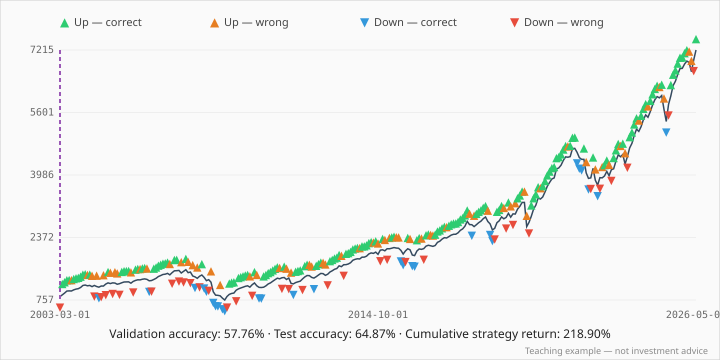
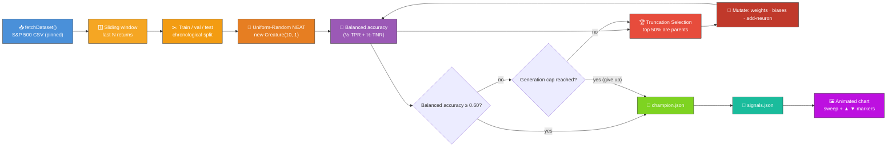
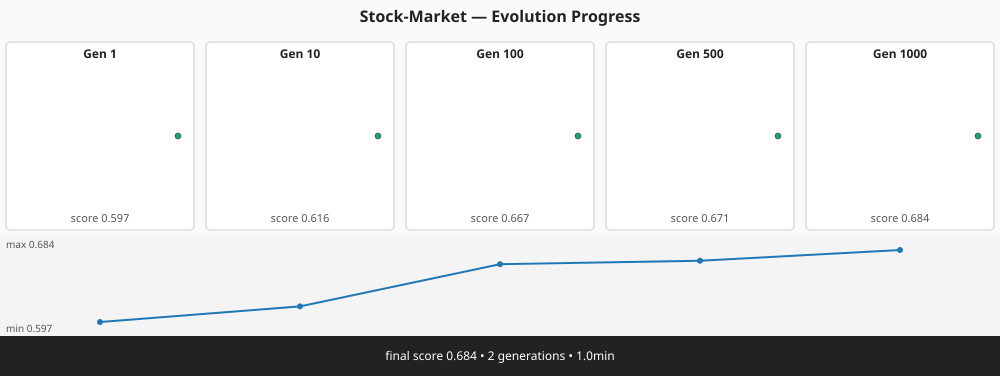
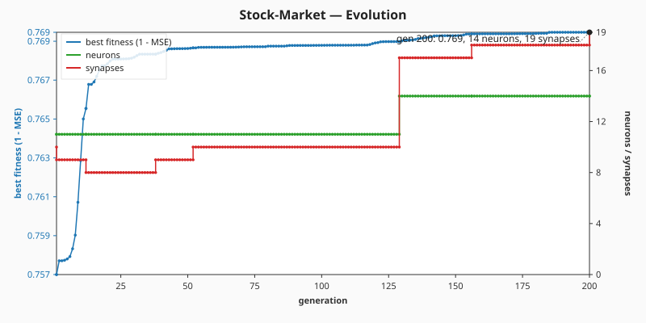

# 📈 Stock Market — Direction Prediction

> 🌱 **Generation 1 starts from random noise** — the initial population is built by NEAT-AI's
> uniform-random `Creature(WINDOW_SIZE, 1)` constructor, with **no hand-crafted topology and no
> domain-tuned narrow weight init**. Structural mutation grows hidden neurons during evolution; the
> captured milestones show the predictor climbing from population-mean chance toward a network that
> beats the chance baseline on direction.

`stock_market.ts` evolves a NEAT-AI network from uniform-random noise to predict next-period
direction (up vs. down) on the public S&P 500 monthly-close dataset. The dataset is downloaded once
into `.synthetic-stock/data/prices.csv` (with a SHA-256 digest pinned to a specific upstream commit
so runs are deterministic) and the evolutionary loop runs entirely in pure TypeScript.

> ⚠️ **Teaching example only — not investment advice.**
>
> The model is a deliberately tiny NEAT controller over a window of recent returns. Real markets are
> noisy, regime-shifting, and adversarial; do not use this code to make trading decisions.



## 🔧 How It Works



## 📊 Dataset

| Field         | Value                                                                           |
| ------------- | ------------------------------------------------------------------------------- |
| Source        | [`datasets/s-and-p-500`](https://github.com/datasets/s-and-p-500) (public, MIT) |
| Series        | `SP500` nominal monthly close                                                   |
| Pinned commit | `45117dfc620664bda935a7dbd692f65a5beaa1cd`                                      |
| Coverage      | 1871-01 → 2026-05 (1865 monthly closes)                                         |
| Cache path    | `.synthetic-stock/data/prices.csv`                                              |
| Integrity     | SHA-256 verified by `common/data_cache.ts`                                      |

The dataset is monthly, so the example predicts next-**month** direction. The same code works
unchanged for daily data — swap `DATASET_URL` and `DATASET_SHA256` for a daily-close CSV and the
sliding-window logic is identical.

## 🎯 Inputs and Outputs

| Channel    | Type      | Meaning                                                   |
| ---------- | --------- | --------------------------------------------------------- |
| Input 0..N | feature   | The last `WINDOW_SIZE` (default 10) simple period returns |
| Output 0   | direction | LOGISTIC, `>= 0.5` predicts up, otherwise predicts down   |

The score during evolution is **balanced directional accuracy** on the validation window — the mean
of the per-class hit rates (true-positive rate on "up" months, true-negative rate on "down" months).
This is the honest metric for a skewed dataset like the S&P 500: any constant predictor (say,
"always up") scores **0.5** in balanced accuracy regardless of how skewed the labels are, so the
only way to climb above 0.5 is for the network's predictions to actually correlate with direction.

The "task is solved" threshold (`SOLVED_THRESHOLD`) is set to **0.60** — comfortably above the 0.50
chance baseline yet above where the best-of-population from a uniform-random NEAT seed can reach by
luck alone. The hard generation cap (`maxGenerations`) is **1000**: evolution stops as soon as the
threshold is met or the cap is reached, whichever comes first.

## 🚦 Train / Validation / Test Split

The samples are split **chronologically** (never shuffled) so no future information leaks back to
earlier windows:

| Slice      | Fraction | Used for                                |
| ---------- | -------- | --------------------------------------- |
| Train      | 70%      | (reserved — visible to evolution)       |
| Validation | 15%      | Scoring each candidate during evolution |
| Test       | 15%      | Replay & SVG (held out from training)   |

## 🚀 Running the Example

```bash
./stock_market/run.sh
```

Artefacts:

- `.synthetic-stock/data/prices.csv` — cached dataset
- `.synthetic-stock/creatures/champion.json` — fittest controller from the run
- `.synthetic-stock/snapshots/snapshot-gen-*.json` — running-champion snapshots captured at the
  configured checkpoints
- `.synthetic-stock/output/signals.json` — per-day prediction vs. outcome on the test window
- `docs/screenshots/stock_market.svg` — animated chart of the test window
- `docs/screenshots/stock_market_evolution.svg` — multi-panel evolution-progression strip rendered
  from the captured snapshots
- `docs/screenshots/stock_market/evolution.svg` — dual-axis evolution chart plotting best balanced
  accuracy on the left and champion neuron / synapse counts on the right

## 🖼️ Reading the Chart

Each marker plots the controller's prediction at one bar against the realised outcome:

| Marker   | Colour  | Meaning                                 |
| -------- | ------- | --------------------------------------- |
| ▲ green  | #2ecc71 | Predicted **up**, price went **up**     |
| ▲ orange | #e67e22 | Predicted **up**, price went **down**   |
| ▼ blue   | #3498db | Predicted **down**, price went **down** |
| ▼ red    | #e74c3c | Predicted **down**, price went **up**   |

The dashed purple play-head sweeps left-to-right, letting viewers walk the test window in real time.

## Evolution Progress





The runner captures a snapshot of the **running champion** at each of the canonical checkpoint
generations `[1, 10, 100, 500, 1000]` (those that fall inside the configured `maxGenerations`). The
cadence is wider than the previous fixed-topology bounded-random search because variable-topology
evolution from uniform-random noise typically needs more generations to converge.

Generation 1 is the **uniform-random NEAT population** straight from `new Creature(WINDOW_SIZE, 1)`
— direct input → output connections with weights and bias drawn by the library's RNG. The
population-mean balanced accuracy at gen 1 sits in the chance band (~0.55, just above 0.50) — the
honest "noise" check, since a constant predictor would also score 0.5 in balanced accuracy. The
intermediate milestones at gens 10 / 100 / 500 show the controller shifting weights into a more
predictive region of the search space, and the final captured snapshot meets the
`SOLVED_THRESHOLD = 0.60`.

## 🧠 Tacit Knowledge

A few things that are not obvious from the code alone:

- **No hand-crafted topology, no narrow bounded weight init.** `stock_market.ts` never hand-codes
  neurons, synapses, or domain-tuned starting weights. The initial population is built with
  `createSeededPopulation({ inputCount, outputCount, ... })` which delegates to
  `new Creature(input, output)` for every member — uniform-random NEAT genomes with direct input →
  output connections. Hidden neurons appear only when the add-neuron mutation operator splits an
  existing connection during evolution.
- **Balanced accuracy, not raw accuracy.** The S&P 500 has a strong upward bias (~63% of months
  close above the previous month). Raw directional accuracy would credit a network that always
  predicts "up" with the base rate (~63%) even though it has learnt nothing. Balanced accuracy (mean
  of per-class hit rates) honestly scores any constant or coin-flip predictor at 0.5 and only rises
  above 0.5 when the network's predictions actually correlate with direction. This is what makes the
  noise → competent narrative meaningful.
- **Population-mean noise check.** As with cart-pole, the honest "gen 1 is noise" check is the
  population **mean** balanced accuracy — the best-of-population can occasionally edge above 0.5 by
  luck on a finite validation window, but the mean stays in the chance band. The unit test
  `evolveStockController generation-1 mean accuracy is near coin-flip noise` enforces this.
- **Hard generation cap.** Evolution stops at `maxGenerations` even if the threshold has not been
  reached, so a stuck run never blocks the example forever. The cap is enforced in
  `evolveStockController` and verified by the `honours the hard generation cap` test.
- **Chronological split, no shuffling.** Shuffling samples would let a candidate "see" future
  patterns during validation — the unit tests verify the no-look-ahead property structurally.
- **Reproducibility.** All randomness flows through `common/deterministic_random.ts` for mutation,
  and the library's global RNG is reseeded at the start of each evolve call via
  `setRandomNumberGenerator(createSeededRng(seed))`. With a fixed seed and the pinned dataset, the
  same champion is produced on every run.
- **Cumulative strategy return** in the caption assumes "go long when predicting up, sit flat when
  predicting down" — it's a sanity-check of the directional signal, **not** a backtest. There are no
  costs, slippage, or compounding adjustments.
- **Monthly cadence.** The teaching example uses monthly data because it is small, public, and
  digest-pinnable. A daily CSV would behave identically — the code is unaware of the cadence.
