# 📈 Stock Market — Direction Prediction

`stock_market.ts` evolves a small NEAT-AI network to predict next-period direction (up vs. down) on
the public S&P 500 monthly-close dataset. The dataset is downloaded once into
`.synthetic-stock/data/prices.csv` (with a SHA-256 digest pinned to a specific upstream commit so
runs are deterministic) and the evolutionary loop runs entirely in pure TypeScript.

> ⚠️ **Teaching example only — not investment advice.**
>
> The model is a deliberately tiny logistic classifier over a window of recent returns. Real markets
> are noisy, regime-shifting, and adversarial; do not use this code to make trading decisions.


## 🔧 How It Works

```mermaid
flowchart LR
    DL["📥 fetchDataset()<br/>S&P 500 CSV (pinned)"]
    SLIDE["🪟 Sliding window<br/>last N returns"]
    SPLIT["✂️ Train / val / test<br/>chronological split"]
    EVOLVE["🧬 Truncation + mutation"]
    SCORE["📏 Validation accuracy"]
    CHAMP["💾 champion.json"]
    SIG["📝 signals.json"]
    CHART["🖼️ Animated chart<br/>sweep + ▲ ▼ markers"]

    DL --> SLIDE --> SPLIT --> EVOLVE --> SCORE
    SCORE -- not best --> EVOLVE
    SCORE -- best --> CHAMP --> SIG --> CHART

    style DL fill:#4a90d9,stroke:#333,color:#fff
    style SLIDE fill:#f5a623,stroke:#333,color:#fff
    style SPLIT fill:#f39c12,stroke:#333,color:#fff
    style EVOLVE fill:#e74c3c,stroke:#333,color:#fff
    style SCORE fill:#9b59b6,stroke:#333,color:#fff
    style CHAMP fill:#7ed321,stroke:#333,color:#fff
    style SIG fill:#1abc9c,stroke:#333,color:#fff
    style CHART fill:#bd10e0,stroke:#333,color:#fff
```



## 📊 Dataset

| Field         | Value                                                                           |
| ------------- | ------------------------------------------------------------------------------- |
| Source        | [`datasets/s-and-p-500`](https://github.com/datasets/s-and-p-500) (public, MIT) |
| Series        | `SP500` nominal monthly close                                                   |
| Pinned commit | `45117dfc620664bda935a7dbd692f65a5beaa1cd`                                      |
| Coverage      | 1871-01 → 2026-05 (1865 monthly closes)                                         |
| Cache path    | `.synthetic-stock/data/prices.csv`                                              |
| Integrity     | SHA-256 verified by `common/data_cache.ts`                                      |

The dataset is monthly, so the example predicts next-**month** direction. The same code works
unchanged for daily data — swap `DATASET_URL` and `DATASET_SHA256` for a daily-close CSV and the
sliding-window logic is identical.

## 🎯 Inputs and Outputs

| Channel    | Type      | Meaning                                                   |
| ---------- | --------- | --------------------------------------------------------- |
| Input 0..N | feature   | The last `WINDOW_SIZE` (default 10) simple period returns |
| Output 0   | direction | LOGISTIC, `>= 0.5` predicts up, otherwise predicts down   |

The score is **directional accuracy on the validation window** — the fraction of next-period
predictions whose direction matches the realised direction. The "task is solved" floor used by the
unit tests is simply that the champion beats 50% (a fair coin).

## 🚦 Train / Validation / Test Split

The samples are split **chronologically** (never shuffled) so no future information leaks back to
earlier windows:

| Slice      | Fraction | Used for                                |
| ---------- | -------- | --------------------------------------- |
| Train      | 70%      | (reserved — visible to evolution)       |
| Validation | 15%      | Scoring each candidate during evolution |
| Test       | 15%      | Replay & SVG (held out from training)   |

## 🚀 Running the Example

```bash
./stock_market/run.sh
```

Artefacts:

- `.synthetic-stock/data/prices.csv` — cached dataset
- `.synthetic-stock/creatures/champion.json` — fittest controller from the run
- `.synthetic-stock/output/signals.json` — per-day prediction vs. outcome on the test window
- `docs/screenshots/stock_market.svg` — animated chart of the test window

## 🖼️ Reading the Chart

Each marker plots the controller's prediction at one bar against the realised outcome:

| Marker   | Colour  | Meaning                                 |
| -------- | ------- | --------------------------------------- |
| ▲ green  | #2ecc71 | Predicted **up**, price went **up**     |
| ▲ orange | #e67e22 | Predicted **up**, price went **down**   |
| ▼ blue   | #3498db | Predicted **down**, price went **down** |
| ▼ red    | #e74c3c | Predicted **down**, price went **up**   |

The dashed purple play-head sweeps left-to-right, letting viewers walk the test window in real time.

## 🧠 Tacit Knowledge

A few things that are not obvious from the code alone:

- **Linear is enough.** A logistic classifier over 10 prior returns is sufficient capacity for the
  task to be slightly better than a coin. The example uses a `WINDOW_SIZE`-input, one-output network
  with no hidden neurons.
- **Chronological split, no shuffling.** Shuffling samples would let a candidate "see" future
  patterns during validation — the unit tests verify the no-look-ahead property structurally.
- **Reproducibility.** All randomness flows through `common/deterministic_random.ts`. With a fixed
  seed and the pinned dataset, the same champion is produced on every run.
- **Cumulative strategy return** in the caption assumes "go long when predicting up, sit flat when
  predicting down" — it's a sanity-check of the directional signal, **not** a backtest. There are no
  costs, slippage, or compounding adjustments.
- **Monthly cadence.** The teaching example uses monthly data because it is small, public, and
  digest-pinnable. A daily CSV would behave identically — the code is unaware of the cadence.
