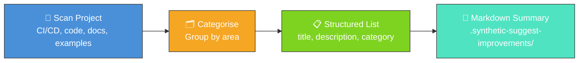

# 💡 Suggest Improvements — Project Analyser

**Acronym.** _NEAT_ = NeuroEvolution of Augmenting Topologies (the algorithm whose example
repository this script analyses).

`suggest_improvements.ts` analyses the NEAT-AI-Examples project structure and produces actionable
improvement suggestions. These suggestions can be filed as GitHub issues using the `gh` CLI.

## 🔧 How It Works



1. Scans the project for common improvement opportunities
2. Categorises suggestions (CI/CD, code quality, documentation, new examples)
3. Produces a structured list with titles, descriptions, and categories
4. Optionally writes a markdown summary to `.synthetic-suggest-improvements/`

## 🚀 Running the Example

```bash
./suggest_improvements/run.sh
```

The output lists each improvement suggestion with its category and description. To file the
suggestions as GitHub issues, use the `gh` CLI:

```bash
gh issue create --title "Improvement title" --label "enhancement" --body "Description"
```

## 🧰 NEAT-AI Features Used

This is a static-analysis utility — it does not invoke evolution itself. Instead, it reads the
project's current example state and surfaces opportunities to wire in additional NEAT-AI
capabilities.

Features exercised (links go to upstream
[`COMPARISON.md`](https://github.com/stSoftwareAU/NEAT-AI/blob/Develop/COMPARISON.md)):

- **[Cross-References Upstream Feature List](https://github.com/stSoftwareAU/NEAT-AI/blob/Develop/COMPARISON.md#what-weve-implemented)**
  — the suggestions point readers at upstream NEAT-AI features (memetic evolution, Markov chain
  Monte Carlo (MCMC) mutation acceptance, Discovery, synthetic synapse, etc.) that are not yet
  exercised by an example here.
