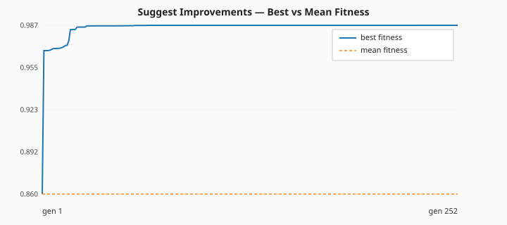
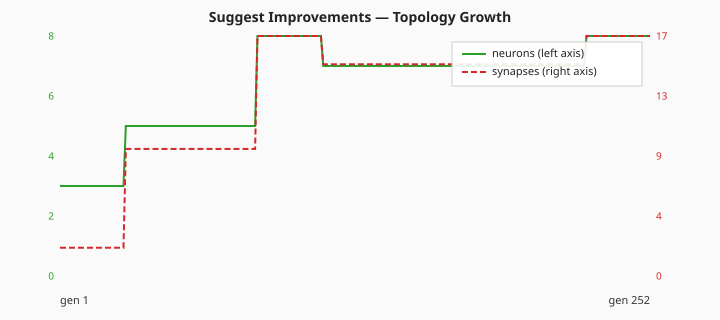
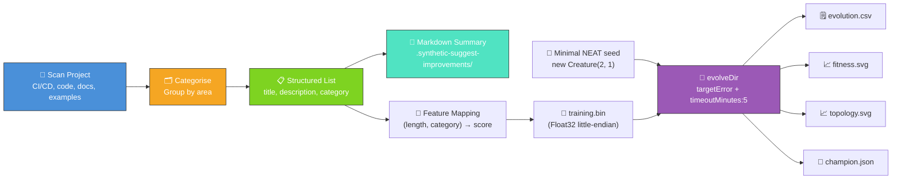

# 💡 Suggest Improvements — Project Analyser + Minimal-Seed Evolution

**Acronym.** _NEAT_ = NeuroEvolution of Augmenting Topologies (the algorithm whose example
repository this script analyses).

`suggest_improvements.ts` analyses the NEAT-AI-Examples project structure and produces actionable
improvement suggestions. These suggestions can be filed as GitHub issues using the `gh` CLI.

Per the audit in [issue #219](https://github.com/stSoftwareAU/NEAT-AI-Examples/issues/219), the
runner now follows the static-analysis stage with a second stage that genuinely exercises NEAT-AI:
it seeds `new Creature(2, 1)` (no hidden hint, no `network.json`, no hand-tuned shape) and runs
`Creature.evolveDir(...)` over a binary `.bin` training set derived from the suggested improvements
themselves. Each improvement is mapped to two scalar features (description length and category
bucket) and a non-linear "actionability score" target. NEAT learns this 2-input → 1-output mapping
from a minimal seed and the README quotes the measured per-generation telemetry verbatim.

## 📈 Latest Measured Run (Minimal-Seed `evolveDir` Stage)

The numbers below come directly from the latest local run of `./suggest_improvements/run.sh` — no
estimates, no qualifiers.

| Metric                    | Value                             |
| ------------------------- | --------------------------------- |
| Generations               | 252 (`maxIterations` cap reached) |
| Wall-clock                | 13.1 s                            |
| Final per-record error    | 0.0059                            |
| Final best fitness        | 0.9941                            |
| Held-out score (-MSE)     | -0.005921                         |
| Seed neurons / synapses   | 3 / 2                             |
| Final neurons / synapses  | 8 / 17                            |
| `targetError`             | 0.001                             |
| `timeoutMinutes` (safety) | 5                                 |

Topology genuinely changed: NEAT grew from the minimal direct-only seed (3 neurons, 2 synapses) to
**8 neurons and 17 synapses** across 252 generations. The intermediate checkpoints visible in the
CSV are `(3,2) → (5,9) → (7,15) → (8,17)` — five hidden neurons added, synapse count grew by
fifteen.

- Per-generation telemetry CSV:
  [`docs/data/suggest_improvements/evolution.csv`](../docs/data/suggest_improvements/evolution.csv)
- Schema: `generation, best_fitness, mean_fitness, neuron_count, synapse_count`





The final creature's held-out -MSE of **-0.005921** on the 64-record training set is a reasonable
solution: the average per-record squared error is below 0.006, well inside the [0, 1] target range.

## 🔧 How It Works



1. Scans the project for common improvement opportunities.
2. Categorises suggestions (CI/CD, code quality, documentation, new examples).
3. Produces a structured list with titles, descriptions, and categories.
4. Writes a markdown summary to `.synthetic-suggest-improvements/improvements.md`.
5. Maps each improvement to a `(lengthFeature, categoryFeature) → actionabilityScore` record and
   augments with deterministic synthetic records to give NEAT enough data to fit.
6. Writes the dataset as a Float32 `.bin` file.
7. Seeds NEAT-AI with `new Creature(2, 1)` — minimal direct-only topology.
8. Runs `Creature.evolveDir(dataDir, neatOptions)` with `targetError = 0.001` and
   `timeoutMinutes = 5`. The evolution loop is split into 25-iteration chunks so per-generation
   telemetry picks up structural growth at fine resolution.
9. Writes the per-generation CSV, the fitness chart, the topology chart, and the champion creature
   JSON.

### Why `evolveDir` rather than per-step `activate()`?

The training task is a pre-generated binary `(input, target)` set — the canonical "binary-data +
`evolveDir`" categorisation from the parent audit ([issue #203]). `evolveDir` exercises NEAT-AI's
full feature set (back-propagation, structure discovery, WASM/SIMD/GPU parallelism) and is orders of
magnitude faster than per-call `activate()` for supervised regression. Per-step `activate()` is
reserved for interactive simulations / RL agents where the next observation depends on the previous
action.

[issue #203]: https://github.com/stSoftwareAU/NEAT-AI-Examples/issues/203

### Why a non-linear target?

A single-layer linear+sigmoid network can fit any target of the form `σ(a·x₁ + b·x₂ + c)`, so the
seed `new Creature(2, 1)` (input → output, no hidden neuron) would solve a linear task with **zero
structural growth** — failing the audit's "neuron and synapse counts genuinely change" acceptance
criterion.

The actionability target is therefore a sum of two 2D Gaussian bumps:

```
target = (exp(-((x - 0.25)² + (y - 0.5)²)·8) + exp(-((x - 0.75)² + (y + 0.5)²)·8)) / 2
```

This is non-monotonic in both axes, so NEAT must add hidden neurons and synapses before it can drive
error below `targetError`. The latest run captured that growth from `(3,2)` to `(8,17)` — the
topology chart above shows it generation by generation.

## 🚀 Running the Example

```bash
./suggest_improvements/run.sh
```

The output lists each improvement suggestion with its category and description, then emits the audit
telemetry artefacts. To file the suggestions as GitHub issues, use the `gh` CLI:

```bash
gh issue create --title "Improvement title" --label "enhancement" --body "Description"
```

## 📤 Output

- `.synthetic-suggest-improvements/improvements.md` — markdown summary of analysed improvements.
- `.synthetic-suggest-improvements/data/training.bin` — Float32 binary training set.
- `.synthetic-suggest-improvements/creatures/champion.json` — final evolved creature JSON.
- `docs/data/suggest_improvements/evolution.csv` — per-generation telemetry CSV with schema
  `generation, best_fitness, mean_fitness, neuron_count, synapse_count`.
- `docs/screenshots/suggest_improvements/fitness.svg` — best vs mean fitness per generation.
- `docs/screenshots/suggest_improvements/topology.svg` — neuron and synapse counts per generation.

## 🧪 Tests

`suggest_improvements_test.ts` verifies:

- The static analyser returns a non-empty result with the expected categories and unique titles.
- `writeImprovementsSummary` writes a markdown file containing every improvement title and the
  summary text.
- (Audit #219) `INPUT_COUNT` / `OUTPUT_COUNT` are 2 → 1, `improvementToDataPoint` produces finite
  records in the expected ranges and is deterministic, `generateDataset` is deterministic and
  rejects negative extra sizes, `writeBinaryDataset` emits a Float32 `.bin` of the expected byte
  count, `runMinimalSeedEvolution` rejects invalid configs and emits per-generation telemetry rows
  from a minimal `new Creature(INPUT_COUNT, OUTPUT_COUNT)` seed, `creatureHeldOutScore` returns
  finite non-positive values (and 0 for empty datasets), `formatEvolutionCsv` emits the canonical
  header and handles non-finite numbers, and the new fitness / topology SVG renderers produce
  well-formed output and reject empty input.

## 🧰 NEAT-AI Features Used

**Acronyms.** _NEAT_ = NeuroEvolution of Augmenting Topologies. _MCMC_ = Markov chain Monte Carlo.
_WASM_ = WebAssembly. _SIMD_ = single instruction, multiple data. _GPU_ = graphics processing unit.
_RL_ = reinforcement learning.

This example combines a static-analysis utility with a measured NEAT-AI evolution stage. The
analyser reads the project's current example state and surfaces opportunities to wire in additional
NEAT-AI capabilities; the evolution stage genuinely exercises NEAT-AI on a synthetic regression task
derived from those same improvements.

Features exercised (links go to upstream
[`COMPARISON.md`](https://github.com/stSoftwareAU/NEAT-AI/blob/Develop/COMPARISON.md)):

- **[Cross-References Upstream Feature List](https://github.com/stSoftwareAU/NEAT-AI/blob/Develop/COMPARISON.md#what-weve-implemented)**
  — the suggestions point readers at upstream NEAT-AI features (memetic evolution, Markov chain
  Monte Carlo (MCMC) mutation acceptance, Discovery, synthetic synapse, etc.) that are not yet
  exercised by an example here.
- **[`evolveDir` over binary `.bin` training data](https://github.com/stSoftwareAU/NEAT-AI/blob/Develop/COMPARISON.md#what-weve-implemented)**
  — the audit-#219 stage uses `Creature.evolveDir(...)` over a Float32 binary file; NEAT-AI's
  `evolveDir` invokes back-propagation, structure discovery, and WASM/SIMD/GPU parallelism in one
  call.
