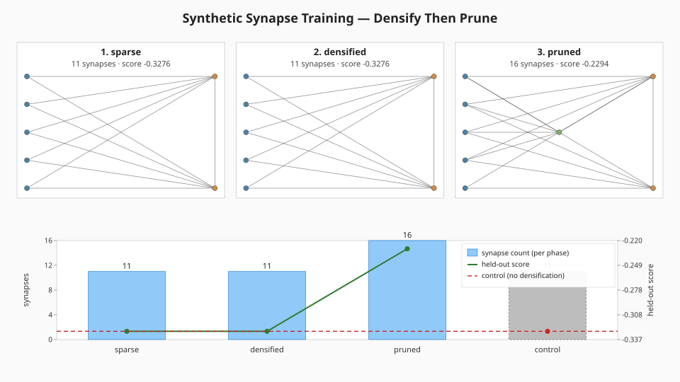
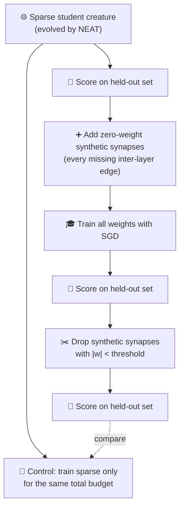

# 🧬 Synthetic Synapse Training — Densify Then Prune

**Acronyms.** _NEAT_ = NeuroEvolution of Augmenting Topologies. _SGD_ = stochastic gradient descent
(backpropagation that updates weights from a small mini-batch each step). _WASM_ = WebAssembly (the
sandboxed binary instruction format NEAT-AI uses to run activation functions natively in the browser
or Deno).

`synthetic_synapse_example.ts` demonstrates one of NEAT-AI's most distinctive techniques for keeping
large creatures trainable: **synthetic-synapse training**. The example temporarily densifies the
inter-layer connectivity of an evolved sparse creature, trains every weight (existing and synthetic)
together, and then prunes the synthetic synapses whose magnitude stayed close to zero — leaving a
sparse, deployable creature that has been refined as if it were dense.



## 🚀 How to Run

```bash
./synthetic_synapse/run.sh
```

The runner prints per-phase statistics and writes the topology / bar-chart SVG to
`.synthetic-synapse/output/synthetic_synapse.svg`. The whole run completes in well under two minutes
on a developer machine — typically a few hundred milliseconds.

## 🧠 Why does NEAT-AI need this?

Vanilla NEAT struggles at scale because evolutionary search is unlikely to stumble on every useful
inter-layer edge once a network grows wide. Backprop, by contrast, can fit any topology you give it
— but it cannot fit edges that do not exist. Synthetic-synapse training closes the loop: NEAT finds
the topology, backprop fills in the missing edges, then pruning removes the ones backprop decided
were not useful.

| Aspect              | Pure NEAT                                    | Synthetic-synapse training                                |
| ------------------- | -------------------------------------------- | --------------------------------------------------------- |
| Inter-layer edges   | Only those evolution discovered              | Every adjacent-layer pair, then pruned by gradient signal |
| Cost at deployment  | Whatever evolution produced                  | Same — synthetic edges are removed before deployment      |
| Cost while training | Sparse — fast forward pass, slow convergence | Dense temporarily — slower forward pass, faster fitting   |
| Failure mode        | Backprop bottlenecks at missing edges        | Pruned creature is at most as expressive as the dense one |

## 🔧 How It Works



### The synthetic task

The "student" is a sparse creature produced by `buildLargeCreature` (issue #83) using small default
sizes (4 inputs, 12 hidden, 2 outputs, density 0.18 — about 26 synapses). The "target" is a
fully-connected creature with the same shape and a different seed — the held-out dataset is
generated by feeding random inputs through the target so the truth function is reachable in
principle by a fully connected network of this size.

### Phases

1. **sparse** — train only the existing edges using analytical-gradient SGD. Record synapse count
   and held-out score.
2. **densified** — add every missing `input → hidden` and `hidden → output` edge as a zero-weight
   synthetic synapse, then keep training. Synthetic edges start at zero so the network's behaviour
   is unchanged at insertion time; only their gradients are non-zero, so the optimiser can move them
   if doing so reduces the loss.
3. **pruned** — drop every synthetic synapse whose absolute weight stayed below `pruneThreshold`.
   Original (non-synthetic) edges are kept regardless. The remaining synapses are the ones the
   gradient said were useful.

### Matched-budget control

A separate run trains the original sparse creature for `sparseEpochs + densifiedEpochs` SGD steps —
the same total compute budget — without densifying or pruning. The pruned creature's held-out score
must be at least as good as the control's; otherwise the synthetic-synapse path would have wasted
training budget for nothing.

### Why analytical SGD instead of NEAT-AI's training pipeline?

NEAT-AI's production training pipeline (`creature.evolveDir`, `TrainingSetup`) expects binary data
files on disk and runs through WASM, which is overkill for a self-contained two-minute demo. The
example instead implements straight feed-forward backprop directly on the synapse array — same
mathematics, no I/O, byte-deterministic for a given seed. The point of the demo is to show the
**topology effect** (sparse → dense → pruned), not to benchmark NEAT-AI's training internals.

## 📤 Output

- `docs/screenshots/synthetic_synapse.svg` — three topology panels (one per phase) plus a bar chart
  of synapse count per phase with the held-out score overlaid as a line. The matched-budget control
  appears as a dashed reference line and a hatched bar. A mirror copy is also written to
  `.synthetic-synapse/output/synthetic_synapse.svg`.

## 🧪 Tests

`synthetic_synapse_example_test.ts` verifies:

- The forward pass returns finite outputs of the correct shape and rejects mismatched input length.
- The synthetic dataset is deterministic for a given seed.
- A few epochs of SGD measurably improves the held-out score.
- `densify` adds zero-weight synthetic synapses without changing the forward output, and is
  idempotent if called twice.
- `prune` removes synthetic synapses below the threshold while leaving every original synapse
  intact, even when their weight has drifted below the threshold.
- The end-to-end run produces three phases in the right order with `densified > sparse` and
  `pruned < densified` synapse counts, and the pruned held-out score does not regress versus the
  matched-budget control.
- The whole run is byte-deterministic for the same config.
- The rendered SVG is well-formed, embeds all three phase labels, and addresses original vs.
  synthetic synapses through their own CSS classes.
