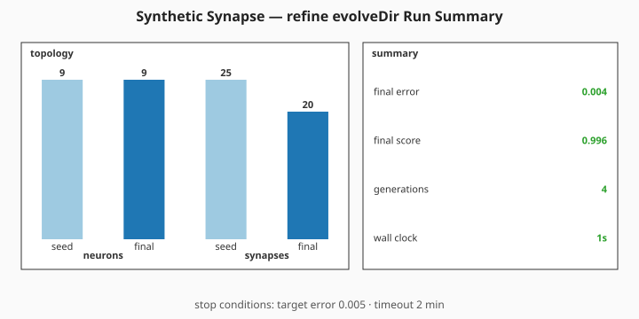
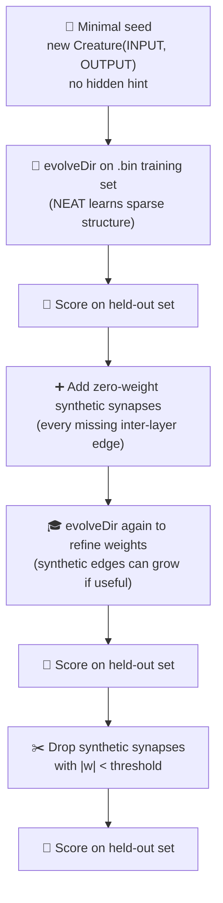

# 🧬 Synthetic Synapse Training — Densify Then Prune

**Acronyms.** _NEAT_ = NeuroEvolution of Augmenting Topologies. _SGD_ = stochastic gradient descent
(backpropagation that updates weights from a small mini-batch each step). _WASM_ = WebAssembly (the
sandboxed binary instruction format NEAT-AI uses to run activation functions natively in the browser
or Deno). _CSV_ = comma-separated values.

`synthetic_synapse_example.ts` demonstrates one of NEAT-AI's most distinctive techniques for keeping
large creatures trainable: **synthetic-synapse training**. The example temporarily densifies the
inter-layer connectivity of an evolved sparse creature, refines every weight (existing and
synthetic) together, and then prunes the synthetic synapses whose magnitude stayed close to zero —
leaving a sparse, deployable creature that has been refined as if it were dense.

Per the audit in [issue #206](https://github.com/stSoftwareAU/NEAT-AI-Examples/issues/206), the seed
passed to NEAT-AI is **minimal** — only `new Creature(INPUT_COUNT, OUTPUT_COUNT)` with no
hidden-layer hint, no pre-built `network.json`, no hand-tuned topology. NEAT-AI random-initialises
the rest, and `Creature.evolveDir(...)` over a binary `.bin` training set learns the structure.
Under telemetry rewire [issue #303](https://github.com/stSoftwareAU/NEAT-AI-Examples/issues/303) the
per-generation `onTrainingEvent` hook was removed; both `evolveDir` phases now return milestone
summaries from their return values (the canonical milestone-only telemetry surface — see #298).


The headline topology before/after panel above is unchanged in shape. Its held-out score callouts
are now sourced from the milestone summary path below.



## 🚀 How to Run

```bash
./synthetic_synapse/run.sh
```

The runner prints per-phase statistics, writes the topology / bar-chart SVG to
`docs/screenshots/synthetic_synapse.svg`, and writes the refine-phase milestone summary SVG to
`docs/screenshots/synthetic_synapse/evolution_summary.svg`.

## 🧠 Why does NEAT-AI need this?

Textbook NEAT (Stanley & Miikkulainen 2002) struggles at scale because evolutionary search is
unlikely to stumble on every useful inter-layer edge once a network grows wide. Backprop, by
contrast, can fit any topology you give it — but it cannot fit edges that do not exist.
Synthetic-synapse training closes the loop: NEAT finds the topology, weight optimisation fills in
the missing edges, then pruning removes the ones the gradient signal decided were not useful.

> **NEAT-AI is not textbook NEAT.** The "evolution-cannot-find-every-useful-edge" failure mode is
> recognised, and synthetic-synapse training is only one of several NEAT-AI techniques aimed at it.
> Other mitigations shipped in NEAT-AI — each linked to its description in upstream
> [`COMPARISON.md`](https://github.com/stSoftwareAU/NEAT-AI/blob/Develop/COMPARISON.md) — include:
>
> - **[GPU-accelerated Discovery](https://github.com/stSoftwareAU/NEAT-AI/blob/Develop/COMPARISON.md#2--error-guided-structural-evolution)**
>   — error-guided structural mutation that targets saturated, dead, dormant, or bottleneck neurons
>   instead of relying on lucky random edge insertions, with cached candidates
>   ([`COMPARISON.md` feature 8](https://github.com/stSoftwareAU/NEAT-AI/blob/Develop/COMPARISON.md#8--discovery-caching-and-disk-space-management))
>   so the GPU search amortises across generations.
> - **[Memetic evolution](https://github.com/stSoftwareAU/NEAT-AI/blob/Develop/COMPARISON.md#1--memetic-evolution-hybrid-evolution--backpropagation)**
>   — hybrid evolution + backpropagation that lets every generation refine its weights with gradient
>   descent rather than waiting for evolution alone to find them.
> - **[MCMC mutation acceptance](https://github.com/stSoftwareAU/NEAT-AI/blob/Develop/COMPARISON.md#9--mcmc-mutation-acceptance)**
>   — Markov chain Monte Carlo (MCMC) Metropolis-Hastings acceptance keeps occasional structural
>   worsening so the population can escape local optima that pure greedy NEAT gets stuck on.
> - **[Adaptive mutation policy](https://github.com/stSoftwareAU/NEAT-AI/blob/Develop/COMPARISON.md#what-weve-implemented)**
>   — hyperparameter self-adaptation rebalances structural-vs-weight mutation rates per generation
>   based on how the population is actually progressing.
> - **[Advanced breeding strategies](https://github.com/stSoftwareAU/NEAT-AI/blob/Develop/COMPARISON.md#10--advanced-breeding-strategies)**
>   — historical-marking-aware crossover combines useful sub-structures from different parents
>   instead of relying on a single line of descent.
> - **[Synthetic Synapse Training](https://github.com/stSoftwareAU/NEAT-AI/blob/Develop/COMPARISON.md#12--synthetic-synapse-training)**
>   — the densify-train-prune technique this example demonstrates.

| Aspect              | Textbook NEAT                                | Synthetic-synapse training                                |
| ------------------- | -------------------------------------------- | --------------------------------------------------------- |
| Inter-layer edges   | Only those evolution discovered              | Every adjacent-layer pair, then pruned by gradient signal |
| Cost at deployment  | Whatever evolution produced                  | Same — synthetic edges are removed before deployment      |
| Cost while training | Sparse — fast forward pass, slow convergence | Dense temporarily — slower forward pass, faster fitting   |
| Failure mode        | Backprop bottlenecks at missing edges        | Pruned creature is at most as expressive as the dense one |

## 🔧 How It Works



### The synthetic task

The "ground truth" is a small fully-connected target network the demo synthesises deterministically
(reusing `buildLargeCreature` with density 1.0). The held-out dataset is generated by feeding random
inputs through the target so the truth function is reachable in principle by an evolved network of
this scale.

The student creature passed to NEAT-AI is built from `new Creature(INPUT_COUNT, OUTPUT_COUNT)`
**only**. NEAT random-initialises the rest of the structure: every hidden neuron and every
inter-layer synapse the final creature owns is discovered during evolution.

### Phases

1. **sparse** — `Creature.evolveDir(...)` runs over the binary `.bin` training set from the minimal
   seed until either `targetError` is met or `timeoutMinutes` elapses. NEAT mutates structure as it
   sees fit; the resulting champion is the "evolved sparse" creature.
2. **densified** — every missing `input → hidden`, `hidden → output`, and `input → output` edge is
   added as a zero-weight synthetic synapse. Synthetic edges start at zero so the creature's
   behaviour is unchanged at insertion time; only their gradients are non-zero, so the next phase's
   weight optimisation can move them if doing so reduces the loss.
3. **refined** — `Creature.evolveDir(...)` runs again with the same stop conditions on the densified
   creature. NEAT-AI's training pipeline tunes the weights (memetic evolution + Discovery), and any
   synthetic synapse the gradient signal finds useful migrates away from zero.
4. **pruned** — every synthetic synapse whose absolute weight stayed below `pruneThreshold` is
   removed. Original (non-synthetic) edges are kept regardless. The remaining synapses are the ones
   the gradient said were useful.

### Stop conditions

Each evolveDir phase stops when **either** `targetError` is reached **or** the `timeoutMinutes`
backstop expires. Issue #206 originally capped the run at 5 wall-clock minutes; issue #389
(Refresh-2026-05) lifted the backstop to 20 wall-clock minutes (= the original 5 + an additional 15
minutes mandated by parent milestone #369) so the runner can actually consume the extra evolution
budget on newer NEAT-AI builds. `maxIterationsPerPhase` was lifted from 250 to 10 000 alongside so
wall-clock remains the genuine limiter. The example's defaults are `targetError: 0.005` and
`timeoutMinutes: 20` — the per-phase wall-clock budget is half this so the two-phase total respects
the safety net. `targetError` was tightened from 0.005 to 0.0005 under issue #389 alongside the
budget bump so the sparse phase doesn't converge in seconds and leave the densify-train-prune cycle
nothing to do.

## 📊 Milestone Telemetry

Each `evolveDir` phase's return value is captured as an `EvolveDirSummary` and exposed on the demo's
result (`sparseSummary`, `refineSummary`). The headline summary panel quotes:

- `finalError` / `finalScore` reached by NEAT-AI in the refine phase.
- `generations` completed across the phase.
- `wallClockMs` — total time the refine `evolveDir` call took.
- `seedNeurons`/`seedSynapses` vs `finalNeurons`/`finalSynapses` — the bar pair on the topology side
  of the milestone SVG.

Held-out score callouts on the three-panel topology chart (sparse / densified / pruned) are computed
locally against the held-out dataset and surfaced alongside the milestone summary so the
densify-train-prune narrative remains visible at a glance.

## 📤 Output

- `docs/screenshots/synthetic_synapse.svg` — three topology panels (one per phase) plus a bar chart
  of synapse count per phase with the held-out score overlaid as a line. A mirror copy is also
  written to `.synthetic-synapse/output/synthetic_synapse.svg`.
- `docs/screenshots/synthetic_synapse/evolution_summary.svg` — refine-phase milestone summary SVG
  sourced from the `evolveDir` return value.
- `.synthetic-synapse/creatures/champion.json` — the final pruned champion creature.

## 🧪 Tests

`synthetic_synapse_example_test.ts` verifies:

- The forward pass returns finite outputs of the correct shape and rejects mismatched input length.
- The synthetic dataset is deterministic for a given seed.
- `writeBinaryDataset` emits a Float32 `.bin` of the expected size.
- `densifyCreature` adds a zero-weight synthetic synapse for every missing forward edge and is
  idempotent on a second call.
- `pruneCreature` removes only synthetic synapses below the threshold and rejects negative
  thresholds.
- The end-to-end `runSyntheticSynapseDemo` produces three phases in the right order with
  `densified >= sparse` synapse counts and a finite held-out score per phase.
- `runSyntheticSynapseDemo` returns milestone summaries from both `evolveDir` phases — seed counts
  match the minimal `new Creature(INPUT_COUNT, OUTPUT_COUNT)`, and `refineSummary.finalSynapses` is
  at least `sparseSummary.finalSynapses` (densification only adds).
- `renderSyntheticSynapseSVG` is well-formed, embeds all three phase labels, and rejects malformed
  phase ordering.
- `renderEvolveDirSummarySvg` renders the refine-phase milestone summary derived from
  `runSyntheticSynapseDemo`, carrying the four callout labels and the topology counts.

## 🧰 NEAT-AI Features Used

Synthetic Synapse Training is a NEAT-AI extension: densify-train-prune on an evolved sparse
creature.

Features exercised (links go to upstream
[`COMPARISON.md`](https://github.com/stSoftwareAU/NEAT-AI/blob/Develop/COMPARISON.md)):

- **[Synthetic Synapse Training](https://github.com/stSoftwareAU/NEAT-AI/blob/Develop/COMPARISON.md#12--synthetic-synapse-training)**
  — densify-train-prune step on an evolved sparse creature — the central technique this example
  demonstrates.
- **[Backpropagation](https://github.com/stSoftwareAU/NEAT-AI/blob/Develop/COMPARISON.md#what-weve-implemented)**
  — gradient-based weight tuning runs on the densified topology before pruning — concrete proof that
  NEAT-AI is **not** evolution-only.
- **[Neuron Pruning](https://github.com/stSoftwareAU/NEAT-AI/blob/Develop/COMPARISON.md#what-weve-implemented)**
  — the final pass removes the synthetic synapses that did not pull weight, keeping the creature
  sparse.
- **Milestone-only telemetry** — both phases' `EvolveDirSummary` records are captured from
  `evolveDir`'s return value; no per-generation hook is used (#303).
