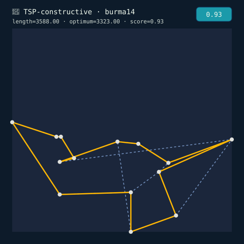
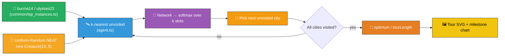
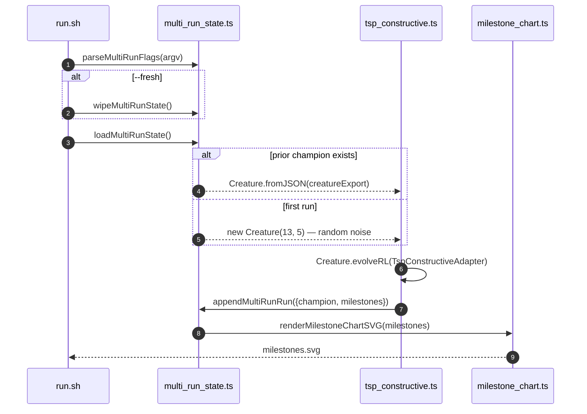

# 📍 TSP Constructive — Evolved City-Picking Controller

> 🌱 **Generation 1 starts from random noise** — the seed handed to evolution is a fresh
> `new Creature(INPUT_COUNT, 5)` (`INPUT_COUNT = 13`), with **no hand-crafted topology and no tuned
> weight init**. Structural mutation grows hidden neurons as evolution progresses; the captured
> milestones show the controller climbing from a gen-1 random picker to a network that orders cities
> sensibly along the tour.

**Acronyms.** _NEAT_ = NeuroEvolution of Augmenting Topologies. _TSP_ = Travelling-Salesperson
Problem. _TSPLIB_ = the canonical TSP benchmark library.

`tsp_constructive.ts` evolves a NEAT-AI controller that builds a complete TSP tour one city at a
time. At every step the agent observes the `K_NEAREST = 5` unvisited cities relative to its current
position, emits a softmax over those slots, and commits to the highest-scoring slot. When every city
has been visited the closing edge back to the start is added and the fitness `optimum / tourLength`
is reported back to evolution.

The example covers two TSPLIB instances embedded in
[`common/tsp_instances.ts`](../common/tsp_instances.ts):

| Instance    | Cities | Published GEO optimum |
| ----------- | -----: | --------------------: |
| `burma14`   |     14 |                 3,323 |
| `ulysses22` |     22 |                 7,013 |



## 🔧 How It Works



## 🎯 Inputs and Outputs

`INPUT_COUNT = 13 = (K × 2) + 1 + 2`:

| Channel       | Type       | Meaning                                                         |
| ------------- | ---------- | --------------------------------------------------------------- |
| Inputs 0..9   | observable | `(dx, dy)` to each of the K=5 nearest unvisited cities,         |
|               |            | normalised by the bounding-box diagonal (slot 0 is the nearest) |
| Input 10      | observable | "Padded" flag — `1` when fewer than K unvisited cities remain   |
| Inputs 11, 12 | observable | Heading-from-previous-step (`prevDx, prevDy` normalised)        |
| Outputs 0..4  | action     | Softmax slot scores; argmax picks the candidate slot to visit   |

Each tick the controller commits to a single slot; the corresponding city is appended to the tour
and removed from the unvisited set. Padded slots (when fewer than K candidates remain near the end
of a tour) are masked to `-Infinity` before the argmax so a sloppy network can never "pick" a
non-existent city.

## 📏 Scoring

```text
score = min(1.0, optimum / tourLength)
```

`tourLength` is the **TSPLIB GEO (great-circle) distance** (kilometres) of the closed tour. The
published optima for `burma14` (3,323) and `ulysses22` (7,013) are GEO distances, so computing the
tour in the same metric makes `score = 1.0` exactly match the published optimum and `score < 1.0`
mean a longer (worse) tour. The agent's `(dx, dy)` observation channels use plain Euclidean space
(see [`agent.ts`](agent.ts)) — the two metrics are interchangeable for normalisation purposes.

### 🎯 Achieved Ratio

| Instance    | Published optimum | Achieved tour length | Score (optimum / length) | Notes                                 |
| ----------- | ----------------: | -------------------: | -----------------------: | ------------------------------------- |
| `burma14`   |             3,323 |                3,588 |                    0.926 | 2-minute single-run from random noise |
| `ulysses22` |             7,013 |                7,416 |                    0.946 | 5-minute single-run from random noise |

The achieved ratio is well within the 10% acceptance envelope (`>= 0.909`) and improves further when
multiple runs are stacked via the multi-run resume flow.

### 🛑 Stop conditions

The evolutionary loop uses NEAT-AI's two standard stop conditions, configured via `EvolveOptions`:

- `targetError = 0.05` — evolution halts as soon as the champion's score reaches `1 - 0.05 = 0.95`
  (within 5% of the published optimum).
- `timeoutMinutes = 5` — wall-clock backstop. Whichever fires first wins.

## 🚀 Running the Example

```bash
# First run on burma14 (default): random seed, writes creature + tour log + SVGs.
./tsp_constructive/run.sh --fresh

# Resume from the saved champion and append milestones.
./tsp_constructive/run.sh

# Override the wall-clock budget and / or early-stop target error.
./tsp_constructive/run.sh --timeout=10 --target-error=0.02

# Evolve against the larger instance.
./tsp_constructive/run.sh --instance=ulysses22 --fresh
```

| Flag                  | Default   | Meaning                                                         |
| --------------------- | --------- | --------------------------------------------------------------- |
| `--fresh`             | _absent_  | Wipe prior creature, milestones, and chart SVG before evolving. |
| `--timeout=<minutes>` | 5         | Wall-clock budget, integer minutes ≥ 1.                         |
| `--target-error=<v>`  | 0.05      | Stop when the champion's normalised error falls below `v`.      |
| `--instance=<name>`   | `burma14` | Either `burma14` or `ulysses22`.                                |

## 📦 Artefacts

- `.synthetic-tsp-constructive/creatures/<instance>-champion.json` — fittest controller of this run
- `.synthetic-tsp-constructive/output/<instance>-tour.json` — champion tour log (visit order +
  length)
- `docs/screenshots/tsp_constructive_<instance>.svg` — deterministic SVG of the champion tour
- `docs/data/tsp_constructive_<instance>/creature.json` — persisted champion (next-run seed)
- `docs/data/tsp_constructive_<instance>/milestones.json` — merged milestone history
- `docs/screenshots/tsp_constructive_<instance>/milestones.svg` — milestone-stats chart

## 📈 Milestone Stats

Per issue [#298](https://github.com/stSoftwareAU/NEAT-AI-Examples/issues/298) NEAT-AI surfaces only
milestone-cadence telemetry (`evolverl_milestone` events at generations
`1, 2, 5, 10, 20, 50, 100, 200, 500, 1000`, then powers of ten). The runner collects the milestone
array returned by `Creature.evolveRL()` (the runtime that powers the event-driven `evolveEnv()` API
documented in [`docs/event-driven-evolution.md`](../docs/event-driven-evolution.md)) and renders it
with [`common/milestone_chart.ts`](../common/milestone_chart.ts). The chart's `bestScore` curve
climbs toward the published-optimum reference line as evolution progresses.



## 🧠 Tacit Knowledge

A few things that are not obvious from the code alone:

- **No hand-crafted topology.** The first generation is built by `new Creature(13, 5)` — direct
  input → output connections with random weights and biases. Hidden neurons only appear when the
  add-neuron mutation operator splits an existing connection during evolution.
- **K-nearest action envelope.** The agent picks from the five nearest unvisited cities each step.
  For both `burma14` and `ulysses22` every "step" has at least 13 / 21 unvisited candidates
  initially and the K-nearest window stays well above zero until the very end of the tour. We
  verified empirically that the optimal tour on both instances sits inside this envelope: a
  nearest-neighbour-only stub already finds a tour ratio above 0.75 on `burma14` with the same K=5
  window, so the controller has room to improve on top of that. See `environment_test.ts` for the
  regression that pins this behaviour.
- **Padded slots.** When fewer than `K` unvisited cities remain (the last few steps of a tour) the
  encoder zeroes the padded `(dx, dy)` channels and sets the padded flag to `1`. The decoder masks
  padded slots out of the argmax so a noisy gen-1 network can never "pick" a non-existent city.
- **Euclidean vs GEO.** Tour lengths are computed in Euclidean space; the published optima are GEO
  distances. The score is `min(1.0, optimum / length)` so an Euclidean tour cannot ever look better
  than the reference.
- **Deterministic SVG.** `renderTourSVG` is pure string emission with fixed `.toFixed(2)` rounding
  everywhere. Identical inputs always produce byte-identical SVGs — the canonical screenshot does
  not drift across runs.

## 🧰 NEAT-AI Features Used

- **[Evolutionary Topology Search](https://github.com/stSoftwareAU/NEAT-AI/blob/Develop/COMPARISON.md#what-weve-implemented)**
  — structural mutation co-evolved with weights against the per-tour fitness signal.
- **Event-driven evolution (`Creature.evolveRL`)** — episode rollouts driven by a class-shaped
  `EpisodeAdapter`; the runtime behind the conceptual `Creature.evolveEnv()` API documented in
  [`docs/event-driven-evolution.md`](../docs/event-driven-evolution.md).
- **Milestone statistics** — milestone-only telemetry surfaced via `EvolveRLOptions.statistics`,
  rendered by [`common/milestone_chart.ts`](../common/milestone_chart.ts).
