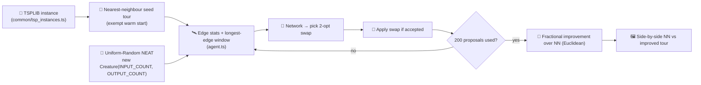

# 🧭 tsp_two_opt — Learned 2-Opt Local-Search Heuristic

🛠 **Technique demo** — this example demonstrates NEAT-AI as a _learned local-search operator_. Every
episode starts from a deterministic nearest-neighbour seed tour and the evolved controller proposes
2-opt swaps to improve it within a fixed swap budget.

## How the demo is set up

The NEAT seed itself is **uniform-random** —
`new Creature(INPUT_COUNT,
OUTPUT_COUNT, { layers: SEED_HIDDEN_LAYERS })`. The hidden-layer stack is
the size hint allowed by the library's `Creature` constructor; the weights and biases inside that
topology are random. The nearest-neighbour starting tour is the exempt "warm" piece — the
hand-crafted bit that this example is _about_, analogous to the hand-crafted gene in
`crispr_injection` (see `AGENTS.md` exemption list).

## Observation and action spec

For `K_LONGEST = 5` and a sliding window of width 3, the network sees a fixed
`INPUT_COUNT = 3 + 1 + K_LONGEST + K_LONGEST · 3 = 24` floats:

| Channel | Meaning                                                       |
| ------- | ------------------------------------------------------------- |
| 0       | Mean edge length / bounding-box diagonal                      |
| 1       | Max edge length / bounding-box diagonal                       |
| 2       | Pop-standard-deviation of edge lengths / diagonal             |
| 3       | Proposals remaining / total budget                            |
| 4 … 8   | Lengths of the K = 5 longest edges (descending), normalised   |
| 9 … 23  | Sliding window of length 3 around each of the K longest edges |

The action is `OUTPUT_COUNT = 2 · K_LONGEST = 10` floats — argmax over the first K picks edge `a`,
argmax over the second K picks edge `b`. The chosen pair selects two positions in the current tour
and proposes the 2-opt swap that reverses the sub-tour between them. The environment accepts the
swap iff it strictly improves the total tour length.

## Diagram



## Run instructions

```bash
./tsp_two_opt/run.sh                       # burma14 (default)
./tsp_two_opt/run.sh --instance=ulysses22  # the 22-city instance
./tsp_two_opt/run.sh --fresh               # wipe prior multi-run state
```

A complete run finishes in roughly five minutes wall-clock on a commodity laptop for the `burma14`
default. The CI quick-mode (used by `./quality.sh`) caps the run via `TSP_TWO_OPT_QUICK=1` and
writes its ephemeral artefacts under a temp directory so the canonical docs SVG is never
overwritten.

## Output artefacts

- `docs/screenshots/tsp_two_opt.svg` — side-by-side SVG: nearest- neighbour seed tour on the left,
  post-evolution improved tour on the right, each labelled with its own tour length and a
  `× optimum` ratio. An animated playhead at the bottom sweeps across the swap budget.

> **Note on the published optimum.** `common/tsp_instances.ts` stores the canonical TSPLIB
> GEO-distance optima (`burma14`: 3,323; `ulysses22`: 7,013) as reference values, but our
> `tourLength` computes plain two-dimensional Euclidean distance. The two metrics are not
> interchangeable — for `burma14` the nearest-neighbour seed length under Euclidean is already ~38 —
> so the demo reports a **fractional improvement over the NN seed** rather than an "x% of optimum"
> ratio.

- `docs/data/tsp_two_opt/creature.json` — champion creature persisted across runs (resume-friendly).
- `.synthetic-tsp-two-opt/creatures/champion.json` — local copy of the same champion.

## Contrast with `tsp_constructive`

| Aspect        | `tsp_constructive`       | `tsp_two_opt`                  |
| ------------- | ------------------------ | ------------------------------ |
| Episode start | Empty partial tour       | Nearest-neighbour seed tour    |
| Action        | Pick next unvisited city | Pick a 2-opt swap              |
| Per-step cost | One city per tick        | One _attempted_ swap per tick  |
| Fitness       | `optimum / tourLength`   | Fractional improvement over NN |
| Paradigm      | Constructive policy      | Learned local-search operator  |
| Warm start?   | No (random seed only)    | Hand-crafted NN seed tour      |

The two examples deliberately share `common/tsp_instances.ts` so the city coordinates and the
`tourLength` arithmetic cannot drift apart. Move acceptance in `tsp_two_opt` is the
strictly-improving rule; for a follow-up demo the same proposal loop could be wrapped in the
Metropolis-Hastings sampler from `mcmc_acceptance` to explore noisier acceptance criteria.
