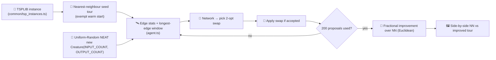
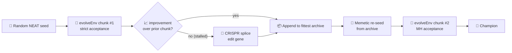

# 🧭 tsp_two_opt — Learned 2-Opt Local-Search Heuristic

🛠 **Technique demo** — this example demonstrates NEAT-AI as a _learned local-search operator_. Every
episode starts from a deterministic nearest-neighbour seed tour and the evolved controller proposes
2-opt swaps to improve it within a fixed swap budget.

## How the demo is set up

The NEAT seed itself is **uniform-random** —
`new Creature(INPUT_COUNT,
OUTPUT_COUNT, { layers: SEED_HIDDEN_LAYERS })`. The hidden-layer stack is
the size hint allowed by the library's `Creature` constructor; the weights and biases inside that
topology are random. The nearest-neighbour starting tour is the exempt "warm" piece — the
hand-crafted bit that this example is _about_, analogous to the hand-crafted gene in
`crispr_injection` (see `AGENTS.md` exemption list).

## Observation and action spec

For `K_LONGEST = 5` and a sliding window of width 3, the network sees a fixed
`INPUT_COUNT = 3 + 1 + K_LONGEST + K_LONGEST · 3 = 24` floats:

| Channel | Meaning                                                       |
| ------- | ------------------------------------------------------------- |
| 0       | Mean edge length / bounding-box diagonal                      |
| 1       | Max edge length / bounding-box diagonal                       |
| 2       | Pop-standard-deviation of edge lengths / diagonal             |
| 3       | Proposals remaining / total budget                            |
| 4 … 8   | Lengths of the K = 5 longest edges (descending), normalised   |
| 9 … 23  | Sliding window of length 3 around each of the K longest edges |

The action is `OUTPUT_COUNT = 2 · K_LONGEST = 10` floats — argmax over the first K picks edge `a`,
argmax over the second K picks edge `b`. The chosen pair selects two positions in the current tour
and proposes the 2-opt swap that reverses the sub-tour between them. The environment accepts the
swap iff it strictly improves the total tour length.

## Diagram



## Supported instances

| Name        | Cities | Published optimum | Path through the runner                     |
| ----------- | -----: | ----------------: | ------------------------------------------- |
| `burma14`   |     14 |             3,323 | original single-`evolveEnv` path (default)  |
| `ulysses22` |     22 |             7,013 | original single-`evolveEnv` path            |
| `pcb442`    |    442 |            50,778 | hybrid orchestrator (memetic + CRISPR + MH) |

## Run instructions

```bash
./tsp_two_opt/run.sh                                              # burma14 (default)
./tsp_two_opt/run.sh --instance=ulysses22                         # the 22-city instance
./tsp_two_opt/run.sh --instance=pcb442                            # the 442-city PCB instance
./tsp_two_opt/run.sh --time-seconds=60                            # bounded "smoke" budget (CI)
./tsp_two_opt/run.sh --instance=pcb442 --time-seconds=60          # pcb442 60s smoke (wired into quality.sh)
./tsp_two_opt/run.sh --instance=pcb442 --timeout=480               # pcb442 manual overnight (~8h)
./tsp_two_opt/run.sh --fresh                                      # wipe prior multi-run state
```

The `--time-seconds=<N>` flag converts to `timeoutMinutes = N / 60` and overrides
`--timeout=<minutes>` when both are supplied (smoke beats human run). When absent, behaviour is
unchanged from the documented default.

A complete run finishes in roughly five minutes wall-clock on a commodity laptop for the `burma14`
default. The CI quick-mode (used by `./quality.sh`) caps the run via `TSP_TWO_OPT_QUICK=1` and
writes its ephemeral artefacts under a temp directory so the canonical docs SVG is never
overwritten.

## Output artefacts

- `docs/screenshots/tsp_two_opt.svg` — side-by-side SVG: nearest- neighbour seed tour on the left,
  post-evolution improved tour on the right, each labelled with its own tour length and a
  `× optimum` ratio. An animated playhead at the bottom sweeps across the swap budget.

> **Note on the published optimum.** `common/tsp_instances.ts` stores the canonical TSPLIB
> GEO-distance optima (`burma14`: 3,323; `ulysses22`: 7,013) as reference values, but our
> `tourLength` computes plain two-dimensional Euclidean distance. The two metrics are not
> interchangeable — for `burma14` the nearest-neighbour seed length under Euclidean is already ~38 —
> so the demo reports a **fractional improvement over the NN seed** rather than an "x% of optimum"
> ratio.

- `docs/data/tsp_two_opt/creature.json` — champion creature persisted across runs (resume-friendly).
- `.synthetic-tsp-two-opt/creatures/champion.json` — local copy of the same champion.

## Contrast with `tsp_constructive`

| Aspect        | `tsp_constructive`       | `tsp_two_opt`                  |
| ------------- | ------------------------ | ------------------------------ |
| Episode start | Empty partial tour       | Nearest-neighbour seed tour    |
| Action        | Pick next unvisited city | Pick a 2-opt swap              |
| Per-step cost | One city per tick        | One _attempted_ swap per tick  |
| Fitness       | `optimum / tourLength`   | Fractional improvement over NN |
| Paradigm      | Constructive policy      | Learned local-search operator  |
| Warm start?   | No (random seed only)    | Hand-crafted NN seed tour      |

The two examples deliberately share `common/tsp_instances.ts` so the city coordinates and the
`tourLength` arithmetic cannot drift apart.

## Hybrid orchestrator for `pcb442` (issue #482)

The 442-city instance is large enough that pure NEAT struggles inside a sane wall-clock budget, so
`--instance=pcb442` dispatches to a **hybrid orchestrator** (`tsp_two_opt/hybrid.ts`) that wires
three NEAT-AI hybrid techniques on top of the learned 2-opt local search:



| Technique          | Where in `pcb442`                                                                                                                                                                                                                                                                                  |
| ------------------ | -------------------------------------------------------------------------------------------------------------------------------------------------------------------------------------------------------------------------------------------------------------------------------------------------- |
| 🧠 Memetic re-seed | Every chunk after the first is seeded from the previous chunk's exported champion (the analogue of the "fittest archive" in `memetic_evolution`).                                                                                                                                                  |
| 🧬 CRISPR splice   | When a chunk fails to improve over its predecessor (or always on the smoke run, via `forceCrispr`), the champion is spliced with a hand-crafted edit gene before the next chunk. The splicer reuses `injectGene` from `crispr_injection/` — the hand-crafted gene is the demo's exempt warm piece. |
| 🌡️ MH acceptance   | Chunks after the first run with the Metropolis-Hastings accept rule (`exp(-delta / (T · seedLength))`) so the search can climb out of local optima. At `T → 0` the rule degenerates to strict-improvement.                                                                                         |

`burma14` and `ulysses22` still take the original single-`evolveEnv` path with strict-improvement
acceptance — their CLI output is byte-identical to the pre-hybrid runner.

The orchestrator emits one of these markers per technique to `stdout` so the harness can grep for
each on a smoke run:

```
🧠 memetic re-seed chunk 2/2 seeded from prior champion.
🧬 CRISPR splice chunk 2/2 spliced edit gene into stalled champion (...).
🌡️ MH accept chunk 2/2 using MH acceptance T=0.002.
```

A 60-second smoke (`./tsp_two_opt/run.sh --instance=pcb442 --time-seconds=60`) exercises every code
path without expecting SOTA tour lengths — the parent issue's "within 25% of 50,778" target is
verified by the user's overnight run, not by this orchestrator.

The three techniques are demonstrated in dedicated examples elsewhere in this repository — the
pcb442 hybrid wires them together on top of the learned 2-opt local search:

- [`crispr_injection/README.md`](../crispr_injection/README.md) — splicing a hand-crafted edit gene
  into a stalled champion (the splicer reused here via `injectGene`).
- [`memetic_evolution/README.md`](../memetic_evolution/README.md) — re-seeding the next chunk from
  the previous chunk's archived champion.
- [`mcmc_acceptance/README.md`](../mcmc_acceptance/README.md) — Metropolis-Hastings acceptance over
  a synthetic fitness landscape (the analytical analogue of the per-swap MH rule on chunks 2+).

### Smoke run output

The committed `docs/screenshots/tsp_two_opt_pcb442.svg` is the side-by-side artefact produced by one
real 60-second smoke run of the hybrid orchestrator (issue #483). It is proof the harness — the
three hybrid techniques wired on top of the learned 2-opt local search, dispatched through the
`pcb442` instance path — works end-to-end inside a CI-sized budget. The committed SVG should be read
as a smoke-only artefact: the improvement ratio is ~2% over the nearest-neighbour seed, not the SOTA
tour length that the user's overnight (~8h) run is expected to reach.

The champion artefact bundle from the overnight run — the long-running `creature.json` under
`docs/data/tsp_two_opt_pcb442/`, the milestones chart, and the SOTA side-by-side SVG — lands via
follow-up issue [#484](https://github.com/stSoftwareAU/NEAT-AI-Examples/issues/484), **not** this
PR. The pcb442 smoke wired into `quality.sh` inherits the `TSP_TWO_OPT_QUICK=1` discipline so its
ephemeral artefacts go under a temp directory and the canonical
`docs/screenshots/tsp_two_opt_pcb442.svg` committed here is never overwritten by CI.
