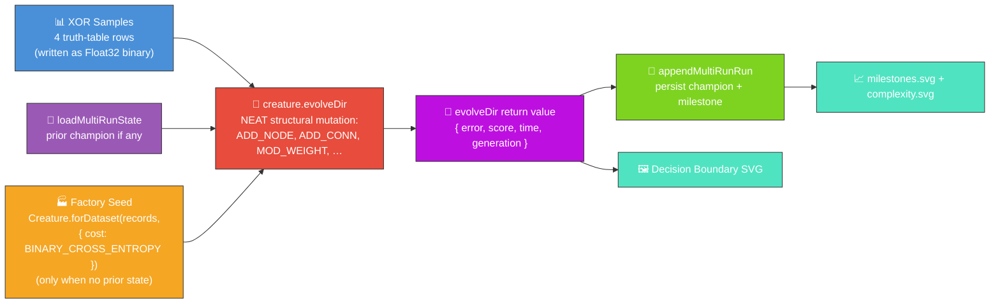
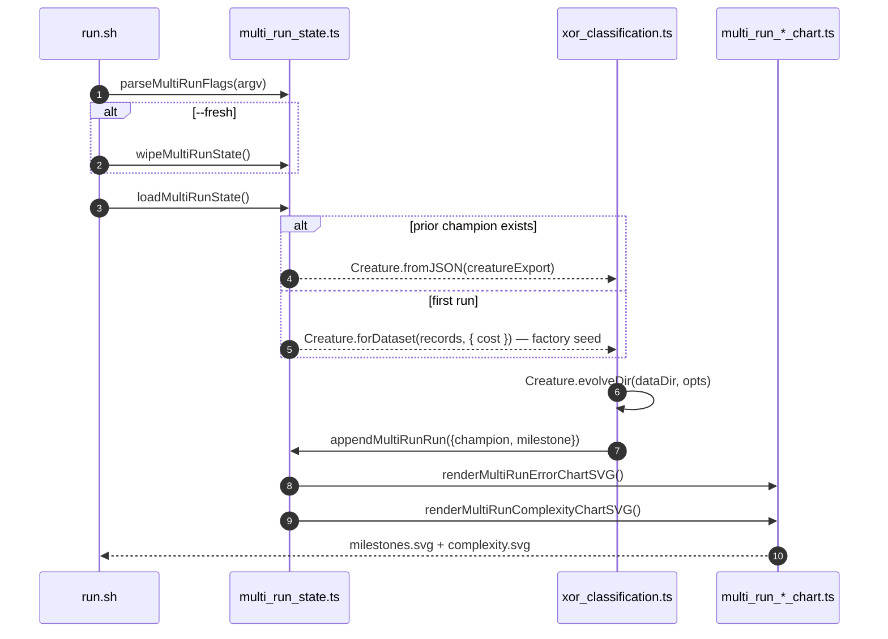
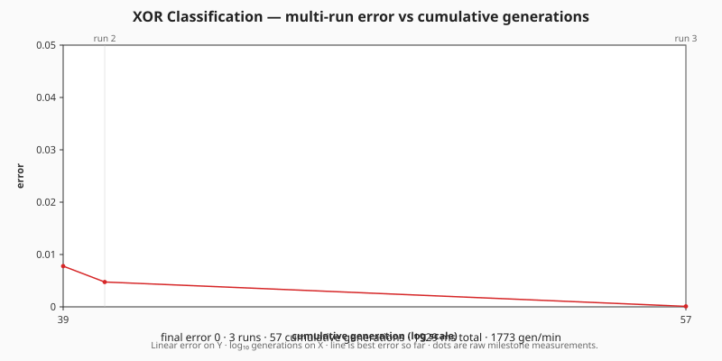
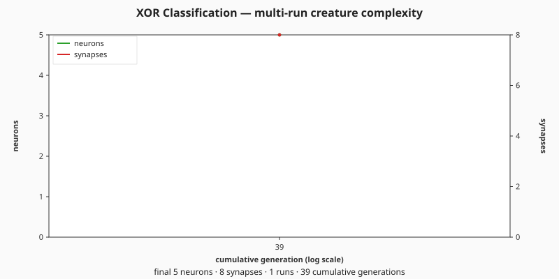

# 🧠 XOR Classification — Hello World of NEAT

> 🌱 **Generation 1 is built by the NEAT-AI factory (issue #520).** Instead of a bare
> `new Creature(2, 1)`, the fresh-run seed is minted by the `Creature.forDataset(records, { cost })`
> factory, which derives the output activation from the cost and pre-sizes a small hidden layer.

**Acronyms.** _NEAT_ = NeuroEvolution of Augmenting Topologies (the Stanley & Miikkulainen 2002
algorithm that grows topology and weights together). _XOR_ = exclusive OR (the two-input boolean
that returns true when exactly one input is true). _PRNG_ = pseudorandom number generator.

`xor_classification.ts` evolves a tiny NEAT-AI network that learns the XOR truth table — the
canonical "Hello World" of neuroevolution. The fresh-run creature is built by the NEAT-AI
**factory** — `Creature.forDataset(records, { cost: "BINARY_CROSS_ENTROPY" })` — instead of a bare
`new Creature(2, 1)` (issue #520). Because XOR is tiny, fast, and deterministic, it is the ideal
**smoke-test** that the factory produces a valid, well-initialised seed: the binary-classification
cost couples the output to a **LOGISTIC** activation (NEAT-AI #2793) — the activation the `>= 0.5`
threshold and the squared-error contribution against `{0, 1}` targets both assume — and the factory
pre-sizes a small RELU hidden layer with He/Xavier-scaled random weights. **No weights or biases are
hand-specified by this example;** the factory chooses the topology and scaling, every parameter is
still drawn from the seeded PRNG. Structural mutation — add-neuron, add-synapse and weight tuning —
is delegated to `creature.evolveDir(...)`, whose configuration is **unchanged** (default MSE
scoring), so evolution behaves exactly as before (issues #131, #148, audited under #205, telemetry
rewired under #301, multi-run wiring under #326, factory seed under #520).

Stop conditions: `targetError` plus a `timeoutMinutes: 5` safety backstop (the tiny XOR problem
typically converges in well under a minute, but the backstop is mandatory so the runner cannot
wedge).



## 🔧 How It Works



## 🎯 Inputs and Outputs

| Channel  | Type    | Symbol | Meaning                                     |
| -------- | ------- | ------ | ------------------------------------------- |
| Input 0  | feature | `a`    | First operand of XOR (0 or 1)               |
| Input 1  | feature | `b`    | Second operand of XOR (0 or 1)              |
| Output 0 | scalar  | —      | `>= 0.5` predicts class `1`, else class `0` |

The XOR truth table:

| `a` | `b` | target |
| --- | --- | ------ |
| 0   | 0   | 0      |
| 0   | 1   | 1      |
| 1   | 0   | 1      |
| 1   | 1   | 0      |

Fitness is `1 - MSE` across the four samples; the task is "solved" when the mean squared error drops
below the configured `errorThreshold` (default `0.05`, equivalent to `>= 95%` per-sample fitness)
AND all four truth-table rows are classified correctly. A hard generation cap (`maxGenerations`,
default `2000`) bounds the run so the developer's screenshot run cannot wedge indefinitely if the
threshold is never reached — the loop stops, the run is reported as "did not solve", and the SVG
artefacts are still written.

## 🚀 Running the Example

> ⚡ **Speed note:** this example writes its training data in NEAT-AI's binary format — see
> [`docs/binary_training_stream.md`](../docs/binary_training_stream.md).

```bash
# First run — random seed, writes creature + milestones + both charts.
./xor_classification/run.sh --fresh

# Subsequent runs — resume from the saved champion and append a milestone.
./xor_classification/run.sh

# Override the wall-clock budget and / or early-stop target error.
./xor_classification/run.sh --timeout=10 --target-error=0.005
```

The runner forwards every flag to the underlying Deno program, which parses them via
`parseMultiRunFlags` from [`common/multi_run_state.ts`](../common/multi_run_state.ts):

| Flag                  | Default | Meaning                                                               |
| --------------------- | ------- | --------------------------------------------------------------------- |
| `--fresh`             | absent  | Wipe prior creature, milestones, and both chart SVGs before evolving. |
| `--timeout=<minutes>` | 5       | Wall-clock budget for this invocation, integer minutes ≥ 1.           |
| `--target-error=<v>`  | 0.05    | Stop as soon as the champion's mean-squared error falls below `v`.    |

Artefacts:

- `.synthetic-xor/creatures/champion.json` – the fittest classifier from this invocation
  (working-directory copy for ad-hoc inspection)
- `docs/screenshots/xor_decision_boundary.svg` – the committed decision-boundary plot
- [`docs/data/xor_classification/creature.json`](../docs/data/xor_classification/creature.json) –
  persisted champion that subsequent runs reload as the next seed
- [`docs/data/xor_classification/milestones.json`](../docs/data/xor_classification/milestones.json)
  – merged milestone history across every run, with both `runGen` and `cumulativeGen`
- [`docs/screenshots/xor_classification/milestones.svg`](../docs/screenshots/xor_classification/milestones.svg)
  – multi-run error-curve chart: error vs cumulative generation, with faint run-boundary guide lines
  (`renderMultiRunErrorChartSVG` from
  [`common/multi_run_error_chart.ts`](../common/multi_run_error_chart.ts))
- [`docs/screenshots/xor_classification/complexity.svg`](../docs/screenshots/xor_classification/complexity.svg)
  – multi-run complexity chart: neuron and synapse counts vs cumulative generation
  (`renderMultiRunComplexityChartSVG` from
  [`common/multi_run_complexity_chart.ts`](../common/multi_run_complexity_chart.ts))

> [!TIP]
> The script writes its working data to `.synthetic-xor/`, a hidden directory ignored by git.

## 📈 Evolution Progress (Multi-Run)

Per issue [#298](https://github.com/stSoftwareAU/NEAT-AI-Examples/issues/298) NEAT-AI surfaces only
milestone-cadence telemetry. For the supervised XOR run, `Creature.evolveDir` returns a single
end-of-run summary `{ error, score, time, generation }` — so each invocation contributes one
milestone to the merged history. The legacy single-run summary chart
(`docs/screenshots/xor_classification/evolution_summary.svg`) was superseded by the multi-run chart
pair under issue [#326](https://github.com/stSoftwareAU/NEAT-AI-Examples/issues/326). Each
subsequent run reloads the saved champion via
[`common/multi_run_state.ts`](../common/multi_run_state.ts), evolves further, and appends a fresh
milestone with a monotonically-increasing `cumulativeGen` — so the charts show one continuous noise
→ competent arc across every run combined.







Re-run `./xor_classification/run.sh` (without `--fresh`) to extend both charts with another run.

## 🧠 Tacit Knowledge

A few things that are not obvious from the code alone:

- **Factory seed (issue #520).** The fresh-run seed is built via
  `Creature.forDataset(records, { cost: "BINARY_CROSS_ENTROPY" })`. The factory derives the output
  activation from the cost (binary classification ⇒ **LOGISTIC**), pre-sizes a small RELU hidden
  layer from the problem shape (Heaton's rule), and scales the random weights to the per-activation
  init stddev (He/Xavier) — all from problem-intrinsic facts, never a hand-crafted architecture. The
  cost shapes only the seed; `evolveDir` keeps its default MSE scoring, so evolution is untouched.
  This is a **milestone-sanctioned departure** from the project-wide
  [no-warm-starts](../AGENTS.md#-no-warm-starts--evolution-must-start-from-random-noise) policy,
  made under the factory-adoption tracker (issue #517). The bare `new Creature(2, 1)` baseline
  (`buildRandomSeedCreature`, zero hidden neurons) is retained for fixtures. XOR is not linearly
  separable, so a solved champion still proves that genetic operators tuned a working topology;
  structural growth beyond the seed continues to come purely from `evolveDir`'s mutation operators.
- **Multi-run resume.** With no prior state the run starts from the factory seed and writes a new
  champion. Re-run without `--fresh` and the saved champion is reloaded as the seed creature, so
  evolution continues from where it left off and the multi-run charts gain another run-boundary
  marker.
- **Solved-vs-cap.** The runner stops as soon as MSE drops below `errorThreshold` _and_ all four
  rows are classified correctly. If neither happens within `maxGenerations`, the run is reported as
  "did not solve" — but the milestone and chart SVGs are still written. The hard cap exists
  specifically to keep the screenshot regeneration pipeline from wedging indefinitely.
- **Mutation rate matters.** The library defaults (`mutationRate = 0.3`, `mutationAmount = 1`) are
  too conservative for a problem this small; the runner sets them to `0.6` and `3` so structural
  mutations fire often enough to bootstrap a hidden neuron in the early generations.
- **Reproducibility.** The seed flows through `NeatOptions.seed` and reseeds the global PRNG before
  the factory mints the seed creature, so two runs with the same seed (and the same prior state)
  produce the same champion — identical topology shape, squashes, biases, and weights. Only the
  factory's randomly-minted hidden-neuron UUIDs differ between runs, so the determinism test
  compares the learnable parameters rather than the raw JSON.
- **Decision boundary, not just labels.** The SVG shades the entire input square `[0, 1]²` by the
  network's continuous output, so you can see the boundary curve. Cleanly-separated XOR shows up as
  four diagonal "quadrants" of alternating colour.

---

> **Why this example was restructured.** Issue
> [#130](https://github.com/stSoftwareAU/NEAT-AI-Examples/issues/130) noticed that an earlier
> version of this demo started from a hand-fixed 2-2-1 topology and only mutated weights, so the
> neuron and synapse counts never changed. This page (and the screenshots) reflects the rewrite that
> replaced the hand-rolled loop with real NEAT structural mutation from a minimal random seed. Issue
> [#301](https://github.com/stSoftwareAU/NEAT-AI-Examples/issues/301) then retired the
> per-generation charts and checkpoint strip in favour of the milestone summary, and issue
> [#326](https://github.com/stSoftwareAU/NEAT-AI-Examples/issues/326) replaced that single-run
> summary with the multi-run persistence + chart pipeline shared by the other in-scope examples.

## 🧰 NEAT-AI Features Used

XOR is the canonical neuroevolution "Hello World" — evolution from noise against a tiny supervised
target. The capability surfaced here is plain NEAT-AI evolutionary topology search.

> 🔎 **Stripped-down operator subset.** This example deliberately exercises a narrow slice of
> NEAT-AI's full pipeline so the noise → competent story stays uncluttered. The production training
> pipeline (backpropagation, dropout, L1/L2 regularisation, K-fold, binary `.bin` data streams,
> distributed evolution, etc.) is intentionally **not** wired into this demo — see issue
> [#185](https://github.com/stSoftwareAU/NEAT-AI-Examples/issues/185) and the upstream
> production-pipeline notes in
> [`COMPARISON.md`](https://github.com/stSoftwareAU/NEAT-AI/blob/Develop/COMPARISON.md) for the
> wider feature set.

Features exercised (links go to upstream
[`COMPARISON.md`](https://github.com/stSoftwareAU/NEAT-AI/blob/Develop/COMPARISON.md)):

- **Cost-coupled factory seed** — `Creature.forDataset(records, { cost: "BINARY_CROSS_ENTROPY" })`
  derives the output activation (LOGISTIC) from the classification cost, pre-sizes a hidden-capacity
  budget, and scales the initial weights per activation (issue #520); no hand-coded hidden-layer
  sizes or pre-built `network.json` seed.
- **[Evolutionary Topology Search](https://github.com/stSoftwareAU/NEAT-AI/blob/Develop/COMPARISON.md#what-weve-implemented)**
  — structural mutation (add-neuron / add-synapse) is mandatory because XOR is not linearly
  separable from the direct-only random seed.
- **[Genetic Operators](https://github.com/stSoftwareAU/NEAT-AI/blob/Develop/COMPARISON.md#what-weve-implemented)**
  — weight and bias mutation co-evolved with structure against the squared-error fitness signal.
