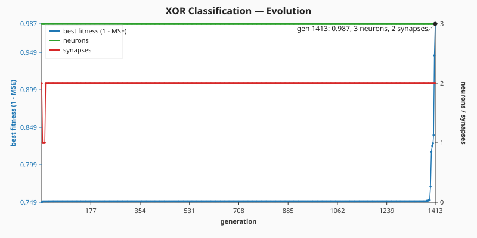
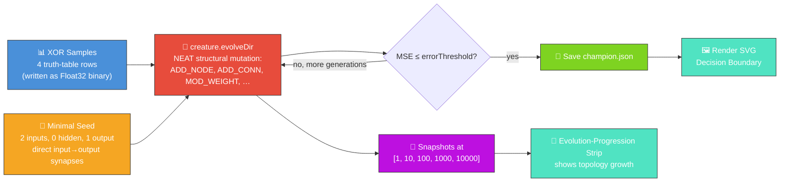
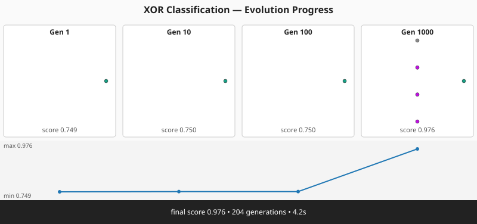

# 🧠 XOR Classification — Hello World of NEAT

`xor_classification.ts` evolves a tiny NEAT-AI network that learns the XOR truth table — the
canonical "Hello World" of neuroevolution. Evolution starts from a **minimal seed** (two inputs,
zero hidden neurons, one output) and delegates structural mutation — add-neuron, add-synapse and
weight tuning — to `creature.evolveDir(...)`. XOR is not linearly separable, so the seed cannot
solve the task; NEAT must invent at least one hidden neuron during evolution (issue #131).




## 🔧 How It Works



## 🎯 Inputs and Outputs

| Channel  | Type    | Symbol | Meaning                                     |
| -------- | ------- | ------ | ------------------------------------------- |
| Input 0  | feature | `a`    | First operand of XOR (0 or 1)               |
| Input 1  | feature | `b`    | Second operand of XOR (0 or 1)              |
| Output 0 | scalar  | —      | `>= 0.5` predicts class `1`, else class `0` |

The XOR truth table:

| `a` | `b` | target |
| --- | --- | ------ |
| 0   | 0   | 0      |
| 0   | 1   | 1      |
| 1   | 0   | 1      |
| 1   | 1   | 0      |

Fitness is `1 - MSE` across the four samples; the task is "solved" when the mean squared error drops
below the configured `errorThreshold` (default 0.05) and all four samples are classified correctly.

## 🚀 Running the Example

```bash
./xor_classification/run.sh
```

Artefacts:

- `.synthetic-xor/creatures/champion.json` – the fittest classifier from the run
- `.synthetic-xor/snapshots/snapshot-gen-*.json` – running-champion snapshots captured at the
  configured checkpoints
- `docs/screenshots/xor_decision_boundary.svg` – the committed decision-boundary plot
- `docs/screenshots/xor_classification/evolution.svg` – per-generation evolution chart (best-fitness
  score on the left axis, neuron and synapse counts on the right axis)
- `docs/screenshots/xor_classification_evolution.svg` – multi-panel evolution-progression strip
  rendered from the captured snapshots

> [!TIP]
> The script writes its working data to `.synthetic-xor/`, a hidden directory ignored by git.

## Evolution Progress



The runner captures a snapshot of the **running champion** at each of the canonical checkpoint
generations `[1, 10, 100, 1000, 10000]` (those that fall inside the configured `maxGenerations`).
Because the seed has zero hidden neurons but the champion typically grows several, the resulting
strip is a literal picture of NEAT topology discovery — the first panel shows a flat 2 → 1 network,
later panels show progressively richer topologies. Each panel displays the champion's topology, the
generation label, and the score (`1 - MSE`) at that checkpoint.

## 🧠 Tacit Knowledge

A few things that are not obvious from the code alone:

- **At least one hidden neuron is required.** A purely linear `w·s + b` cannot represent XOR — the
  classes are not linearly separable. The minimal seed (zero hidden neurons) starts at MSE = 0.25;
  NEAT must invent at least one hidden neuron via `ADD_NODE` to break out of that plateau.
- **Mutation rate matters.** The library defaults (`mutationRate = 0.3`, `mutationAmount = 1`) are
  too conservative for a problem this small; the runner sets them to `0.6` and `3` so structural
  mutations fire often enough to bootstrap a hidden neuron in the early generations.
- **Reproducibility.** The seed flows through `NeatOptions.seed`, so two runs with the same seed
  produce the same champion JSON.
- **Decision boundary, not just labels.** The SVG shades the entire input square `[0, 1]²` by the
  network's continuous output, so you can see the boundary curve. Cleanly-separated XOR shows up as
  four diagonal "quadrants" of alternating colour.
